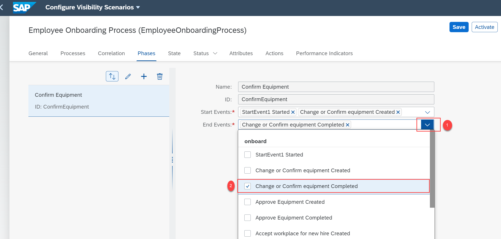
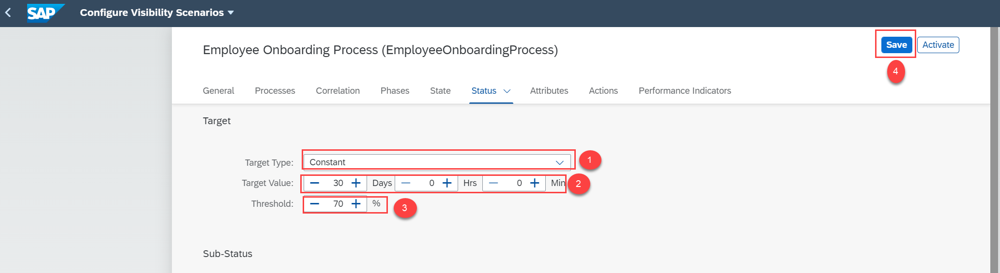
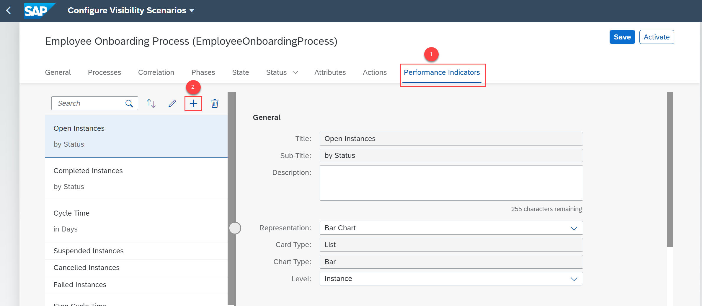

## Prerequisites
-	Ensure that you have the access to the Configure Business Scenarios application. For more information, see [Consume the Process Visibility UI Applications Using SAP Fiori Launchpad](cp-cf-processvisibility-setup-flp).

## Details
### You will learn
-	How to enhance your business scenario by adding phases, attributes, and performance indicators
-	How to activate your business scenario

By default, a set of performance indicators are generated when you add an SAP Cloud Platform Workflow as a participant. You can view the default status, attributes, and performance indicators using various tabs of the Configure Scenarios application. You can choose to activate the business scenario without enhancing it. Alternatively, you can further enhance the business scenario by adding phases, status, calculated attributes, and performance indicators. To know more, refer to this [Blog](https://blogs.sap.com/2019/08/09/get-visibility-into-your-workflow-using-sap-cloud-platform-process-visibility/).

[ACCORDION-BEGIN [Step 1: ](Create phases)]
1. Navigate to the **Phases** tab and choose the **+** icon.

    

2. Provide the following details to add the phase and click **OK**.

    

3. In the **Start Events** drop down, select      **StartEvent1 Started** and **Change or Confirm equipment Created**.

    

4. In the **End Events** drop down, select **Change or Confirm equipment Completed**.

    

5. Create another phase named **Approve Equipment**. Then, select the **Approve Equipment Created** option from the **Start Events** dropdown and **Approve Equipment Completed** option from the **End Events** dropdown. Then save the changes.

    

[DONE]
[ACCORDION-END]

[ACCORDION-BEGIN [Step 2: ](Configure the target)]
1. Navigate to the **Status** tab.

    

2. Under the **Target** section, provide the following details and save the changes:

    

[DONE]
[ACCORDION-END]

[ACCORDION-BEGIN [Step 3: ](Add business scenario attributes)]
1. Choose the **Attributes** tab, where you can view a set of default attributes.

    

2. If you want to configure a calculated attribute, then choose the **+** icon.

    

    Add the following properties in the **Add Calculated Attribute** dialog.

    

3. Save the changes.

[DONE]
[ACCORDION-END]

[ACCORDION-BEGIN [Step 4: ](Configure performance indicators)]
1. Navigate to the **Performance Indicators** tab and choose the **+** icon.

    

    In the **Add Performance Indicator** dialog, provide the following details and choose **OK**:

    

2. Choose the following options as shown in the **General** and **Data** section of the **Performance Indicators** tab:

    

4. Choose the **+** icon under the **Filters** section of **Performance Indicators**.

    

    In the **Add Filter** dialog, provide the following details:

    

6. Save the changes.

[DONE]
[ACCORDION-END]

[ACCORDION-BEGIN [Step 5: ](Activate business scenario)]
1. Save the business scenario and then choose **Activate**.

    

2. Once the business scenario is successfully activated, the state of the business scenario changes to **Active**.

    

[VALIDATE_1]
[ACCORDION-END]

---
