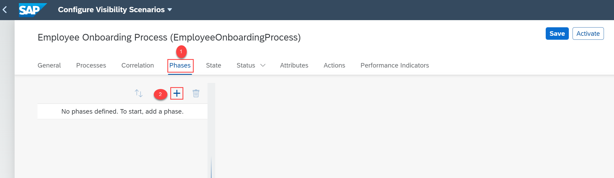
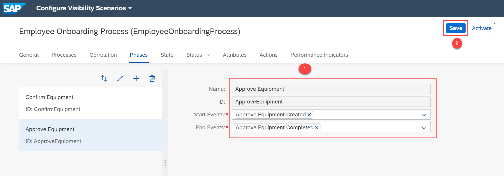
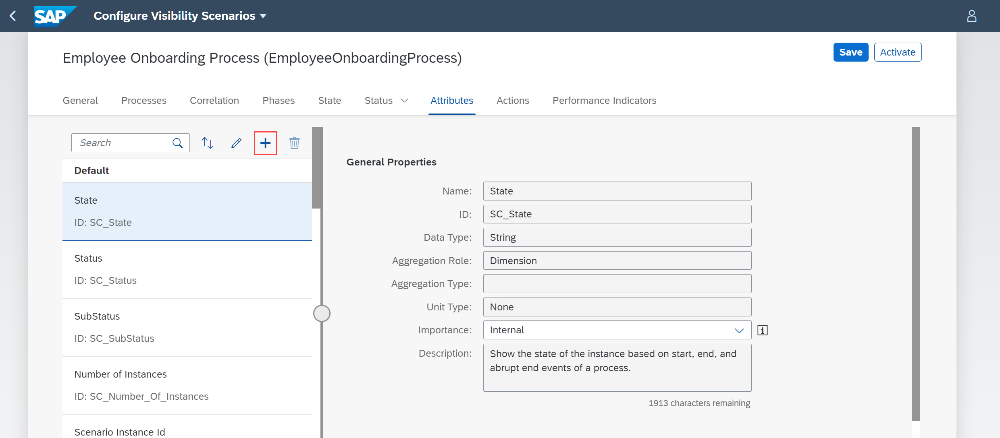
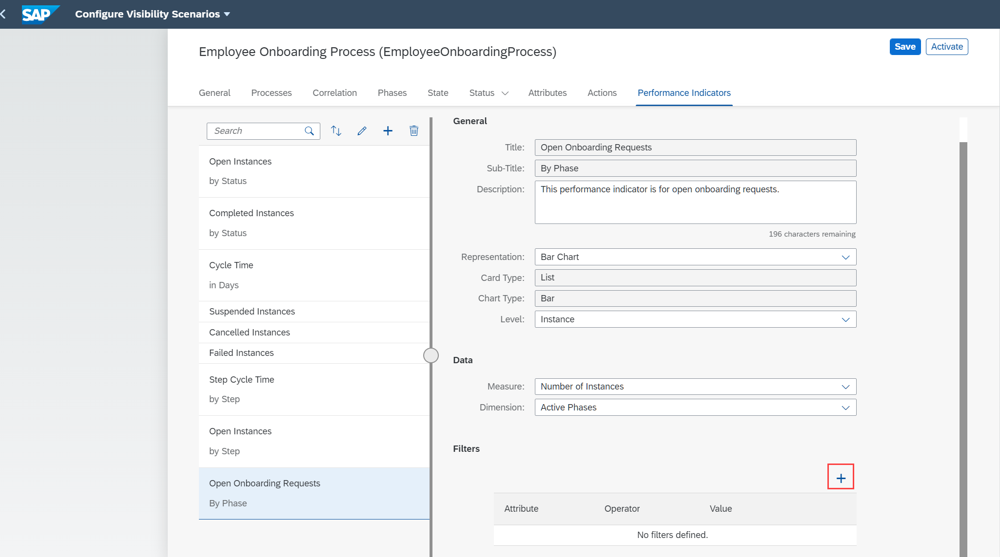
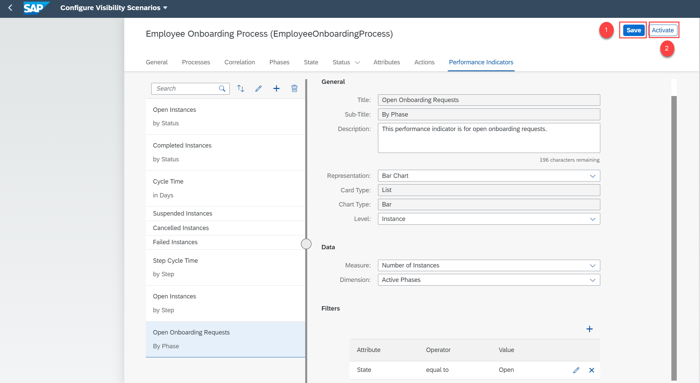

# Enhance Your Visibility Scenario for a Deployed Workflow
<!-- description --> Enhance your visibility scenario by configuring the status, phases, performance indicators, and attributes for the workflow added to track and analyze the business process.

## Prerequisites
- You have set up **SAP Workflow Management** service. For more information, see the [Set Up Workflow Management in Cloud Cockpit](cp-starter-ibpm-employeeonboarding-1-setup) tutorial.
- You have created a visibility scenario named **Employee Onboarding Process** with **onboard** workflow as a process participant. For more information, see [Create a Visibility Scenario for a Deployed Workflow](cp-cf-processvisibility-model-configscenario) tutorial.

## You will learn
-	How to enhance your scenario by configuring phases, attributes, and performance indicators
-	How to activate the scenario

## Intro
When you add a workflow to your visibility scenario as a process participant, a set of attributes and performance indicators are automatically configured to your visibility scenario. You can navigate to the respective tabs in the **Configure Visibility Scenarios** application to view them. You can either choose to activate the visibility scenario without enhancing or you can further enhance the visibility scenario by adding phases, status, calculated attributes, and performance indicators.

### Create phases

1. Add a phase to your visibility scenario by choosing **+** icon in the **Phases** tab.

    <!-- border -->

2. Provide a the following details for the phase and choose **OK**.

    |  Field Name     | Value
    |  :------------- | :-------------
    | Name   | **`Confirm Equipment`**
    | ID     | **`ConfirmEquipment`**

    

3. In the **Start Events** drop down, select **StartEvent1 Started** and **Change or Confirm equipment Created** options.

    Field Name     | Value
    |  :------------- | :-------------
    |  Start Events   | **`StartEvent1 Started`**, **`Change or Confirm equipment Created`**

    <!-- border -->

4. In the **End Events** drop down, select **Change or Confirm equipment Completed** option.

    Field Name     | Value
    |  :------------- | :-------------
    |  End Events     | **`Change or Confirm equipment Completed`**

    <!-- border -->

5. Similarly, create another phase named **Approve Equipment**. Then, select the **Approve Equipment Created** option from the **Start Events** dropdown and **Approve Equipment Completed** option from the **End Events** dropdown and **Save** the changes.

    |  Field Name     | Value
    |  :------------- | :-------------
    | Name         | **`Approve Equipment`**
    | ID           | **`ApproveEquipment`**
    | Start Events | **`Approve Equipment Created`**
    | End Events    | **`Approve Equipment Completed`**

    <!-- border -->

### Configure the target

1. Navigate to the **Status** tab.

2. Under the **Target** section, provide the following details and **Save** the changes:

    |  Field Name     | Value
    |  :------------- | :-------------
    | Target Type     | **`Constant`**
    | Target Value    | **`30 Days`**, **`0 Hrs`**, **`0 Min`**
    | Threshold       | **`70 %`**

    <!-- border -->

### Add visibility scenario attributes

1. Choose the **Attributes** tab, you can view a set of default attributes in the left pane.

    <!-- border -->

2. Add a calculated attribute by choosing the **+** icon.

    <!-- border -->

3. Add the following properties in the **Add Calculated Attribute** dialog.

    |  Field Name     | Value
    |  :------------- | :-------------
    | Name            | **`Time Taken To Approve Equipment`**
    | ID              | **`TimeTakenToApproveEquipment`**
    | Expression Type | **`Duration between events`**
    | Start Event     | **`Approve Equipment Created`**
    | End Event       | **`Approve Equipment Completed`**

    <!-- border -->

4. **Save** the changes.

### Configure performance indicators

1. Navigate to the **Performance Indicators** tab and add a performance indicator by choosing the **+** icon.

    <!-- border -->

2. In the **Add Performance Indicator** dialog, provide the following details and choose **OK**.

    |  Field Name     | Value
    |  :------------- | :-------------
    | Title           | **`Open Onboarding Requests`**
    | Sub-Title       | **`By Phase`**
    | ID              | **`Open_Onboarding_Requests`**

    <!-- border -->

3. Choose the following options as shown in the **General** and **Data** section of the **Performance Indicators** tab:

    For **General** section:

    |  Field Name     | Value
    |  :------------- | :-------------
    | Title           | **`Open Onboarding Requests`**
    | Sub-Title       | **`By Phase`**
    | Description     | **`This performance indicator is for open onboarding requests.`**
    | Representation  | **`Bar Chart`**
    | Card Type       | **`List`**
    | Chart Type      | **`Bar`**
    | Level           | **`Instance`**

    For **Data** section:

    |  Field Name     | Value
    |  :------------- | :-------------
    | Measure         | **`Number of Instances`**
    | Dimension       | **`Active Phases`**

    <!-- border -->

4. Choose the **+** icon under the **Filters** section of **Performance Indicators** to add a filter.

    <!-- border -->

5. In the **Add Filter** dialog, provide the following details:

    |  Field Name     | Value
    |  :------------- | :-------------
    | Attribute       | **`State`**
    | Operator        | **`equal to`**
    | Value           | **`Open`**

    <!-- border -->

6. **Save** the changes.

### Activate the scenario

1. **Save** the scenario and then choose **Activate**.

    <!-- border -->

2. Once the scenario is successfully activated, you can see the status of the **Employee Onboarding Process** scenario as **Active**.

    <!-- border -->

---
