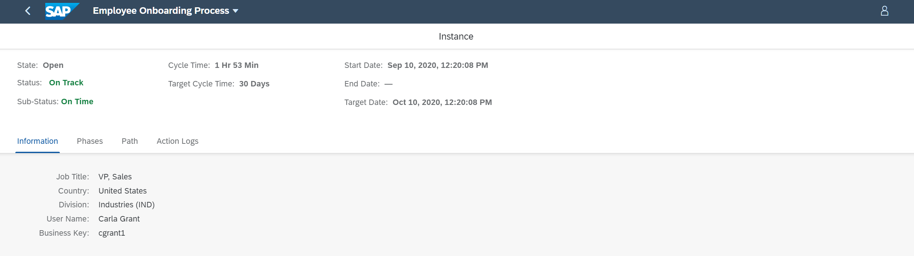

# Track the Workflow Using the Process Workspace Application
<!-- description --> Track the workflow in real time and analyze performance indicators to gain insights on the needed improvements.

## Prerequisites
 - Ensure that you have set up **SAP Workflow Management** service to access the **Process Workspace** application. For more information, see the [Set Up Workflow Management in Cloud Cockpit](cp-starter-ibpm-employeeonboarding-1-setup) tutorial.
 - You have created and enhanced a visibility scenario containing a workflow as a process Participant. For more information, see the [Create a Visibility Scenario for a Deployed Workflow](cp-cf-processvisibility-model-configscenario) and [Enhance Your Visibility Scenario for a Deployed Workflow](cp-cf-processvisibility-enhancebusinessscenario) tutorials.
 - You have started a new instance for your workflow. For more information, see the [Create Workflow Instances for Process Visibility](cp-cf-processvisibility-model-workflow) tutorial.
 - you have processed the acquired data by using **Monitor Visibility Scenarios** application. For more information, see the [Monitor Your Visibility Scenarios](cp-cf-processvisibility-model-monitorscenario) tutorial.

## You will learn
  - How to gain visibility on the end-to-end processes of a visibility scenario
You can track the workflow in real-time and analyze the performance indicators to gain insights on the needed improvements.

## Intro
The process visibility capability provides **Process Workspace** to gain visibility on end-to-end processes for line-of-business users. It enables you to track processes in real-time, search and filter instances, analyze performance indicators, and view detailed information about an instance.

---

### Access the Process Workspace

  Open the **Workflow Management** dashboard and choose the **Process Workspace** tile.

  

### Analyze performance indicators for a scenario instance

1. In the **Scenarios** table, choose the **Employee Onboarding Process** scenario.

    <!-- border -->

    You can see the process workspace overview page of the **Employee Onboarding Process** scenario as shown below.

    <!-- border -->

    Above is the default process workspace for a visibility scenario. If you enhance your visibility scenario with more phases, calculated attributes, and performance indicators, you can see a dashboard as shown below. This dashboard can be used to track the workflow instances. For more information on creating and enhancing the visibility scenario, see [Creating a Scenario](https://help.sap.com/viewer/62fd39fa3eae4046b23dba285e84bfd4/Cloud/en-US/df284fd12073454392c5db8913f82d81.html)

      <!-- border -->

2. Choose one of the tiles to view the details of the workflow instances contributing to the respective performance indicators.

    <!-- border -->

3. Choose an instance from the table to navigate to the details view of that particular scenario instance.

    <!-- border -->

    The scenario instance details view provides detailed information about the selected instance.

    <!-- border -->

    In the scenario instance details view, you can view the following:

    - **Information** view displays values of all the attributes that are selected.

    -	**Phases** view displays progress of the workflow, how much time has elapsed, how many more phases and steps are left, and any violations which could bring the instance to risk based on the target cycle time.

      <!-- border -->

    - **Path** view provides an ordered list or a flow chart to show the progress of the workflow in terms of time taken to traverse from one task to another. This helps the business users to identify the bottlenecks, inconsistencies, and possible causes of the delays in the workflow.

      <!-- border -->

    - **Action Logs** view displays the activity logs of actions of the type **Trigger Workflow from SAP Workflow Service**. It displays the name of the action, the status of the action, the user triggering the action, and the time when the action was triggered. The reason for the failure can be seen by clicking the failed icon in action status.

      In this tutorial, actions are not configured for the **Employee Onboarding Process** scenario. Hence, there are no actions logs displayed for this scenario instance.

      <!-- border -->

