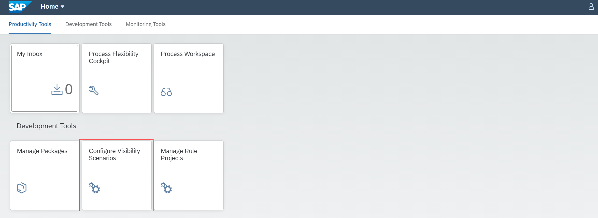
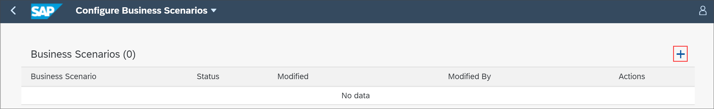
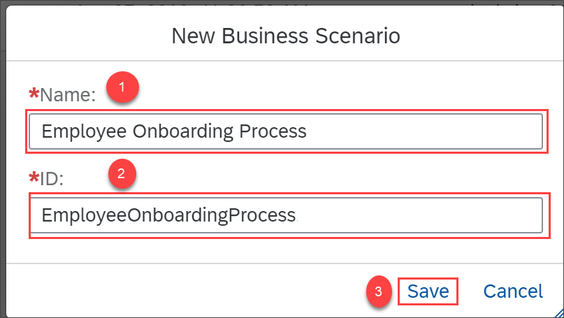
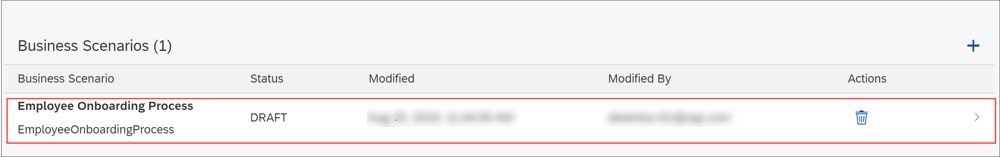
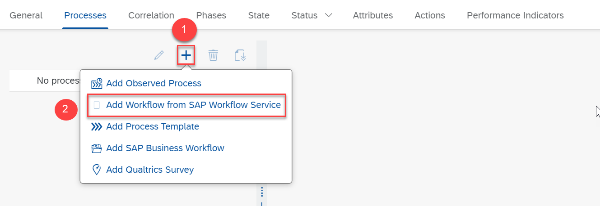
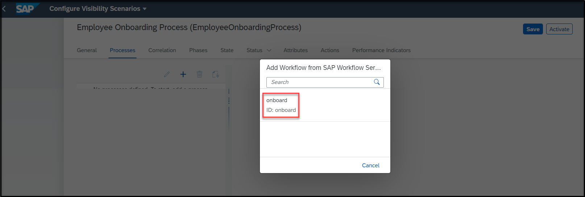
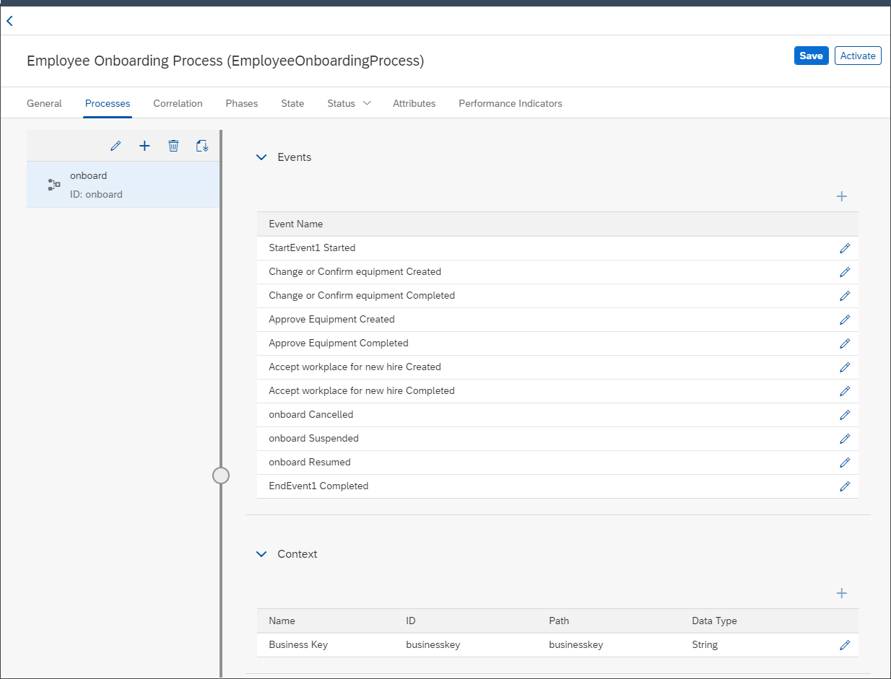

## Prerequisites
 1. You have set up the Workflow Management service. For more information, see the [Set Up Workflow Management in Cloud Cockpit](cp-starter-ibpm-employeeonboarding-1-setup) tutorial.
 2. You have a deployed workflow. If you do not have a workflow deployed, then refer to steps 5 and 6 in [Configure Business Rules, Workflow and Process Visibility](cp-starter-ibpm-employeeonboarding-2-configure) tutorial.
 3. You have set up business rules for determining equipment. To set up the business rules, see steps 1 to 4 in [Configure Business Rules, Workflow and Process Visibility](cp-starter-ibpm-employeeonboarding-2-configure) tutorial.

## Details
### You will learn
  - How to use the Configure Visibility Scenarios application
  - How to build a visibility scenario by adding workflows
  - How to activate the visibility scenarios  

Visibility scenarios allow you to track the performance of end-to-end processes. In this tutorial, you can add workflows from SAP Workflow service to your visibility scenario to gain visibility on workflows. For more information, see [Creating a Scenario](https://help.sap.com/viewer/62fd39fa3eae4046b23dba285e84bfd4/Cloud/en-US/df284fd12073454392c5db8913f82d81.html).

---

[ACCORDION-BEGIN [Step 1:](Create a scenario)]
1. Log on to the **Workflow Management** home screen and choose the **Configure Visibility Scenarios** tile.

    !

2. Choose the **+** icon.

    !

3. In the **New Scenario** dialog, provide the following details and choose **Create**.

    |  Field Name     |  Value
    |  :------------- | :-------------
    |  Name           | `Employee Onboarding Process`
    |  ID             | `EmployeeOnboardingProcess`

    !

4. Now, select the **Employee Onboarding Process** scenario which is in the **Draft** state to edit it.

    !

[VALIDATE_1]
[ACCORDION-END]

[ACCORDION-BEGIN [Step 2: ](Add workflows)]
In this step, you add the onboard workflow to your scenario.

1. Under the **Processes** tab, choose the **+** icon and then choose **Add Workflow from SAP Workflow Service** to add a workflow to the scenario.

    !

2. In the **Add Workflow from SAP Workflow Service** dialog, choose the workflow named **Onboard**.

    

    This adds the workflow as a process participant and automatically adds all the events provisioned by the added workflow. It also adds the corresponding context of the workflow into the scenario.

    !

    >Check the default **State**, **Status**, **Attributes**, and **Performance Indicators** that are pre-created for the given workflow.

3. **Save** the changes.

    You have now created a visibility scenario with workflows.

[DONE]
[ACCORDION-END]

---
