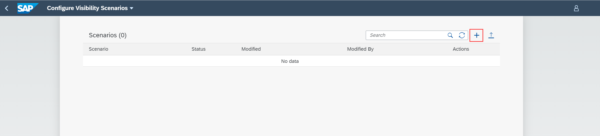
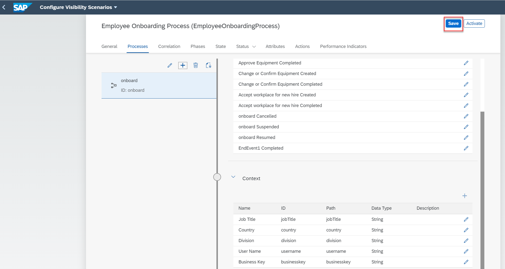

# Create a Visibility Scenario for a Deployed Workflow
<!-- description --> Create a visibility scenario based on a workflow using the Configure Visibility Scenarios application.

## Prerequisites
 1. You have set up SAP Workflow Management service. For more information, see the [Set Up Workflow Management in Cloud Cockpit](cp-starter-ibpm-employeeonboarding-1-setup) tutorial.
 2. You have a deployed workflow. If you do not have a workflow deployed, then refer to steps 5 and 6 in [Configure Business Rules, Workflow and Process Visibility](cp-starter-ibpm-employeeonboarding-2-configure) tutorial.
 3. You have set up business rules for determining equipment. To set up the business rules, see steps 1 to 4 in [Configure Business Rules, Workflow and Process Visibility](cp-starter-ibpm-employeeonboarding-2-configure) tutorial.

## You will learn
  - How to use the Configure Visibility Scenarios application
  - How to create a visibility scenario by adding workflows
  - How to activate a visibility scenario  

## Intro
Visibility scenarios allow you to track the performance of end-to-end processes. You can configure the aspects of a scenario such as events and context of the processes, correlation conditions, status, attributes, and performance indicators for the end-to-end processes of a scenario.

In this tutorial, you will learn how to add a workflow to your visibility scenario to gain visibility on the workflow. In this tutorial we create a visibility scenario named **Employee Onboarding Process** and then add the **onboard** workflow from workflow capability as a process participant to the  visibility scenario. For more information, see [Creating a Scenario](https://help.sap.com/viewer/62fd39fa3eae4046b23dba285e84bfd4/Cloud/en-US/df284fd12073454392c5db8913f82d81.html).

---

### Create a scenario

1. Open the **Workflow Management** dashboard and choose the **Configure Visibility Scenarios** tile present under **Development Tools**.

    <!-- border -->

2. Create a visibility scenario by choosing the **+** icon.

    <!-- border -->

3. In the **New Scenario** dialog, provide **Namespace** and **Name** for your scenario. On providing these values, the **ID** field gets populated automatically. You can choose to edit the **ID** if required. Optionally provide a **Description** to the scenario and choose **Create**.

    <!-- border -->

    You can see the **Employee Onboarding Process** scenario listed in the **Scenarios** table in the **Draft** state.

4. Now, select the **Employee Onboarding Process** scenario in the **Draft** state to edit it.

    <!-- border -->

### Add workflow to the Visibility scenario

In this step, you will add the **onboard** workflow to your **Employee Onboarding Process** scenario.

1. Under the **Processes** tab, choose the **+** icon and then choose **Add Workflow from SAP Workflow Service** to add a workflow to the visibility scenario.

    <!-- border -->

2. In the **Add Workflow from SAP Workflow Service** dialog, choose the workflow named **onboard**.

    <!-- border -->

    Now, the workflow is added as a process participant to your visibility scenario. By default all the events provisioned by the workflow along with the corresponding context of is added into the visibility scenario.

    >Check the default **State**, **Status**, **Attributes**, and **Performance Indicators** that are pre-created for the given workflow.

3. **Save** the changes.

    <!-- border -->

  You have now created an **Employee Onboarding Process** visibility scenario with an **onboard** workflow as a process participant.

---
