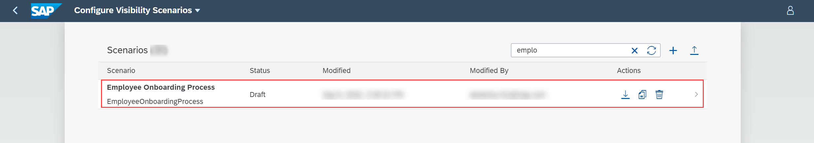

## Prerequisites
 - Ensure that you have access to the Configure Business Scenarios application. For more information, see [Consume the Process Visibility UI Applications Using SAP Fiori Launchpad](cp-cf-processvisibility-setup-flp).
 - You have a deployed workflow from SAP Cloud Platform Workflow on Cloud Foundry. If you do not have a workflow deployed, then refer to the following [blog](https://blogs.sap.com/2019/05/20/sap-cloud-platform-workflow-sample-application-in-cloud-foundry/).

## Details
### You will learn
  - How to use the Configure Business Scenarios application
  - How to build a business scenario
  - How to add workflows to business scenarios  

Business scenarios allows you to track the performance of end-to-end processes. In this tutorial, you can add workflows from SAP Cloud Platform Workflow to your business scenario to gain visibility on workflows. For more information, see [Creating a Business Scenario](https://help.sap.com/viewer/62fd39fa3eae4046b23dba285e84bfd4/Cloud/en-US/df284fd12073454392c5db8913f82d81.html).

---

[ACCORDION-BEGIN [Step 1:](Create a business scenario)]
1. Log on to the **Configure Business Scenarios** application in SAP Fiori Launchpad.

    

2. Choose the **+** icon.

    

3. Provide the following details and create a new business scenario by saving the changes.

    |  Field Name     |  Value
    |  :------------- | :-------------
    |  Name           | `Employee Onboarding Process`
    |  ID             | `EmployeeOnboardingProcess`

    

4. Now, select the **Employee Onboarding Process** business scenario which is in the **Draft** state to edit it.

    

[VALIDATE_1]
[ACCORDION-END]

[ACCORDION-BEGIN [Step 2: ](Add workflows)]

1. Choose the **+** icon and then choose **Add SAP Cloud Platform Workflow** to add a workflow to the business scenario.

    

2. In the **Add SAP Cloud Platform Workflow** dialog, choose the workflow named **Onboard**.

    

    This adds the workflow as a process participant and automatically adds all the events provisioned by the added workflow. It also adds the corresponding context `(businessKey)` of the workflow into the business scenario.

    

    >Check the default **State**, **Status**, **Attributes** and **Performance Indicators** that are pre-created for the given workflow.

3. Save the changes.

    You have now added created a business scenario with workflows.

[DONE]
[ACCORDION-END]

---
