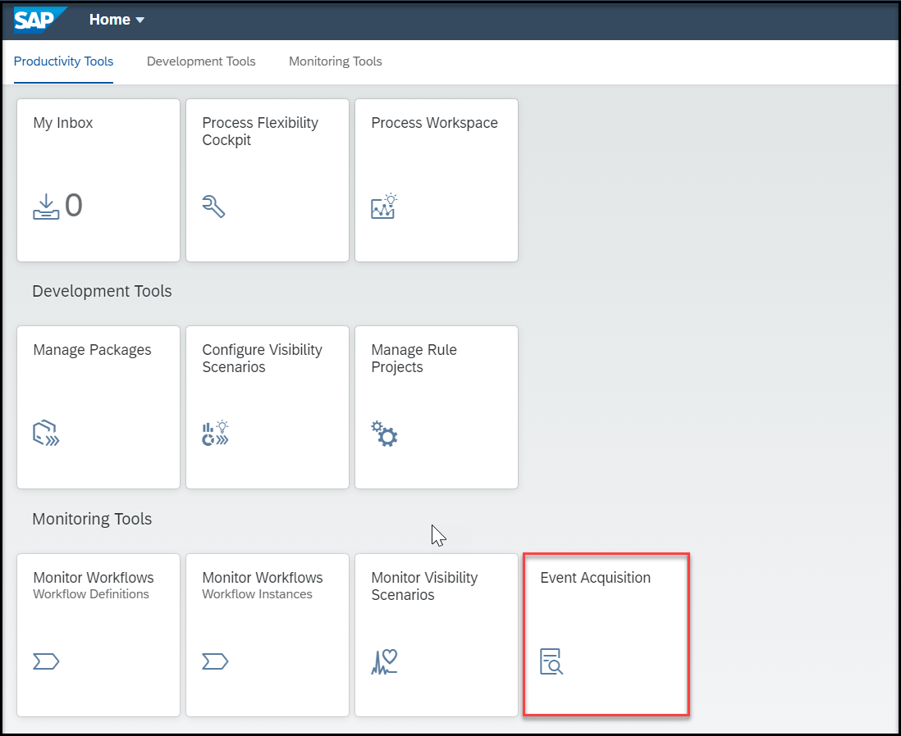
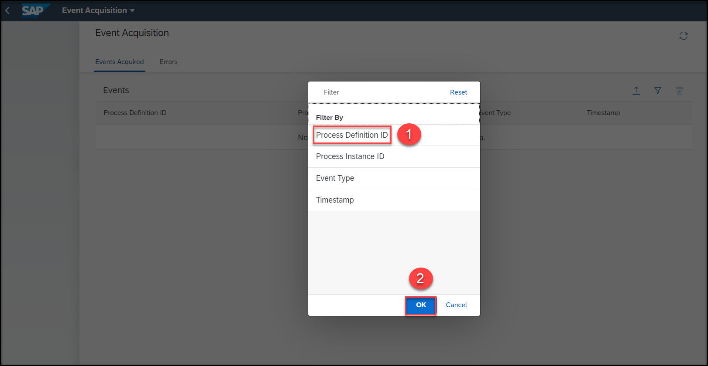
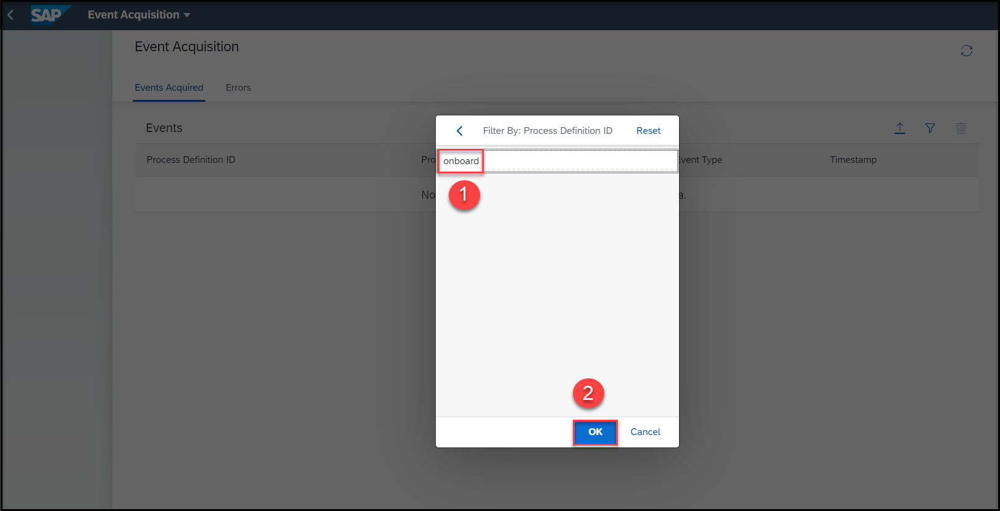
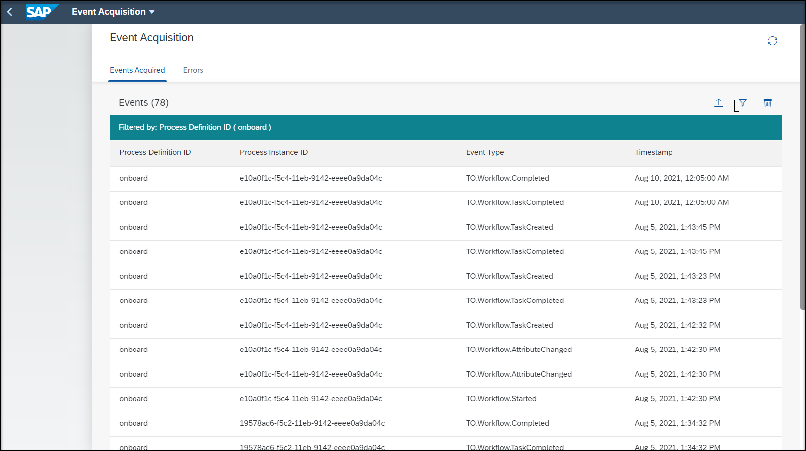

# Monitor Events Acquired Using the Event Acquisition Application
<!-- description --> Monitor the events acquired using the Event Acquisition application.

## Prerequisites
 - Ensure that you have setup the **SAP Workflow Management** service to access the **Event Acquisition** application. For more information, see the [Set Up Workflow Management in Cloud Cockpit](cp-starter-ibpm-employeeonboarding-1-setup) tutorial.
 - You have created and enhanced a visibility scenario containing a workflow as a process Participant. For more information, see the [Create a Visibility Scenario for a Deployed Workflow](cp-cf-processvisibility-model-configscenario) and [Enhance Your Visibility Scenario for a Deployed Workflow](cp-cf-processvisibility-enhancebusinessscenario) tutorials.
 - You have started a new instance for your workflow. For more information, see the [Create Workflow Instances for Process Visibility](cp-cf-processvisibility-model-workflow) tutorial.

## You will learn
  - How to view the events that have been acquired by the process visibility capability

## Intro
Using the **Event Acquisition** application, you can view the events that have been acquired by process visibility capability.

---

### Access the Events Acquisition application

  Open the **Workflow Management** dashboard and choose the **Event Acquisition** tile.

  

  >By default, the **Event Acquisition** application opens with no events. You need to apply filter to see the events based on attributes.

### View events acquired by Process Visibility

1. Choose the filter icon to filter the events based on the attributes.

    <!-- border -->

    >You can filter the events based on **Process Definition ID**, **Process Instance ID**, **Event Type**, and **Timestamp**.

2. Select the required filter and provide the value that you have used in your visibility scenario. In this tutorial, we apply the filter based on the **Process Definition ID** and we use the value **onboard**.

    <!-- border -->

    <!-- border -->

    The events acquired will be listed.

    <!-- border -->

    For more information on the **Events Acquisition** application, refer to the [Managing Events](https://help.sap.com/viewer/62fd39fa3eae4046b23dba285e84bfd4/Cloud/en-US/72a054799c6f41e08b5445b950ac512d.html) documentation.

---
