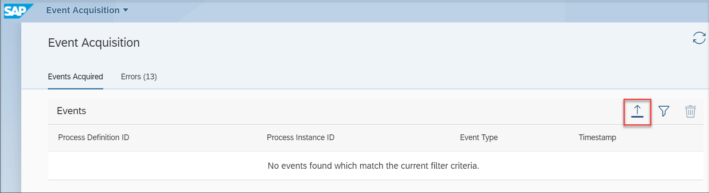
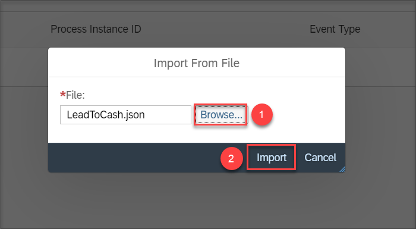
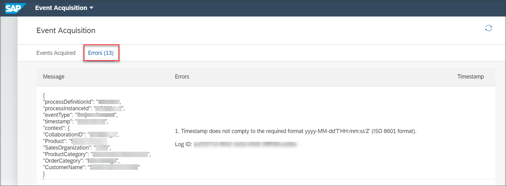

## Prerequisites
 - You have the **Event Acquisition** application configured on SAP Fiori launchpad. For more information, refer to [Consume the Process Visibility UI Applications Using SAP Fiori Launchpad] (cp-cf-processvisibility-setup-flp).
- You have the **`PVTenantOperator`** role assigned to your user

## Details
### You will learn
  - How to view the events that have been acquired by process visibility
  - How to monitor the errors that have occurred while consuming the events that have been pushed to the process visibility service
  - How to import events into the process visibility service

Using the **Event Acquisition** application, you can view the events that have been acquired by process visibility and monitor errors while consuming the events pushed to the service.

[ACCORDION-BEGIN [Step 1: ](Access the Events Acquisition application)]

1. Log into SAP Fiori Launchpad.

2. Click on the **Event Acquisition** tile to open the Events Acquisition application.

    

    You will be able to see the UI of **Event Acquisition** application. By default, no events are shown unless a filter is applied.

[DONE]
[ACCORDION-END]

[ACCORDION-BEGIN [Step 2: ](View events acquired by Process Visibility)]

1. Click the filter icon to filter events based on attributes.

    

    You can filter the events based on Process Definition ID, Process Instance ID, Event Type, and Timestamp.

2. Click on the required filter and provide the value you used in your business scenario. In this tutorial, we apply the filter based on Process Definition ID and we use the value **onboard**.

    

    

    The events acquired will be listed.

    

[DONE]
[ACCORDION-END]

[ACCORDION-BEGIN [Step 3: ](Import the events acquired by Process Visibility)]

Click the import icon, browse for the required JSON file containing an array of events, and select **Import**.

You will be able to import events into the process visibility service.

[DONE]
[ACCORDION-END]

[ACCORDION-BEGIN [Step 4: ](Monitor the errors while consuming the events)]

Click the **Errors** tab to view errors that have occurred while consuming the events pushed to the process visibility service.

You can see error messages specific to each event and the time when a specific error has occurred.

[VALIDATE_1]
[ACCORDION-END]

---
