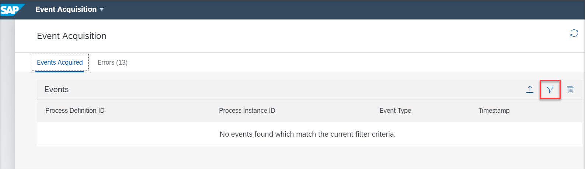
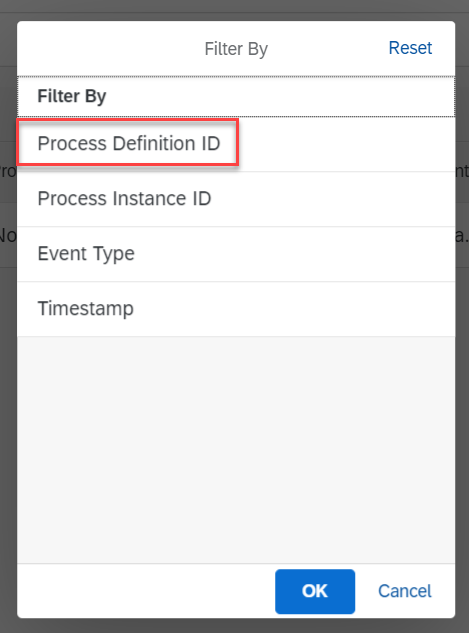
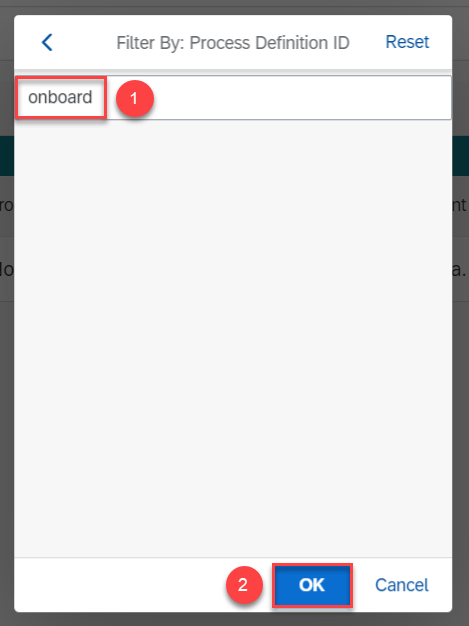
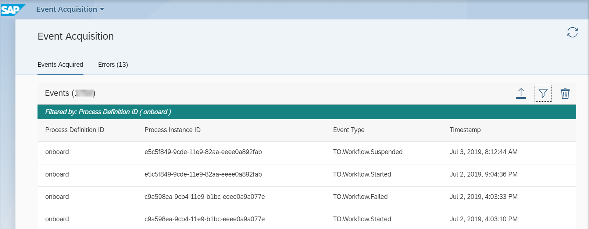

## Prerequisites
 - Ensure that you have setup the **Workflow Management** service to access the **Event Acquisition** application. For more information, see the [Set Up Workflow Management in Cloud Cockpit](cp-starter-ibpm-employeeonboarding-1-setup) tutorial.

## Details
### You will learn
  - How to view the events that have been acquired by the process visibility service

Using the Event Acquisition application, you can view the events that have been acquired by the process visibility service.

---

[ACCORDION-BEGIN [Step 1: ](Access the Events Acquisition application)]

Log on to the **Workflow Management** home screen and choose the **Event Acquisition** tile.
    !

The Event Acquisition application opens with no events.

[DONE]
[ACCORDION-END]

[ACCORDION-BEGIN [Step 2: ](View events acquired by Process Visibility)]

1. Click the filter icon to filter the events based on attributes.

    !

    You can filter the events based on **Process Definition ID**, **Process Instance ID**, **Event Type**, and **Timestamp**.

2. Click the required filter and provide the value you used in your visibility scenario. In this tutorial, we apply the filter based on **Process Definition ID** and we use the value **onboard**.

    !

    !

    The events acquired will be listed.

    !

For more information on this application, refer to the [Managing Events](https://help.sap.com/viewer/62fd39fa3eae4046b23dba285e84bfd4/Cloud/en-US/72a054799c6f41e08b5445b950ac512d.html) documentation.

[VALIDATE_1]
[ACCORDION-END]

---
