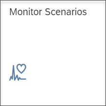
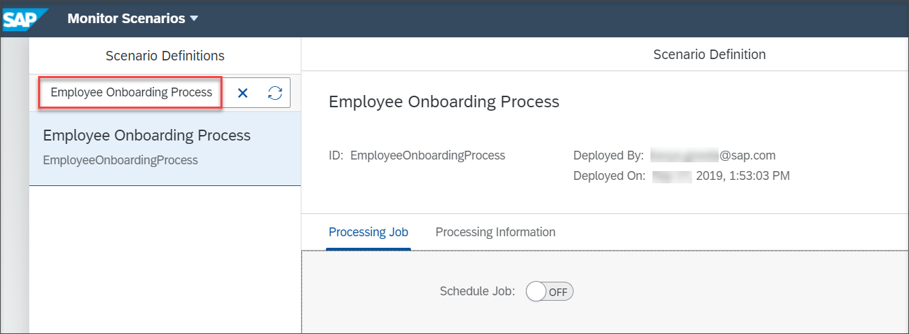
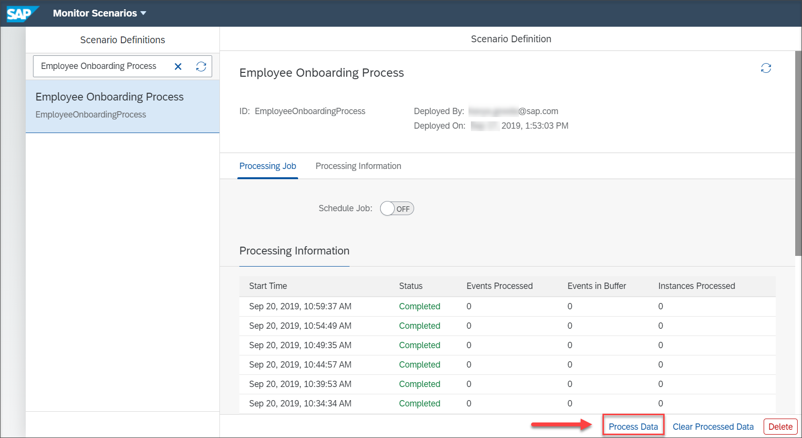
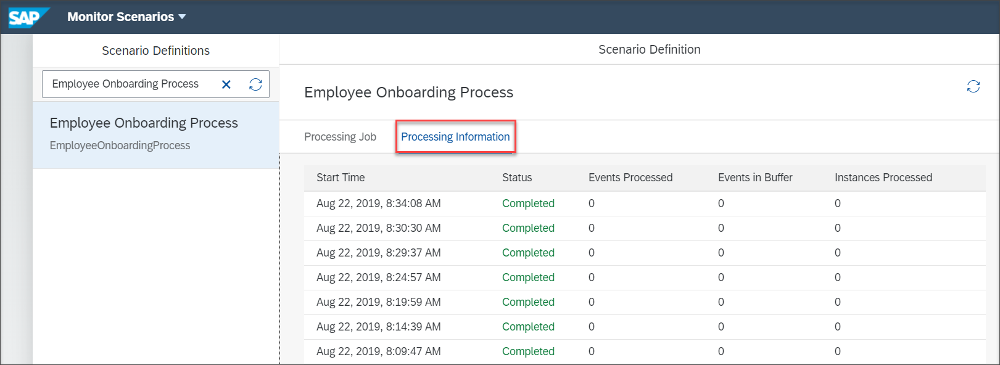

## Prerequisites
 - Ensure that you have set up the **Workflow Management** service to access the **Monitor Visibility Scenarios** application. For more information, see the [Set Up Workflow Management in Cloud Cockpit](cp-starter-ibpm-employeeonboarding-1-setup) tutorial.

## Details
### You will learn
  - How to view the details about the ongoing or completed processing runs of a visibility scenario

You can monitor activated visibility scenarios using the Monitor Visibility Scenarios application.

---

[ACCORDION-BEGIN [Step 1: ](Access the Monitor Visibility Scenarios application)]

Log on to the **Workflow Management** home screen and choose the **Monitor Visibility Scenarios** tile.
    !

[DONE]
[ACCORDION-END]

[ACCORDION-BEGIN [Step 2: ](View details of scenario definition)]

1. Type and search for the keyword **Employee Onboarding Scenario**, which is the scenario definition name used in this tutorial.

    !

2. Click **Process Data** to process the events manually.

    !

3. On successful processing of data, you can see the processing information listed out under **Processing Information**.

    !

      You will be able to view details about the ongoing or completed  processing runs such as Start Time, Status, Events Processed, Events in Buffer, Instances Processed.

For more information on this application, refer to [Monitor Scenarios](https://help.sap.com/viewer/62fd39fa3eae4046b23dba285e84bfd4/Cloud/en-US/14779d59bd4e43ada87f6d528f613fe9.html).

[VALIDATE_1]
[ACCORDION-END]

---
