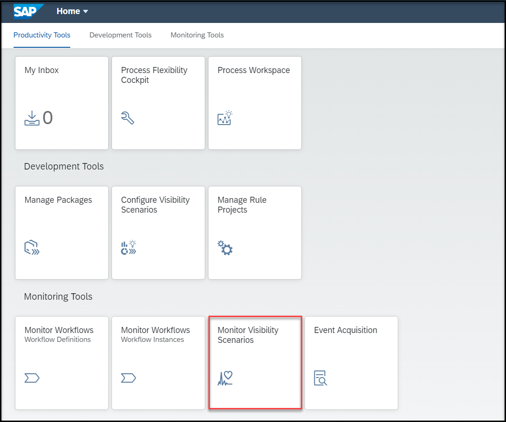

# Monitor Your Visibility Scenarios
<!-- description --> Monitor the visibility scenario and process the acquired data using the Monitor Visibility Scenarios application.

## Prerequisites
 - Ensure that you have set up **SAP Workflow Management** service to access the **Monitor Visibility Scenarios** application. For more information, see the [Set Up Workflow Management in Cloud Cockpit](cp-starter-ibpm-employeeonboarding-1-setup) tutorial.
 - You have created and enhanced a visibility scenario containing a workflow as a process participant. For more information, see the [Create a Visibility Scenario for a Deployed Workflow](cp-cf-processvisibility-model-configscenario) and [Enhance Your Visibility Scenario for a Deployed Workflow](cp-cf-processvisibility-enhancebusinessscenario) tutorials.
 - You have started a new instance for your workflow. For more information, see the [Create Workflow Instances for Process Visibility](cp-cf-processvisibility-model-workflow) tutorial.

## You will learn
  - How to view the details about the ongoing or completed processing runs of a visibility scenario

## Intro
You can manage the activated visibility scenarios using the **Monitor Visibility Scenarios** application.
You can view the details of a scenario definition such as who created the scenario and when the scenario was created. You can see the processing log information such as start time, status, number of events processed, number of events in the buffer, and number of new/updated instances. You can also process the acquired data of a scenario manually. Processing of data correlates and processes the acquired data based on the scenario model to form an end-to-end process instance.

---

### Access the Monitor Visibility Scenarios application

  Open the **Workflow Management** dashboard and choose the **Monitor Visibility Scenarios** tile present under **Monitoring Tools**.

  

### View details of scenario definition

1. Type and search for the scenario definition name as a keyword. In this tutorial, we search for **Employee Onboarding Process**, which is the scenario definition name used across the tutorial.

    <!-- border -->

2. Choose **Process Data** to process the acquired data of a scenario manually.

    <!-- border -->

3. On successful processing of data, you can see the processing information listed under **Processing Information** tab.

    <!-- border -->

    You can view the details about the ongoing or completed processing runs such as Start Time, Status, Events Processed, Events in Buffer, Instances Processed.

    For more information on **Monitor Visibility Scenarios** application, refer to [Monitor Scenarios](https://help.sap.com/viewer/62fd39fa3eae4046b23dba285e84bfd4/Cloud/en-US/14779d59bd4e43ada87f6d528f613fe9.html) documentation.

---
