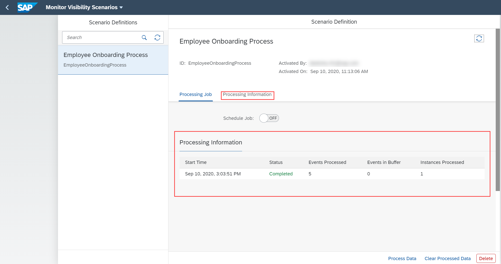

## Prerequisites
 - You have the **Monitor Scenarios** application configured on SAP Fiori launchpad. For more information, refer to [Consume the Process Visibility UI Applications Using SAP Fiori Launchpad] (cp-cf-processvisibility-setup-flp).
 - You have the **`PVAdmin`** role assigned to your user.

## Details
### You will learn
  - How to view the details about the ongoing or completed  processing runs of a business scenario

You can monitor the activated business scenarios using the **Monitor Scenarios** application.

---

[ACCORDION-BEGIN [Step 1: ](Access the Monitor Scenarios application)]

1. Log in to SAP Fiori launchpad.

2. Click on the **Monitor Scenarios** tile to open the Monitor Scenarios application.

    

[DONE]
[ACCORDION-END]

[ACCORDION-BEGIN [Step 2: ](View details of scenario definition)]

1. Type and search for the keyword **Employee Onboarding Scenario**, which is the scenario definition name used in this tutorial.

    

2. Click on **Process Data** to process the events manually.

    

3. On successful processing of data, you can see the processing information listed out under Processing Information.

    

      You will be able to view details about the ongoing or completed  processing runs such as Start Time, Status, Events Processed, Events in Buffer, Instances Processed.

For more information on this application, refer to [Monitor Scenarios application](https://help.sap.com/viewer/62fd39fa3eae4046b23dba285e84bfd4/Cloud/en-US/14779d59bd4e43ada87f6d528f613fe9.html).

[VALIDATE_1]
[ACCORDION-END]

---
