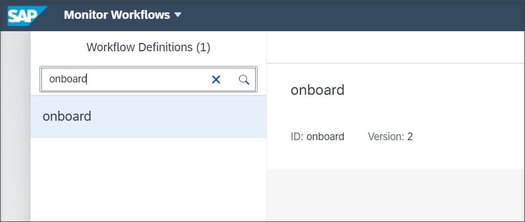
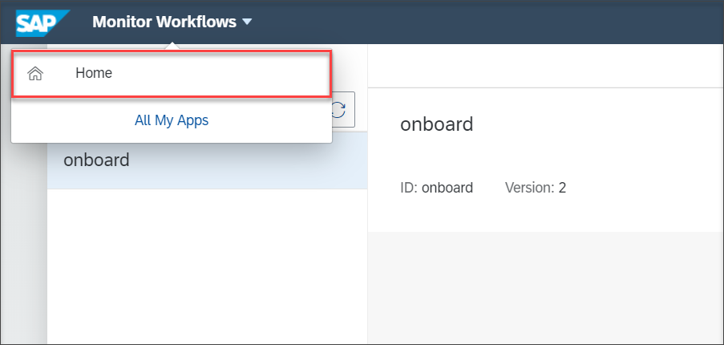
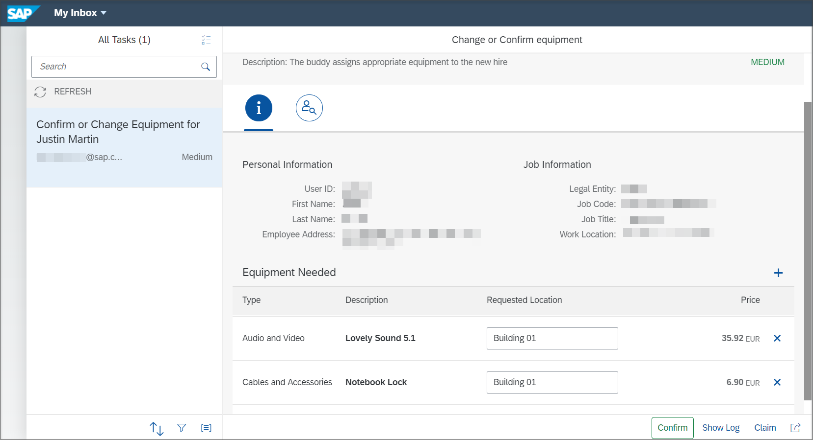

## Prerequisites
 - You have your workflow modelled, built and deployed on Cloud Foundry environment using SAP Cloud Platform Workflow. If you do not have workflows configured, then refer to the following [blog](https://blogs.sap.com/2019/05/20/sap-cloud-platform-workflow-sample-application-in-cloud-foundry/).
 - You have created a portal site to create Monitor Workflow and My Inbox tiles. To learn on how to create a **Monitor workflows** and **My Inbox** tiles, refer to [Help Portal](https://help.sap.com/viewer/e157c391253b4ecd93647bf232d18a83/Cloud/en-US/97c079f9317c42bba31cc9ca9d4cc7c3.html).
 - You have **`WorkflowParticipant`**, **`WorkflowAdmin`** and **`WorkflowInitiator`** roles assigned to your user.
 - You have setup the SAP Cloud Platform Process Visibility in your Cloud Foundry tenant.
 - You have **`PVAdmin`**, **`PVDeveloper`** and **`PVOperator`** roles of SAP Cloud Platform Process Visibility assigned to your user. For more information on how to assign these roles, refer to [Assign the Process Visibility Roles to Users] (cp-cf-processvisibility-setup-assignroles).

## Details
### You will learn
  - How to create a workflow instance in the SAP Cloud Platform Process Visibility Workspace.

Process Visibility applications have pre-built integration with SAP Cloud Platform Workflow which makes it easier to discover available workflows and import the required events and context attributes.

Once you have modelled and activated the business scenario, go to your Monitor Workflows application and start a new instance of the workflow. Once the workflow has started, you will see the start and other events being received by the process visibility service. You can see these events using the Event Acquisition application and processed them using the Monitor Scenario application.

[ACCORDION-BEGIN [Step 1: ](Access the SAP Cloud Platform Workflow Fiori Launchpad)]

1. Log in to SAP Cloud Platform Workflow Fiori launchpad.

2. Click the **Monitor Workflows** tile.

    

[DONE]
[ACCORDION-END]

[ACCORDION-BEGIN [Step 2: ](Create a new instance for the workflow)]

1. Search and select the workflow definition **onboard** for which you want to create an instance and click on **Start New Instance**.

    

    

2. Provide the starting payload and click **Start New Instance**.

    

3. Click on **Show Instances** to view the created instance.

    

    You should be able to see the newly created workflow instance.

    

4. Click on **Home** and navigate to the SAP Cloud Platform Workflow Fiori launchpad.

    

5. You should be able to see the increased count of tasks in the **My Inbox tile**.

    

6. Click **My Inbox** tile to open the application. You can see a new task in the list.

    

    Before you Confirm the task, access the Event Acquisition application to familiarize yourself with the acquired events. For more information on Event Acquisition application, refer to [Monitor Events Acquired using the Event Acquisition Application] (cp-cf-processvisibility-model-manageevents).

    You can move forward in the workflow by Confirming the task.

[VALIDATE_1]
[ACCORDION-END]

---
