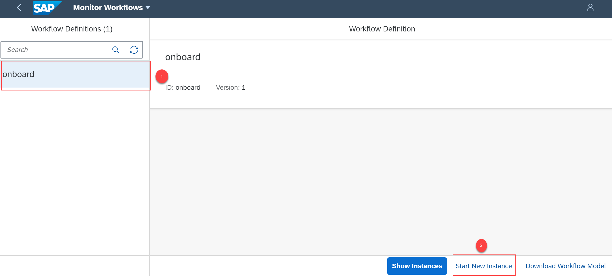

# Create Workflow Instances for Process Visibility
<!-- description --> Create workflow instances to see how events from different types of workflow activities combine to provide an overview to analyze the progress and identify inefficiencies in the workflow.

## Prerequisites
 - You have set up **SAP Workflow Management** service. For more information, see the [Set Up Workflow Management in Cloud Cockpit](cp-starter-ibpm-employeeonboarding-1-setup) tutorial.
 - You have created a visibility scenario named **Employee Onboarding Process** with **onboard** workflow as a process Participant. For more information, see [Create a Visibility Scenario for a Deployed Workflow](cp-cf-processvisibility-model-configscenario) tutorial.
 - You have set up business rules for determining equipment. To setup business rules, see steps 1 to 4 in [Configure Business Rules, Workflow and Process Visibility](cp-starter-ibpm-employeeonboarding-2-configure) tutorial.

## You will learn
  - How to start a workflow instance for a visibility scenario

## Intro
Once you have modelled and activated your visibility scenario, navigate to the **Monitor Workflows** application to start a new instance of the workflow. Once the workflow has started, you will see the start events and other events being received in the **Event Acquisition** application. You can process them using the **Monitor Visibility Scenarios** application.

---

### Start a new instance of workflow

1. Open the **Workflow Management** dashboard and choose the **Monitor Workflows** tile under **Monitoring Tools**.

    <!-- border -->

2. Search for the workflow using the workflow definition ID as the keyword. In this tutorial, we search for the **onboard** workflow definition ID for which we need to start the instance. Now, choose **Start New Instance** to start a new instance for the workflow.

    <!-- border -->

2. In the available payload, provide your trial email ID in the highlighted snippet and then choose **Start New Instance and Close**.

    <!-- border -->

3. Choose **Show Instances** to view the created instance.

    <!-- border -->

    You should be able to see the newly created workflow instance.

    <!-- border -->

### Open new workflow

1. Choose **Home** to navigate to the **Workflow Management** dashboard.

    <!-- border -->

    You can see a new task created in the **My Inbox** tile in the running state.

    <!-- border -->

2. Open the **My Inbox** application. You can see the new task in the list.

    <!-- border -->

    Before you **Confirm** the task, access the **Event Acquisition** application to familiarize yourself with the acquired events. For more information on Event Acquisition application, refer to [Monitor Events Acquired Using the Event Acquisition Application](cp-cf-processvisibility-model-manageevents).

    You can move forward in the workflow by choosing the **Confirm** button.

    <!-- border -->

---
