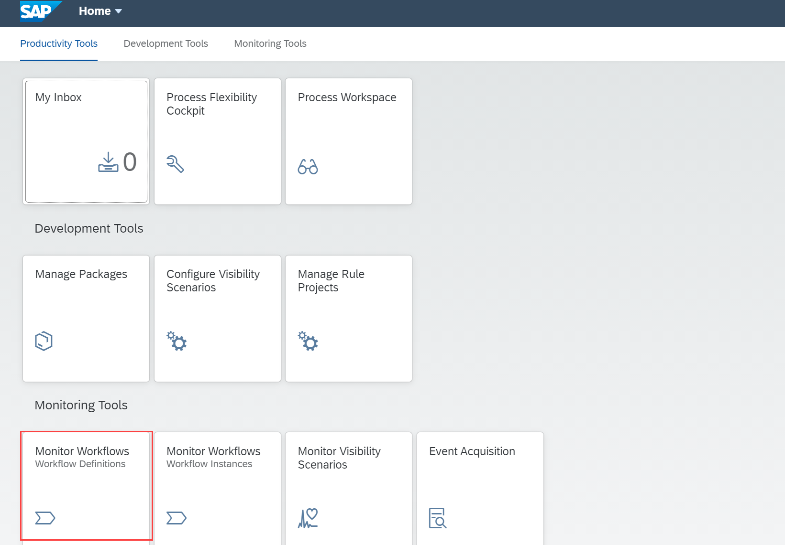

## Prerequisites
 - You have set up the **Workflow Management** service. For more information, see the [Set Up Workflow Management in Cloud Cockpit](cp-starter-ibpm-employeeonboarding-1-setup) tutorial.
 - You have set up the business rules for determining equipment. To setup business rules, see steps 1 to 4 in [Configure Business Rules, Workflow and Process Visibility](cp-starter-ibpm-employeeonboarding-2-configure) tutorial.

## Details
### You will learn
  - How to start a workflow instance for a scenario

Once you have modelled and activated the visibility scenario, navigate to the Monitor Workflows application and start a new instance of the workflow. Once the workflow has started, you will see the start and other events being received in the Event Acquisition application. You can process them using the Monitor Visibility Scenarios application.

---

[ACCORDION-BEGIN [Step 1: ](Start a new instance of workflow)]
1. Log on to the Workflow Management home screen and choose the **Monitor Workflows** tile.

    !

2. Search and select the workflow definition **onboard** for which you want to create an instance and click **Start New Instance**.

    !

2. In the available payload, provide your trial email ID in the highlighted snippet and then click **Start New Instance**.

    !

3. Click **Show Instances** to view the created instance.

    !

    You should be able to see the newly created workflow instance.

    !

[DONE]
[ACCORDION-END]

[ACCORDION-BEGIN [Step 2: ](Open new workflow)]

1. Click **Home** and navigate to the home screen.

    !

    You should be able to see a new task in the **My Inbox** tile in the running state.

    !

2. Click the **My Inbox** tile to open the application. You can see the new task in the list.

    !

    Before you **Confirm** the task, access the Event Acquisition application to familiarize yourself with the acquired events. For more information on Event Acquisition application, refer to [Monitor Events Acquired Using the Event Acquisition Application](cp-cf-processvisibility-model-manageevents).

    You can move forward in the workflow by choosing the **Confirm** button in **My Inbox**.

    !

[VALIDATE_1]
[ACCORDION-END]

---
