## Prerequisites
 - You are assigned to the **User & Role Administrator** role in the **Security** section of your subaccount. For more information on how to assign these roles, refer to [Assign the Process Visibility Roles to Users](cp-cf-processvisibility-setup-assignroles).

## Details
### You will learn
  - How to create role collections
  - How to assign role collections to your users

Add roles to one or more role collections and then assign these role collections to your users to use various applications of SAP Cloud Platform Process Visibility.

[ACCORDION-BEGIN [Step 1: ](Create a role collection)]

1. In your Web browser, open the [SAP Cloud Platform](https://account.hanatrial.ondemand.com/cockpit) cockpit. If you do not have a trial account, see Prerequisites.

2. You will see two buttons on the welcome screen of the SAP Cloud Platform Cockpit. Click on **Enter Your Trial Account** to see your global account.

    

3. Navigate to your subaccount.

    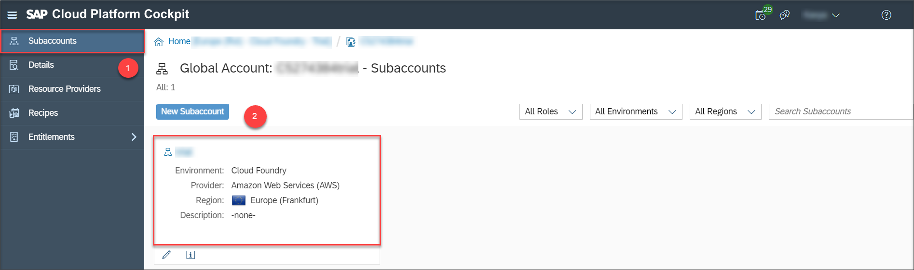

4. From the navigation pane, choose the **Security** tab, then choose **Role Collections**.

    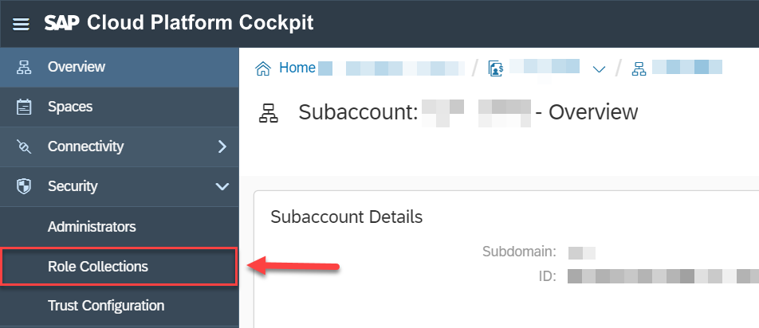

5. Click **New Role Collection** to create a role collection for your service.

    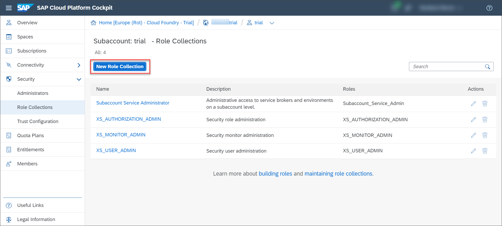

6. Provide a name and optionally a description to your role collection, then click **Save**.

    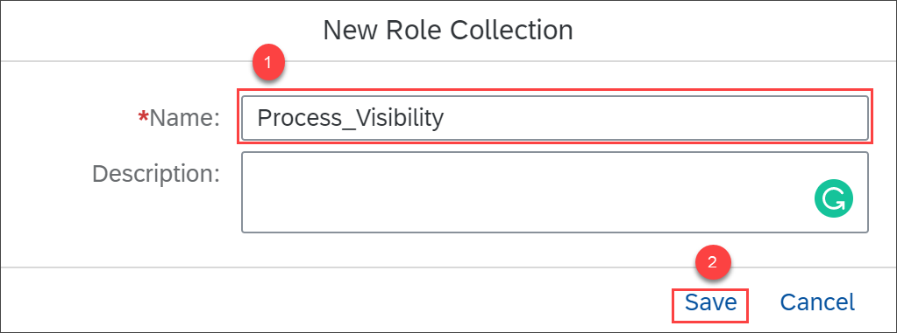

7. Choose the role collection created from the list and click **Add Role**.

    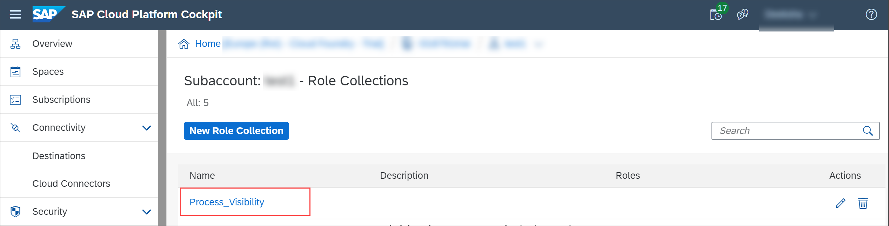

    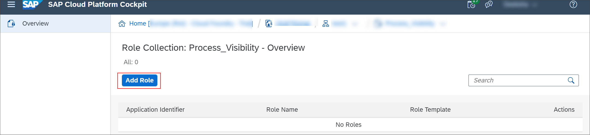

8. Choose the entry that begins with **`pvreuseservice`** to access the APIs as an application identifier.

    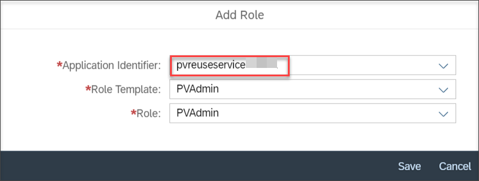

9. Choose the role template and the corresponding role to be assigned to the users from the dropdown menu, and then click **Save**.

 In this tutorial, assign the role templates **`PVAdmin`**, **`PVOperator`**, **`PVDeveloper`**, **`PVEventSender`** by following the steps from **Step 6**. For more information about these roles, refer to [Process Visibility Roles](https://help.sap.com/viewer/62fd39fa3eae4046b23dba285e84bfd4/Cloud/en-US/e395bfade9c64d89922c561c4b92979f.html).

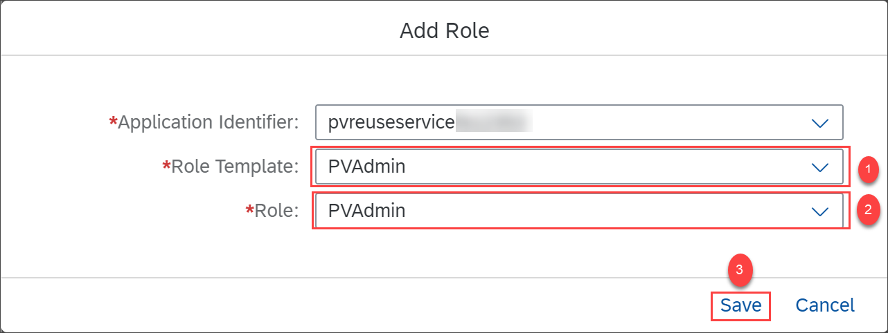

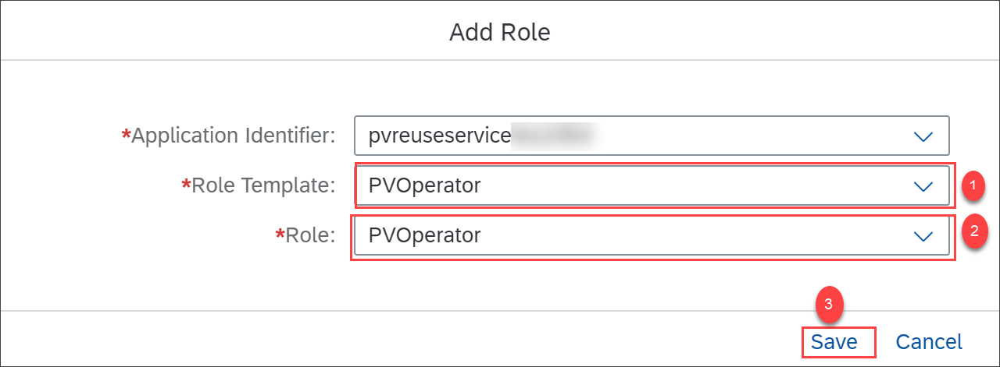

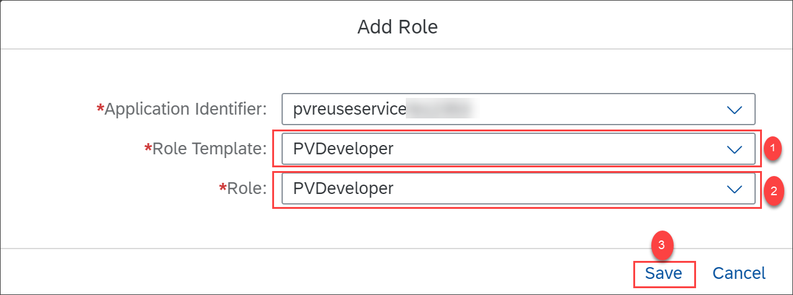

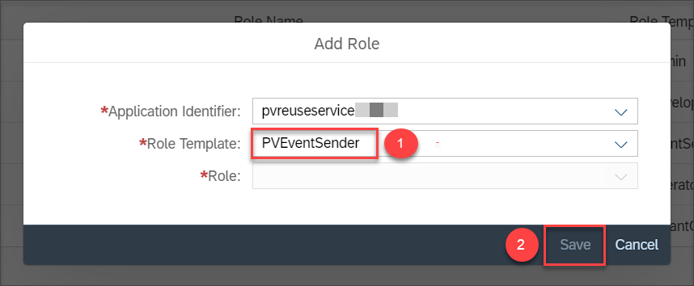

[DONE]
[ACCORDION-END]

[ACCORDION-BEGIN [Step 2: ](Assign the role collection to users)]

1. Navigate to your subaccount in the SAP Cloud Platform cockpit.

    

2. In the navigation pane, under **Security**, choose **Trust Configuration**. Then choose the name of your identity provider from the list of available identity providers.

    

4. Enter the email address of the user to wish you to assign the role collection into the **E-Mail Address** field, then choose **Show Assignments**.

    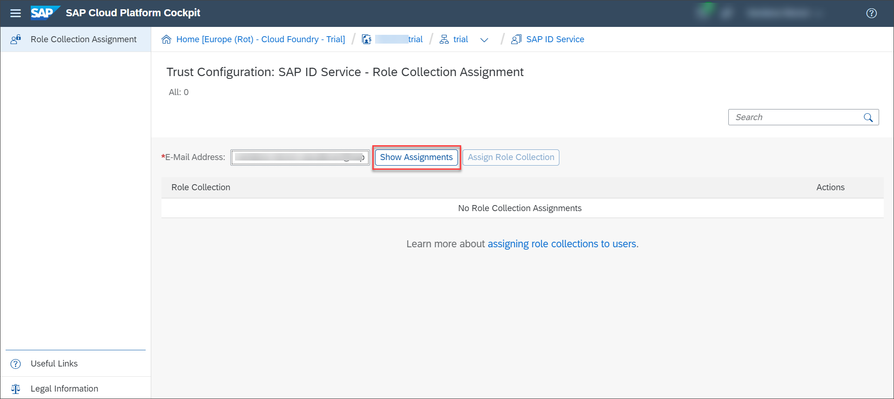

    If a user is not added to the respective identity provider, add the user by selecting **Add User** in the confirmation dialog box.

    

5. Choose **Assign Role Collection**. In the new window, select the desired role collection, and click **Assign Role Collection**.

    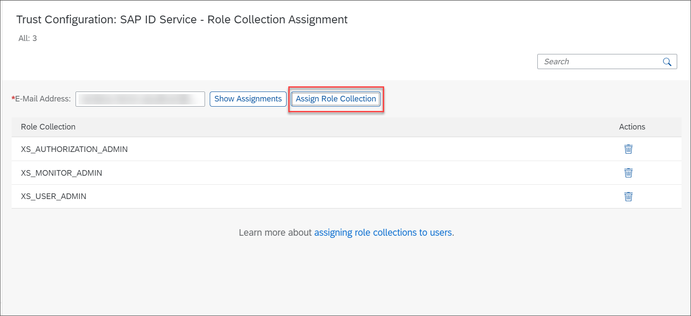

    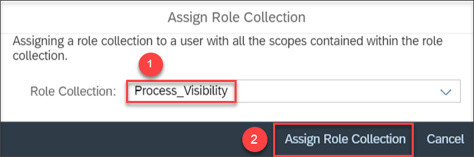

[VALIDATE_1]
[ACCORDION-END]

---
