## Prerequisites
### Details
### You will learn
- How to configure your multi-target application to view Process Visibility tiles in SAP Fiori launchpad

### Prerequisites
The UIs of Process Visibility must be configured on SAP Web IDE Full-Stack. After configuring and deploying the UIs, the three default tiles of Process Visibility will be available on SAP Fiori launchpad. For more information, see [Consuming UI Applications on SAP Fiori Launchpad](https://help.sap.com/viewer/62fd39fa3eae4046b23dba285e84bfd4/Cloud/en-US/27850a2be7834ccfa209a2a3aabd216e.html)

  - You must have SAP Web IDE Full-Stack enabled on your Neo account. This is needed for building and deploying FLP modules for accessing the Process Visibility applications on SAP Fiori launchpad.

  - You have configured the Cloud Foundry environment details on the SAP Web IDE Full-Stack.

  - You have a global account in Cloud Foundry.

  - You have created a subaccount and space in Cloud Foundry.

  - You have an entitlement for the following:

      - SAP Cloud Platform portal, which is needed for SAP Fiori launchpad configurations

      - Application Runtime

      - Process Visibility

  - You have created a service instance of Process Visibility and have noted the Process Visibility service instance name. For more information, see [Create a Service Instance of SAP Cloud Platform Process Visibility](cp-cf-processvisibility-setup-serviceinstance).

---

[ACCORDION-BEGIN [Step 1: ](Download the Multi-Target Application file from GitHub)]
1. Use the following link to access the MTA file from [GitHub] (https://github.com/SAP-samples/cloud-process-visibility/releases).

2. Choose the `FLPConfigForPVS.zip` file.

    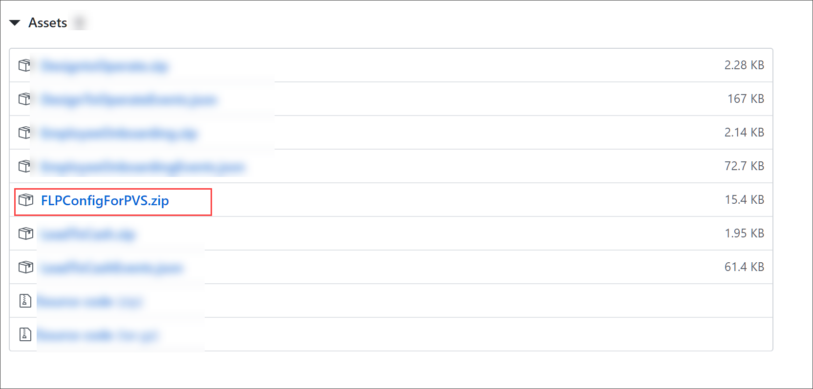

>The `FLPConfigForPVS.zip` is downloaded in your local system.

[DONE]
[ACCORDION-END]

[ACCORDION-BEGIN [Step 2: ](Import a Multi-Target Application to your SAP Web IDE Full-Stack)]
1. Log into the **SAP Web IDE Full-Stack** and open the **Development** perspective.

    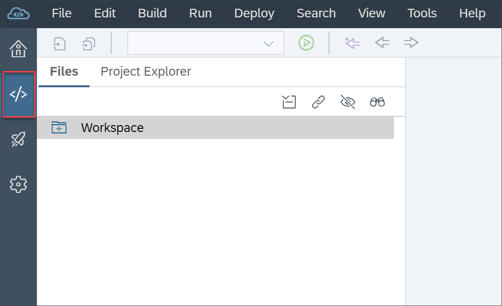

2. Right-click the **Workspace** root folder, then choose **Import > File or Project**.

    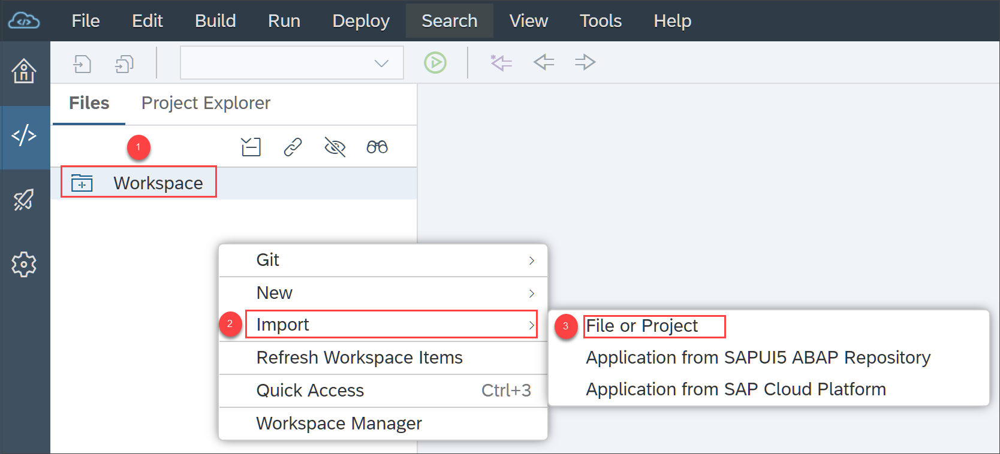

3. In the **Import** dialog, browse for the `FLPConfigForPVS.zip` file that you have downloaded in your local system.

    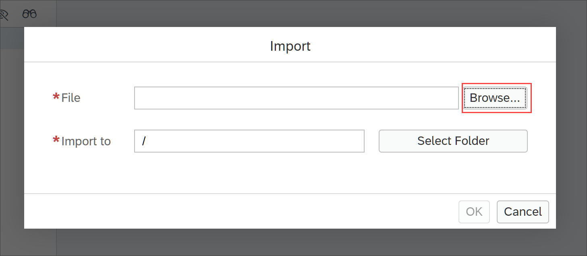

    Upon browsing the file, the other fields automatically get updated.

4. Choose **OK**.

    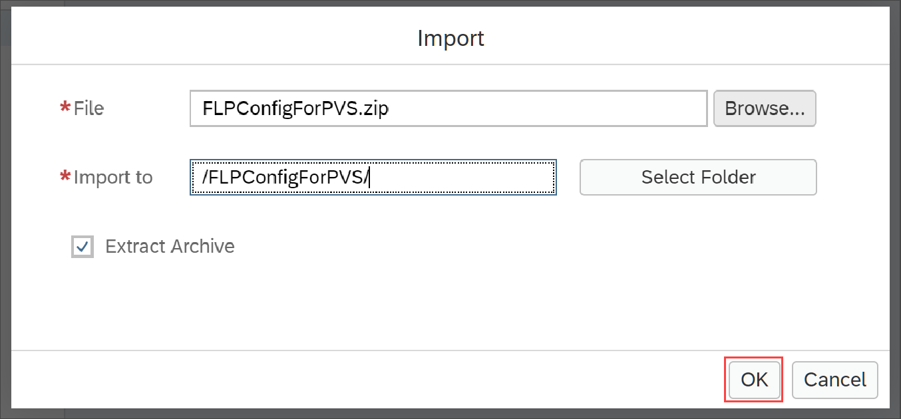

    >The MTA file is imported under the `Workspace` folder and the file structure is shown below. Ensure that have chosen **Show Hidden Files** to be able to view the file structure as shown.

    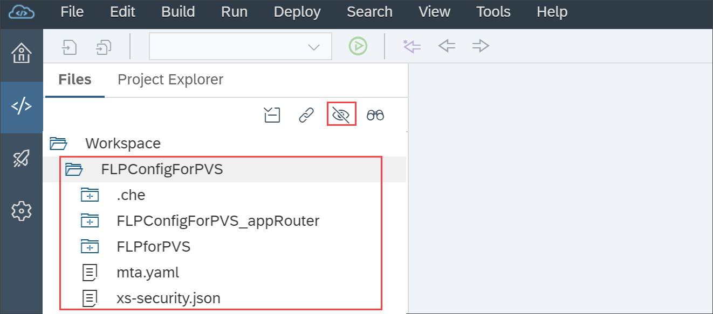

[DONE]
[ACCORDION-END]

[ACCORDION-BEGIN [Step 3: ](Modify the mta.yaml file (optional))]
If you have created a service instance with the name other than `pvservice`, you need to perform the following procedure.

1. Right-click the `mta.yaml` file and choose **Open Code Editor**.

    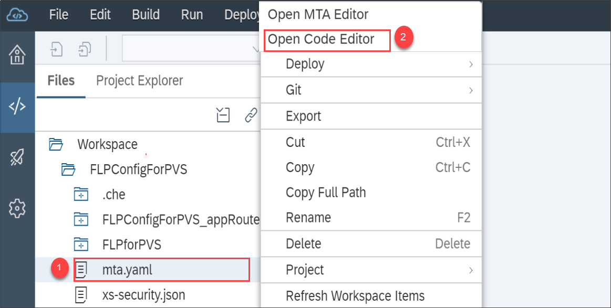

2. Add the name of your service instance in the `requires` section of the `approuter` module and the SAP Fiori launchpad site module. In this example, we have created a service instance called `pvservice`. Ensure that you provide the name of the service instance that you have created during [Create a Service Instance of SAP Cloud Platform Process Visibility](cp-cf-processvisibility-setup-serviceinstance).

    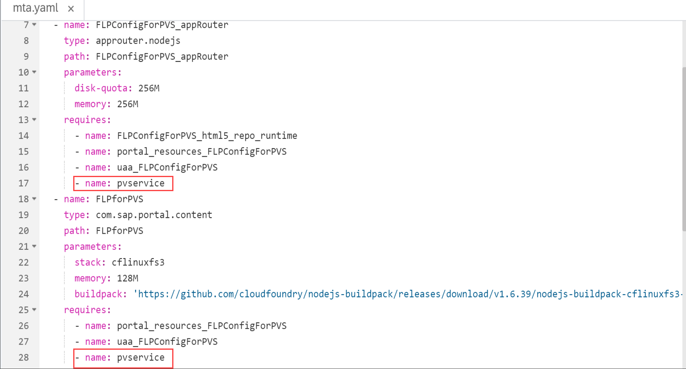

3. Add the name of your service instance in the `resources` section of the SAP Fiori launchpad site module. In this example, we have created a service instance called `pvservice`. Ensure that you provide the name of the service instance that you have created during [Create a Service Instance of SAP Cloud Platform Process Visibility](cp-cf-processvisibility-setup-serviceinstance).

    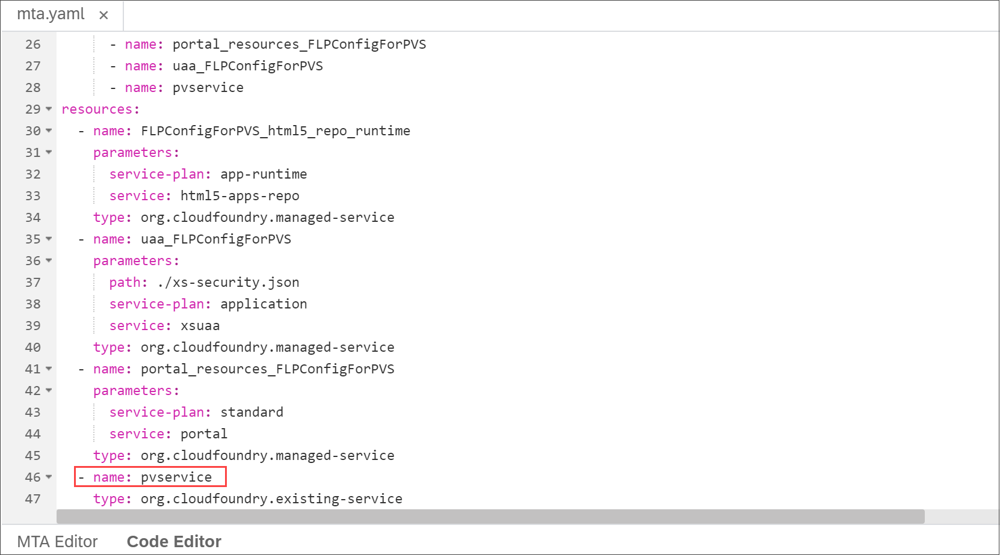

[DONE]
[ACCORDION-END]

[ACCORDION-BEGIN [Step 4: ](Build and deploy your project)]

1. Right-click on the `FLPConfigForPVS` project and choose **Build > Build**.

    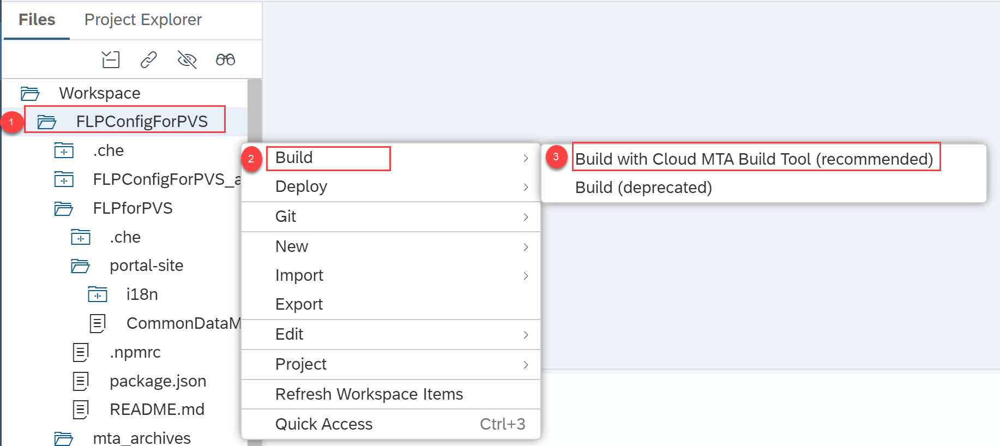

2. After the build completes, navigate to the **`mta_archives` > `FLPConfigForPVS_0.0.1.mtar`** file and choose **Deploy > Deploy to SAP Cloud Platform**.

    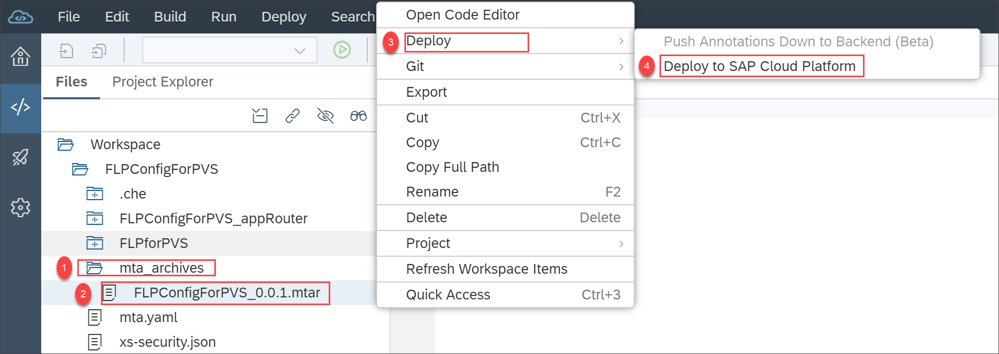

3. In the **Deploy to SAP Cloud Platform** dialog, choose the highlighted Cloud Foundry environment details as shown below and then choose **Deploy**.

    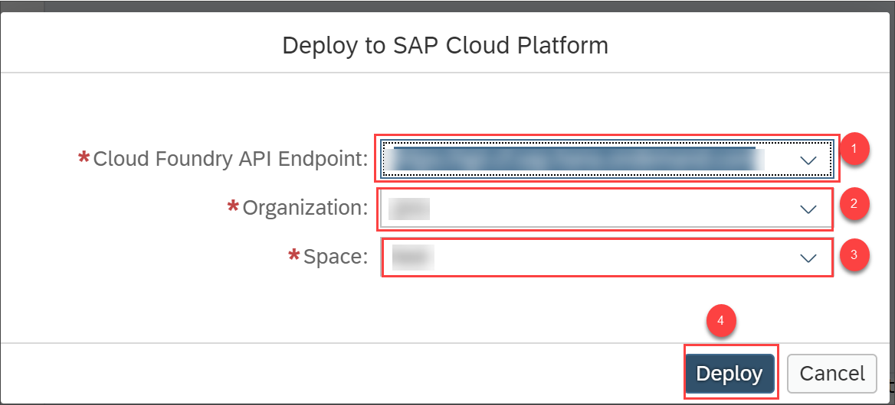

4. Open the job console at the end of the deployment process, and search for the App Router URL. It should appear in the console as follows:

    `Application <app name>-approuter has been created. Application URL is: https://<application URL>.`

    >To know more about accessing the applications using SAP Cloud Platform cockpit, refer to [Access Launchpad Runtime](https://help.sap.com/viewer/ad4b9f0b14b0458cad9bd27bf435637d/Cloud/en-US/4657960c8fab408eb84a575d267e1041.html).

5. Copy the URL to your browser to access the tiles on SAP Fiori launchpad. You can now see default tiles of Process Visibility on SAP Fiori launchpad.

    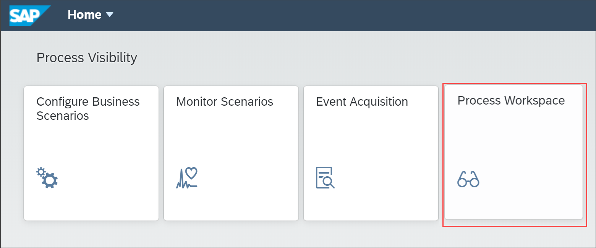

[VALIDATE_1]
[ACCORDION-END]

---
