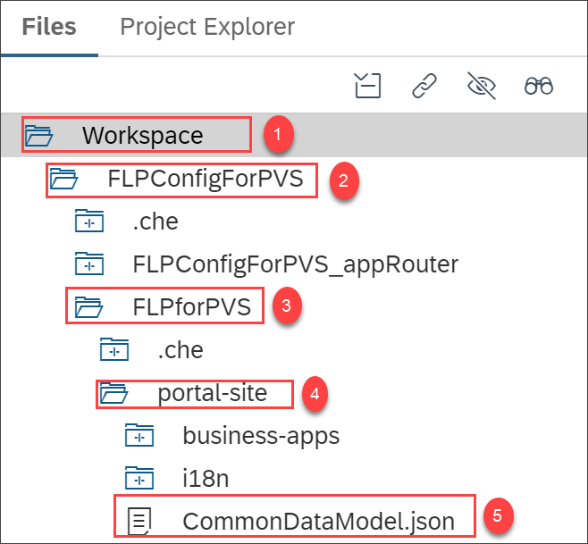
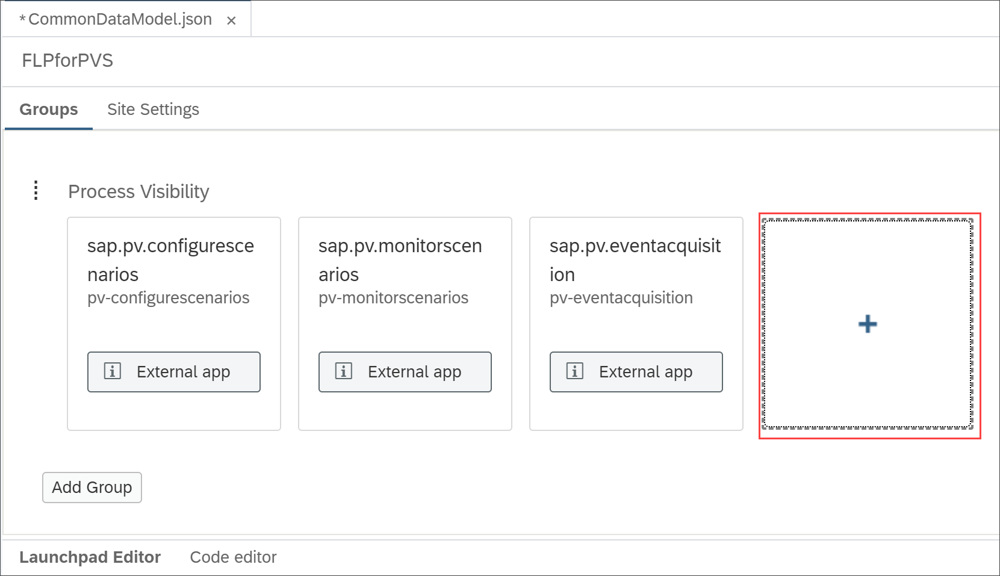
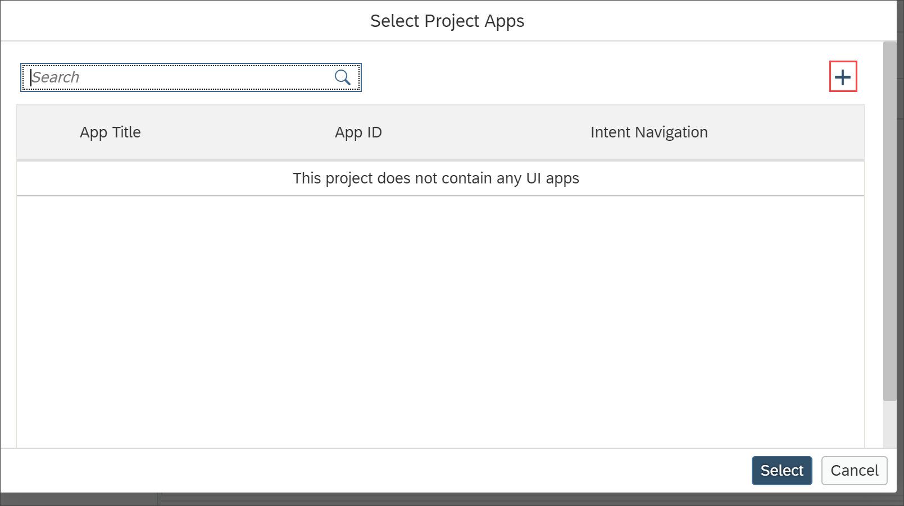
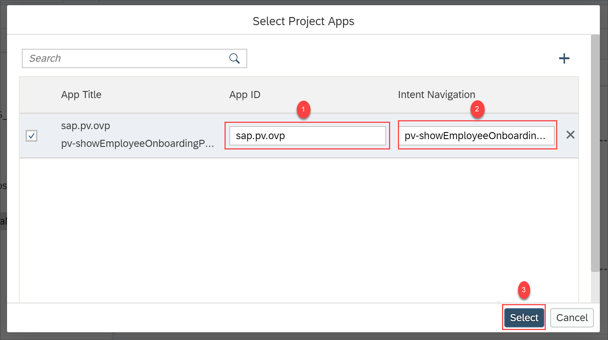
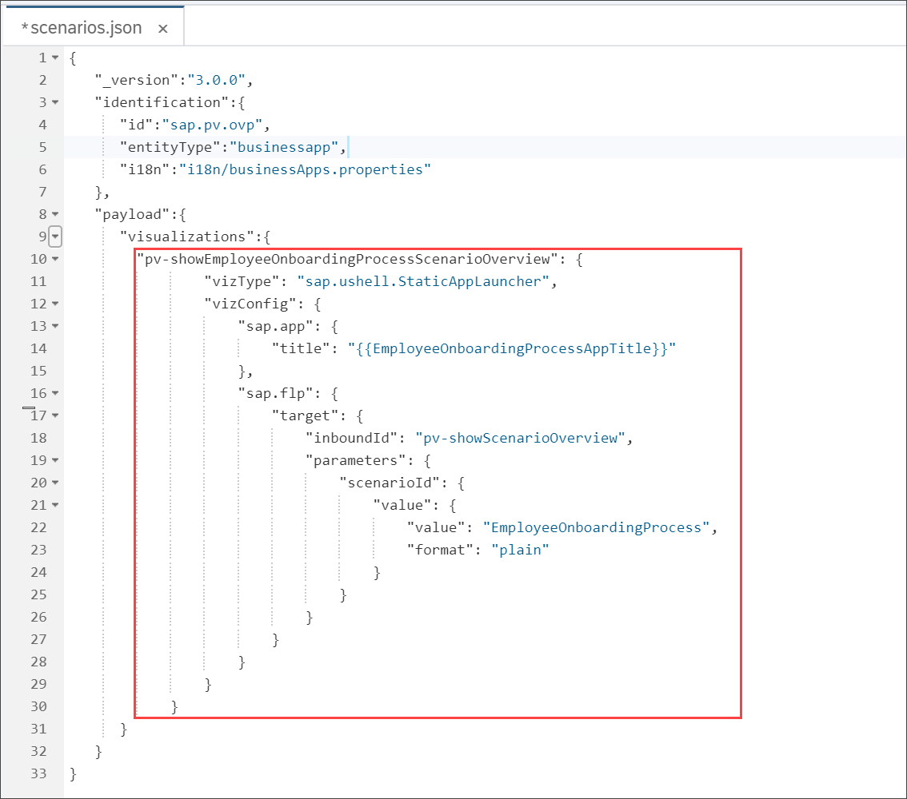
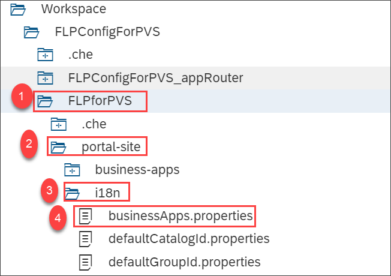
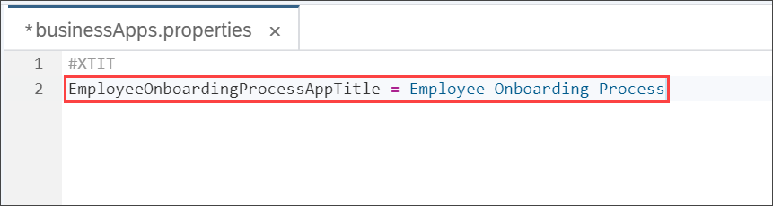
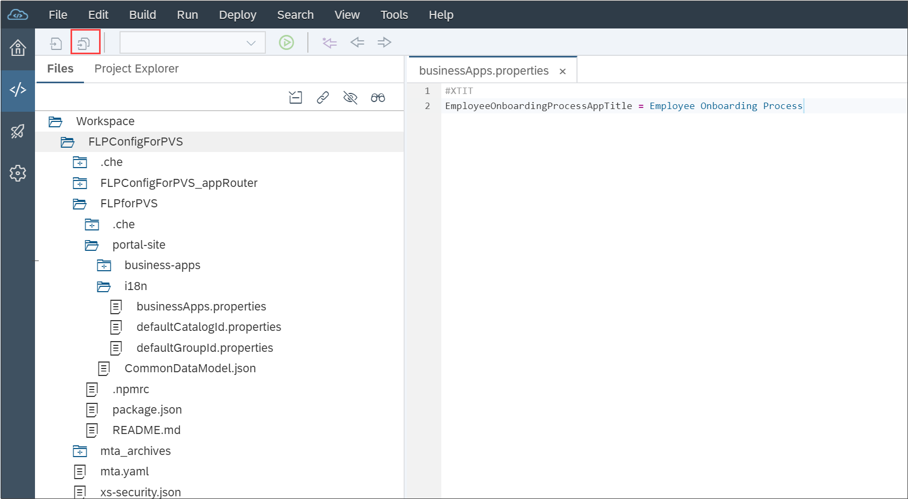
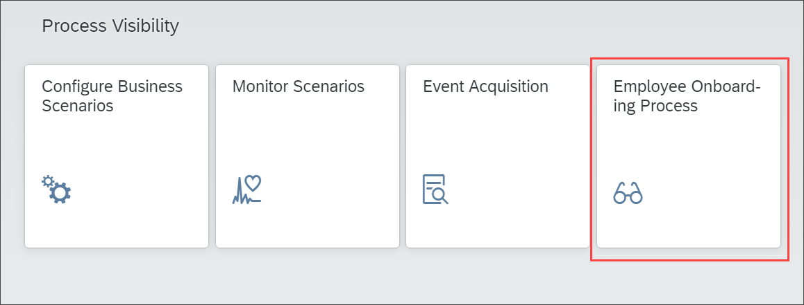

## Prerequisites
 - • You have configured the default UI applications of Process Visibility. For more information, see [Consume the Process Visibility UI Applications Using SAP Fiori Launchpad](cp-cf-processvisibility-setup-flp).
 - • You have noted down the **Scenario ID** and **Scenario Name** provided, while creating your business scenario. For more information, see [Create Your Business Scenario](cp-cf-processvisibility-model-configscenario).

## Details
### You will learn
  - How to modify your multi-target application file to create a scenario specific Process Workspace tile

You need to configure scenario specific tile for the Process Workspace application to explicitly add each business scenario as a tile on SAP Fiori launchpad.

---

[ACCORDION-BEGIN [Step 1: ](Create Process Workspace tile)]
In this step, you will be creating a tile for the `Employee Onboarding Process` using the SAP Web IDE Full-Stack application.

1. Log on to the SAP Web IDE Full-Stack application and navigate to **Development** perspective.

    

    Expand the folders in the following order to open the `CommonDataModel.JSON` file. You can open the `CommonDataModel.JSON` file by double-clicking the file.

    

2. In the **Launchpad Editor** of the `CommonDataModel.JSON` file, choose the **+** tile.

    

3. In the **Select Project Apps** dialog, choose the **+** icon.

    

    Provide the following value in the **App ID** and **Intent Navigation** fields and choose **Select**:

    |  App ID     | Intent Navigation  
    |  :------------- | :-------------   
    |  **`sap.pv.ovp`** | **`pv-showEmployeeOnboardingProcessScenarioOverview`**

    >In this procedure, the `<ScenarioID>` is set to `EmployeeOnboardingProcess`. You can add tiles on SAP Fiori launchpad for each business scenario for Process Workspace by providing the relevant `Scenario ID` in the place of `EmployeeOnboardingProcess`.

    

[DONE]
[ACCORDION-END]

[ACCORDION-BEGIN [Step 2: ](Configure the Process Workspace tile)]

1.	Navigate to the `scenarios.json` file as shown.

    

    Open the `scenarios.json` file and provide the following code snippet after the `visualizations` section:

    ```JSON
    "pv-showEmployeeOnboardingProcessScenarioOverview": {
                "vizType": "sap.ushell.StaticAppLauncher",
                "vizConfig": {
                    "sap.app": {
                        "title": "{{EmployeeOnboardingProcessAppTitle}}"
                    },
                    "sap.flp": {
                        "target": {
                            "inboundId": "pv-showScenarioOverview",
                            "parameters": {
                                "scenarioId": {
                                    "value": {
                                        "value": "EmployeeOnboardingProcess",
                                        "format": "plain"
                                    }
                                }
                            }
                        }
                    }
                }
            }
```
    >In this example, **Scenario ID** value is `EmployeeOnboardingProcess`. If you have provided a different **Scenario ID** while configuring your business scenario, then ensure that `EmployeeOnboardingProcess` in the above code is replaced with the **Scenario ID** of your business scenario.

    > After adding the code snippet your `scenarios.json` file should look like this.

    

2. Navigate to `FLPforPVS` > **portal-site** > **i18n** > `businessApps.properties` file as shown.

    

3. Provide the following snippet in the `businessApps.properties` file. You can provide the `Scenario ID` and `Scenario Name` as per your business scenario configuration. In this example, `Scenario ID` value is **`EmployeeOnboardingProcess`** and `Scenario Name` value is **`Employee Onboarding Process`**.

    ```json
    EmployeeOnboardingProcessAppTitle = Employee Onboarding Process
    ```

      

4.	Save the changes.

    

[DONE]
[ACCORDION-END]


[ACCORDION-BEGIN [Step 3: ](Build and deploy your project)]

After making the tile configurations, you must build the modified project and deploy it to your SAP Cloud Platform account.

1. Right-click on the `FLPConfigForPVS` project and choose **Build > Build**.

    

2. After the build completes, navigate to the **`mta_archives` > `FLPConfigForPVS_0.0.1.mtar`** file and choose **Deploy > Deploy to SAP Cloud Platform**.

    

3. In the **Deploy to SAP Cloud Platform** dialog, choose the following Cloud Foundry environment details and then choose **Deploy**.

    

4. Open the job console at the end of the deployment process, and search for the App Router URL. It should appear in the console as follows:

    `Application <app name>-approuter has been created. Application URL is: https://<application URL>.`

    >To know more about accessing the applications using SAP Cloud Platform cockpit, refer to [Access Launchpad Runtime](https://help.sap.com/viewer/ad4b9f0b14b0458cad9bd27bf435637d/Cloud/en-US/4657960c8fab408eb84a575d267e1041.html).

5. Copy the URL to your browser to access the tiles on SAP Fiori launchpad. You can now see the tiles on SAP Fiori launchpad.



[VALIDATE_1]

[ACCORDION-END]

---
