## Prerequisites
 - You are a global account administrator and your global account is entitled to use SAP Cloud Platform Process Visibility.
 - You have created a subaccount.
 - You have created a space within a subaccount in which Cloud Foundry is enabled. Within that space, the user is assigned to the **Space Manager** and **Space Developer** roles for the subaccount.
 - You have SAP Cloud Platform Web IDE Full-Stack enabled on your Neo account.

## Details
### You will learn
  - How to create a service instance of SAP Cloud Platform Process Visibility using SAP Cloud Platform cockpit

SAP Cloud Platform Process Visibility provides end-to-end visibility and intelligence to processes, which run on cloud, on-premise, and in hybrid environments. For more information on SAP Cloud Platform Process Visibility, refer to [SAP Cloud Platform Process Visibility](https://help.sap.com/viewer/62fd39fa3eae4046b23dba285e84bfd4/Cloud/en-US/2f72882f457a4b87a054bdf45d85fe52.html).

You must create a service instance to enable SAP Cloud Platform Process Visibility. You can create multiple service instances of process visibility across different spaces within the same organization. These instances share the same data.

---

[ACCORDION-BEGIN [Step 1: ](Assign service entitlements to global account)]
1. Log onto SAP Cloud Platform Control Center to assign service entitlements to your global account. Use your global account admin credentials to access the Control Center.

2. In the SAP Cloud Platform Control Center, navigate to your global account, click **Edit** and choose **Assign Services** from the dropdown list.

    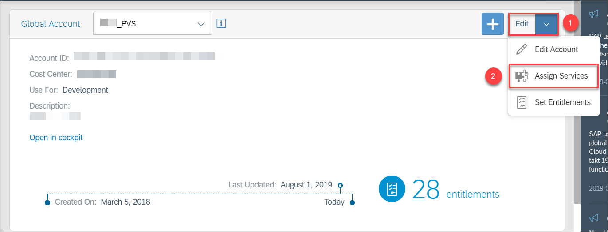

3. Search the service by typing the keyword of the service in the search field, select the service, and click **Save**. In this tutorial, you require entitlements for **Process Visibility**, **Portal**, and **Application Runtime** services.

    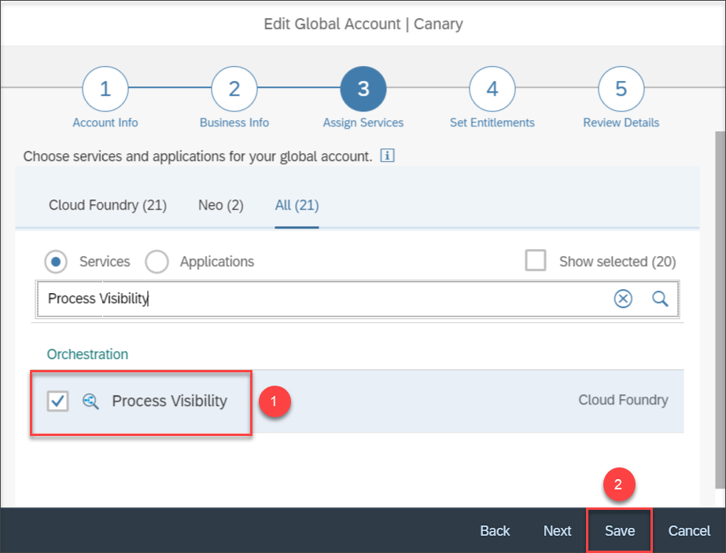

    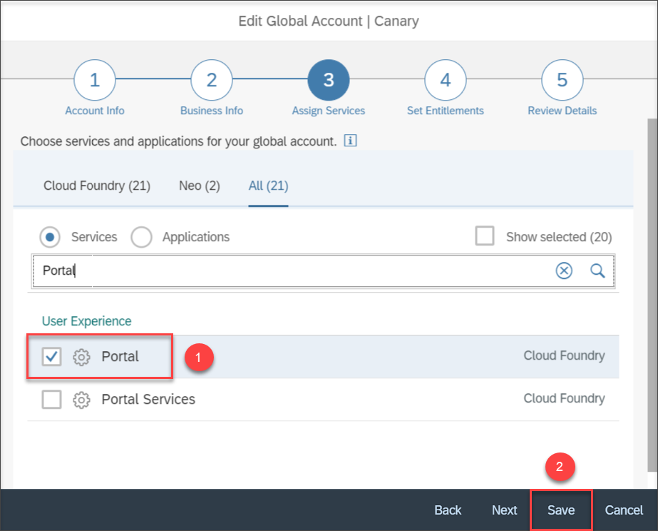

    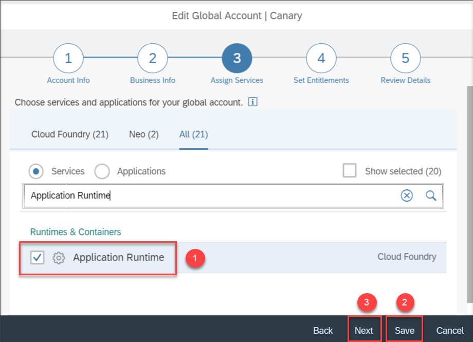

    Choose **Next** after selecting all the required services for entitlement.

4. Add **Process Visibility**, **Portal**, and **Application Runtime** entitlements to your global account with their quota for maximum allowed consumption. Choose the service, increase the quota based on your requirement, and click **Save**.

    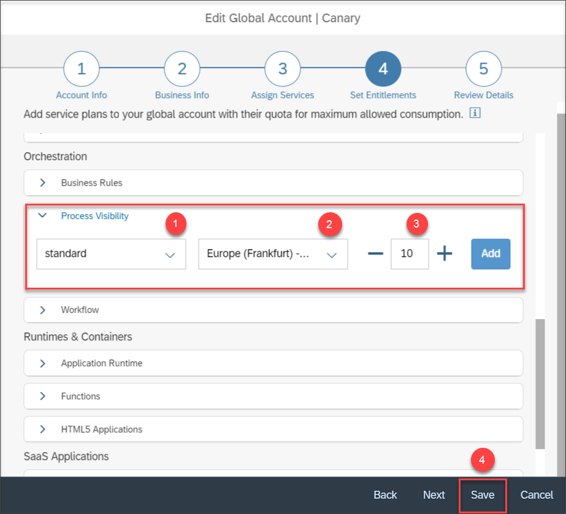

    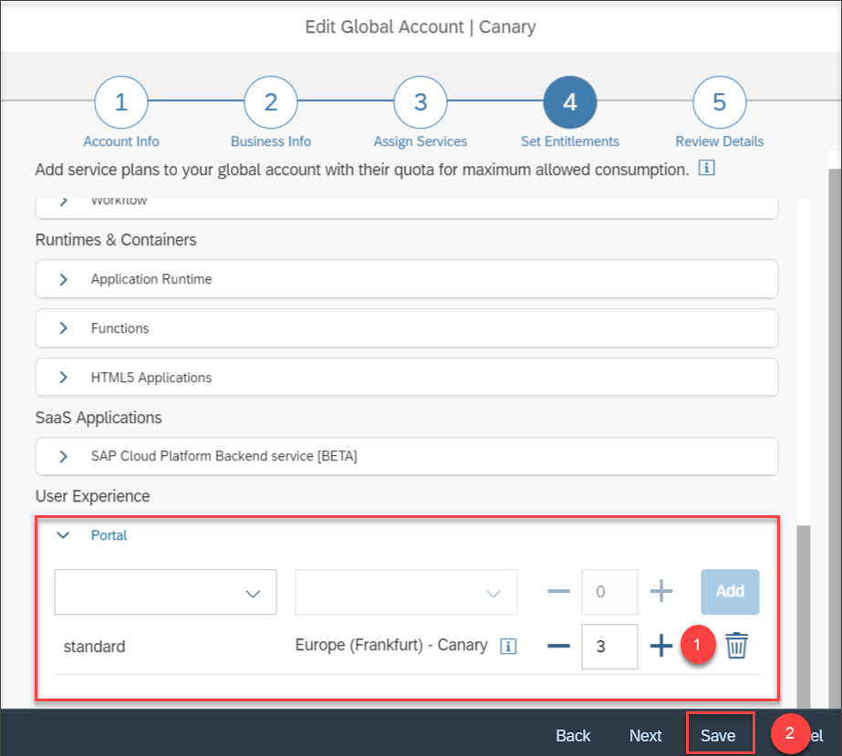

    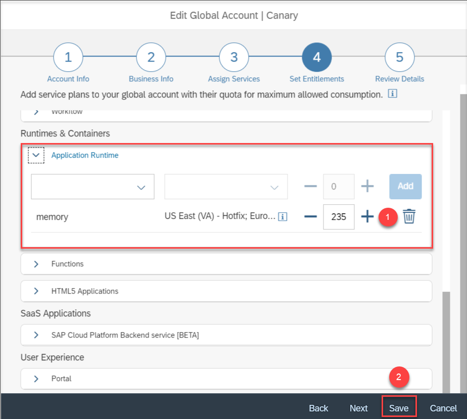

[DONE]
[ACCORDION-END]

[ACCORDION-BEGIN [Step 2: ](Assign service entitlements to subaccount)]

1. Open the SAP Cloud Platform cockpit in your web browser. Under **Entitlements**, navigate to **Subaccount Assignments**.

    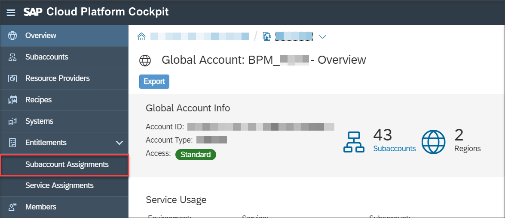

2. Search your subaccount in the search field, choose your subaccount, and click **Go**.

    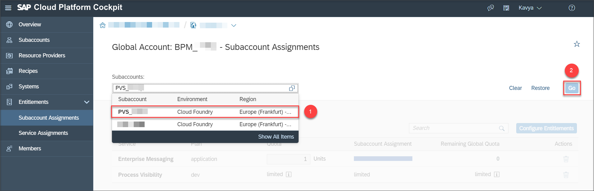

    You will be able to see the list of services and their entitlements.

3. Click **Configure Entitlements** to configure the service entitlements to your subaccount.

    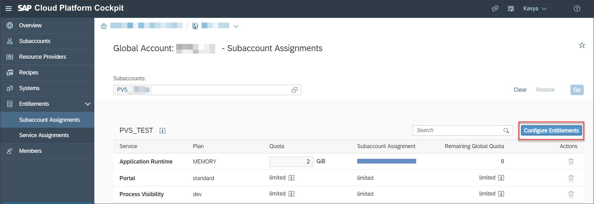

4. Add service plans to your services by clicking **Add Service Plans**.

    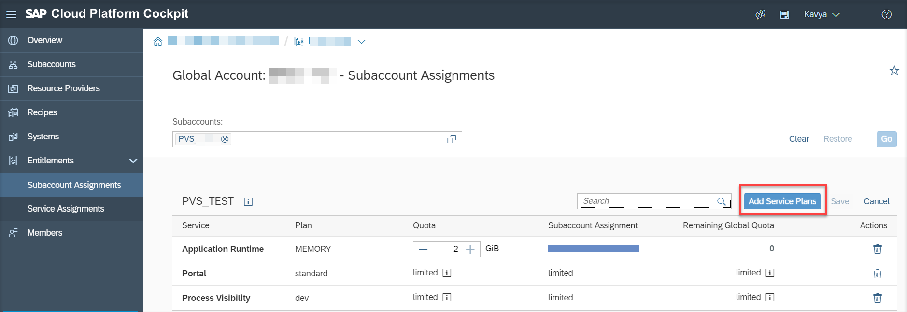

    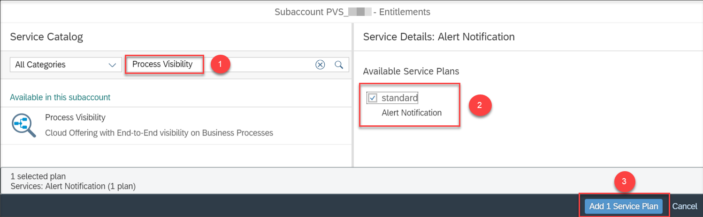

    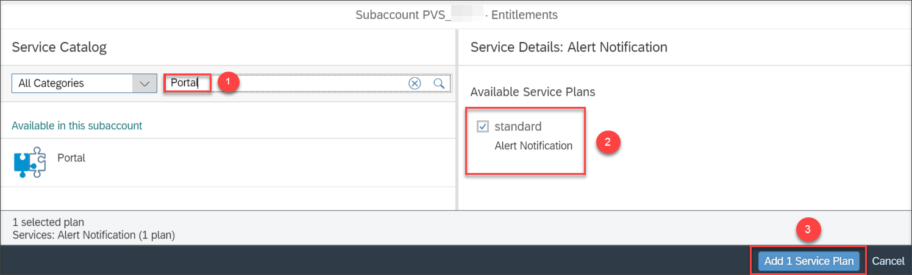

    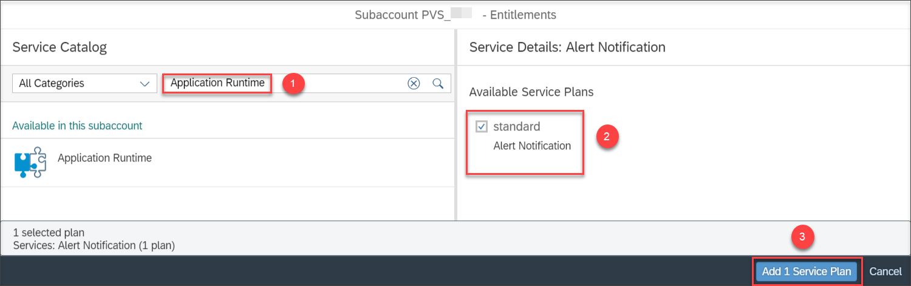

[DONE]
[ACCORDION-END]

[ACCORDION-BEGIN [Step 3: ](Create a service instance)]

1. Open the SAP Cloud Platform cockpit in your web browser. Navigate to **Spaces** and choose your space.

    

2. Under **Services** in the navigation pane, select **Service Marketplace**.

    

3. In **Service Marketplace**, search for process visibility and choose the **Process Visibility** tile.

    

4. In the navigation area, choose **Instances** and then select **New Instance** to create a new instance.

    

5. Choose the service plan **standard** and click **Next**.

    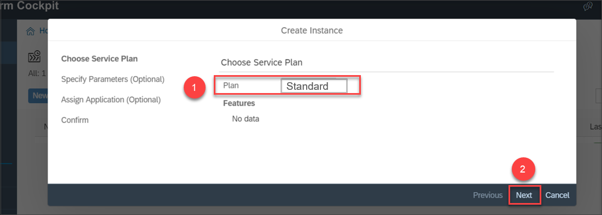

6. No parameters are needed as shown in the following image, so choose **Next**.

    

7. In the next screen, choose **Next** as we don't need to bind any application.

    

8. In the **Instance Name** field, provide **`pvservice`** as the instance name. You can provide a unique instance name of your wish.

    >**IMPORTANT:** Note the instance name, as it is required to bind the UIs. The new instance is displayed in the list and the status present under the **Last Operation** changes to **Created**.

    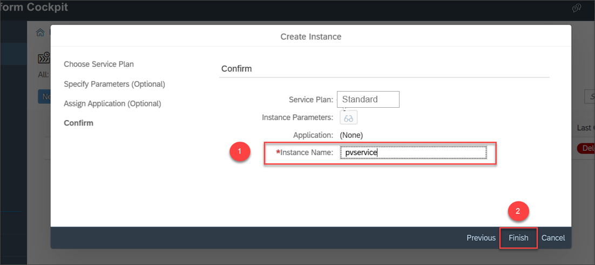

    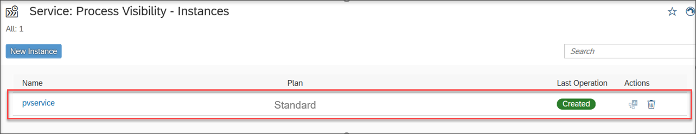

[DONE]
[ACCORDION-END]

[ACCORDION-BEGIN [Step 4: ](Create service key for service instance)]

1. In the navigation area, choose **Instances**, then choose the **`pvservice`** instance from the list for which you are creating a service key.

    

2. Choose **Service Keys** in the navigation area and select **Create Service Key**.

    

3. In the **Name** field, provide **`pvservicekey`** as the service key name and click **Save**.

    

[VALIDATE_1]
[ACCORDION-END]
