## Prerequisites
 - **Tutorials:** [Get a Free Trial Account on SAP Cloud Platform](hcp-create-trial-account)
 - Configure entitlement for Process Visibility in your subaccount. for more info, see [Configure Entitlements and Quotas for Subaccounts](https://help.sap.com/viewer/65de2977205c403bbc107264b8eccf4b/Cloud/en-US/5ba357b4fa1e4de4b9fcc4ae771609da.html)

## Details
### You will learn
  - How to create a service instance of SAP Cloud Platform Process Visibility using SAP Cloud Platform cockpit

SAP Cloud Platform Process Visibility provides end-to-end visibility and intelligence to processes, which run on cloud, on-premise, and in hybrid environments. For more information on SAP Cloud Platform Process Visibility, refer to [SAP Cloud Platform Process Visibility](https://help.sap.com/viewer/62fd39fa3eae4046b23dba285e84bfd4/Cloud/en-US/2f72882f457a4b87a054bdf45d85fe52.html).

You must create a service instance to enable SAP Cloud Platform Process Visibility. You can create multiple service instances of process visibility across different spaces within the same organization. These instances share the same data.

[ACCORDION-BEGIN [Step 1: ](Open the SAP Cloud Platform cockpit)]

1. In your Web browser, open the [SAP Cloud Platform](https://account.hanatrial.ondemand.com/cockpit) cockpit. If you do not have a trial account, see Prerequisites.

2. You will see two buttons on the welcome screen of the SAP Cloud Platform Cockpit. Click on **Enter Your Trial Account** to see your global account.

    

[DONE]
[ACCORDION-END]

[ACCORDION-BEGIN [Step 2: ](Open Process Visibility tile)]

1. Navigate to your subaccount.

    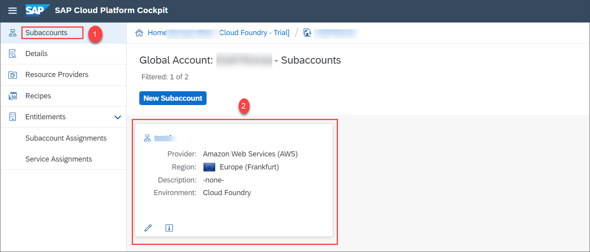

2. Navigate to **Spaces** and choose your space.

    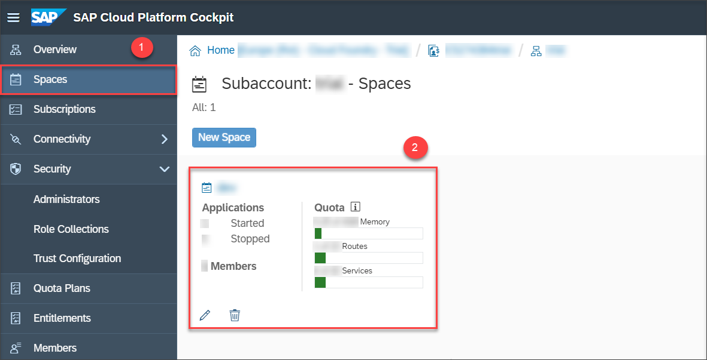

3. Under **Services** in the navigation pane, select **Service Marketplace**.

    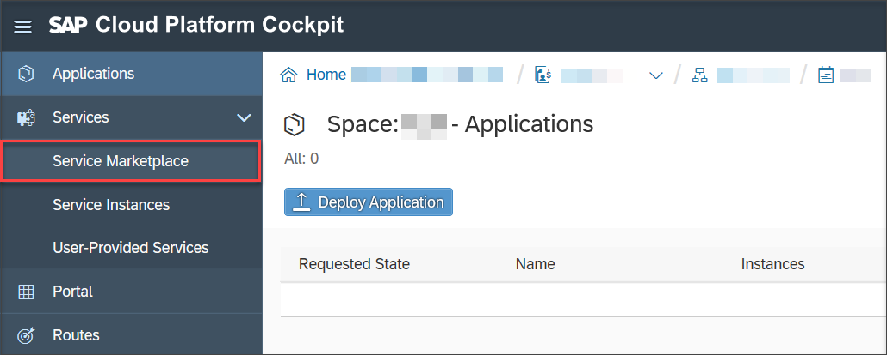

4. In **Service Marketplace**, search for process visibility and choose the **Process Visibility** tile.

    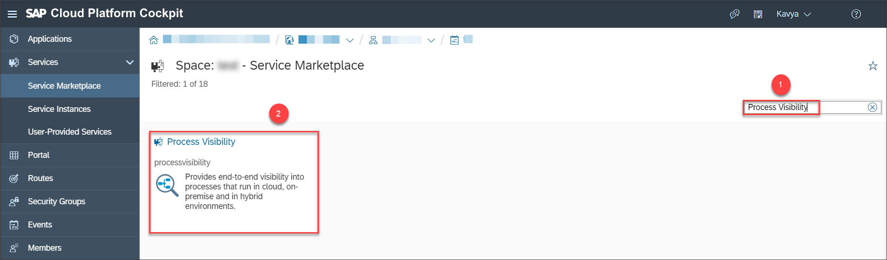

[DONE]
[ACCORDION-END]

[ACCORDION-BEGIN [Step 3: ](Create a service instance)]

1. In the navigation area, choose **Instances** and then select **New Instance** to create a new instance.

    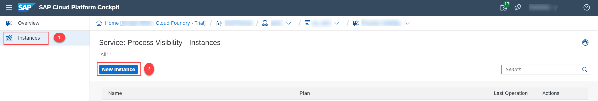

2. Choose the service plan **lite** and click **Next**.

    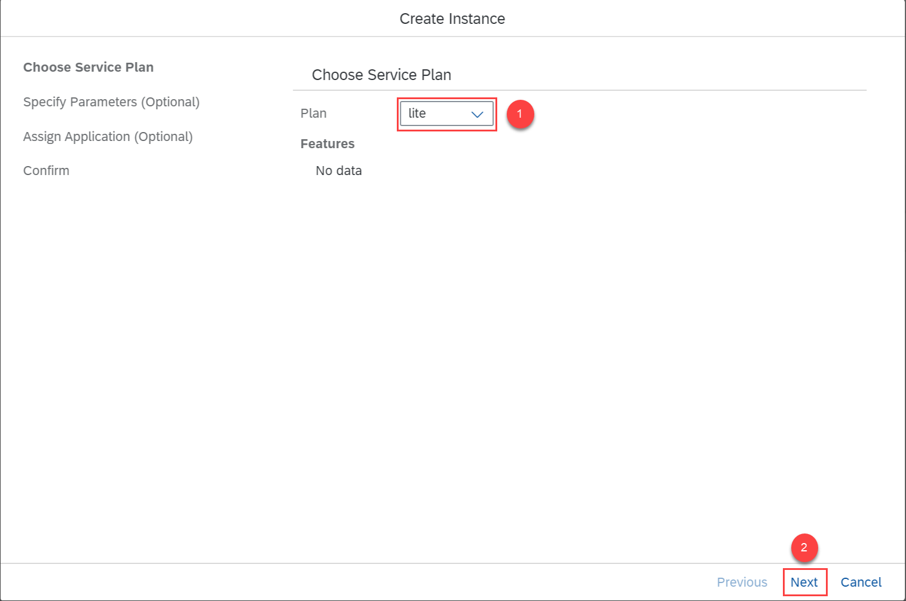

3. No parameters are needed as shown in the following image, so choose **Next**.

    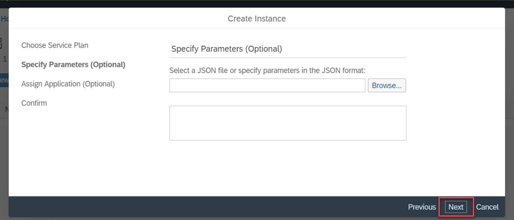

4. In the next screen, choose **Next** as we don't need to bind any application.

    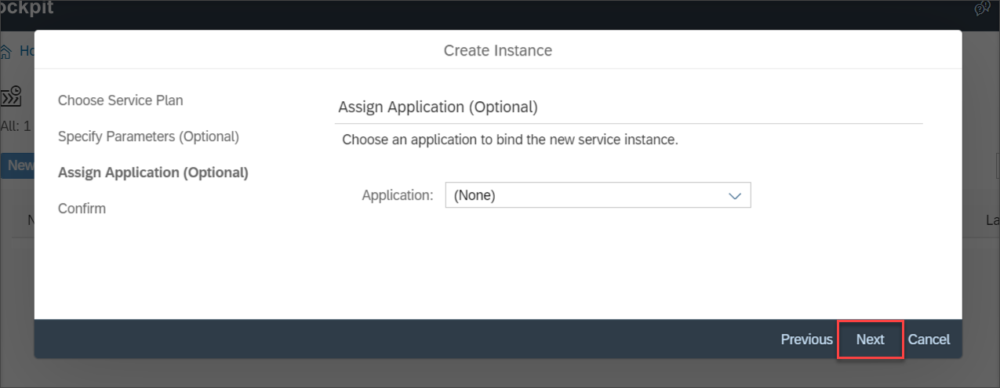

5. In the **Instance Name** field, provide **`pvservice`** as the instance name and choose **Finish**. You can provide a unique instance name of your wish.

    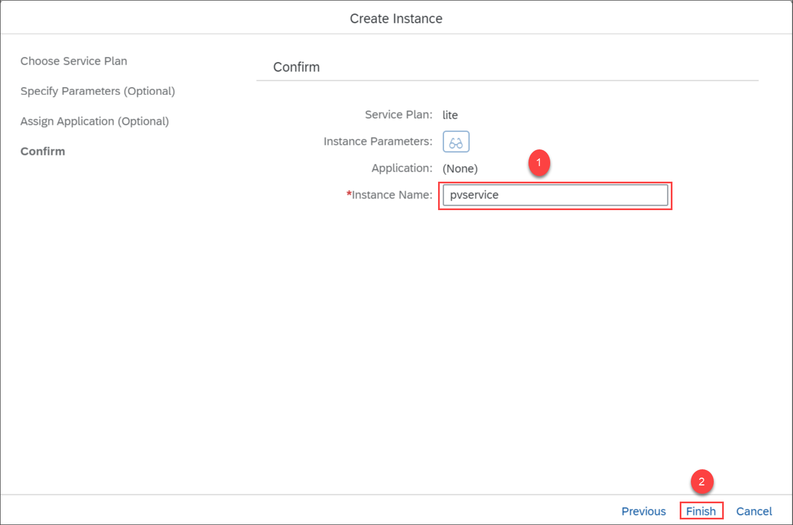

    >**IMPORTANT:** Note the instance name, as it is required to bind the UIs. The new instance is displayed in the list and the status present under the **Last Operation** changes to **Created**.

    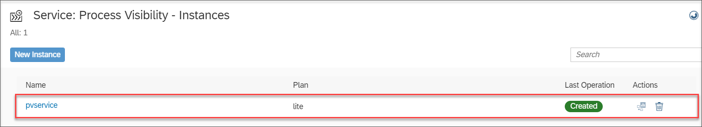

[DONE]
[ACCORDION-END]

[ACCORDION-BEGIN [Step 4: ](Create service key for service instance)]

1. Choose the **`pvservice`** instance from the list for which you are creating a service key.

    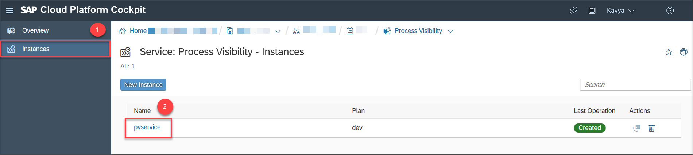

2. Choose **Service Keys** in the navigation area and select **Create Service Key**.

    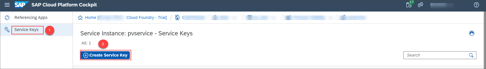

3. In the **Name** field, provide **`pvservice_key`** as the service key name and click **Save**.

    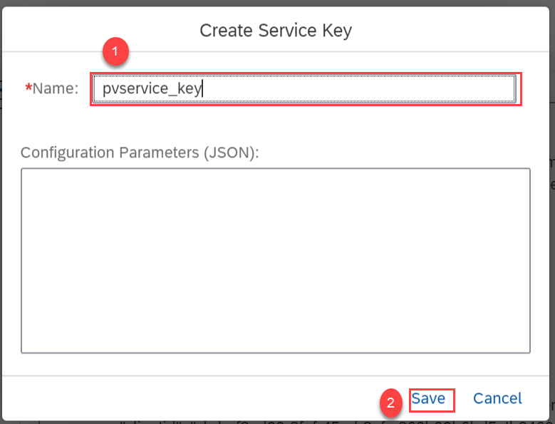

[VALIDATE_1]
[ACCORDION-END]
