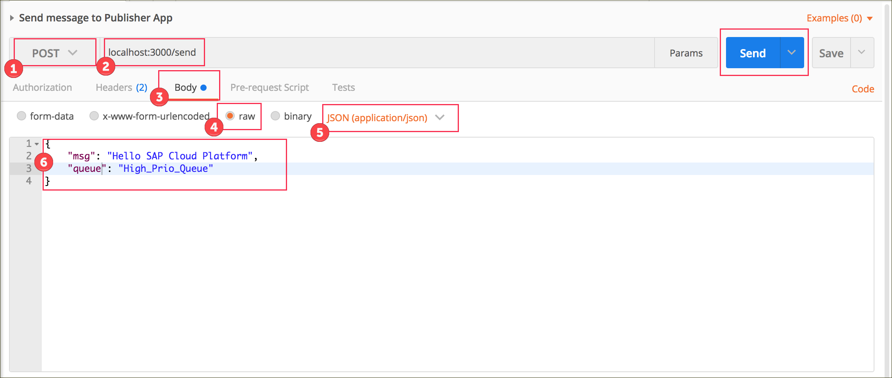
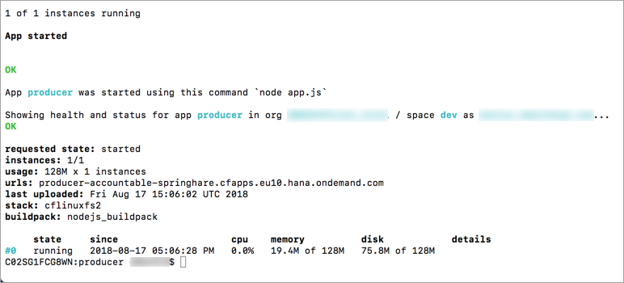
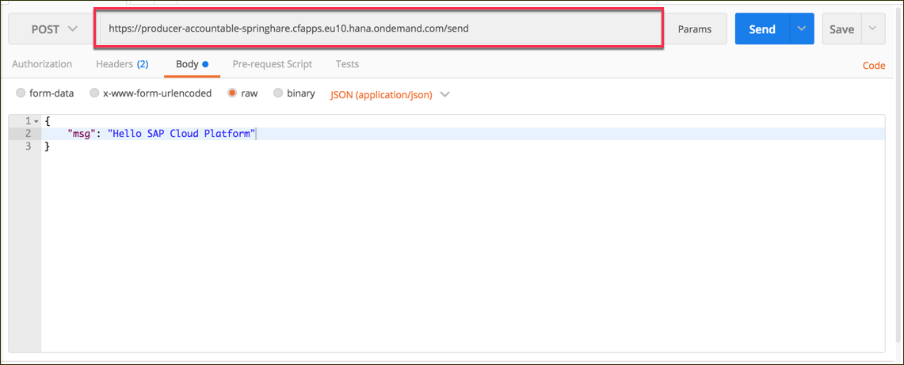

## Prerequisites  
 - Install [Postman](https://www.getpostman.com/)
 - Install [Node.js](https://nodejs.org)

### You will learn
  - How to use environment variables in SAP Cloud Platform Cloud Foundry
  - How to test the application on your local machine

---

[ACCORDION-BEGIN [Step 1: ](Define and install the dependencies)]

Before you can start the actual development of the application, you need to define some dependencies and the metadata of the project. To do this, create a new `package.json` file:
```json
{
    "name": "producer",
    "scripts": {
        "start": "node  app.js"
    },
    "engines": {
        "node": "10.x"
    },
    "description": "This is the sample project to demonstrate how to produce RabbitMQ event on SAP Cloud Platform",
    "dependencies": {
        "body-parser": "^1.18.3",
        "cfenv": "^1.1.0",
        "express": "4.14.0"
    }
}
```
There are three dependencies defined:

- `Express` and `body-parser`
  A popular web framework that hosts the web server and parses the parameters of the incoming HTTP requests

- `cfenv`
  Reads the cloud foundry specific environment variables

Now that you defined all modules, you can install them with `npm install`.

[VALIDATE_1]
[ACCORDION-END]

[ACCORDION-BEGIN [Step: ](Create a simple web server)]
First, you need the specify the core file of your application, the `app.js` file. It is the central entry point of your application (as defined in the `package.json` file).

```javascript
const path = require('path'),
    express = require('express'),
    cfenv = require('cfenv'),
    appEnv = cfenv.getAppEnv();

var app = express();

app.use('/', express.static(path.join(__dirname, 'webapp')));
//INSERT CODE IN STEP 3

const iPort = appEnv.isLocal ? 3000: appEnv.port;
app.listen(iPort, function () {
    console.log(`Congrats, your producer app is listening on port ${iPort}!`);
});
```
This code snippet will create a new web server that listens on the port 3000, if the application is running locally. If this code runs in the SAP Cloud Platform Cloud Foundry environment, the environment will inject the port information as an environment variable and make it accessible to the application.
>This web server will serve all requests with content of the `webapp` folder, which can be used as a project folder for a web application.

[VALIDATE_2]
[ACCORDION-END]
[ACCORDION-BEGIN [Step: ](Add a new endpoint to the web server)]
This step adds a new endpoint to the web server, which will be used to receive and parse data from the web application.

1. Specify a new module, which helps us to parse the payload of incoming request. You also need to connect this module with the express framework to trigger the parsing of all incoming requests.
```javascript
const bodyParser = require('body-parser');
app.use(bodyParser.urlencoded({
  extended: false
}));
app.use(bodyParser.json());
```
2. Create a new endpoint named **`/send`** and assign a callback function, which is invoked whenever a request is sent to this endpoint. This function parses the `msg` from the incoming request, stores the massage in an array, and writes it to the application log.
```javascript
const aHistory = [];
const sDefaultMessage = 'Hello Cloud Platform';
app.post('/send', function (oReq, oRes) {
  var oMessage = {
    message: oReq.body.msg || sDefaultMessage
  }
  oRes.sendStatus(201);
  console.log(`Received message "${oMessage.message}" via HTTP`);
  aHistory.push(oMessage);
});
//INSERT CODE IN STEP 4
```

[VALIDATE_3]
[ACCORDION-END]
[ACCORDION-BEGIN [Step 4: ](Add a new endpoint to retrieve the sent message)]
Create a new endpoint named **`/outbox`** and assign a callback function, which returns the array of stored messages of the previous step.
```javascript
app.get('/outbox', function(oReq, oRes) {
    oRes.send(aHistory);
});
```

[DONE]
[ACCORDION-END]
[ACCORDION-BEGIN [Step : ](Test your producer application locally)]

You can test the application on your local machine like any other node.js application by executing `npm start` from the root directory of your project.

Copy the following values to the Postman form to send an HTTP request to your local server:

|  Property| Value |  
|:------------------|:---|
| 1 - HTTP verb  | **`POST`**  |
| 2 - URL  | **`localhost:3000/send`**  |
| 3   | **`body`**  |
| 4   | **`raw`**  |
| 5 - Content-Type  | **`JSON(application/json)`**  |
| 6 - Payload  | `{"msg": "Hello SAP Cloud Platform"}` |


 

The response of this message should be a status 201 message.

[VALIDATE_5]
[ACCORDION-END]
[ACCORDION-BEGIN [Step 6: ](Deploy your producer application to SAP Cloud Platform)]
In order to push the application to Cloud Foundry, you need to specify the deployment information in a `manifest.yml` file in the root folder.
```yml
 ---
applications:
- name: producer
  random-route: true
  memory: 128MB
  disk_quota: 128MB
  instances: 1
  buildpack: nodejs_buildpack
  command: node app.js

services:
   - pubsub-messagingservice

```
>The property `random-route` will generate a route, which does not conflict with any other application in the same Cloud Foundry instance.

This file contains all the deployment information, which are required by the Cloud Foundry environment.

The command `cf push` reads this manifest file and deploys the application to SAP Cloud Platform. You should see the URL in the console output when the deployment has completed.


Please copy and paste the URL of your newly deployed service into Postman to test the service.



[VALIDATE_6]
[ACCORDION-END]
[ACCORDION-BEGIN [Step 7: ](Troubleshooting)]

**Problem**: I see the following error message when I execute `cf push`: "Server error, status code: 400, error code: 210003, message: The host is taken"
**Solution**: This means this application name is already use in the current Cloud Foundry environment (probably by another user). Please change the property `name` in the `manifest.yml` file

[DONE]
[ACCORDION-END]

---
