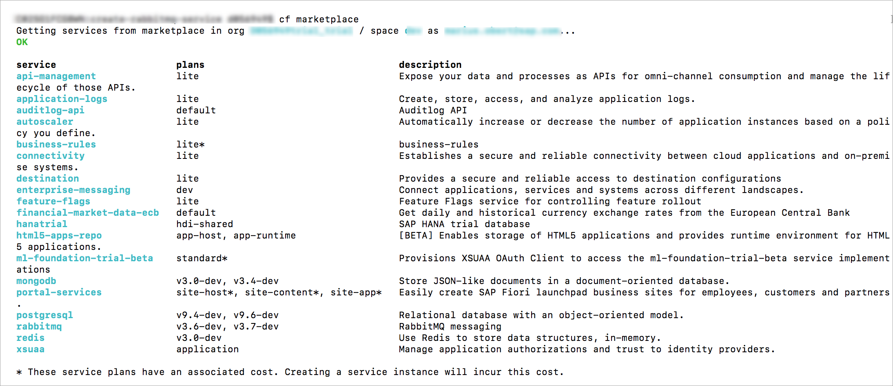
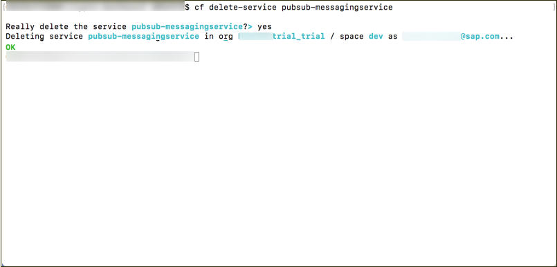
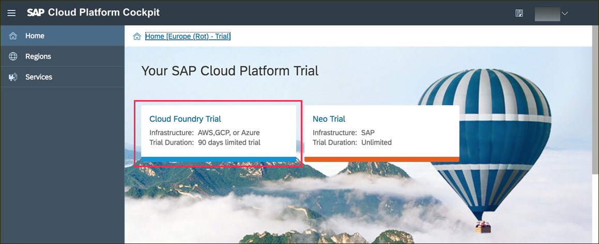
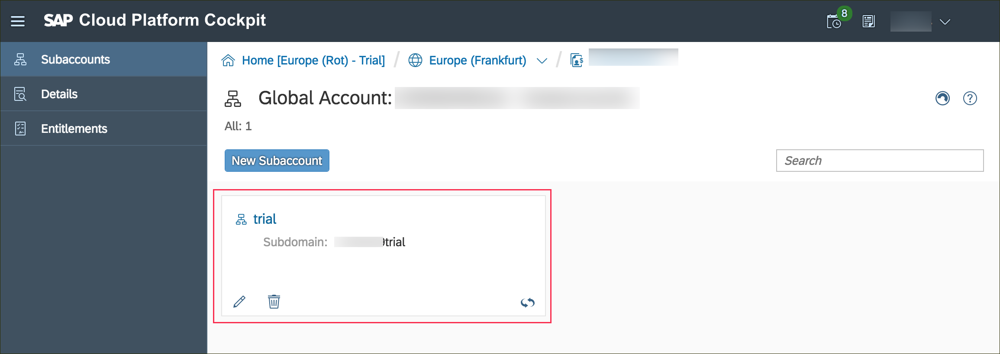
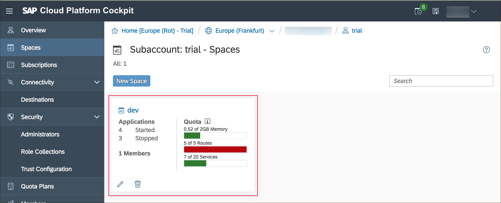
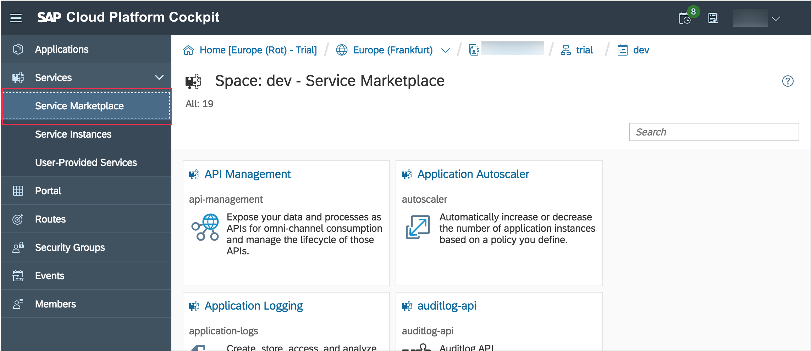
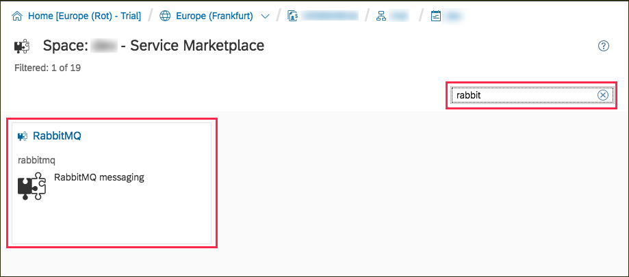
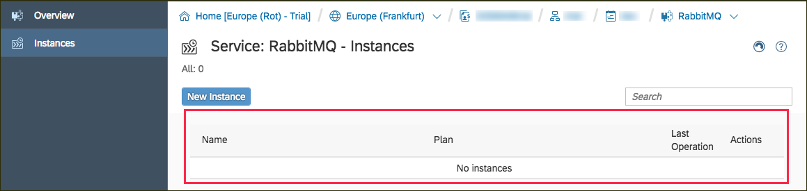
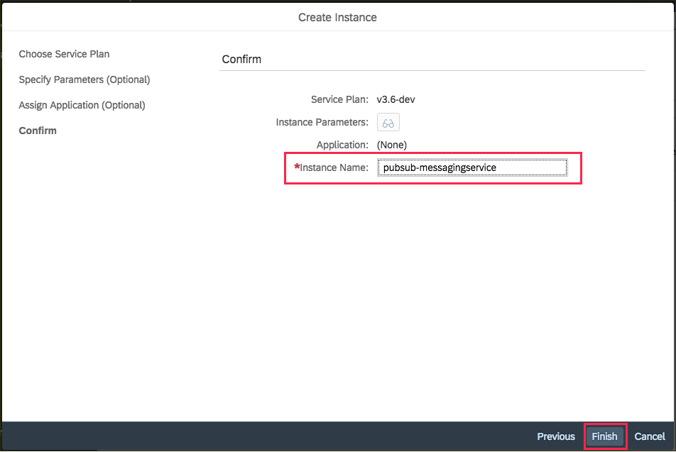
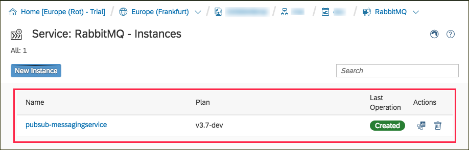

## Prerequisites  
 - [Sign up for a free trial account on SAP Cloud Platform](https://developers.sap.com/tutorials/hcp-create-trial-account.html)
 - [Install the Cloud Foundry CLI](https://developers.sap.com/tutorials/hcp-cf-getting-started.html)

##Details
### You will learn  
  - How to find a service in the SAP Cloud Platform Cloud Service marketplace
  - How to use the SAP Cloud Platform cockpit
  - How to use the Cloud Foundry CLI

---


[ACCORDION-BEGIN [Step: ](Create a RabbitMQ service from the command line)]
>You can create the service via the command line or via the SAP Cloud Platform Cockpit. This step describes how to create a service via the CLI. Please make sure that you have installed the [Cloud Foundry CLI](https://developers.sap.com/tutorials/hcp-cf-getting-started.html) and that you are connected to the proper org.

1. Run the following command to see all available services and make sure that "RabbitMQ" is available.

    ```Bash
    cf marketplace
    ```

      

2. Select the plan **`v3.7-dev`** and create the service name **`pubsub-messagingservice`** by running:

    ```Bash
    cf create-service rabbitmq v3.7-dev pubsub-messagingservice
    ```

3. You can verify that this service is ready with:

    ```Bash
    cf services | grep pubsub-messagingservice
    ```

    You should now see your newly created service.

4. You learned how to create the service via the CLI. Now remove the service in order to be able to create if via the SAP Cloud Platform Cockpit.

    ```Bash
    cf delete-service pubsub-messagingservice
    ```

      


[VALIDATE_1]
[ACCORDION-END]


[ACCORDION-BEGIN [Step: ](Navigate to the service marketplace)]

Log onto the [SAP Cloud Platform](https://account.hanatrial.ondemand.com/) and enter the Cloud Foundry (Trial) environment.



Browse to the sub-account you want to add the new message broker service to.



Click **Spaces** to see your spaces and select the tile of the space where your service should live.



Click **Service Marketplace**.



[DONE]
[ACCORDION-END]
[ACCORDION-BEGIN [Step: ](Display all RabbitMQ services)]
Now you can search for the RabbitMQ service by typing **`rabbit`** in the search field in the top right.



Select this service by clicking the associated tile to see an overview of this service. You can use the corresponding buttons on the left-hand side to switch from  **Overview** to  **Instances**. The new screen lists all existing service instances of this service type.



[VALIDATE_2]
[ACCORDION-END]
[ACCORDION-BEGIN [Step: ](Create a new RabbitMQ service)]
   1. Click **New Instance** to trigger the creating of a new service instance.
   2. Select the latest version of the plan and skip the optional steps.
   3. Enter the desired name of the service **`pubsub-messagingservice`** on the last screen on the dialog.
   4. Click **Finish** to create the RabbitMQ service.

    

You should now be able to see the newly created service in the list of existing services.



[VALIDATE_3]
[ACCORDION-END]


[ACCORDION-BEGIN [Step: ](Troubleshooting)]
**Problem**: I see the following error message when I execute `cf create-service rabbitmq v3.7-dev pubsub-messagingservice`:
Server error, status code: 502, error code: 10001, message: Service broker error: Quota is not sufficient for this request
**Solution**: This means there are already too many services running in your current Cloud Foundry space. Please check which services aren't necessary (`cf services`) and remove them (`cf delete-service  <SERVICE NAME>`)

[DONE]
[ACCORDION-END]

---
