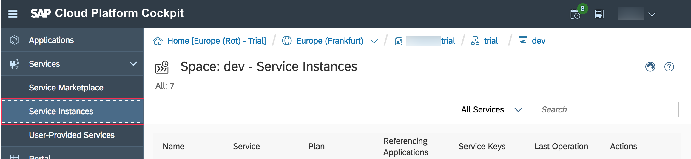
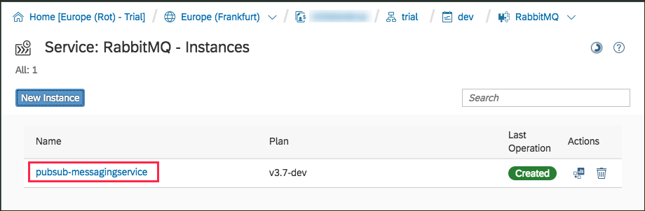
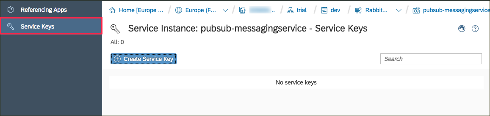
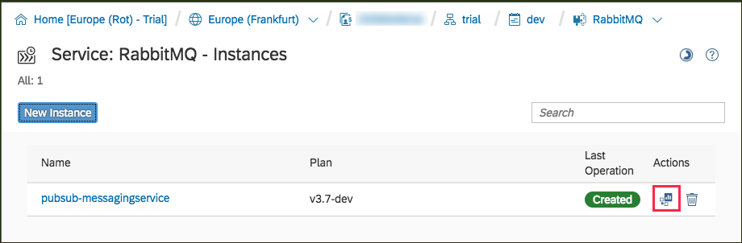
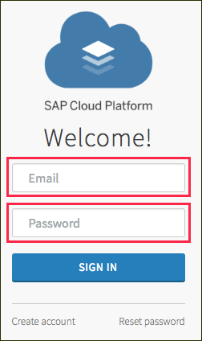
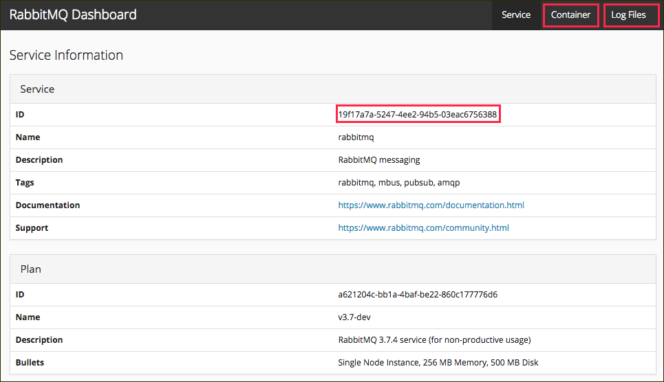

## Details
### You will learn
  - The different ways to check the status of your service instance
  - How to monitor your backing services and check for associated apps and service keys

---

[ACCORDION-BEGIN [Step 1: ](Get to know the service via the CLI)]
> You can use the commands introduced in this section to get familiar with the CLI. However, you are not required to run those commands in order to complete this tutorial.

You can print all your services with the command:
```Bash
cf services
```
This command will print a table which displays the name, plan and the last operation of this all services. Additionally, you can see all apps which are bound to the respective service. You should be able to see the service, **`pubsub-messagingservice`**, which you created in the previous tutorial.

You can use the following command to see more information about a specific service:
```Bash
cf service pubsub-messagingservice
```
The output contains several information, such as the current status of the service, a list of the operations which ran last and a link to the service dashboard (see Step 3 for more information).

In order to establish a communication between apps and services is necessary to connect them via (a restart of the app will be necessary):
```Bash
cf bind-service <app-name> <service-name>
```

It is also possible to generate service keys. Service keys can be seen as 'credentials' to configure consumers of marketplace services manually. This is especially interesting during the development phase when the applications are tested locally.
```Bash
cf create-service-key <service-name> <key-name>
```

[VALIDATE_1]
[ACCORDION-END]

[ACCORDION-BEGIN [Step 2: ](Get to know the service in the SAP Cloud Platform cockpit)]
Navigate to the space that contains your service instance in the SAP Cloud Platform cockpit and click on  **Service Instances**  (under **Services**) on the panel on the left-hand side.



Access the service details page by clicking the name of your service on the service overview.



You can use the left-hand panel to navigate between two pages. The first one will show all applications which are bound to this service. For now, this list is probably empty.


The second page shows all service keys that exist for this service. Service keys can be seen as "credentials" to configure consumers of marketplace services manually. This list should also be empty after you created a new service.



[DONE]
[ACCORDION-END]


[ACCORDION-BEGIN [Step 3: ](Discover the service dashboard)]

You can access the service dashboard via the first button in the **Actions** column of the service overview (or alternatively via the **Open Dashboard** button on the service details page).



On the new page, you will be prompted for you SAP Cloud Platform credentials.



After logging in you can see the service dashboard, which provides several pieces of information, such as the service ID, the container size of the service instance, and its logs. The logging information is especially useful when you need to debug your applications.



[VALIDATE_3]
[ACCORDION-END]

---
