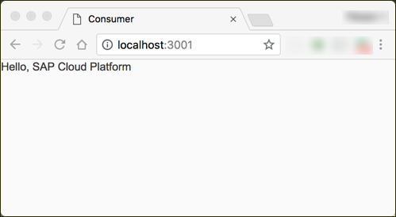
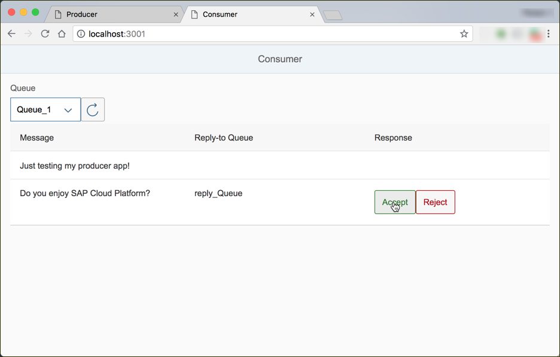
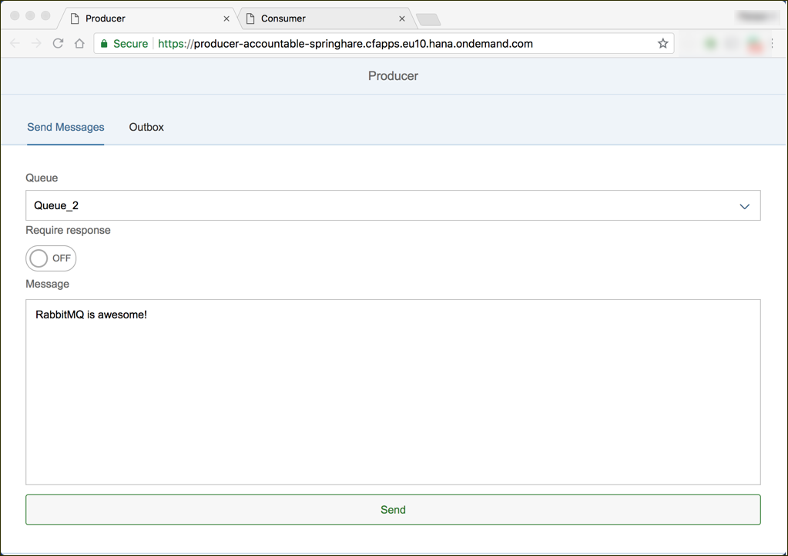
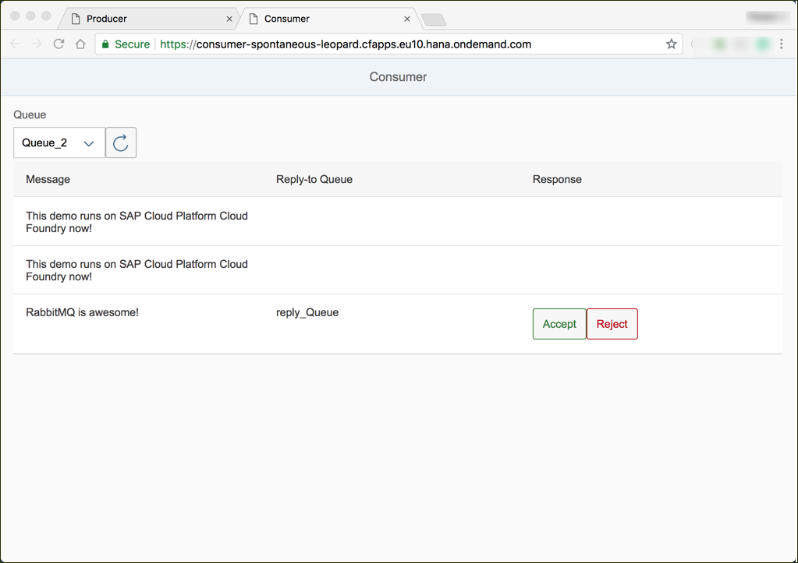

## Details
### You will learn  
  - How to handle query parameters
  - How to cache messages in an internal data structure
  - How to listen to several message queues

The app will display a select control to offer supported queues and a list which displays all messages of that queue. This list can be refreshed by clicking on a refresh button or by selecting another queue in the select control. The app will also provide two buttons, to accept or reject the message, if the message can be answered.

---

[ACCORDION-BEGIN [Step  ](Bootstrap SAPUI5)]
Create a new file named `index.html` in the `webapp` folder of your project and insert the following content.
This snippet bootstraps the SAPUI5 SDK in the first `<script>` tag. The second `<script>` tag renders a simple text control on the page once the bootstrapping has finished.

```HTML
<!DOCTYPE HTML>
<html>
<head>
    <meta http-equiv='X-UA-Compatible' content='IE=edge'/>
    <meta charset='UTF-8'>
    <title>Consumer</title>
    <script id='sap-ui-bootstrap'
            src='https://sapui5.hana.ondemand.com/1.42.6/resources/sap-ui-core.js'
            data-sap-ui-libs='sap.m'
            data-sap-ui-theme='sap_belize'
            data-sap-ui-compatVersion='edge'>
    </script>
    <script>
        sap.ui.getCore().attachInit(function () {  //REPLACE THIS FUNCTION IN STEP 2
          new sap.m.Text({
              text: "Hello, SAP Cloud Platform"
          }).placeAt("content");
        });
    </script>
</head>
<body class='sapUiBody' id='content'>
</body>

</html>
```

Run `npm start` from the project root folder and access `http://localhost:3001` to test the web app. Refresh this page during the course of this tutorial to see how the web app evolves.



[DONE]
[ACCORDION-END]
[ACCORDION-BEGIN [Step  ](Implement a simple page layout)]

>You can use the `id` property to manually define the ID of any SAPUI5 control.

Replace then entire content of the second `<script>` tag with the following code. This code aggregates several SAPUI5 controls like pages, labels, inputs, vertical boxes, and a list to a simple form.

```JavaScript
sap.ui.getCore().attachInit(function () {
  //INSERT CODE IN STEP 3.1
  new sap.m.App({ //REPLACE THS OBJECT IN STEP 3.2
    pages: new sap.m.Page({
      title: 'Consumer',
      content: new sap.m.VBox({
        items: [
        new sap.m.Label({
          text: 'Queue',
        }),
        new sap.m.HBox({
          items: [
            new sap.m.Select({
            }),
            new sap.m.Button({
              icon: 'sap-icon://refresh',
            })
          ]
        }),
        new sap.m.Table({
          id: 'inbox',
          columns: [
            new sap.m.Column({
              header: new sap.m.Text({
                text: 'Message'
              })
            }),
            new sap.m.Column({
              header: new sap.m.Text({
                text: 'Reply-to Queue'
              })
            }),
            new sap.m.Column({
              header: new sap.m.Text({
                text: 'Response'
              })
            })
          ],
          items: []
        })
        ]
      }).addStyleClass('sapUiSmallMargin')
    })
  }).placeAt('content');
});
```
[VALIDATE_1]
[ACCORDION-END]
[ACCORDION-BEGIN [Step 3: ](Add a model to the consumer web-based user interface)]

1. Initialize a new model in the callback function of the `attachInit` hook.
```JavaScript
var oModel = new sap.ui.model.json.JSONModel({
  queue: 'Queue_1',
  queues: [{
    name: 'Queue_1'
  }, {
    name: 'Queue_2'
  }, {
    name: 'Queue_3'
  }],
});
```
2. Update the controls by adding the model bindings.
```JavaScript
//INSERT CODE IN STEP 4.1
//INSERT CODE IN STEP 5.1
new sap.m.App({
    pages: new sap.m.Page({
        title: 'Consumer',
        content: new sap.m.VBox({
            items: [
                new sap.m.Label({
                    text: 'Queue',
                }),
                new sap.m.HBox({
                    items: [
                        new sap.m.Select({
                            selectedKey: '{/queue}',
                            items: {
                                path: '/queues',
                                template: new sap.ui.core.Item({
                                    key: '{name}',
                                    text: '{name}'
                                })
                            },
                            //INSERT CODE IN STEP 4.2
                        }),
                        new sap.m.Button({
                            icon: 'sap-icon://refresh',
                            //INSERT CODE IN STEP 4.3
                        })
                    ]
                }),
                new sap.m.Table({
                  id: 'inbox',
                  columns: [
                    new sap.m.Column({
                      header: new sap.m.Text({
                        text: 'Message'
                      })
                    }),
                    new sap.m.Column({
                      header: new sap.m.Text({
                        text: 'Reply-to Queue'
                      })
                    }),
                    new sap.m.Column({
                      header: new sap.m.Text({
                        text: 'Response'
                      })
                    })
                  ],
                  items: {
                    path: '/inbox',
                    template: new sap.m.ColumnListItem({
                      cells: [
                        new sap.m.Text({text: '{message}'}),
                        new sap.m.Text({text: '{replyTo}'}),
                        new sap.m.HBox({
                          items: [
                            new sap.m.Text({
                              text: '{response}',
                              visible: '{= ${response} !== undefined}'
                            }),
                            new sap.m.Button({
                              text: "Accept",
                              type: sap.m.ButtonType.Accept,
                              visible: '{= ${response} === undefined && ${replyTo} !== undefined}',
                              //INSERT CODE IN STEP 5.2
                            }),
                            new sap.m.Button({
                              text: "Reject",
                              type: sap.m.ButtonType.Reject,
                              visible: '{= ${response} === undefined && ${replyTo} !== undefined}',
                              //INSERT CODE IN STEP 5.2
                            })
                          ]
                        })
                      ]
                    })
                  }
                })
            ]
        }).addStyleClass('sapUiSmallMargin')
    })
}).setModel(oModel).placeAt('content');
```

[VALIDATE_2]
[ACCORDION-END]
[ACCORDION-BEGIN [Step  ](Fetch the messages from the back-end)]
>The method `setProperty(path, data)` can be used to overwrite the data located at any `path` of the `JSONModel`.

1. Declare the function `updateHistory` which reads the currently selected queue from the model and sends the corresponding request to the defined endpoint. Also invoke this function immediately, so that the model can update.
```JavaScript
function updateInbox() {
  var sQueue = oModel.getProperty('/queue');
  $.get('/inbox?queue=' + sQueue, function (data) {
    oModel.setProperty('/inbox', data);
    sap.m.MessageToast.show('Updated ' + sQueue)
  })
}
updateInbox();
```
2. Use this function `updateHistory` as a callback whenever the refresh button
is pressed.
```JavaScript
new sap.m.Button({
  icon: 'sap-icon://refresh',
  press: updateInbox
})
```
3. Invoke `updateHistory`, when selected option of the select control changes.
```JavaScript
new sap.m.Select({
  selectedKey: '{/queue}',
  items: ...,
  change: updateInbox
})
```

[VALIDATE_3]
[ACCORDION-END]
[ACCORDION-BEGIN [Step  ](Return responses to the sender)]

1. Declare the function `respondToMessage` which is triggered when either one of the reply buttons is pressed. The callback function will identify the label of the pressed button and read the correlation id of the original message. Use both information to send the response back to the sender.
```JavaScript
function respondToMessage(oEvent){
  const oButton = oEvent.getSource()
  const oMessage = oButton.getBindingContext().getObject();
  const oModel=  oButton.getModel();
  $.post('/respond', {
    replyTo: oMessage.replyTo,
    correlationId: oMessage.correlationId,
    response: oButton.getType(),
    queue: oModel.getProperty('/queue')
  }, function(){
    oMessage.response = oButton.getType();
    oModel.refresh();
    sap.m.MessageToast.show('Response sent')
  })
}
```
2. Attach the callback `respondToMessage` to both buttons.
```JavaScript
new sap.m.Button({
  text: "Accept",
  press: respondToMessage,
  ...
}),
new sap.m.Button({
  text: "Reject",
  press: respondToMessage,
  ...
})
```

[DONE]
[ACCORDION-END]
[ACCORDION-BEGIN [Step  ](Test the consumer UI locally)]
>Now you should be able to test the application on your local machine fully. First, make sure you are running the producer app (to produce some messages) and the local RabbitMQ service:
```Bash
docker run -it --rm -p 5672:5672 -p 15672:15672 rabbitmq
```

You can add new messages to the queue with the local deployment of the producer app (at `http://localhost:3001/`) of the previous tutorial group.

Run `npm start` and go to `http://localhost:3001/` to open the web-based user interface to see all existing messages.


[DONE]
[ACCORDION-END]
[ACCORDION-BEGIN [Step  ](Re-deploy the updated application to SAP Cloud Platform)]
1. Use the producer application to send new messages to the message broker service
    

2. Update the application with `cf push` (from the root folder of the project) to deploy the updated version to SAP Cloud Platform Cloud Foundry.

3. Now, use your browser to check whether the deployment was successful. Access the web-based user interface and read the messages you have added to the message queue before.
    

[DONE]
[ACCORDION-END]

---
