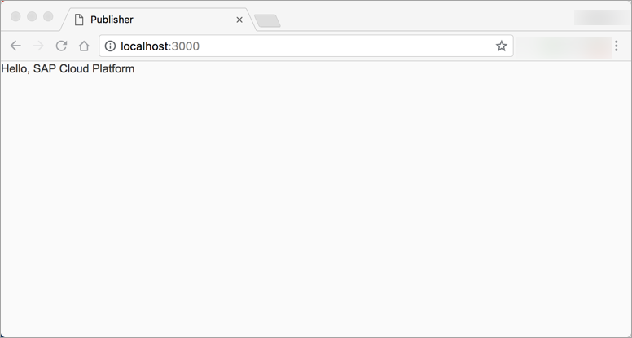
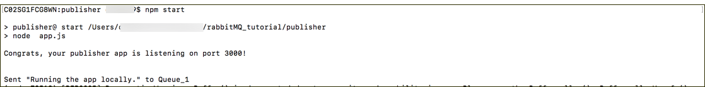
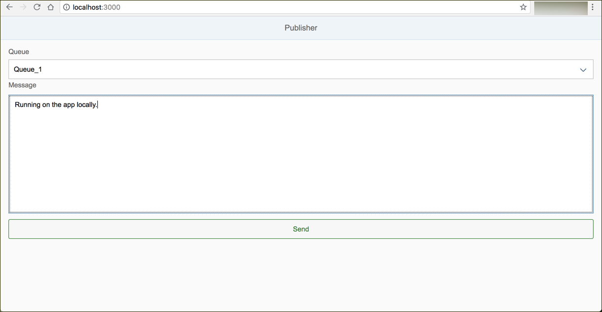
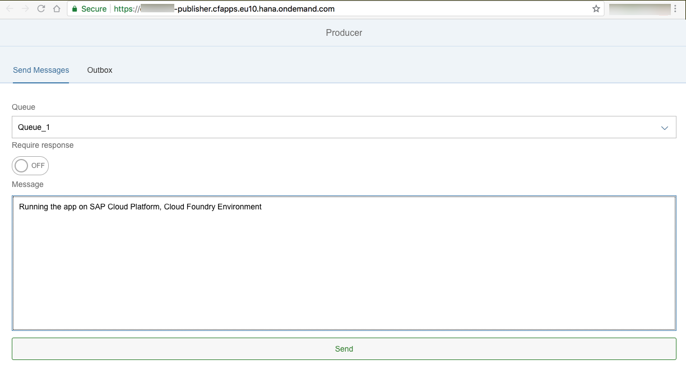

## Details
### You will learn  
  - Basics of the SAPUI5 framework
  - How to embed a SAPUI5 application in your web server
  - How to communicate between a web app and the web server

The app will display a select control to choose the queue and a text input field to enter the payload of the message. The current content can be sent to the message broker via a submit button.

---

[ACCORDION-BEGIN [Step : ](Bootstrap SAPUI5)]


Create a new file named `index.html` in the `webapp` folder of your project and insert the following content.
This snippet bootstraps the SAPUI5 SDK in the first `<script>` tag. The second `<script>` tag renders a simple text control on the page once the bootstrapping has finished.

>The [`attachInit()`](https://sapui5.hana.ondemand.com/#/api/sap.ui.core.Core/methods/attachInit) method of `sap.ui.core.Core` can be used to register a callback function that is executed after the SAPUI5 framework has been initialized

```html
<!DOCTYPE HTML>
<html>
<head>
    <meta http-equiv='X-UA-Compatible' content='IE=edge'/>
    <meta charset='UTF-8'>
    <title>Producer</title>
    <script id='sap-ui-bootstrap'
            src='https://sapui5.hana.ondemand.com/1.42.6/resources/sap-ui-core.js'
            data-sap-ui-libs='sap.m'
            data-sap-ui-theme='sap_belize'>
    </script>
    <script>
        sap.ui.getCore().attachInit(function () {
            new sap.m.Text({
                text: 'Hello, SAP Cloud Platform'
            }).placeAt('content');
        });
    </script>
</head>
<body class='sapUiBody' id='content'>
</body>

</html>
```

Run `npm start` from the project root folder and access `http://localhost:3000` to test the web app. You can see the impact of each single step  when you refresh this page during the course of this tutorial (make sure to disable to cache of your browser).



[VALIDATE_1]
[ACCORDION-END]

[ACCORDION-BEGIN [Step : ](Implement a page layout)]


Replace then entire content of the second `<script>` tag with the following code. This code aggregates several SAPUI5 controls like pages, labels, inputs and two tabs in a tab bar to the user interface.


```javascript
sap.ui.getCore().attachInit(function () {
  new sap.m.App({
    pages: new sap.m.Page({
        title: 'Producer',
        content: new sap.m.IconTabBar({
          items: [
            new sap.m.IconTabFilter({
              text: "Send Messages",
              key: "send",
              content:
                  new sap.m.VBox({
                    items: [
                        new sap.m.Label({
                            text: 'Queue',
                            width: '100%',
                        }),
                        new sap.m.Select({
                            width: '100%',
                            items: [
                              new sap.ui.core.Item({
                                key: 'Queue_1',
                                text: 'Queue_1'
                              }),
                              new sap.ui.core.Item({
                                  key: 'Queue_2',
                                  text: 'Queue_2'
                              }),
                              new sap.ui.core.Item({
                                  key: 'Queue_3',
                                  text: 'Queue_3'
                              })
                            ]
                        }),
                        new sap.m.Label({
                            text: 'Require response',
                            width: '100%',
                        }),
                        new sap.m.Switch({
                            width: '100%',
                        }),
                        new sap.m.Label({
                            width: '100%',
                            text: 'Message'
                        }),
                        new sap.m.Button({
                            width: '100%',
                            text: 'Send',
                            type: 'Accept'
                        })
                    ]
                  })
              }).addStyleClass('sapUiSmallMargin')
            }),
            new sap.m.IconTabFilter({
              text: "Outbox",
                key: "outbox",
              content: new sap.m.Table({
                columns: [
                  new sap.m.Column({
                    header: new sap.m.Text({
                      text: 'Queue'
                    })
                  }),
                  new sap.m.Column({
                    header: new sap.m.Text({
                      text: 'Message'
                    })
                  }),
                  new sap.m.Column({
                    header: new sap.m.Text({
                      text: 'Correlation ID'
                    })
                  }),
                  new sap.m.Column({
                    header: new sap.m.Text({
                      text: 'Response'
                    })
                  })
                ],
              })
            })
          ]
        })
  }).placeAt('content');
});
```

[VALIDATE_2]
[ACCORDION-END]
[ACCORDION-BEGIN [Step : ](Add a model to the application)]

>Model-binding is a very comfortable way to separate the layout from the data that is displayed in it. This model will also be available to all child controls of this parent control. In this case the model will be available to the label, select box, text area and the button.

To use this implementation of the MVC pattern in your application, you have to add a new `Model` object to your `sap.m.App` control.

```javascript
new sap.m.App({
  ...
}).setModel(new sap.ui.model.json.JSONModel({
    queues: [{
        name: 'Queue_1',
    }, {
        name: 'Queue_2'
    }, {
        name: 'Queue_3'
    }, {
        name: 'Queue_4'
    }]
  })).placeAt('content');
```

>The model only needs to define "deep" hierarchies, for example, nested objects. Properties on the root level of the model are assumed to be `undefined` and can still be used for model binding.

[VALIDATE_3]
[ACCORDION-END]
[ACCORDION-BEGIN [Step : ](Make use of the model binding feature)]

First, you want to populate the select options (aggregated controls) of the `sap.m.Select` control. You want to have one option / child control for each queue you have defined in the model. Therefore, you bind the items aggregation to the **`/queues`** property of the model (the '/' refers to the root of the model).

Each option should be created from a template `sap.ui.core.Item` control and has two properties: A display name and a unique key. For simplicity, use the same value for both, hence the same binding **`{name}`**.

The selected key should be saved to the property **`/queue`** in the model (again, the '/' refers to the root of the model). This property will be updated whenever the user changes the selection of the control.

```javascript
new sap.m.Select({
    items: {
        path: '/queues',
        template: new sap.ui.core.Item({
            key: '{name}',
            text: '{name}'
        })
    },
    selectedKey: '{/queue}',
    width: '100%'
}),
```
>The curly brackets are necessary whenever the binding is defined as a string. Alternatively, you can define the binding with an object and the brackets need to be omitted `selectedKey: {path: '/queue'}`

Next, you do the same to the `sap.m.TextArea` control, which renders as input field. This input is the message the users wants to push to the message service. It will be stored on the path `{/message}` in the model, which represents the property `message` on the root level of the model object.

```javascript
new sap.m.TextArea({
    width: '100%',
    height: '250px',
    value: '{/message}'
})
```

The state property of the `sap.m.Switch` control also needs to be bound.
```javascript
new sap.m.Switch({
    state: '{/reqResponse}',
    width: '100%',
}),
```

[VALIDATE_4]
[ACCORDION-END]
[ACCORDION-BEGIN  [Step :  ](Read the user input from the model)]

>Some SAPUI5 controller like select boxes or checkboxes are able to trigger events (e.g., when the user interacts with them). So, can the `sap.m.Button` control when it's being clicked. You can listen on these events with callback functions.

Add a new callback function to the button control, which is triggered when the user clicks the button. This callback accesses the current model and retrieves the information of interest from it. Furthermore, the callback function also triggers an HTTP post request, which sends the payload to the endpoint of the server you have implemented previously.

```javascript
new sap.m.Button({
    width: '100%',
    text: 'Send',
    type: 'Accept',
    press: function () {
      var oModel = this.getModel();
          var oPayload = {
              msg: oModel.getProperty('/message'),
              queue: oModel.getProperty('/queue'),
              reqResponse: oModel.getProperty('/reqResponse')
          };

          $.post('/send', oPayload, function() {
            oModel.setProperty('/message', '');
            sap.m.MessageToast.show('Delivered!')
          })
    }
})
```


[VALIDATE_5]
[ACCORDION-END]
[ACCORDION-BEGIN  [Step : ](Show the sent messages)]

Update the content model of the outbox whenever the user clicks on the corresponding icon in the tab bar. Update the declaration of the `sap.m.IconTabBar` to add this functionality.

```javascript
new sap.m.IconTabBar({
  select: function(oEvent){
    if(oEvent.getParameter('selectedKey') === 'outbox'){
      var oHistoryModel = oEvent.getSource().setModel(new sap.ui.model.json.JSONModel('/outbox'), 'outbox');
    }
  },
```

Now, bind the items of the `sap.m.Table` to this new model.
```javascript
new sap.m.Table({
  columns: ...
  items: {
    path: 'outbox>/',
    template: new sap.m.ColumnListItem({
      cells: [
        new sap.m.Text({text: '{outbox>queue}'}),
        new sap.m.Text({text: '{outbox>message}'}),
        new sap.m.Text({text: '{outbox>correlationId}'}),
        new sap.m.Text({text: '{outbox>response}'})
      ]
    })
  }
})
```

[DONE]
[ACCORDION-END]
[ACCORDION-BEGIN  [Step : ](Test the application locally)]

Now you should be able to test the application on your local machine fully. First, make sure you are running a local RabbitMQ service:
```bash
docker run -it --rm -p 5672:5672 -p 15672:15672 rabbitmq
```
Now you should be able to use the web-based form to write messages to RabbitMQ and see them in your application log:





[DONE]
[ACCORDION-END]
[ACCORDION-BEGIN [Step : ](Re-deploy the updated application to Cloud Foundry)]
You can simply update the application with `cf push` (from the root folder of the project) since you already created the `manifest.yml` file.

Now, use your browser to double check that the deployment was successful. You should see the same form here as well.



Use the form to send a message to the RabbitMQ message service.

[VALIDATE_7]
[ACCORDION-END]
---
