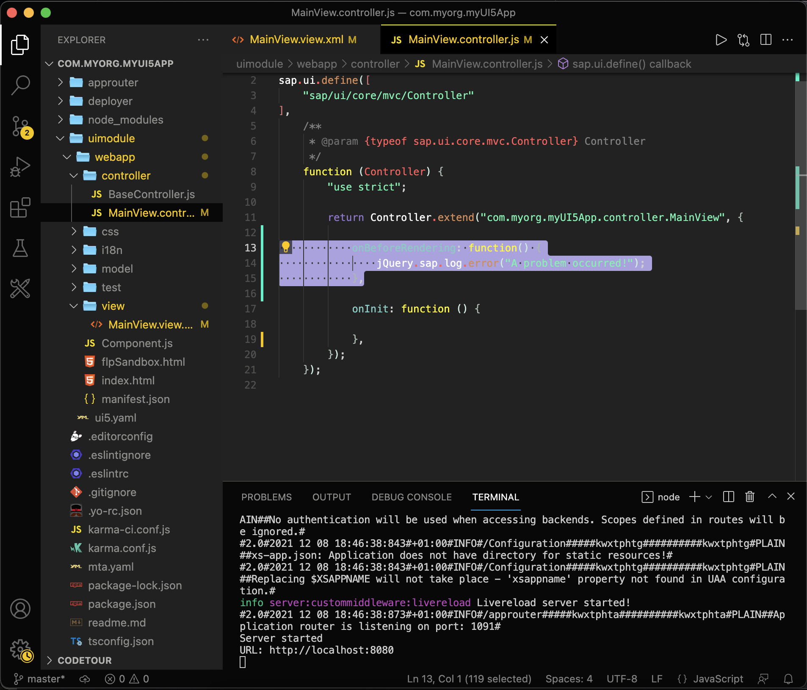

# Debug Your SAPUI5 App
<!-- description --> Debugging and logging are the nut and bolts to inspect your application. Learn how to debug and test your web apps with the Google Chrome Dev Tools.

## Prerequisites
  - You have previously [created an SAPUI5 application](cp-cf-sapui5-local).

## You will learn
  - How to do add breakpoints to your JavaScript code.
  - How to log data to the browser console.
  - How to use the browser dev tools.

---

### Add a message page

Add a simple message page to let the users know you are still working on this app.

Replace the existing `<Page />` control in the file `myui5app/webapp/view/MainView.view.xml` with the following code:

```XML
<MessagePage
    showHeader="false"
    description="More content to come"
    text="Stay tuned!"
    icon="sap-icon://home" />
```

> Tip: You can put your editor window and browser window right next to each other to benefit from the live reload feature of the web server even more.


### Write a log message to the console

SAPUI5 provides [lifecycle hooks](https://sapui5.hana.ondemand.com/sdk/#/topic/121b8e6337d147af9819129e428f1f75.html) to execute logic at certain points in the lifecycle of the app. For example, the `onBeforeRendering` hook can be used to do clean-up tasks each time before the view is being rendered (and the HTML is placed in the DOM). For the purpose of practice however, you will simply log an error to the browser console.

Paste the following `onBeforeRendering` hook into the file `myui5app/webapp/controller/MainView.controller.js`, right after the existing `onInit` hook:

```JavaScript
,
onBeforeRendering: function() {
    console.error("A problem occurred!");
}
```



### Add a breakpoint

Another lifecycle hook provided by SAPUI5 is the `onAfterRendering` hook, which gets executed - well - after rendering. Why don't we use it to practice setting a breakpoint and calling the debugger of the browser, so we can inspect the app at that specific moment of its lifecycle.

Paste the following `onAfterRendering` hook into the file `myui5app/webapp/controller/MainView.controller.js`:

```JavaScript
,
onAfterRendering: function() {
	debugger
}
```


### Stop at the breakpoint

Test the changes by running the app on your local machine.

Execute the following command from the project root:

```Bash
npm run start:myui5app
```

This command should start the app and open your browser automatically. Open the dev tools of your browser. You should now see that the app reached the breakpoint (the dev tools automatically switched to the `Sources` tab). With the execution of the script being stopped, you can hover over variables in the script to inspect them or even execute command using the "Console" tab. This is essential for debugging complex apps and understanding what's going on at certain points in the script.


### See the error log message

Click the blue arrow (in the yellow box) or press F8 to resume the script execution and then switch to the "Console" tab.

Now you should see your error message printed in red. Click on the small triangle on the left side to expand the error message.


---
