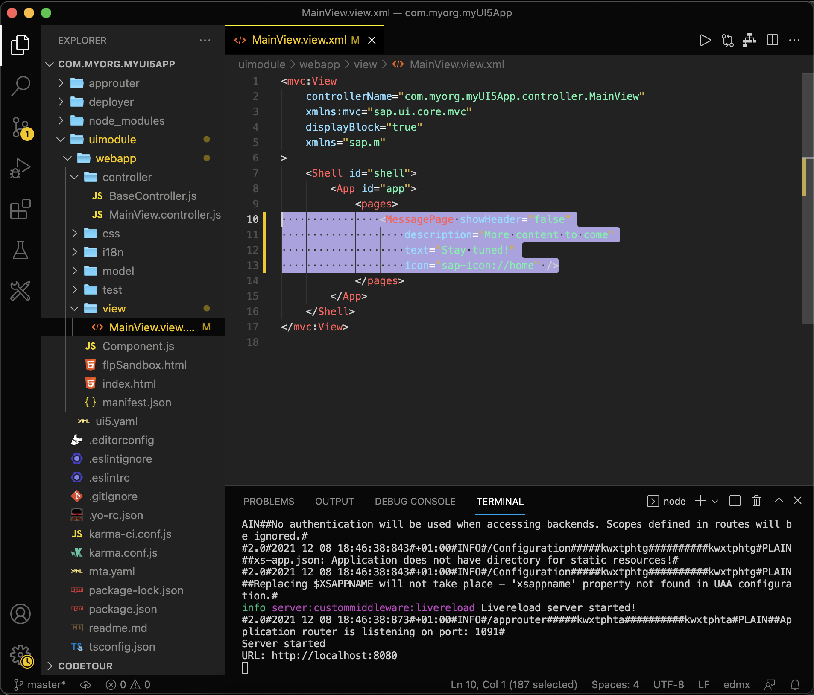
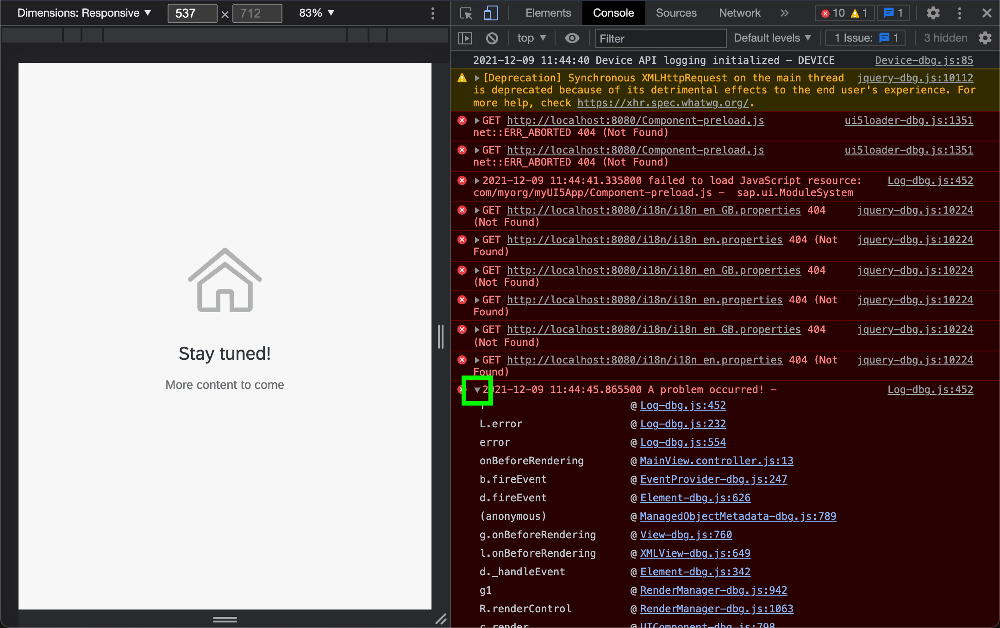

# Debug Your SAPUI5 App
<!-- description --> Debugging and logging are the nut and bolts to inspect your application. Learn how to debug and test your web apps with the Google Chrome Dev Tools.

## You will learn
  - How to do add breakpoints to your JavaScript code
  - How to log data to the console
  - How to use the Google Chrome Dev Tools.

---

### Add a message page

Add a simple message page to let the users know you are still working on this app.

Replace the existing page in the file `webapp/view/MainView.view.xml` with
```JavaScript
<MessagePage showHeader="false"
  description="More content to come"
  text="Stay tuned!"
  icon="sap-icon://home" />
```





### Write a log message to the console

Add this `onBeforeRendering` hook to the file `webapp/controller/MainView.controller.js` (before the `onInit` hook). This error function allows you to write error messages to the console. Error messages also write the stack trace to the console, which can be used to trace the message back to the line of invocation.
```JavaScript
onBeforeRendering: function() {
    jQuery.sap.log.error("A problem occurred!");
},
```


> This `onBeforeRendering` method is called every time the View is rendered, before the Renderer is called and the HTML is placed in the DOM-Tree. It can be used to perform clean-up-tasks before re-rendering.


### Add a breakpoint


Add this `onAfterRendering` hook to the same file to place a breakpoint in your code. A breakpoint will cause your app to stop when the execution thread reaches it. This gives you the chance to inspect the state of your app.
```JavaScript
,

onAfterRendering: function() {
	debugger
},
```


> This `onAfterRendering` method is called every time the view is rendered, after the HTML is placed in the DOM-Tree. It can be used to apply additional changes to the DOM after the Renderer has finished.


### Stop at the breakpoint

Test the changes  on your local machine.
```
npm start
```
This command should start the app and open your browser automatically. Open the Chrome Dev Tools (or the [dev tools of your favorite browser](https://www.lifewire.com/web-browser-developer-tools-3988965)) by **clicking F12**. **Refresh the page** to run the script one more time.

You should now see that the app reached the breakpoint (the dev tools automatically switched to the `Sources` tab).


### See the error log message

Click **F8** to jump over the breakpoint and **switch** to the `Console` tab.
Now you should see your error message printed in red. Click on the small triangle on the left side to expand the error message.




---
