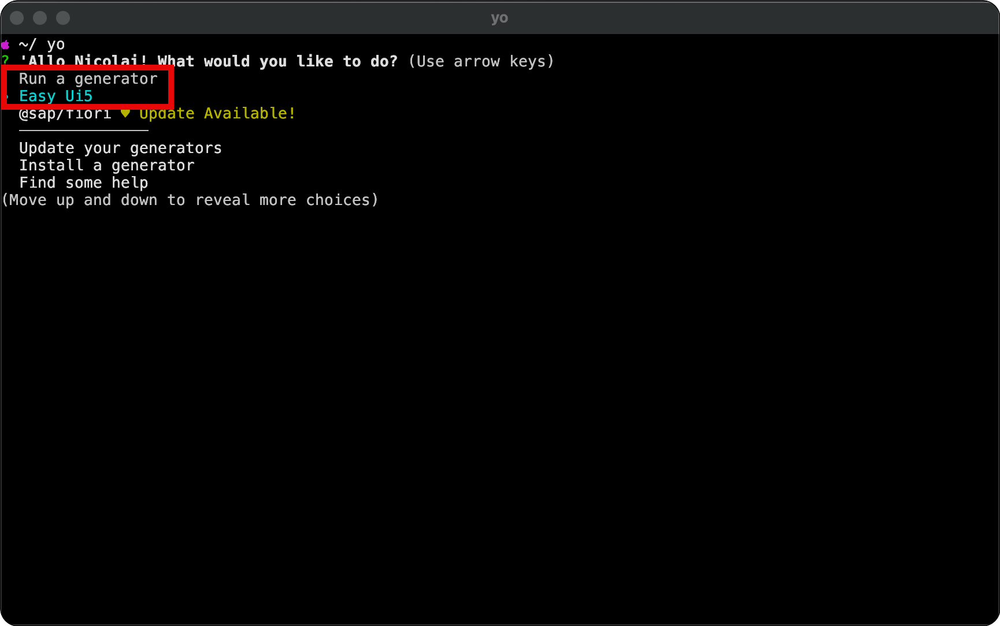

# Get Ready for UI5-Development on Your Local Machine
<!-- description --> Prepare you local development environment to implement successful SAPUI5 projects.

## Prerequisites
 - [Install the latest Node.js LTS version](https://nodejs.org/en/download/)
 - [[Only for Windows users] Install Chocolatey](https://chocolatey.org/)

## You will learn
  - How to install the Yeoman scaffolding tool
  - How to install the easy-ui5 generator plugin for Yeoman
  - How to install the Multi-Target Application (MTA) build tool for Cloud Foundry


---

### Install Yeoman

[Yeoman](http://yeoman.io) is an open source scaffolding tool for modern web-apps. It helps you to kickstart new projects, prescribing best practices and tools to help you stay productive.

Install the module globally:

```Bash
npm install -g yo
```

### Install the easy-ui5 generator

In order to use Yeoman to create SAPUI5 projects, we need to install a plugin (another npm module). Yeoman recognizes all plugins automatically on the basis of the `generator-` prefix of the module:

```Bash
npm install -g generator-easy-ui5
```

The source code for this plugin is available on [GitHub](https://github.com/SAP/generator-easy-ui5) - feel free to open issues and/or contribute.


### Verify the Yeoman installations

Use the following command to test whether the installation has been successful:

```Bash
yo
```

You should see the easy-ui5 generator in the list of generators:




### Install the MTA build tool

In Cloud Foundry, applications are usually being shipped as so called `mta` archives. The [Multi-target Application Archive Builder](https://github.com/SAP/cloud-mta-build-tool) is a standalone command-line tool that builds a deployment-ready multi-target application archive `.mtar` file. You can leverage `npm` to install this tool as well:

```Bash
npm install -g mbt
```

Run `mbt --help` to see all available commands.


### Install Make

You might be able to skip this step. Usually, users of unix-based operating systems already have `make` preinstalled. You can verify that `make` is installed by running the following command:

```
make -v
```

If `make` is not already installed on your machine (maybe you are on a Windows), run the following command (or follow [these instructions](https://chocolatey.org/packages/make)):

```
choco install make
```

---
