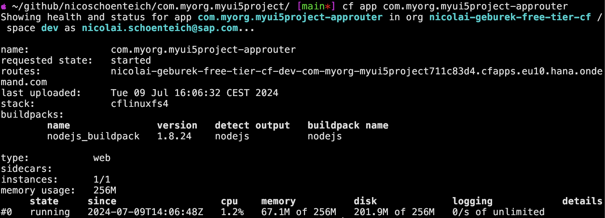

# Create an SAPUI5 App from the Command Line
<!-- description --> Create and test a newly created SAPUI5 app on your local machine with the editor of your choice.

## Prerequisites
 - Install at least version 3.0.0 of the [easy-ui5 generator](cp-cf-sapui5-local-setup)

## You will learn
  - How to scaffold an SAPUI5 project
  - How to leverage the UI5 Tooling to test the app locally
  - How to build a multi-target application archive
  - How to deploy a SAPUI5 app to SAP BTP, Cloud Foundry environment

---

### Scaffold a SAPUI5 project

Run the following command to create new project:

```
yo easy-ui5 project
```

Choose the following responses for the prompts:

| Parameter     | Value
| :------------- | :-------------
| What do you want to do? | **`project [project]`**
| Which namespace do you want to use? | **`com.myorg`**
| How do you want to name this project? | **`myui5project`**
| How do you want to name the first uimodule within your project? | **`myui5app`**
| Do you want to enable the SAP Fiori elements flexible programming model? | **`No`**
| On which platform would you like to host the application | **`Application Router`**
| Where should your UI5 libs be served from? | **`Content delivery network (SAPUI5)`**
| Would you like to create a new directory for the project? | **`Yes`**
| Would you like to initialize a local git repository for the project? | **`Yes`**


The following installation of the project's dependencies might take a while.

### Inspect the generated code

Let's have a look at the generated code. Go to the newly created directory and open the code with your favorite editor (here Neovim):

```Bash
cd com.myorg.myui5project/
code .
```

You can see that the wizard created a bunch of folders and files.


The generated project follows a monorepo approach, which results in a root `package.json` file describing the overall project as well as a `package.json` for each generated app (also called "uimodule").

### Test the app locally

The `package.json` at the root of the project contains a script to start the generated uimodule `myui5app`. The uimodule itself is configured to use the UI5 Tooling for development. Among other tasks, the tooling can start a local web server when you run the following command from the project root:

```Bash
npm run start:myui5app
```


### Package the MTA archive

Before the project can be deployed, the source code has to be minified and packed into an MTA (multi-target application) archive. Also, the code for the SAPUI5 app has to be moved to the `approuter/` directory. All of this can be achieved by running the following command:

```Bash
npm run build
```

This build step essentially executes the instructions configured in the `mta.yaml` file and creates the MTA archive from it.

### Deploy the MTA archive

Next, the generated archive can be deployed to SAP BTP, Cloud Foundry environment. Trigger the deployment and track the deployment progress in the terminal with the following command:

```Bash
npm run deploy
```

### Check the status of your app

You can check the status of all running apps in Cloud Foundry with the following command:

```Bash
cf apps
```

Or you can check the status of the freshly deployed app with this more specific command:

```Bash
cf app com.myorg.myui5project-approuter
```



The `requested state` of your application should read `started`.

> You can also check out the logs of your app via `cf logs <app name>`

### See the app running in the cloud

You can see the URL of your application in the output of the previously executed `cf apps` command. This URL points to the approuter, which allows to configure multiple routes. The route to get to the generated SAPUI5 app is `/myui5app/index.html`.

Open the URL in the browser (don't forget to attach `/myui5app/index.html`) to see your app in action:


Congrats, you just deployed your first SAPUI5 app from the command line!

---
