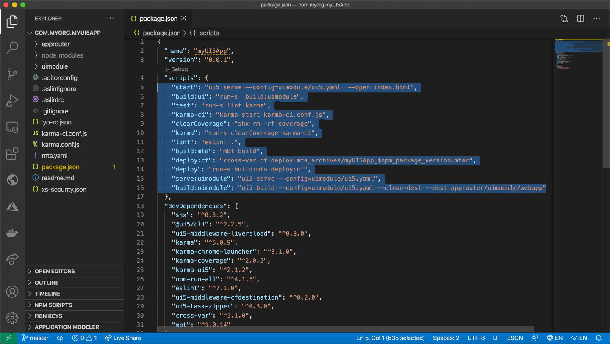
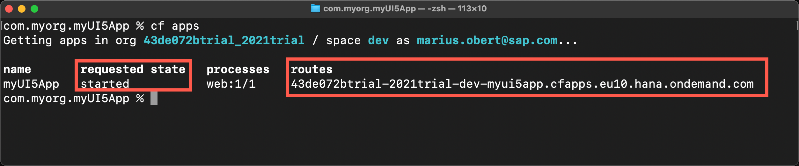
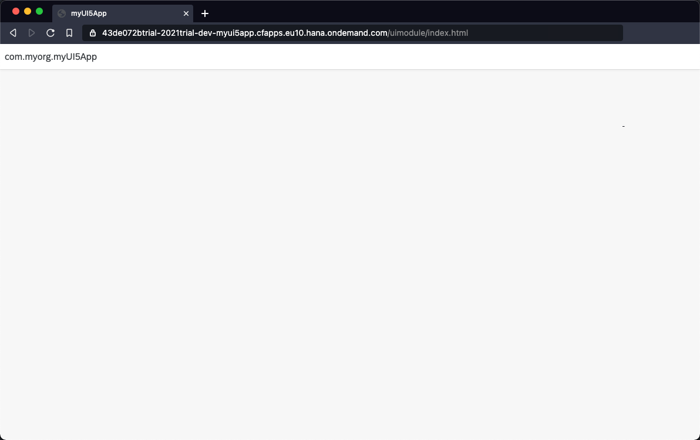

## Prerequisites
 - Install at least version 3.0.0 of the [easy-ui5 generator](cp-cf-sapui5-local-setup)

## Details
### You will learn
  - How to scaffold an SAPUI5 project
  - How to leverage the ui5-tooling to test the app locally
  - How to build a multi-target application archive archive
  - How to deploy a SAPUI5 web-app to SAP BTP, Cloud Foundry environment

---

[ACCORDION-BEGIN [Step 1: ](Scaffold a SAPUI5 project)]

Run the following command to trigger the creation of a new project.
```
yo easy-ui5 project
```


Choose the following responses for the prompted parameters.

|  Parameter     | Value
|  :------------- | :-------------
|  What do you want to do?          | **`Create a new OpenUI5/SAPUI5 project [app]`**
|  How do you want to name this project?          | **`myUI5App`**
|  Which namespace do you want to use?    | **`com.myorg`**
|  On which platform would you like to host the application | **`Application Router @ Cloud Foundry`**
|  Which view type do you want to use? | **`XML`**
|  Where should your UI5 libs be served from?            | **`Content delivery network (SAPUI5)`**
|  Would you like to create a new directory for the project?    | **`Yes`**


The following installation of the project's dependencies might take a while.


[DONE]
[ACCORDION-END]

[ACCORDION-BEGIN [Step 2: ](Inspect the generated code)]


Let's have a look at the generated code. Go to the newly created directory and open the code with your favorite editor (here Visual Studio Code).

```Bash
cd com.myorg.myUI5App/
code .
```

You can see that the wizard created a bunch of folders and files.



The main code for the SAPUI5 app can be found in the directory `webapp`. You might miss the folders `dist` and `mta_archieves` as they will be created later during the build step.


The `package.json` file contains many useful information about the project. The `npm scripts` are especially interesting, since they wrap the command we'll use later.

[DONE]
[ACCORDION-END]
[ACCORDION-BEGIN [Step 3: ](Test the web-app locally)]

This project leverages the UI5 tooling framework for development. Among other tasks, this tool belt can help you to start a local web server when you run

```Bash
npm start
```


[DONE]
[ACCORDION-END]

[ACCORDION-BEGIN [Step 4: ](Package the MTA archive)]

It makes sense to minify the JavaScript code before you deploy it to the cloud. This minification step can be combined with the creation of the MTA archive by

```Bash
npm run build:mta
```


[VALIDATE_1]
[ACCORDION-END]

[ACCORDION-BEGIN [Step 5: ](Deploy the MTA archive)]

Next, we deploy the generated archive to SAP BTP, Cloud Foundry environment. Trigger the deployment and track the deployment progress in the terminal with the following command.

```Bash
cf deploy mta_archives/myUI5App_0.0.1.mtar
```


> The command `npm run deploy` will do both, generate and deploy the application to Cloud Foundry.

[DONE]
[ACCORDION-END]

[ACCORDION-BEGIN [Step 6: ](Check the status of your app)]

You can check the status of all running apps in Cloud Foundry with
```Bash
cf apps
```

The `requested state` of your application should read `started`.



> You can also check out the logs of your app via `cf logs <app name>`

[DONE]
[ACCORDION-END]

[ACCORDION-BEGIN [Step 7: ](See the app running in the cloud)]

You can see the URL of your application in the output of the previously executed `cf apps` command.

Open the URL in the browser to see your app in action:


Congrats, you just deployed your first SAPUI5 app from the command line!


[DONE]
[ACCORDION-END]


---
