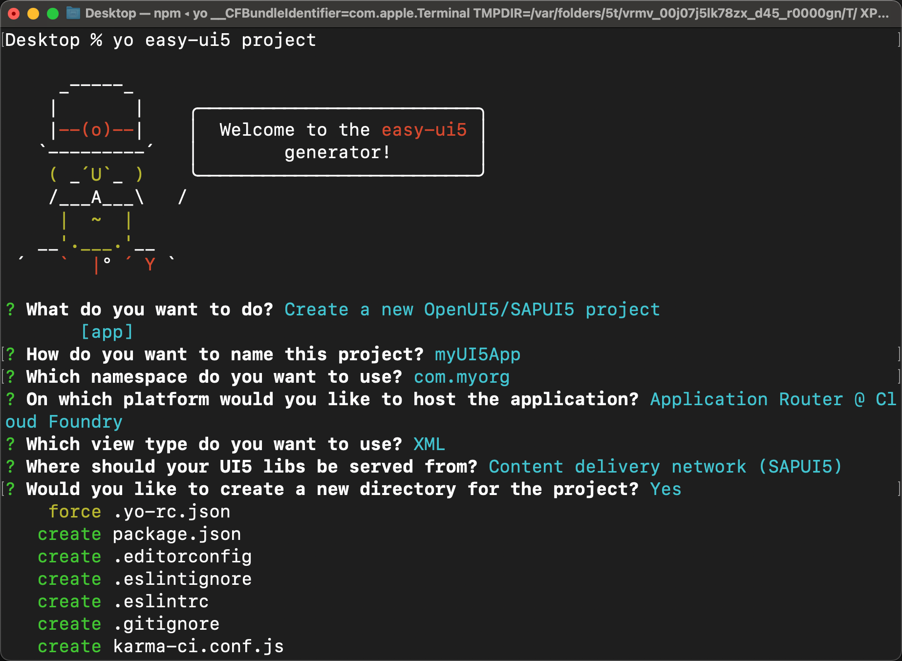
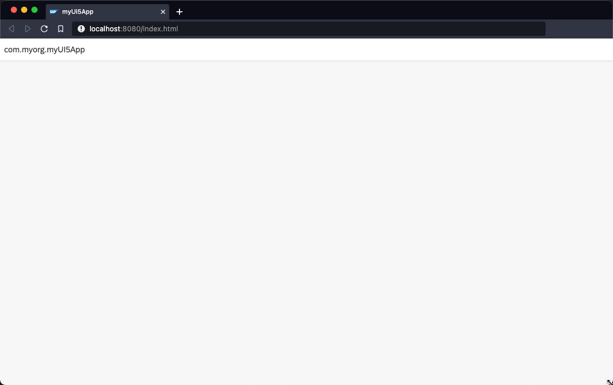

# Create an SAPUI5 App from the Command Line
<!-- description --> Create and test a newly created SAPUI5 app on your local machine with the editor of your choice.

## Prerequisites
 - Install at least version 3.0.0 of the [easy-ui5 generator](cp-cf-sapui5-local-setup)

## You will learn
  - How to scaffold an SAPUI5 project.
  - How to leverage the UI5 Tooling to test the app locally.
  - How to build a multi-target application archive.
  - How to deploy a SAPUI5 app to SAP BTP, Cloud Foundry environment.

---

### Scaffold a SAPUI5 project

Run the following command to create new project:

```
yo easy-ui5 project
```

Choose the following responses for the prompts:

| Parameter     | Value
| :------------- | :-------------
| What do you want to do? | **`project [project]`**
| Which namespace do you want to use? | **`tutorial`**
| How do you want to name this project? | **`myui5project`**
| How do you want to name the first uimodule within your project? | **`myui5app`**
| Do you want to enable the SAP Fiori elements flexible programming model? | **`No`**
| On which platform would you like to host the application | **`SAP Build Work Zone, standard edition`**
| What name should be displayed on the Fiori Launchpad tile? | **`My UI5 Application`**
| Where should your UI5 libs be served from? | **`Local resources (SAPUI5)`**
| Would you like to create a new directory for the project? | **`Yes`**
| Would you like to initialize a local git repository for the project? | **`Yes`**



The following installation of the project's dependencies might take a while.

### Inspect the generated code

Let's have a look at the generated code. Go to the newly created directory and open the code with your favorite editor (here Neovim):

```Bash
cd com.myorg.myui5project/
code .
```

You can see that the wizard created a bunch of folders and files.


The generated project follows a monorepo approach, which results in a root `package.json` file describing the overall project as well as a `package.json` for each generated app (also called "uimodule").

### Test the app locally

The `package.json` at the root of the project contains a script to start the generated uimodule `myui5app`. The uimodule itself is configured to use the UI5 Tooling for development. Among other tasks, the tooling can start a local web server when you run the following command from the project root:

```Bash
npm run start:myui5app
```



### Test the app locally with a Fiori launchpad

Because we selected "SAP Build Work Zone, standard edition" as our deployment target during project generation, the generator added a Fiori launchpad sandbox to the `myui5app` application. It did so using the `preview-middleware` as part of the `ui5.yaml`.

You can start a local web server and directly open the Fiori launchpad sandbox using the following command from the project root:

```Bash
cd myui5app/
npm run start-flp
```


Congrats, you created your first SAPUI5 app form the command line!

---
