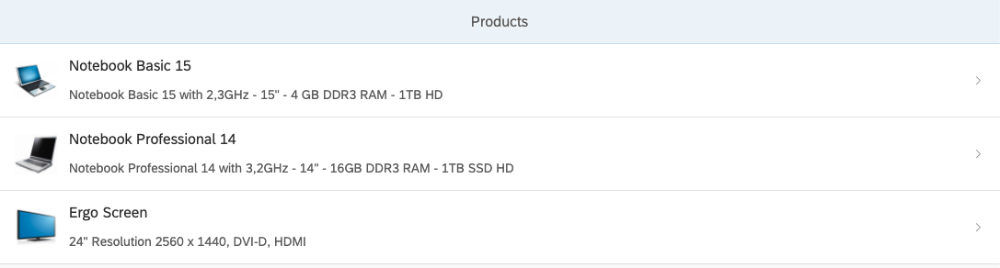

## Prerequisites
  - Download the product list application from [this repository](https://github.com/SAP-samples/teched2019-cloud-cf-product-list/tree/sap-tutorial-xsuaa) or clone the branch **sap-tutorial-xsuaa**.
  - For a better understanding, it is recommended to complete the tutorials [Create a Basic Node.js App](cp-node-create-basic-app) and [Deploy Your Node.js App with the Cloud Foundry CLI](cp-node-deploy-cf-cli) first.

## Details
### You will learn
  - How to secure a basic Node.js application with user authentication
  - How to secure a certain part of your application with user authorization
  - How to assign authorizations (in the form of a role collection) to a user

The goal of this tutorial is to secure and deploy a product list application with authentication and authorization, so only authenticated users with the correct authorizations are able to see the products within the application. Users without the necessary authorizations are able to log in to the application, but do not see the products.

The base for this tutorial is a Node.js application that uses the express framework and SAPUI5 to display a list of products (see screenshot).

!

#### XSUAA and the Application Router

To secure this product list application, two components are used. One is called the XSUAA service and the other one is called application router. The application router is used in combination with the XSUAA service to authenticate a user and route the user to the secured application.

The XSUAA plays the role of an OAuth authorization service whereas the application router plays the role of an OAuth client. Furthermore, the application router works as a central entry point to the application. For more information, check the links at the end of this tutorial.


---

[ACCORDION-BEGIN [Step 1: ](Prepare the application files)]

#### Prepare the index.js file
To prevent a direct call to your application without authentication, it is necessary to add some code to your application. In our example, you use the Node.js passport authentication middleware and configure it with the XSUAA JWT strategy.

1. Go to the `product-list/myapp` folder.

2. Open the `index.js` file.

3. To use additional libraries, add the following lines of code below the line `// secure the direct call to the application`

    ```JavaScript
    const passport = require('passport');
    const { JWTStrategy } = require('@sap/xssec');
    const xsenv = require('@sap/xsenv');

    // XSUAA Middleware
    passport.use(new JWTStrategy(xsenv.getServices({uaa:{tag:'xsuaa'}}).uaa));

    app.use(passport.initialize());
    app.use(passport.authenticate('JWT', { session: false }));
    ```
    This code prevents direct calls to the product list application without a valid JWT.

3. To secure the product list with authorization checks, replace the line `app.get('/products', getProducts);` in the `index.js` file with the following code:

    ```JavaScript
    app.get('/products', checkReadScope, getProducts);

    // Scope check
    function checkReadScope(req, res, next) {
    	if (req.authInfo.checkLocalScope('read')) {
    		return next();
    	} else {
        	console.log('Missing the expected scope');
        	res.status(403).end('Forbidden');
    	}
    }
    ```
    The `checkReadScope` function ensures that only a user with the correct authorizations can look at the products.

4. Save the file.

#### Prepare the package.json file
Since there are now more modules used beside the express module, you have to add the relevant dependencies to your `package.json` file. In this case the dependencies for the modules `passport`, `@sap/xsenv` and `@sap/xssec` have to be added.

> If you want to use SAP modules locally, you need to add the npm configuration:
```bash
npm config set @sap:registry https://npm.sap.com
```

4. Open the `package.json` file.

5. Add the following dependencies:

    ```JSON
    "dependencies": {
      "express": "^4.17.1",
      "@sap/xsenv": "^3.1.0",
      "@sap/xssec": "^3.0.10",
      "passport": "^0.4.1"    
    }
    ```
6. Save the file.


[DONE]
[ACCORDION-END]

[ACCORDION-BEGIN [Step 2: ](Prepare the application security descriptor)]
To use the XSUAA service, a file named `xs-security.json` is necessary. The file can define properties of the XSUAA service instance as well as different roles and authorizations. In this example the file contains a role template and a role collection with a **Product List Viewer** role, that enables the user later to view the products.

6. Add a folder named `security` to your `product-list` folder.

7. Within the folder, create a file named `xs-security.json`.

8. Add the following content:

    ```JSON
    {
    	"xsappname": "product-list",
    	"tenant-mode": "dedicated",
    	"scopes": [
    		{
    			"name": "$XSAPPNAME.read",
    			"description": "With this scope, USER can read products."
    		}
    	],

    	"role-templates": [
    		{
    			"name": "Viewer",
    			"description": "Role to get the list of products",
    			"scope-references": [
    				"$XSAPPNAME.read"
    			]
    		}
    	],
    	"role-collections": [
    		{
    			"name": "ProductListViewer",
    			"description": "Product List Viewer",
    			"role-template-references": [
    				"$XSAPPNAME.Viewer"
    			]
    		}
    	]
    }
    ```
    This creates a role collection with a role template, and a role with a reading scope, so a user with this role can view the products.

  8. Save the file

> To learn more about the `xs-security.json` file, check the links at the end of this tutorial.


[VALIDATE_1]
[ACCORDION-END]


[ACCORDION-BEGIN [Step 3: ](Prepare the approuter files)]
The approuter will enable you to create a secure route to your application.


9. Add a folder named `approuter` to your `product-list` folder.

10. Within that folder create a file named `package.json`.

11. Add the following content:

    ```JSON
    {
        "name": "approuter",
        "dependencies": {
            "@sap/approuter": "^9.0.2"
        },
        "scripts": {
            "start": "node node_modules/@sap/approuter/approuter.js"
        }
    }
    ```
11. Save the file.

12. In the same folder, create a file named `xs-app.json`.

13. Add the following content to that file:

    ```JSON
    {
      "routes": [{
        "source": "^/products",
        "target": "/",
        "destination": "products-destination"
      }]
    }
    ```
    This will create a destination called `products-destination`. The destination is later referenced in the `manifest.yml`.

11. Save the file.
> To learn more about the `xs-app.json` file, check the links at the end of this tutorial.

[DONE]
[ACCORDION-END]


[ACCORDION-BEGIN [Step 4: ](Move static content to the application router)]
For performance reasons it is better to put the images of the application into a static resources folder with the application router.

1. Navigate to the `approuter` folder.

2. Add a folder named `resources`.

3. Move the `images` folder from `myapp/static/` into the `approuter/resources` folder.

By the end of these steps, your folder structure should look like this:

```Bash
product-list
├── approuter
  ├──resources
    ├── images
      ├── HT-1000.jpg
      ├── HT-1010.jpg
      ├── HT-1030.jpg
  ├── package.json
  ├──  xs-app.json
├── myapp
    ├── lib
        ├── repository.js
        ├── products.json
    ├── static
        ├── index.html
    ├── index.js  
    ├── package.json
├── security
    ├── xs-security.json
├── manifest.yaml    
```


[DONE]
[ACCORDION-END]


[ACCORDION-BEGIN [Step 5: ](Update the manifest file)]
In the manifest file you have to define a hostname for your application and add a destination. The manifest file is used to bind the XSUAA service instance to your application.

> The steps show incrementally what parameters and values have to be added. To avoid indentation errors, you can just copy the whole code at the end.

1. Navigate to the `product-list` folder.

2. Open the file `manifest.yaml`.

3. Give your application a specific host name with the parameter `route`. **The route has to be unique in the whole Cloud Foundry landscape**, so make sure to add a random part to the route, for example your initials and your day of birth, like `product-list-ap25` and `approuter-product-list-ap25`. You also need the route to configure a destination later.

    ```YAML
    applications:
    # Product List Application
    - name: product-list
      instances: 1
      memory: 128M
      routes:
        - route: product-list-ap25.cfapps.eu10.hana.ondemand.com
      path: myapp
      buildpacks:
        - nodejs_buildpack  
      timeout: 180
    ```

4. Add the binding for the XSUAA service to your application.

    ```YAML
      ...
      services:
        - xsuaa-service-tutorial
    ```

5. Add the configuration data for the approuter:

    ```YAML
    applications:
    ...

    # Application Router
    - name: approuter
      routes:
        - route: approuter-product-list-ap25.cfapps.eu10.hana.ondemand.com
      path: approuter
      buildpacks:
        - nodejs_buildpack
      memory: 128M
    ```

6. Add a destination to the approuter.

    ```YAML
    # Application Router
    ...
      env:
        destinations: >
          [
            {"name":"products-destination",
             "url":"https://product-list-ap25.cfapps.eu10.hana.ondemand.com",
             "forwardAuthToken": true}
          ]
    ```

    The `name` parameter is the same as previously defined in the file `xs-app.json`. the `url` parameter is the result of the host name of your application and the region of your Cloud Foundry landscape (`https://<hostname>.cfapps.<region>.hana.ondemand.com`). The `forwardAuthToken` parameter set to true ensures that the approuter forwards the JWT token to the destination.

7. Add the bindings for the XSUAA service to the approuter.

    ```YAML
    ...
      services:
        - xsuaa-service-tutorial
    ```
8. Save the file.

When you completed the steps, your manifest.yml file should look like this:
```YAML
applications:
# Application
- name: product-list
  instances: 1
  memory: 128M
  routes:
    - route: product-list-ap25.cfapps.eu10.hana.ondemand.com
  path: myapp
  buildpacks:
    - nodejs_buildpack  
  timeout: 180
  services:
    - xsuaa-service-tutorial

# Application Router
- name: approuter
  routes:
    - route: approuter-product-list-ap25.cfapps.eu10.hana.ondemand.com
  path: approuter
  buildpacks:
    - nodejs_buildpack
  memory: 128M
  services:
    - xsuaa-service-tutorial
  env:
    destinations: >
      [
        {"name":"products-destination",
         "url":"https://product-list-ap25.cfapps.eu10.hana.ondemand.com",
         "forwardAuthToken": true}
      ]
```

[DONE]
[ACCORDION-END]


[ACCORDION-BEGIN [Step 6: ](Update the index.html file)]
Because your are calling the product list over the approuter with `/products` you need to make a small change within the `index.html` file.

1. Navigate to the `product-list/myapp/static` folder.

2. Replace line 24 in the `index.html` file with the following code.
```JavaScript
var productsUrl = "/products/products"; //  contains path mapping which is specified in xs-app.json
```
3. Save the file.

[DONE]
[ACCORDION-END]


[ACCORDION-BEGIN [Step 7: ](Create the XSUAA service instance)]
Before you can deploy your application, you need to create the service instance for the XSUAA.

1. Log in to your Cloud Foundry account with the Cloud Foundry CLI.

2. Navigate to the `product-list` folder.

3. Create the XSUAA service instance with the `xs-security.json` security descriptor file.
```Bash
cf create-service xsuaa application xsuaa-service-tutorial -c security/xs-security.json
```
4. Deploy the application.
```Bash
cf push
```

[DONE]
[ACCORDION-END]


[ACCORDION-BEGIN [Step 8: ](Call your application from its secure route)]

Your application has two routes that are defined in the `manifest.yml`. The direct route to the application should return an error message saying `unauthorized` (because you don't have a valid JWT yet). The secure route through the approuter redirects to a login screen. After logging in, the application opens but shows the message `no data`. To see the product data, you need to assign your user the role collection with the necessary authorizations.

3. First make sure that your application can't be reached on its direct URL:

    `https://product-list-ap25.cfapps.eu10.hana.ondemand.com`

    If everything is working correctly, this will result in an error message reading `unauthorized`.

1. Navigate to your application with the secure route of your application router:

    `https://approuter-product-list-ap25.cfapps.eu10.hana.ondemand.com/products`

2. Enter the e-mail and password of your trial account.

    You should see the `no data` message. This is because you don't have the role assigned yet to view the products. You will do this in the next step.


[DONE]
[ACCORDION-END]

[ACCORDION-BEGIN [Step 7: ](Assign the role collection)]

Assign your user the role collection that contains the necessary role to view the products in the product list.

3. Open the SAP BTP cockpit.

4. Navigate to your subaccount.

5. Choose the **Security** tab and choose **Trust Configuration**.

6. Choose **Default identity provider**.

7. Enter your e-mail address and choose **Show Assignments**.

8. Choose **Assign Role Collection**.

9. Choose the `ProductListViewer` role collection.

10. Call the URL of the approuter again (you might have to delete your cookies/cache before).

    `https://approuter-product-list-ap25.cfapps.eu10.hana.ondemand.com/products`


    The application will now show you the products.


[DONE]
[ACCORDION-END]


### Troubleshooting

#### Error message: the hostname of your application is already taken
To resolve this error, please edit the `manifest.yml` file and change the `route` parameter of the product list application or the `route` parameter of the approuter (depending on which hostname is already taken). If you change the parameter of the product list application, make sure to change the `url` parameter under destinations as well.


### Resources
- [Info on the xs-app.json](https://help.sap.com/viewer/65de2977205c403bbc107264b8eccf4b/Cloud/en-US/c103fb414988447ead2023f768096dcc.html)
- [Info on the xs-security.json](https://help.sap.com/viewer/65de2977205c403bbc107264b8eccf4b/Cloud/en-US/150b04d647cd4b42835411c1787a8b11.html?q=security%20descriptor)
- [Access Management in the Cloud Foundry Environment](https://help.sap.com/viewer/DRAFT/65de2977205c403bbc107264b8eccf4b/Dev/en-US/28eb34a6eda740a395ff6b0496f3bffb.html)

---
