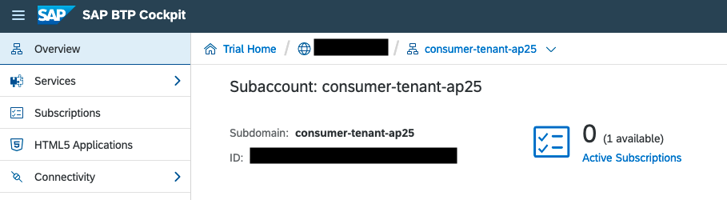

## Prerequisites
 - [Secure a Basic Node.js App with the Authorization and Trust Management Service (XSUAA)](cp-cf-security-xsuaa-create)
 - You must have a second subaccount within the **same** trial account that you can use to subscribe to the application.

## Details
### You will learn
  - How to add multitenancy to a secure Node.js application
  - How to provide the application to another subaccount with the SaaS Provisioning service
  - How to access a multitenant application from another subaccount

The use case for this tutorial is that you've created a Node.js application in your subaccount that is secured by the XSUAA. You now want to make that application available to other subaccounts (tenants). You'll use the SaaS Provisioning service to make your application available to a consumer subaccount within your global trial account.

See the following diagram to get an overview of the SaaS architecture.

!
&nbsp;
>**IMPORTANT:** This tutorial is using **specific values** instead of placeholders. **Please make sure to adapt those values** to your own values, that you used in the [previous tutorial](cp-cf-security-xsuaa-create).

The specific values that are used in this tutorial are:

- The application name of the product list application: **product-list**.
    - Used in the `manifest.yml`.
- The application name of the application router: **approuter**.
    - Used in the `manifest.yml`.
- The route: **product-list-ap25.cfapps.eu10.hana.ondemand.com**.
    - Used in the `manifest.yml`.
    - Partially used in the `config.json`.
- The route: **approuter-product-list-ap25.cfapps.eu10.hana.ondemand.com**.
    - Used in the `manifest.yml`.
    - Partially used in the `index.js`
- The XSUAA service instance name: **xsuaa-service-tutorial**
    - Used in the `manifest.yml`.
    - Used when creating the service instance.
- The SaaS Provisioning service instance name: **saas-registry-tutorial**.
    - Used in the `manifest.yml`.
    - Used when creating the service instance.
- The XSUAA application name: **product-list**
    - Used in the `config.json`.
    - Used in the `xs-security.json`.
- The subdomain Id of the consumer subaccount: **consumer-tenant-ap25**.
    - Used when creating the route for the consumer subaccount.

---

[ACCORDION-BEGIN [Step 1: ](Enable multitenancy in the security descriptor file)]
To enable multitenancy, you need to change the parameter `tenant-mode` in the `xs-security.json` file to make it available for multiple tenants.

1. Go to the `product-list/security` folder.

2. Open the `xs-security.json` file.

3. Change the value of the parameter `tenant-mode` to `shared`.

4. Under `scopes`, add access to the SaaS Provisioning service to call the product list callback API directly. You'll implement the callbacks in Step 3.

    ```JSON
    "scopes": [
  		{
  			"name": "$XSAPPNAME.read",
  			"description": "With this scope, USER can read products."
  		},
  		{
  			"name": "$XSAPPNAME.Callback",
  			"description": "With this scope set, the callbacks for tenant onboarding, offboarding and getDependencies can be called.",
  			"grant-as-authority-to-apps": [
  				"$XSAPPNAME(application,sap-provisioning,tenant-onboarding)"
  			]
  		}
  	],
    ```

5. Save the file.


[DONE]
[ACCORDION-END]

[ACCORDION-BEGIN [Step 2: ](Update the manifest)]
In this step you need to complete the following tasks:

- Add a new routing pattern
- Add the service binding for the SaaS Provisioning service

You can either do these steps one by one or copy the complete `manifest.yml` at the end. Remember to adapt the routes, URLs, and the `TENANT_HOST_PATTERN` according to your own example.

### Add a new routing pattern
Add a parameter called `TENANT_HOST_PATTERN` to the **approuter** application. The parameter specifies a generic route for all tenants to call the application over the approuter.

1. Go to the `product-list` folder.

2. Open the `manifest.yml` file.

3. For the **approuter** application, add the parameter `TENANT_HOST_PATTERN` under the `env` parameter.

    ```YAML
    env:
      destinations: >
        [
          {"name":"hw-dest",
           "url":"https://product-list-ap25.cfapps.eu10.hana.ondemand.com",
           "forwardAuthToken": true}
        ]
      TENANT_HOST_PATTERN: "^(.*)-approuter-product-list-ap25.cfapps.eu10.hana.ondemand.com"
    ```
    >**RESTRICTION:** The value of the parameter `TENANT_HOST_PATTERN` has to be lowercase.


### Add the service binding for the SaaS Provisioning service
Adding the service binding of the SaaS Provisioning service in the `manifest.yml` will automatically bind the service instance to the `product-list` application when deploying it.

Add the service binding for the SaaS Provisioning service to the **product-list** application.

```YAML
services:
  - xsuaa-service-tutorial
  - saas-registry-tutorial
```


At the end your `manifest.yml` file should look like this:

```YAML
applications:
# Application
- name: product-list
  instances: 1
  memory: 128M
  routes:
    - route: product-list-ap25.cfapps.eu10.hana.ondemand.com
  path: myapp
  buildpacks:
    - nodejs_buildpack  
  timeout: 180
  services:
    - xsuaa-service-tutorial
    - saas-registry-tutorial

# Application Router
- name: approuter
  routes:
    - route: approuter-product-list-ap25.cfapps.eu10.hana.ondemand.com
  path: approuter
  buildpacks:
    - nodejs_buildpack
  memory: 128M
  services:
    - xsuaa-service-tutorial
  env:
    destinations: >
      [
        {
          "name":"products-destination",
          "url":"https://product-list-ap25.cfapps.eu10.hana.ondemand.com",
          "forwardAuthToken": true
        }      
      ]
    TENANT_HOST_PATTERN: "^(.*)-approuter-product-list-ap25.cfapps.eu10.hana.ondemand.com"
```


[VALIDATE_1]
[ACCORDION-END]


[ACCORDION-BEGIN [Step 3: ](Implement the subscribe/unsubscribe endpoints)]
To enable other subaccounts to subscribe to your application, you need to implement an endpoint for the SaaS registration manager to subscribe/unsubscribe.

1. Go to the `myapp` folder.

2. Open the `index.js` file.

3. Add the following lines of code after the `checkReadScope` function (replace the string "ap25" with the string that you used when deploying the first tutorial. Adapt the region code if your trial isn't in the eu10 region):

    ```JavaScript
      app.put('/callback/v1.0/tenants/*', function (req, res) {
      	var consumerSubdomain = req.body.subscribedSubdomain;
      	var tenantAppURL = "https:\/\/" + consumerSubdomain + "-approuter-product-list-ap25." + "cfapps.eu10.hana.ondemand.com/products";
      	res.status(200).send(tenantAppURL);
        });

      app.delete('/callback/v1.0/tenants/*', function (req, res) {
      	var consumerSubdomain = req.body.subscribedSubdomain;
      	var tenantAppURL = "https:\/\/" + consumerSubdomain + "-approuter-product-list-ap25." + "cfapps.eu10.hana.ondemand.com/products";
      	res.status(200).send(tenantAppURL);
      });
    ```

  4. To be able to read the body of those calls, add the body parser module at line 9 of the `index.js` file.

    ```JavaScript
    const bodyParser = require('body-parser')
    app.use(bodyParser.json())
    ```

  5. Add the body parser module as a dependency to the `product list/myapp/package.json` file.

    ```JSON
    "dependencies": {
      "express": "^4.17.1",
      "@sap/xsenv": "^3.1.0",
      "@sap/xssec": "^3.0.10",
      "passport": "^0.4.1",
      "body-parser": "^1.19.0"   
    }
    ```


[DONE]
[ACCORDION-END]


[ACCORDION-BEGIN [Step 4: ](Create a SaaS configuration file)]
To make your multitenant application endpoints available for subscription to consumer subaccounts, you must register the application in the Cloud Foundry environment via the SaaS Provisioning service.

To register your application, you need a configuration file called `config.json`. In this file, you specify the subscription URL, the name and description of your application. The `xsappname` has to be the same as the `xsappname` in the `xs-security.json` file.

1. Go to the `product-list` folder.

2. Create a `config.json` file.

3. Insert the following lines:

    ```JSON
    {
      "xsappname":"product-list",
      "appUrls": {
        "onSubscription" : "https://product-list-ap25.cfapps.eu10.hana.ondemand.com/callback/v1.0/tenants/{tenantId}"
      },
      "displayName" : "Product List MTA",
      "description" : "Product list MTA sample application",
      "category" : "Custom SaaS Applications"
    }
    ```


[DONE]
[ACCORDION-END]


[ACCORDION-BEGIN [Step 5: ](Delete the old XSUAA service instance)]
When you change the tenant mode from `dedicated` to `shared` like you did in step 1, it's not enough to update the XSUAA service instance. You have to unbind and delete the old service instance first to recreate it later with the updated tenant mode settings.


1. Unbind the existing XSUAA service instance from the product-list
```Bash
cf unbind-service product-list xsuaa-service-tutorial
```

2. Unbind the existing XSUAA service instance from the approuter.
```Bash
cf unbind-service approuter xsuaa-service-tutorial
```

3. Delete the existing XSUAA service instance.
```Bash
cf delete-service xsuaa-service-tutorial
```

[DONE]
[ACCORDION-END]


[ACCORDION-BEGIN [Step 6: ](Create service instances and redeploy your applications)]
Create the new multitenant XSUAA service instance and the SaaS Provisioning service instance and redeploy your application.


1. Log in to your Cloud Foundry account with the Cloud Foundry CLI.

2. Go to the `product-list` folder.

3. Create the XSUAA service instance with the `xs-security.json` security descriptor file.
```Bash
cf create-service xsuaa application xsuaa-service-tutorial -c security/xs-security.json
```

4. Create the SaaS Provisioning service instance with the `config.json` file.
```Bash
cf create-service saas-registry application saas-registry-tutorial -c config.json
```

5. Redeploy the application with the updated `manifest.yml` file.
```Bash
cf push
```

[DONE]
[ACCORDION-END]


[ACCORDION-BEGIN [Step 7: ](Create a route for a consumer subaccount)]
Make your application reachable for consumer subaccounts by adding a new route in the Cloud Foundry CLI. The route is composed of the subdomain of the **subscribing** subaccount (see screenshot) and the `TENANT_HOST_PATTERN` of the application router that we defined in the `manifest.yml`. You have to create a new route for every subaccount (tenant) that subscribes to the application.

!

1. Log in to the Cloud Foundry account where the application is deployed with the Cloud Foundry CLI.

2. Create a route for the consumer subaccount.
```Bash
cf map-route approuter cfapps.eu10.hana.ondemand.com --hostname consumer-tenant-ap25-approuter-product-list-ap25
```


[VALIDATE_2]
[ACCORDION-END]


[ACCORDION-BEGIN [Step 8: ](Access the application with the consumer subaccount)]
To access the application you need to subscribe to it. Follow these steps to subscribe to the SaaS application with the consumer subaccount and call the application URL.

1. Open the [SAP BTP Trial](https://account.hanatrial.ondemand.com/cockpit/#/home/trialhome).

2. Navigate to your consumer subaccount.

3. Choose **Subscriptions**.

4. Choose **Product List MTA**.

5. Choose **Subscribe**.

6. Choose **Go to Application**.

You'll now see the application with the message `no data` because you have to assign the role collection to your user in the consumer subaccount.


[DONE]
[ACCORDION-END]


[ACCORDION-BEGIN [Step 9: ](Assign the role collection)]

Assign your user the role collection `ProductListViewer` that contains the necessary role to view the products in the product list.

3. Open the SAP BTP cockpit.

4. Navigate to your consumer subaccount.

5. Choose the **Security** tab and choose **Trust Configuration**.

6. Choose **Default identity provider**.

7. Enter your e-mail address and choose **Show Assignments**.

8. Choose **Assign Role Collection**.

9. Choose the `ProductListViewer` role collection.

10. Clear your cache and reload the application URL.

    `https://consumer-tenant-ap25-approuter-product-list-ap25.cfapps.eu10.hana.ondemand.com/products`


The application will now show you the products. If it's not working also consider to check with another browser or in private mode.


[DONE]
[ACCORDION-END]

---

### Resources
- [Developing Multitenant Applications in the Cloud Foundry Environment](https://help.sap.com/viewer/65de2977205c403bbc107264b8eccf4b/Cloud/en-US/5e8a2b74e4f2442b8257c850ed912f48.html)
- [Authorization and Trust Management in the Cloud Foundry Environment](https://help.sap.com/viewer/65de2977205c403bbc107264b8eccf4b/Cloud/en-US/6373bb7a96114d619bfdfdc6f505d1b9.html)

---
