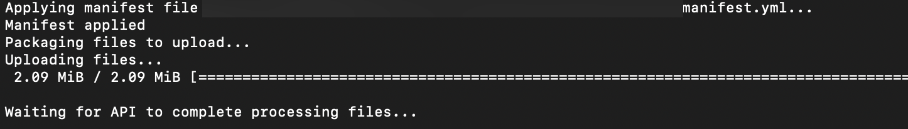
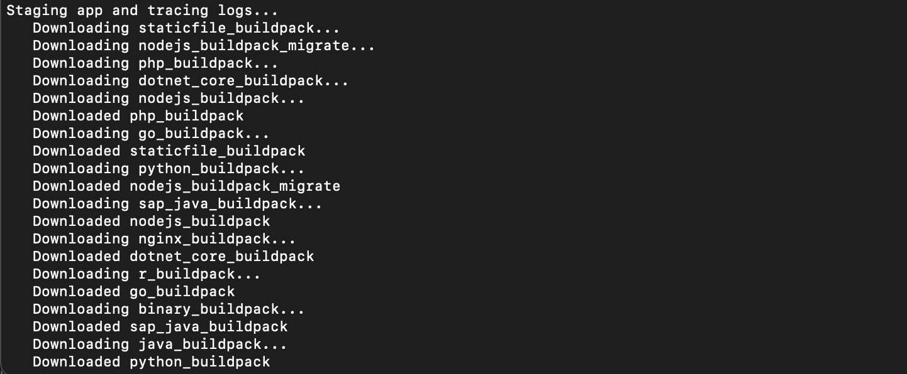
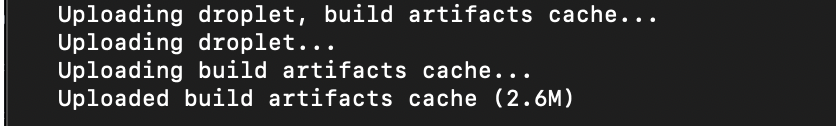
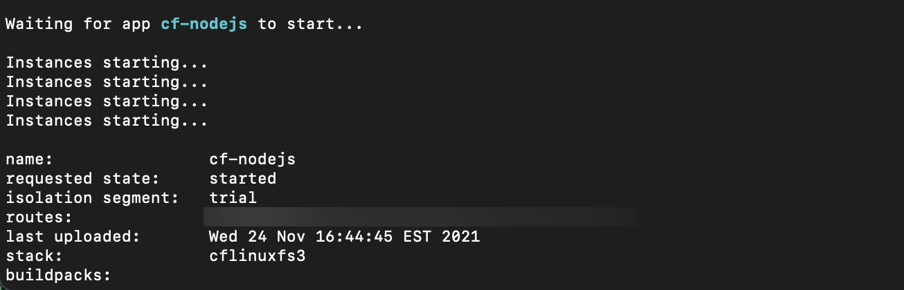

# Understand the Cloud Foundry Application Lifecycle for Buildpack Applications
<!-- description --> Understand the application lifecycle in Cloud Foundry and what happens when you cf push.

## Prerequisites
 - **Tutorials** [Fundamentals of the SAP BTP, Cloud Foundry environment](cp-cf-fundamentals)
 - **Tutorials** [Download and Prepare App for Cloud Foundry Deployment](cp-cf-dev-01-prepare-app)
 - **Tutorials** [Install the Cloud Foundry Command Line Interface (CLI)](cp-cf-download-cli)


## You will learn
  - What happens when you CF Push
  - The lifecycle of buildpack applications
  - Differences between restarting, re-staging, and re-deploying
  - How Cloud Foundry handles crashes and shutdowns, and the process of evacuation

---
### Push your application to Cloud Foundry


When you push an application to Cloud Foundry (`cf push`), by default it uses a [buildpack](https://docs.cloudfoundry.org/buildpacks/) (either specified by you or auto-detected by Cloud Foundry) to download required dependencies, compile everything needed for your application, and produce a [droplet](https://docs.cloudfoundry.org/concepts/glossary.html) - an artifact - that can be used to run your application in a container. A `cf push` goes through three phases:

  1. _Upload_ - A record is created in Cloud Foundry for the application, source files are uploaded, and an app package is created

  2. _Staging_ - The required [buildpack](https://docs.cloudfoundry.org/buildpacks/) is downloaded and a droplet is created (using the generated buildpack and app package)

  3. _Startup_ - The app is scheduled to run and is started up (using the droplet) within a container

You can see the full application lifecycle documented at [How Apps are Staged](https://docs.cloudfoundry.org/concepts/how-applications-are-staged.html). Using the `manifest.yml` file, you can specify what actually happens during each phase, such as what buildpacks to use, the command to be run on startup, and more. A list of all the possible manifest settings can be found in the [official documentation](https://docs.cloudfoundry.org/devguide/deploy-apps/manifest-attributes.html).

To see each phase in action, follow [Install the Cloud Foundry Command Line Interface (CLI)](cp-cf-download-cli) to set up the CF CLI and then get the [cf-nodejs](https://github.com/SAP-samples/cf-sample-app-nodejs) app as described in [Download and Prepare App for Cloud Foundry Deployment](cp-cf-dev-01-prepare-app). Make sure to change [random-route](https://github.com/SAP-samples/cf-sample-app-nodejs/blob/8c5da6ab1b56323a9febbc67216a12c58f1c784f/manifest.yml#L6) to `true` in the `manifest.yml` or have a unique name for the app by changing the [app name](https://github.com/SAP-samples/cf-sample-app-nodejs/blob/8c5da6ab1b56323a9febbc67216a12c58f1c784f/manifest.yml#L3) in the `manifest.yml`, and then run:

```
cd <path-to>/cf-sample-app-nodejs
cf push
```

Once you run the command you will see lots of output print to the screen, and if you look through it carefully you can see where each phase occurs.

The uploading phase begins as follows:

<!-- border -->

After that, the staging phase begins. You can see the buildpacks being downloaded (since a specific buildpack is not specified it downloads all of them):

<!-- border -->

You can also see when the droplet get uploaded:

<!-- border -->

And finally you see the starting phase:

<!-- border -->

> If you run `cf push` for an existing application, _all instances of that application are stopped_ and new instances are started with the code you just pushed. Users that try to access the app during this time may get various HTTP error messages, such as "404" ("file not found") and others, while the application is redeployed. The Cloud Foundry API `v3` support the so called [Rolling App Deployments](https://docs.cloudfoundry.org/devguide/deploy-apps/rolling-deploy.html) with `cf push <app-name> --strategy rolling` which allows to push an app without downtime. The API `v3` are also supported on SAP BTP.


### Understand when and how to re-start, re-stage, or re-push your application


Knowing when to re-stage, restart, or re-push is useful in properly maintaining your application with minimal downtime or even without a downtime. All this can be a little confusing, so here's a quick summary and overview:

- _Re-push_ - if there is new or changed code. When application code changes, the developer has to `push` that new/changed code to Cloud Foundry before CF can do anything with it. A quick `cf push <app-name>` copies the most recent code up to your Cloud Foundry environment so that the changes can be compiled and deployed. More detailed information on this process can be seen in the section above "CF Push".

- _Re-stage_ - when there is updated configuration or a change in app environment which has an effect for the staging process, but your app code's the same. If the application code has not changed, but the environment or configuration has, then doing a re-stage (`cf restage <app-name>`) will get CF to populate those changes down to running instances of your app. Check out the CF docs on [re-staging your app](https://docs.cloudfoundry.org/devguide/deploy-apps/start-restart-restage.html#restage) for more information.

- _Re-start_ - app instances when there are changed environment variables or service bindings. Additionally, `cf restart <app-name>` is useful when you want to quickly recycle application processes and get an application back to a fresh/known state. If you're interested in more details check out the [official documentation](https://docs.cloudfoundry.org/devguide/deploy-apps/start-restart-restage.html#restart).


### Understand application crashes, shutdowns, and evacuations


Every application stops running at some point, whether from a normal shutdown, a crash, or a restart. Cloud Foundry handles all of these scenarios as follows:

- _Crash_ - If an application instance crashes, Cloud Foundry is designed to [automatically try to restart it](https://docs.cloudfoundry.org/devguide/deploy-apps/app-lifecycle.html#crash-events). Application crashes are usually due to an issue with the application itself, though in rare cases a crash could be caused by a problem with some underlying Cloud Foundry component(s). In such a cases, it is important to look at the logs, events and metrics to determine the cause of the crash, and to discern whether or not Cloud Foundry can recover on its own, or if human intervention is required.

- _Shutdown_ - Certain [actions](https://docs.cloudfoundry.org/devguide/deploy-apps/app-lifecycle.html#shutdown) will cause Cloud Foundry to shutdown an application instance. On shutdown, Cloud Foundry sends the app process a SIGTERM, giving the application 10 seconds to stop on its own before being forcibly terminated via SIGKILL. This 10 second limit is a system-wide setting, and is also the default configuration of the SAP BTP. An application developer should keep this in mind when creating their app so that it can handle shutdowns gracefully.

- _Evacuation_ - In some cases, the virtual machines (VMs) that run the containers hosting an app instance may need to be restarted. For example, this may happen if underlying VM image or Cloud Foundry are updated. Through a process called [evacuation](https://docs.cloudfoundry.org/devguide/deploy-apps/app-lifecycle.html#evacuation), Cloud Foundry automatically relocates an app instance to another VM before restarting the VM that previously ran that app instance. When this occurs the app instance is recreated, and once the new app instance reports itself as healthy, the old instance is shut down. This may cause a brief period of time where duplicates of an app can be seen. If an app only has one instance, it may become unavailable during this process (if the new app instance doesn't report as healthy within the default 10 minute evacuation timeout).

> Always run at least two app instances for any environment or workload considered "production" so as not to introduce single points of failure.


---
