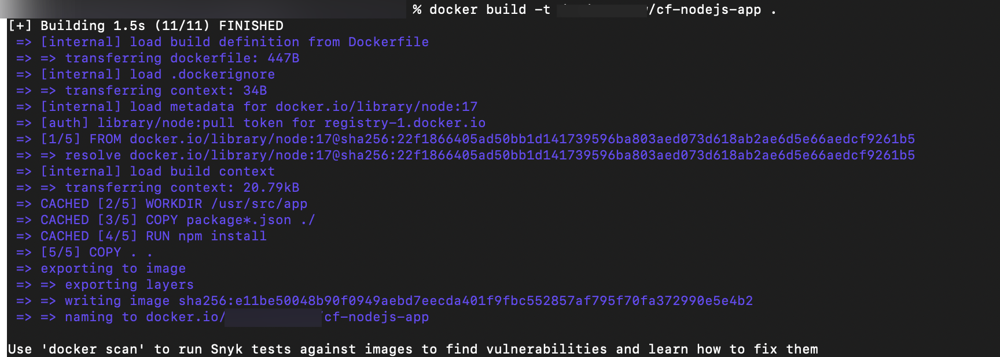
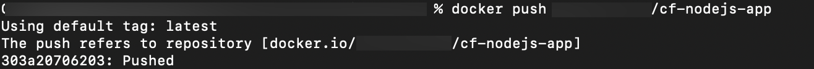
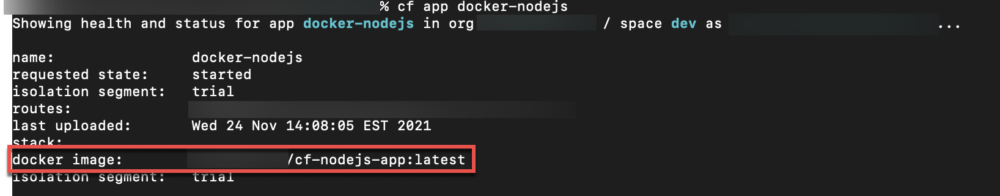

# Understand the Cloud Foundry Application Lifecycle for Docker Applications
<!-- description --> Understand how Docker works with Cloud Foundry and how to push a Docker image

## Prerequisites
 - **Tutorials** [Understand the Cloud Foundry Application Lifecycle for Buildpack Applications](cp-cf-understand-application-lifecycle)
 - You have installed Docker.
 - You have [Docker Hub](https://hub.docker.com/) account.


## You will learn
  - The lifecycle of Docker based applications
  - How to push a Docker application
  - Considerations when re-pushing and re-staging Docker images


---
### Understand Docker based applications


When you push an application to Cloud Foundry (`cf push`), it uses a [buildpack](https://docs.cloudfoundry.org/buildpacks/) by default. There is, however, another option to use a Docker image instead of a buildpack with Cloud Foundry as well. You can see the full application lifecycle documented at [How Apps are Staged](https://docs.cloudfoundry.org/concepts/how-applications-are-staged.html), but for the sake of brevity, just know that the lifecycle is mostly the same when running either a Docker container or buildpack based application. There are some special considerations when it comes to Docker based applications:

  1. When you `cf push` with a Docker image, the last step of the process is to schedule the app as a long running process, and at this point the Docker image is downloaded. That means that Cloud Foundry will require access to the container registry where the image is stored to start your application.

  2. Access to the registry is also required when the application needs to be re-staged or restarted. If the registry is not accessible, these operations will fail. For this reason it is required to re-push your application if the credentials for a private container registry change.

  3. Additionally, when you use a buildpack, your main concern is your application code. The buildpack takes care of the work of downloading dependencies, compiling code, and creating a droplet from which your application can run. However, when using a Docker image, you have to do all this yourself (set up the image, define dependencies, provide settings the image/app needs to start, etc.)

  4. Related to the above, buildpacks are generally maintained and updated by the Cloud Foundry community, but this is not the case for referenced Docker base images. Here you will need to keep track of security vulnerabilities and update the base images. If a base image is not maintained any more you will need to maintain your own base images. Moral of the story: don't take on more than you absolutely have to, but be certain you trust the source of all your base images and buildpacks.


### Push a Docker based application

To see how Docker based applications work you will take the [cf-nodejs](https://github.com/SAP-archive/cf-sample-app-nodejs) application you deployed before and create a Docker image of it, which you will then deploy. To do this, the first thing you need to do is create a `Dockerfile` in the same directory as your application files. The path to the `Dockerfile` should be `<path-to-cf-sample-app-nodejs>/Dockerfile` Once the file is created, open the `Dockerfile` with your favorite editor, and add the following (lines beginning with `#` are comments explaining what the line below it does):

```
# specify the node base image with your desired version node:<version>
FROM node:18
# create a directory within the image to house your application code
WORKDIR /usr/src/app
# copy package files
COPY package*.json ./
#install app dependencies
RUN npm install
#copy over the rest of the app files
COPY . .
#the start command to be run
CMD [ "node", "server.js" ]
```

The code above begins with the official Node image from Docker. We then proceed to add onto this base image, adding files, downloading dependencies, and providing the start command for the `cf-nodejs` app. Make sure to save the file once you have added the code above. Once that is done you then need to tell Docker to build your image. Run the following command (the `username` is your `Dockerhub` username and some commands may require you to enter your `Dockerhub` password):

```Bash
cd <path-to-cf-sample-app-nodejs>
docker build -t <username>/cf-nodejs-app .
```

You should see output similar to the following:

<!-- border -->

Now that the image is built, you need to push it to a repository on `Dockerhub`. Running the following commands, a repository will be created for your user called `cf-nodejs-app` and your image will be uploaded to it:

```Bash
docker login -u <docker-id>
docker push <username>/cf-nodejs-app
```

<!-- border -->

Finally, once the image has been uploaded, you can push the image to Cloud Foundry (you can replace the name `docker-nodejs` with whatever you want to name your application).

```Bash
cf push docker-nodejs --docker-image <username>/cf-nodejs-app:latest --docker-username <username>
```

> In this example `cf-nodejs-app:latest` is used, but in the next section you will see why using the 'latest' image may not always be what you want.

Finally, once the application has started you should be able to access the app through a browser and see the same output as when you ran the `cf-nodejs` app using a buildpack. You can also validate that your application is actually using the docker image by running:

```Bash
cf app docker-nodejs
```

You should then see the `docker image` field with the name your Docker image next to it, similar to the output below.

<!-- border -->

After running through this example, you can see that using a Docker image requires you to specify and configure things that you didn't have to be concerned with when using a buildpack. A buildpack handles most of this in the background for you.


### Why Docker image tags are relevant for your application

There are some special considerations when it comes to re-pushing, re-staging and restarting Docker applications. These operations will trigger a Docker pull when Cloud Foundry starts the application and depending on your Docker image configuration following can happen:

  - If you specify a specific `tag` for the image, Cloud Foundry will pull the latest image state for that `tag` whenever the app start is scheduled.
  - However, if you don't specify a `tag`, the `latest` tag will be used which could be very dangerous for productive apps.

> Always take care which image tags do you use for your productive apps and don't push image changes to those image tags because this will cause unexpected updates of your productive apps.

