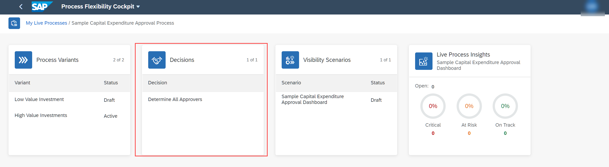
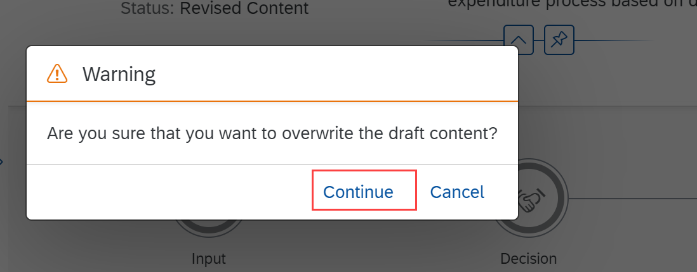
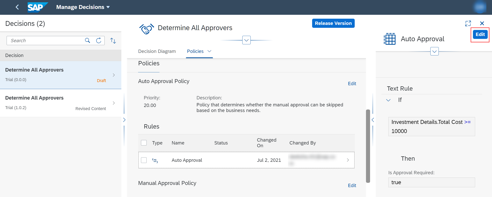
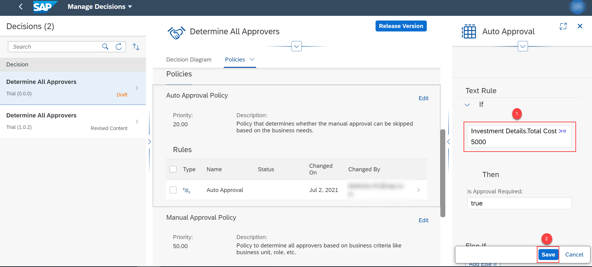
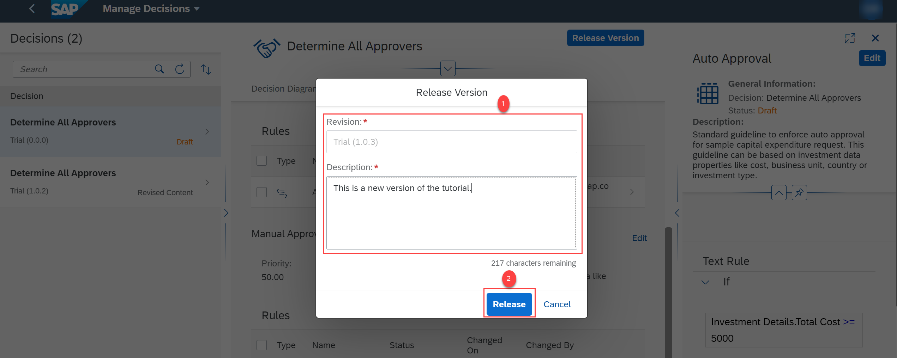
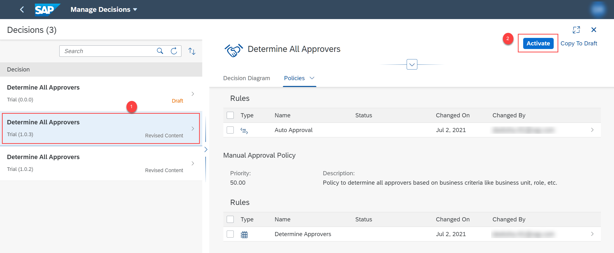

---

parser: v2
auto_validation: true
time: 5
tags: [tutorial>beginner, products>sap-business-technology-platform]
primary_tag: products>sap-business-technology-platform
author_name: Deeksha R
author_profile: https://github.com/Deeksha-R
---

# Manage and Configure Decisions
<!-- description --> Manage and configure the business decisions flexibly for your capital expenditure process with manage decisions.

## Prerequisites
- [Set Up Workflow Management in Cloud Cockpit](cp-starter-ibpm-employeeonboarding-1-setup).

## You will learn
  - How to configure an auto approval policy for a decision

## Intro
You can view, edit, author, and activate your business decisions using **Manage Decisions**.

A decision consists of one or more policies, and each policy consists of a collection of rules. It is a part of the live process package and is used to automate decision making of a business process.

You configure the auto approval policy using this tutorial. This policy is used to determine if an approval is required or not, based on the total investment cost. In this scenario, auto approval is enabled if the investment cost is less than 5000.

---

### Open manage decisions

1. Choose the **Process Flexibility Cockpit**. Then navigate to **My Live Processes** section and choose **Sample Capital Expenditure Approval Process** tile.

    <!-- border -->

    <!-- border -->

2. Choose the **Determine All Approvers** decision.

    <!-- border -->

    You are now in the **Manage Decisions** view.

### Modify auto approval policy

1. Choose the **Determine All Approvers** decision, then choose **Copy to Draft** to create a draft version of the decision.

    <!-- border -->

2. In the warning dialog, choose **Continue**.

    

3.  Choose the draft version of the decision, and then choose **Policies** > **Auto Approval Policy**.

    <!-- border -->

4. Choose the **Auto Approval** rule.

    <!-- border -->

5. Choose **Edit**.

    <!-- border -->

6. Modify the text rule value to **`5000`** and **Save** the changes.

    <!-- border -->

### Release and activate decision

1. Choose **Release Version**.

    <!-- border -->

2. In the **Release Version** dialog, provide the revision number and description. Then choose **Release**.

    <!-- border -->

3. Choose the decision with the version number from the previous step and then choose **Activate**.

    <!-- border -->

    You have now modified the decision for your package.

s

---
