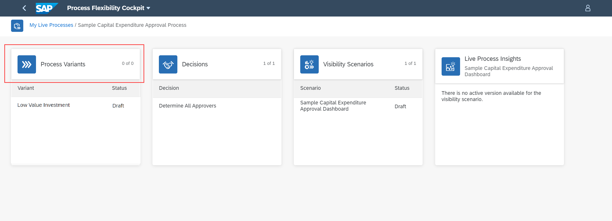
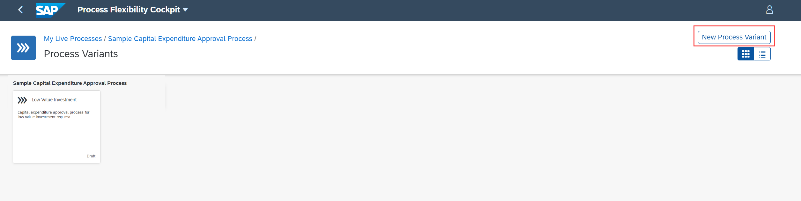
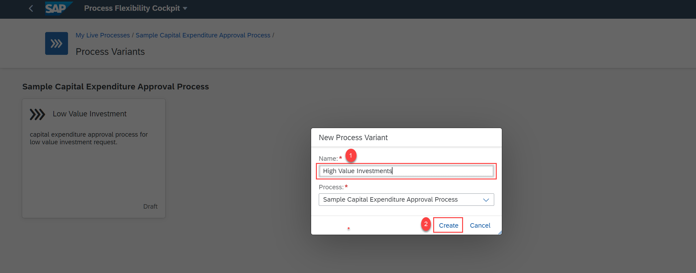
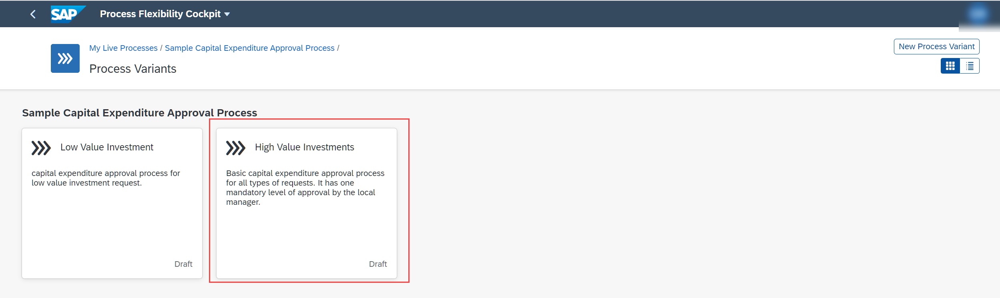

## Prerequisites
- [Set Up Workflow Management in Cloud Cockpit](cp-starter-ibpm-employeeonboarding-1-setup).

## Details
### You will learn
- You will learn how to create a process variant
- You will learn how to configure a process variant

A process variant consists of multiple process steps configured by a line-of-business expert. You can create multiple process variants depending on the number of approval steps to configure for the capital expenditure approval process.

In this tutorial, you can configure one such approval step and activate a process variant.

---

[ACCORDION-BEGIN [Step 1: ](Open process variants)]
1. In the **Process Flexibility Cockpit**, navigate to **My Live Processes** section and choose **Sample Capital Expenditure Approval Process** tile.

    !

2. Choose the **Process Variants** tile.

    !

[DONE]
[ACCORDION-END]

[ACCORDION-BEGIN [Step 2: ](Create a new variant)]
1. Choose **New Process Variant**.

    !

2. Provide **High Value Investments** as the **Name**. Then choose **Create**.

    !

    > The **Process** dropdown is preselected as **`Sample Capital Expenditure Approval Process`**. This process refers to the template from which the new variant will be created. A template contains the process steps that are used to configure the different process variants based on business needs.

3. The new process variant is now created with the given name and default description. Choose the newly created **High Value Investments** process variant tile.

    !

    You are now in the **Manage Process Variants** view.

[DONE]
[ACCORDION-END]

[ACCORDION-BEGIN [Step 3: ](Edit the process variant)]
1. In the **Manage Process Variants** view, add a new approval step to the template by dragging the **Approval** tile from **Available Steps** and drop it after the **Local Manager Approval** step.

    !

    >Choose the new approval step that opens the **Step Properties**

    >!

2. In the **Step Properties** section, modify the name of the step to **`CFO Approval`**.

    !

3. Choose the **Details** tab, then change the **Role Name** to **`CFO`** and **Approval Step** to **`CFO`**.

    !

    >In the **Details** section, you should provide information on the role of the persona that should perform the approval task.

4. **Save** and **Activate** the process variant.

    

5. Navigate to the Workflow Management home screen.

    !

[VALIDATE_2]
[ACCORDION-END]
---
