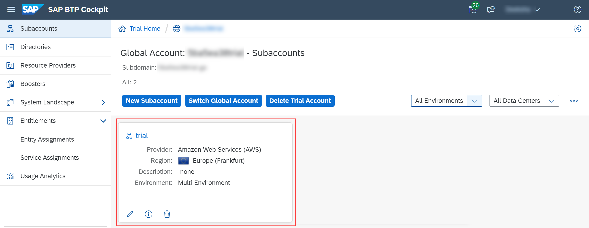
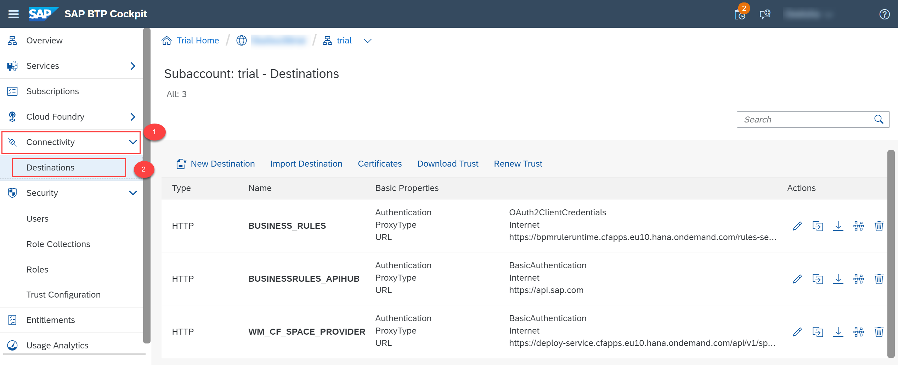
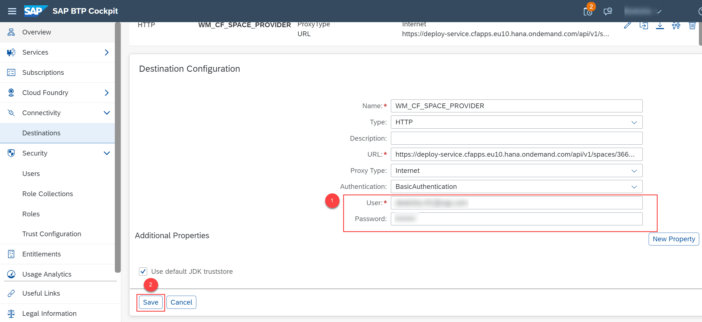
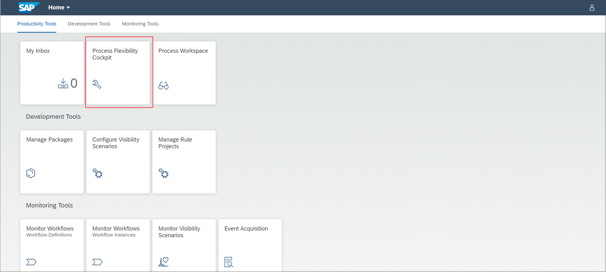
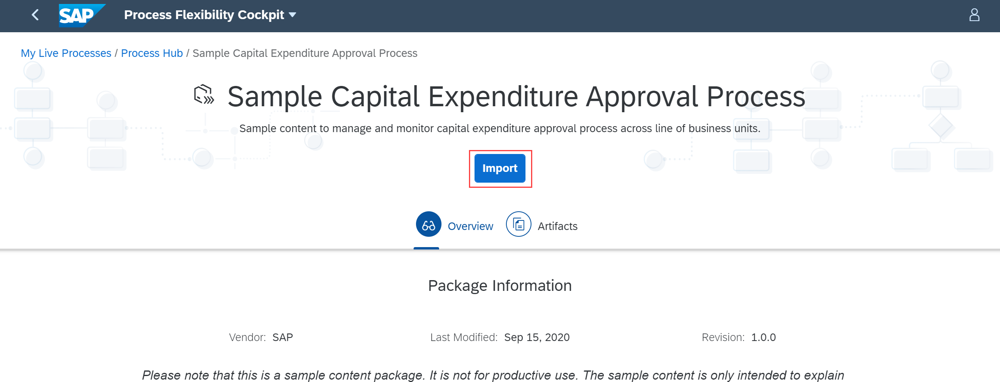
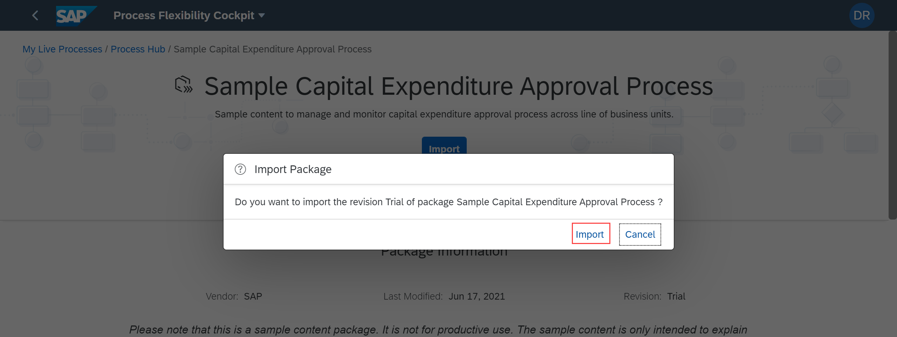

## Prerequisites
- [Set Up Workflow Management in Cloud Cockpit](cp-starter-ibpm-employeeonboarding-1-setup).

## Details
### You will learn
  - What is a capital expenditure process
  - How to discover capital expenditure live process package and import it

SAP Workflow Management allows you to digitize workflows, manage decisions, gain end-to-end process visibility, and configure processes in a low-code approach.

The capital expenditure (CAPEX) process automates CAPEX request approvals in a transparent way and provides end-to-end visibility across all the steps. A workflow is triggered when the capital expenditure request is submitted by the user. This workflow internally calls business rules to determine number of approval steps based on the amount of investment and other related attributes of the request.

In this tutorial, you can import a sample package with different artifacts using the Process Flexibility Cockpit. For more information, see [Discover and Import Packages](https://help.sap.com/viewer/6f55baaf330443bd8132d071581bbae6/Cloud/en-US/bf54c54a7522465788728e6a33c88a8b.html).

---

[ACCORDION-BEGIN [Step 1: ](Configure destination)]

`WM_CF_SPACE_PROVIDER` destination is used in to import live process packages from SAP API Business Hub. This destination is already created upon following the prerequisite, and now you should configure the destination with your trial password.

1. From your global account page, choose the **trial** tile to access your subaccount.

    !

2. Click **Connectivity | Destinations** from the left-hand navigation.

    !

3. Choose the edit icon for the destination with name `WM_CF_SPACE_PROVIDER`. In the **Destination Configuration** section, enter your SAP BTP trial user password and save the changes.

    !
    !
    > Ensure that the credentials of the trial user that are entered in the destination do not have **Two Factor Authentication enabled**.

[DONE]
[ACCORDION-END]
[ACCORDION-BEGIN [Step 2: ](Navigate to the workflow management home screen)]
1. Navigate to **Services | Service Marketplace**.

    !

2. Search for the **Workflow Management** tile, and choose **Go To Application** to access the workflow management home screen.

    !

3. In the **Workflow Management** home screen, choose **Process Flexibility Cockpit** tile.

    !

[DONE]
[ACCORDION-END]

[ACCORDION-BEGIN [Step 3: ](Discover the capital expenditure package)]

1. Choose **Discover Packages**.

    

2.  Choose the **Sample Capital Expenditure Approval Process** tile.

    !

[DONE]
[ACCORDION-END]

[ACCORDION-BEGIN [Step 4: ](Import the capital expenditure package)]

1. Choose **Import**.

    !

2. In the confirmation dialog, choose **Import**.

    !

    > The import operation takes a few minutes for the package to import. If the package import fails for any reason, then you can check the **Import Logs** to identify the cause. Fix the cause and try to import again.

3. Navigate to the **My Live Processes** section.

    !

    > You can view the imported **Sample Capital Expenditure Approval Process** package.

    >!

[VALIDATE_1]
[ACCORDION-END]
