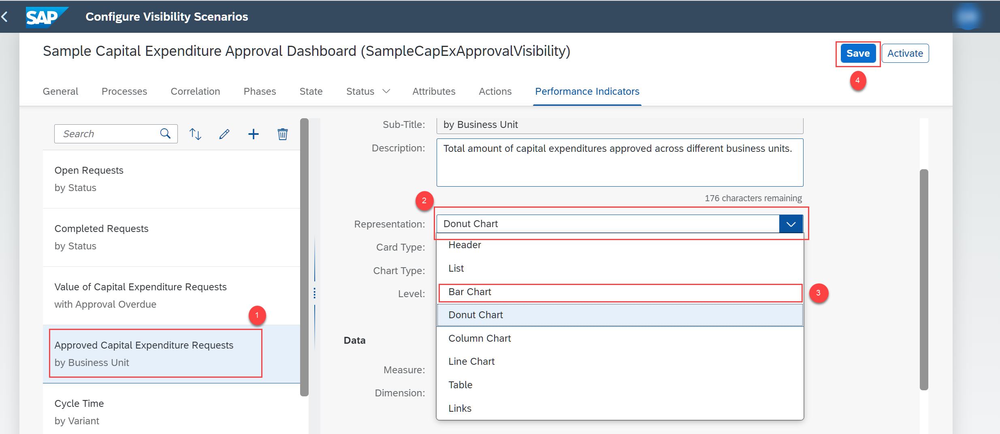
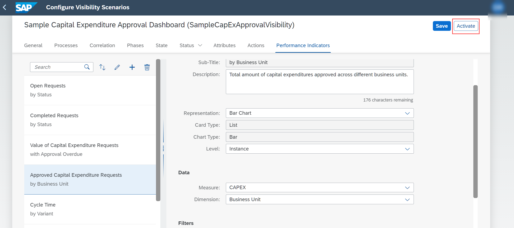

## Prerequisites
 - [Set Up Workflow Management in Cloud Cockpit](cp-starter-ibpm-employeeonboarding-1-setup).

## Details
### You will learn
  - How to view visibility scenarios for the capital expenditure process
  - How to activate a visibility scenario

Visibility scenarios allow users to track the performance of end-to-end processes. You can create, edit, delete, and activate a visibility scenario using the **Configure Visibility Scenarios** application. For more information, see [SAP Help Portal](https://help.sap.com/viewer/62fd39fa3eae4046b23dba285e84bfd4/Cloud/en-US/df284fd12073454392c5db8913f82d81.html).

In this tutorial, you explore the application, modify a performance indicator, and activate the visibility scenario.

---

[ACCORDION-BEGIN [Step 1: ](Navigate to configure visibility scenarios)]
1. Choose **Home** to navigate to the home screen.

    !

    From the home screen navigate to the **Process Flexibility Cockpit**.

    !

2. In the **Process Flexibility Cockpit**, navigate to **My Live Processes** section and choose the **Sample Capital Expenditure Approval Process** tile.

    !

3. From the **Visibility Scenarios** tile, choose **Sample Capital Expenditure Approval Dashboard**.

    !

    You are now in the **Configure Visibility Scenarios** view.

    !

[DONE]
[ACCORDION-END]

[ACCORDION-BEGIN [Step 2: ](Modify performance indicators)]
1. Choose the **Performance Indicators** tab.

    !

2. Choose **Approved Capital Expenditure Requests** and change the **Representation** to **Bar Chart**. Once done, choose **Save**.

    !

[DONE]
[ACCORDION-END]

[ACCORDION-BEGIN [Step 3: ](Activate the visibility scenario)]
Choose **Activate**.

!

The successful activation message appears. You can choose to modify different entities of Configure Visibility Scenarios such as processes, phases, state, attributes and so on. For more information, see [SAP Help Portal](https://help.sap.com/viewer/62fd39fa3eae4046b23dba285e84bfd4/Cloud/en-US/df284fd12073454392c5db8913f82d81.html).

[VALIDATE_1]
[ACCORDION-END]

---
