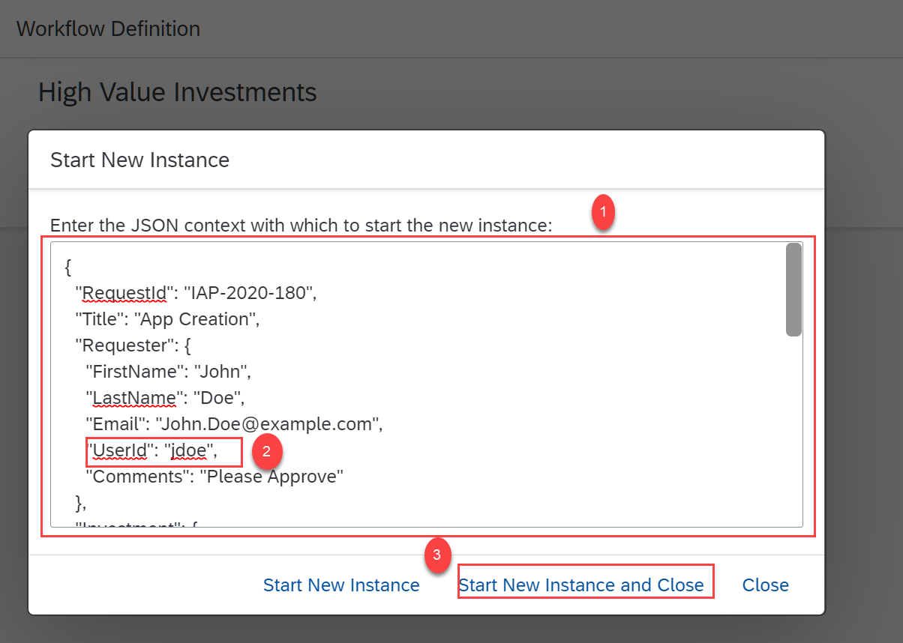
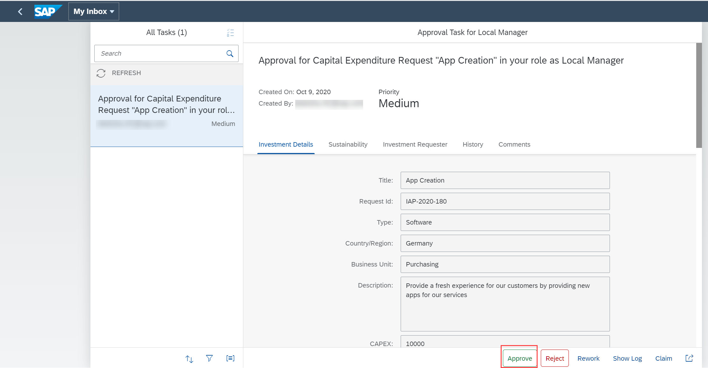

## Prerequisites
- [Set Up Workflow Management in Cloud Cockpit](cp-starter-ibpm-employeeonboarding-1-setup).

## Details
### You will learn
  - How to start a workflow instance
  - How to approve tasks in My Inbox

In this tutorial, you start a new instance of the process variant that you have created. This instance will have the total cost of the order as 50000, which requires a manual approval. Upon starting the instance, the task will be available in My Inbox for your approval.

---

[ACCORDION-BEGIN [Step 1: ](Start a workflow instance)]
1. Navigate to the Workflow Management home screen by choosing **home**.

    !


2. In the Workflow Management home screen, choose the **Monitor Workflow - Workflow Definitions** tile.

    !

3. Choose the **High Value Investments** workflow definition, then choose **Start New Instance**.

    !

4. In the **Start New Instance** popup menu, replace the existing JSON snippet with the below snippet. Then, replace the **`UserId`** field with your SAP trial email ID. Finally, choose **Start New Instance and Close**.

    ```JSON
    {
      "RequestId": "IAP-2020-180",
      "Title": "App Creation",
      "Requester": {
        "FirstName": "John",
        "LastName": "Doe",
        "Email": "John.Doe@example.com",
        "UserId": "jdoe",
        "Comments": "Please Approve"
      },
      "Investment": {
        "TotalCost": 50000,
        "Type": "Software",
        "CAPEX": 10000,
        "OPEX": 2000,
        "ROI": 5,
        "IRR": 5,
        "Country": "Germany",
        "BusinessUnit": "Purchasing",
        "Description": "Provide a fresh experience for our customers by providing new apps for our services"
      },
      "Sustainability": {
        "EnergyEfficiency": 10,
        "CO2Efficiency": 20,
        "EnergyCostSavings": 15,
        "WaterSavings": 10
      },
      "internal": {

      }
    }
    ```

      !

4. Choose **Show Instances**.

    !


You can view the workflow instance created for approval. You can navigate to the **Execution Log** to ensure that the instance is at the local manager approval stage as shown.

!

[DONE]
[ACCORDION-END]

[ACCORDION-BEGIN [Step 2: ](Approve tasks)]
  In this step, you can first approve the task created as a local manager. After the approval, the process moves to the next approval step to the CFO approval. You will again receive a task in My Inbox, where you can approve the task to complete the capital expenditure approval process.

1. Navigate to Workflow Management home screen, choose **My Inbox** tile.

    You can see that there is one task that requires your approval.

    !

2. Choose the approval task from the **All Tasks** list. You can view details of the task that requires your action such as, Investment Details, Sustainability, Investment Requester, History, and Comments.

    !

3. Choose **Approve** to approve the capital expenditure request.

    !

    >Similarly, after the local manager approval, you would have a new task in the **My Inbox** tile for your approval as a CFO.

    >!

This completes your sample capital expenditure live process approval.

[VALIDATE_1]
[ACCORDION-END]

---
