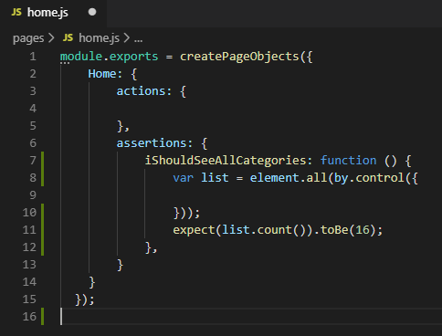
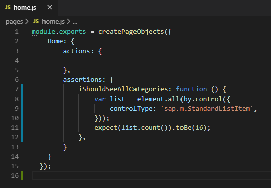
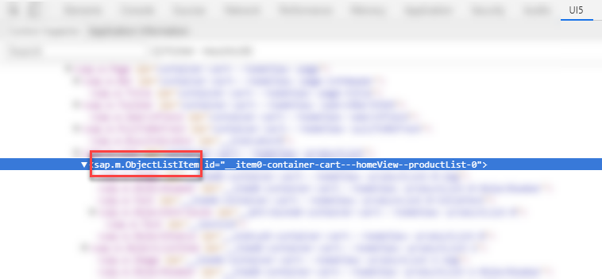
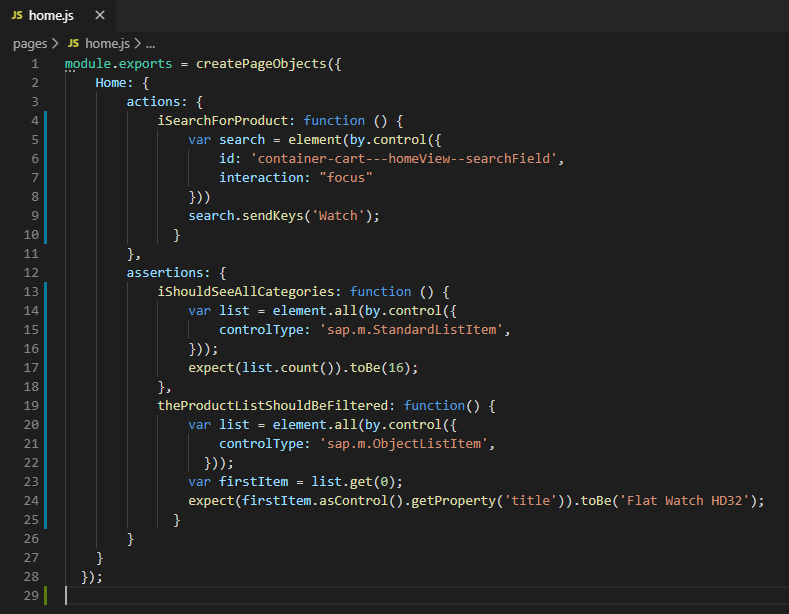
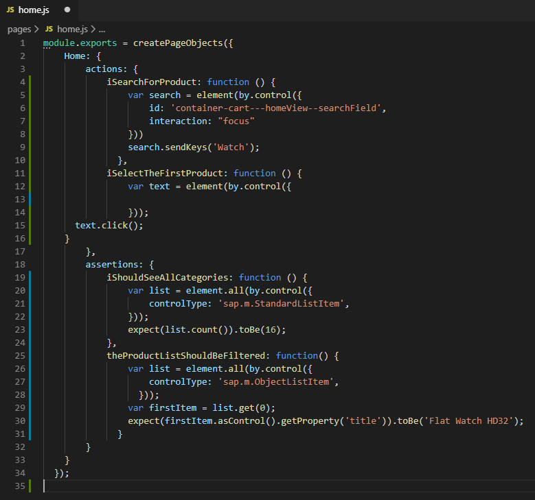
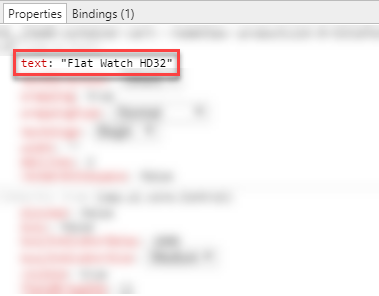
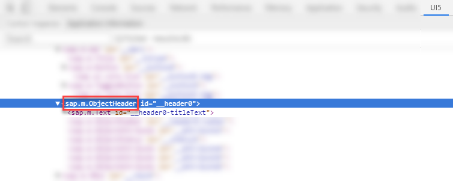
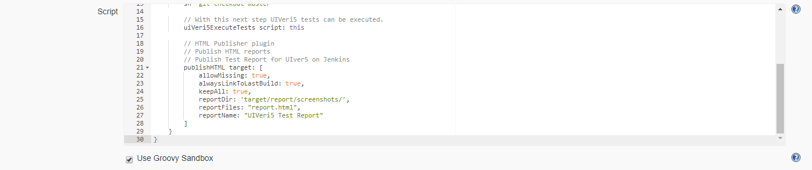

## Prerequisites
- You have installed and configured the local Git client.
- You have installed [Node JS](https://nodejs.org/en/) in version 8.0 or higher.
- You have installed [Visual Studio Code](https://code.visualstudio.com/).
- You have installed UIVeri5 using `npm install @ui5/uiveri5 -g`.
- Your Google Chrome version is up to date. See [Update Google Chrome](https://support.google.com/chrome/answer/95414?co=GENIE.Platform%3DDesktop&hl=en).
- You have added the [UI5 Inspector](https://chrome.google.com/webstore/detail/ui5-inspector/bebecogbafbighhaildooiibipcnbngo?hl=en) to your Google Chrome.
- You have a [Jenkins](https://jenkins.io/) instance that is preconfigured for using project "Piper". See [Configuration](https://sap.github.io/jenkins-library/configuration/).
- You have an account and a repository in [GitHub](https://github.com/).

## Details
### You will learn
  - How to create system tests with UIVeri5
  - How to create a CI/CD pipeline with project "Piper"
  - How to add system tests as automated steps to your CI/CD pipeline

### What Is This Tutorial About?

In this tutorial, you'll create and run automated system tests with UIVeri5 against a simple shopping app for electronic devices. Your test application has basic functions such as a product catalog sorted by categories, a search option, and an *add to cart* function.

The tutorial consists of three main stages:


1. Set up your project and manually go through your test scenario before starting to code it.

2. Create and run system tests with UIVeri5 to check the home screen of your application, its product search, and the navigation to a product.

3. Automate your system tests by integrating them into a CI/CD pipeline.

### About System Tests with UIVeri5

UIVeri5 is an SAP open-source JavaScript testing framework for SAPUI5 applications. It drives a real browser for your deployed app and simulates authentic user scenarios. System tests check both front-end and back-end and make sure that all pieces of an application work well together.

The following graphic shows the positioning of system tests with UIVeri5 compared to other testing methods and tools. The arrow shape illustrates the granularity of the methods: Compared to unit, component, or integration tests, system tests examine less details and focus on crucial workflows, instead.


>For more information about testing with UIVeri5, have a look at these blogs:

>- [UIVeri5: More Stable System Tests for UI5 Applications](https://blogs.sap.com/2019/01/28/uiveri5-more-stable-system-tests-for-ui5-applications/)
>- [UIVeri5 for E2E testing of UI5 apps](https://blogs.sap.com/2019/01/29/uiveri5-for-e2e-testing-of-ui5-apps/)

### About CI/CD with Project "Piper"

Project "Piper" is one of SAP's solutions for continuous integration and delivery. It provides pre-configured Jenkins pipelines, which you can use in your own Jenkins master infrastructure and adapt according your needs. Project "Piper" consists of two different parts:

- A [shared library](https://sap.github.io/jenkins-library/), which contains the description of steps, scenarios, and utilities that are required to use Jenkins pipelines
- A [set of Docker images](https://github.com/SAP/devops-docker-images) that can be used to implement best practice processes

> For more information about SAP solutions for CI/CD, see:

> - [Continuous Integration and Delivery by SAP](https://help.sap.com/viewer/product/CICD_OVERVIEW/Cloud/en-US?task=discover_task)
> - [SAP Solutions for Continuous Integration and Delivery](https://help.sap.com/viewer/8cacec64ed854b2a88e9a0973e0f97a2/Cloud/en-US/e9fa320181124fa9808d4446a1bf69dd.html)


---

[ACCORDION-BEGIN [Step 1: ](Set up your test project)]

In Visual Studio Code, set up your UIVeri5 test project.

1. Open Visual Studio Code.

2. Choose **View** **&rarr;** **Command Palette...** **&rarr;** **Git:Clone**.

3. As **Repository URL**, enter:

    ```
    https://github.com/SAP-samples/teched2019-uiveri5.git
    ```

4. Select a folder of your choice into which to clone the test repository by choosing **Select Repository Location**.

5. When asked if you would like to open the cloned repository, choose **Open**.

    As a result, the project `TECHED2019-UIVERI5` is loaded into the **EXPLORER** pane and you can see its resources in the outline:

    

    Like all system tests with UIVeri5, you'll define your tests through different files:

    - (a) The `conf.js` file:

        In this file, you can define, for example, the browser and reporter that are used, the base URL, and the credentials for your login dialog.

    -	(b) The `spec.js` file (in this case, it's called `teched.spec.js`):

        In this file, you'll define your test scenario, which comprises steps that are triggered one after the other. Within the test scenario, you'll refer to your page objects.

    -	(c) Page objects (in this case, you have `home.js` for the home screen and `product.js` for the detail view of a product):

        Page objects are design patterns that represent a significant part of an app, for example, a view. They group two kinds of elements:

           - Actions, for example, entering a specific text in a search field and triggering the search
           - Assertions, for example, getting a search result that matches the previously entered text

        Page objects use locators to identify specific elements on the screen. Thereby, they allow software clients to see and do anything a real user would. Page objects reside in the `pages` folder of your project.
6. Open the `conf.js` file.

    In this file, you'll define the base URL of your test application.

7. Add the following line into the `exports.config` property:

    ```
    baseUrl: "https://sapui5.hana.ondemand.com/test-resources/sap/m/demokit/cart/webapp/index.html",
    ```

    Now, your project setup is ready. Make sure that your code looks as follows and choose **File** **&rarr;** **Save**.

    

    > If you want to set up a project for an application that is protected by credentials, you need to add authentication configurations. See [Authentication](https://github.com/SAP/ui5-uiveri5/blob/master/docs/config/authentication.md).

8. To check if the test execution works, make sure that you're in the root folder of your project, choose **Terminal** **&rarr;** **New Terminal**, and enter the following command:

    ```
    uiveri5
    ```

    As a result, the browser briefly opens to execute the tests. However, as you haven't defined any tests, yet, the application doesn't load.

9. In the terminal response, check if the test execution has been successful:

    

[DONE]
[ACCORDION-END]

[ACCORDION-BEGIN [Step 2: ](Walk through the test scenario)]

Manually, familiarize yourself with your test scenario before starting to code it. Later, you'll automate the following steps so that they are automatically executed during your system tests.

1. In Google Chrome, use the following URL to access the home screen of your shopping application:

    ```
    https://sapui5.hana.ondemand.com/test-resources/sap/m/demokit/cart/webapp/index.html
    ```

2.    Check how many product categories are shown in the **Product Catalog**:

      !

3. In the **Product Catalog**, search for **`Watch`** and check if the displayed results match your request:

    !

4. Choose **Flat Watch HD32** and check if the product appears in the detailed view:

    !

5. Check if at the bottom right of the detailed view, there is an **Add to Cart** button:

    !

[DONE]
[ACCORDION-END]


[ACCORDION-BEGIN [Step 3: ](Test the home screen)]

Implement a test that checks if in the product catalog on the home screen of your application, all categories are shown. To verify this, the expected number of product categories are compared with the displayed ones.

1. From the **EXPLORER** pane in Visual Studio Code, open `teched.spec.js`.

    In this file, you'll define the steps of your test scenario and within them, refer to your page objects.

2. Implement the `it` function by adding the skeleton of the home screen test:

    ```
    it("Should validate the home screen", function () {

    });
    ```

    Your code should now look as follows:

    

3. To specify what you want to check, add the following line to the test skeleton:

    ```
    Then.onTheHomePage.iShouldSeeAllCategories();
    ```

    `iShouldSeeAllCategories` is a reference to the test function that you'll define in the following.

    Now, your first test scenario is complete. Make sure that it looks as follows and choose **File** **&rarr;** **Save**.

    

4. From the **EXPLORER** pane, open `pages` **&rarr;** `home.js`.

    This file represents the page object for your home screen. In page objects, you can define actions that are performed during a test and make assertions. In this specific case, however, you won't implement an action that is executed during the test but only check the home screen. Therefore, leave the `actions` section empty and only make assertions:

    


5. Into the assertions section, add the following lines:

    ```
    iShouldSeeAllCategories: function () {
        var list = element.all(by.control({

        }));
        expect(list.count()).toBe(16);
    },
    ```

    In this code snippet, you make the assertion that in the **Product Catalog** on the home screen of your test application, 16 different categories are shown.

    The result should look as follows:

    


    Now, the UI5 Inspector helps you find a suitable control locator in your application. With the control locator, you can identify the relevant elements on the screen (in this case, the list items in the category list) to compare them with your expectation (in this case, the expected number of 16 elements).

6. In your test application in Google Chrome, press **`F12`** and switch to the **UI5** tab:

    !

7. In the **Categories** pane of your test application, right-click **Accessories** and choose **Inspect UI5 control**.

    Now, you can see that **Accessories** is one of several `sap.m.StandardListItems` in the `categoryList`:

    !

    Therefore, you can assume that all categories in the **Product Catalog** are `sap.m.StandardListItems`, as well.

8. In your `home.js` in Visual Studio Code, add the following line to use `sap.m.StandardListItems` as a control locator:

    ```
    controlType: 'sap.m.StandardListItem',
    ```

    Now, the page object for your home screen is ready. Make sure that your code looks as follows and choose **File** **&rarr;** **Save**.

    

9. To run the test, execute the following command in the terminal:

    ```
    uiveri5
    ```

    As a result, the browser opens and the home screen is loaded.

10. In the terminal response, check if the test has been passed successfully:

    

[DONE]
[ACCORDION-END]

[ACCORDION-BEGIN [Step 4: ](Test the product search)]

Implement a test that checks if when you search for a product, the search results are displayed accordingly. To verify this, the entered search term is compared with the search result.

1. From the **EXPLORER** pane in Visual Studio Code, open `teched.spec.js`.

2. Into the `describe` function, add the skeleton of the product search test:

    ```
    it("Should search for a product", function () {

    });
    ```

    Your code should now look as follows:

    

3. Within the test skeleton, add the following interaction, which will be defined later:

    ```
    When.onTheHomePage.iSearchForProduct();
    ```

4. Then, add the expected behavior, namely that the product list is filtered:

    ```
    Then.onTheHomePage.theProductListShouldBeFiltered();
    ```

    Now, your test is complete. Make sure that it looks as follows and choose **File** **&rarr;** **Save**.

    

5. From the **EXPLORER** pane, open `pages` **&rarr;** `home.js`.

6. In the `actions` section, define that during your test, the software client should search for **`Watch`**:

    ```
    iSearchForProduct: function () {
      var search = element(by.control({

      }))
      search.sendKeys('Watch');
    }
    ```
    Your code should now look as follows:

    

    Again, use the UI5 Inspector to find a suitable control locator in your test application.

7.  In the Shopping Cart application in Google Chrome, right-click the search field and choose **Inspect UI5 Control**. Now, you can identify the ID of this control:

    !

    >Unlike generated IDs, this one doesn't start with `__`. This means that it is stable and you can therefore directly use it.

8. Add the ID from the UI5 Inspector as a control locator to your `home.js`:

    ```
    id: 'container-cart---homeView--searchField',
    ```

    Because `sap.m.SearchField` has more than one DOM element that accepts interaction, you have to specify the one that is needed for this test: the text input.

9. The text input is the focused element. To target it, add the following code snippet in the next line of your `home.js`.

    ```
    interaction: "focus"
    ```

    Now, your page object should look as follows:

    

    Next, make an assertion about the title of the product that is displayed first in the filtered catalog.

10. To check if the search result matches the entered search term, add the following assertion after your first one.

    ```
    theProductListShouldBeFiltered: function() {
      var list = element.all(by.control({

        }));
      var firstItem = list.get(0);
      expect(firstItem.asControl().getProperty('title')).toBe('Flat Watch HD32');
    }
    ```

     Again, the UI5 Inspector helps you find a suitable control locator.

11. In the Shopping Cart application in Google Chrome, search for **`Watch`**.

12. Right-click the first search result and choose **Inspect UI5 Control**. Now, you can identify the control:

    !

13. Add it to your `home.js`:

    ```
    controlType: 'sap.m.ObjectListItem',
    ```

    Now, the page object for your home screen is ready. Make sure that your code looks as follows and choose **File** **&rarr;** **Save**.

    

14. To run the test, execute the following command in the terminal:

    ```
    uiveri5
    ```

    As a result, the browser opens and you can watch the automated test software execute the actions you have defined.

15. In the terminal response, check if the test has been passed successfully:

    

[DONE]
[ACCORDION-END]

[ACCORDION-BEGIN [Step 5: ](Test the navigation to a product)]

Check if the following two statements are true:

-	When you select a product from the filtered catalog, it is shown in the detailed view. To verify this, compare the selected product title with the title in the detailed view.
-	In the detailed view, there is an **Add to cart** button.

1. From the **EXPLORER** pane in Visual Studio Code, open `teched.spec.js`.

2. Into the `describe` function, add the skeleton of the product search test:

    ```
    it("Should navigate to the product", function () {

      });
    ```

    Your code should now look as follows:

    

3. Within the test skeleton, add the following interaction with reference to your `home.js`:

    ```
    When.onTheHomePage.iSelectTheFirstProduct();
    ```

4. Then, add the first behavior you expect, namely that the product title appears in the detail view:

    ```
    Then.onTheProductPage.theProductTitleIsShown();
    ```

5. Next, add your second expectation, which is that the **Add to cart** button appears:

    ```
    Then.onTheProductPage.theProductCouldBeOrdered();
    ```

    Now, your test is complete. Make sure that it looks as follows and choose **File** **&rarr;** **Save**.

    

6. From the **EXPLORER** pane, open `pages` **&rarr;** `home.js`.

7. Add a comma after the close bracket of the first action.

8. Add the following action to define the click on the first product:

    ```
    iSelectTheFirstProduct: function () {
      var text = element(by.control({

        }));
        text.click();
      }
    ```

    Your code should now look as follows:

    

    Again, use the UI5 Inspector to find a suitable control locator.

9.  In your Shopping Cart application in Google Chrome, right-click the text of the first search result and choose **Inspect UI5 Control**. Now, you can identify the ID of this control:

    !

10. From the **Properties** pane, you get the corresponding properties locator:

    !

11. Now, add both control type and properties matcher to the code block you have just inserted in your `home.js`:

    ```
    controlType: 'sap.m.Text',
    properties: {
      text: 'Flat Watch HD32'
    }
    ```

    Now, the page object for your home screen is ready. Make sure that it looks as follows and choose **File** **&rarr;** **Save**.

    

12. From the **EXPLORER** pane, open `pages` **&rarr;** `product.js`.

    This file represents the page object for the detail view of your selected product.

13. Add the following assertion to validate the title of the first element:

    ```
    theProductTitleIsShown: function () {
      var header = element(by.control({

        }));
        expect(header.asControl(). getProperty('title')).toBe('Flat Watch HD32');
    },
    ```

    Again, use the UI5 Inspector to find an appropriate control locator.

14. In the Shopping Cart application in Google Chrome, right-click the heading of the detail view and choose **Inspect UI5 Control**.

15. Select the parent control, **sap.m.ObjectHeader**:

    !

16. In the **Bindings** view, you can find the binding path to the header:

    !

17. Add both control type and binding path to your `product.js`:

    ```
    controlType: 'sap.m.ObjectHeader',
    bindingPath: {
      path: "/Products('HT-6130')"
    }
    ```

    Now, your page object should look as follows:

    

    To verify if there is an **Add to Cart** button in the detail view of your selected product, make another assertion.

18. Add the following lines after your first assertion:

    ```
    theProductCouldBeOrdered: function() {
      var button = element(by.control({

        }));
        expect(button.isDisplayed( )).toBeTruthy();
    }
    ```

    Use the UI5 Inspector to find a suitable control locator.

19. In the Shopping Cart application in Google Chrome, right-click the **Add to Cart** button and choose **Inspect UI5 Control**. Now, you can identify the ID of this control:

    !

    >This ID starts with `__`. This means that it is generated and therefore unstable. Therefore, you have to find another (stable) locator.

    Have a look at the **Bindings** view. From here, you can take the stable i18n text key and its value:

    !

20. Add both control locator (the control type) and the binding path locators (the i18n text matcher) to your page object:

    ```
    controlType: 'sap.m.Button',
    I18NText: {
      propertyName: "text",
      key: "addToCartShort"
    }
    ```

    Now, your page object for the product detail view is ready. Make sure that it looks as follows and choose **File** **&rarr;** **Save**.

    

21. To run the test, execute the following command in the terminal:

    ```
    uiveri5
    ```

22. In the terminal response, check if the test has been passed successfully:

    


[VALIDATE_6]
[ACCORDION-END]

[ACCORDION-BEGIN [Step 6: ](Integrate your system tests into a CI/CD pipeline)]

Automate your system tests by integrating them into a CI/CD pipeline.

1. Execute a Git commit and push the content of your local `TECHED2019-UIVERI5` project into your GitHub repository.

2. In Google Chrome, open and sign in to your Jenkins instance.

3. To create a new Jenkins pipeline, choose **New Item**.

4. As item name, enter `UI-Testing` (or any other name you like), select **Pipeline**, and choose **OK**.

5. Switch to the **Pipeline** tab.

    For your CI/CD pipeline, you'll use the library of project "Piper". It contains all steps you need to automate the tests you have implemented.

6. In the **Script** area, add the skeleton of your pipeline with reference to the project "Piper" library:

    ```
    #!/usr/bin/env groovy
    @Library(['piper-lib-os']) _

    //Setup the skeleton for Jenkins based Runs
    node {
        stage('System Tests') {

        }
    }
    ```

    Make sure that your script looks as follows and choose **Save**:

    !

7. To run your newly created pipeline, choose **Build Now**.

    As a result, your build is scheduled.

8. In the **Build History**, choose **#1** to check the results of your first pipeline run.

9. To check the log for failures due to syntax issues, choose **Console Output**. Make sure that the (empty) pipeline has run successfully:

    !

    Next, implement a pipeline stage for your system tests with UIVeri5.

10. From the sidebar, choose **Back to Project**.

11. Choose **Configure** and switch to the **Pipeline** tab.

12. Add the following content to your `System Tests` stage:

    ```
    deleteDir()

    // Clone code from the system test repository
    git '<YOUR GITHUB REPOSITORY>'

    // checkout the master branch
    sh 'git checkout master'

    // With this next step UIVeri5 tests can be executed.
    uiVeri5ExecuteTests script: this

    // HTML Publisher plugin
    // Publish HTML reports
    // Publish Test Report for UIveri5 on Jenkins  
    publishHTML target: [
        allowMissing: true,
        alwaysLinkToLastBuild: true,
        keepAll: true,
        reportDir: 'target/report/screenshots/',
        reportFiles: "report.html",
        reportName: "UIVeri5 Test Report"
    ]
    ```

13.  In the script, exchange `<YOUR GITHUB REPOSITORY>` with the URL of the GitHub repository into which you have pushed your local `TECHED2019-UIVERI5` project.

    Make sure that your script looks as follows and choose **Save**:

    

    

14. To run your pipeline, choose **Build Now**.

    As a result, your build is scheduled.

    >The pipeline run might take a few minutes.

15. Choose **#2** to view the results of your second pipeline run. Make sure that it has run successfully:

    !

16. From the sidebar, choose **UIVeri5 Test Report**.

    Here, you get an overview of all test results together with screenshots from their execution:

    !

[DONE]

**Congratulations!**

 You have successfully created different system tests with UIVeri5 and integrated them into a continuous integration and delivery pipeline.

[ACCORDION-END]
---
