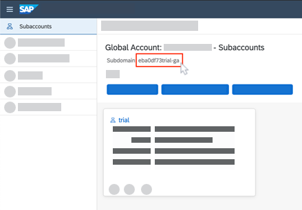
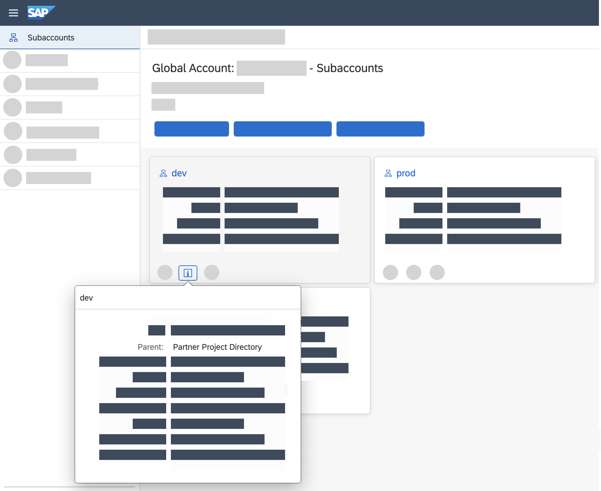
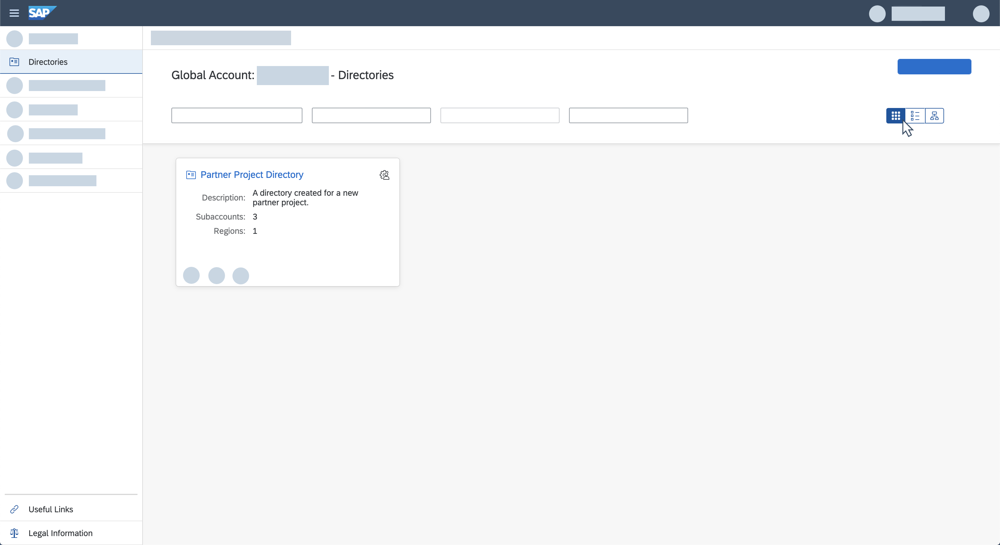
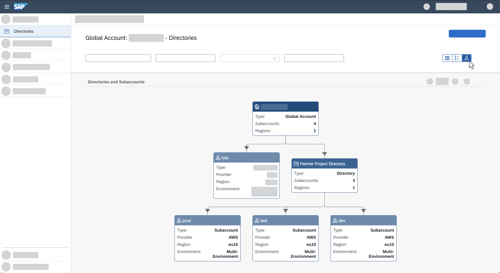
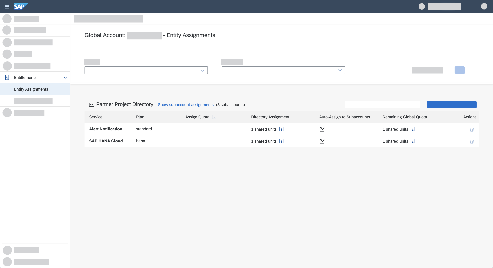
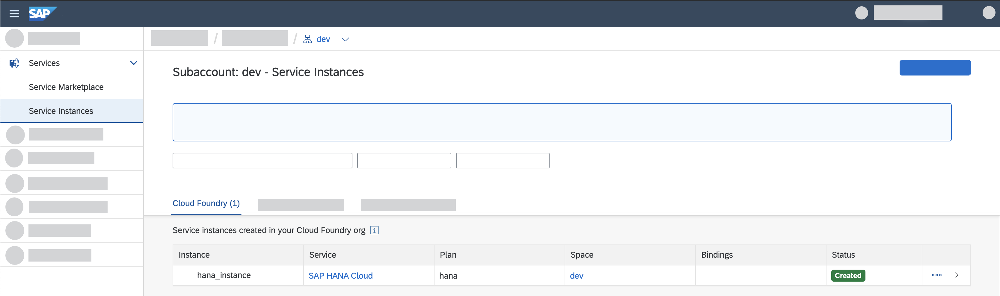

With the introduction of cloud management tools feature set B to SAP BTP, the stars of the show are without a doubt the new REST APIs and command line. With these features, you now have many more options to automate your account administrative flows in SAP BTP.

The REST APIs are offered for each administrative operation available in the SAP BTP cockpit. The API Reference is integrated into the SAP API Business Hub so users can quickly learn how to leverage it for your own use cases. For example, for automating manual operations that until now could only be done via the cockpit.  

If you prefer to use a terminal with CLI commands, the SAP BTP command line interface (btp CLI) also offers the operations available in the cockpit, with an integrated help so that you can quickly identify and execute commands to operate  your global account in SAP BTP and your resources manually or automatically via scripts.

>This tutorial is designed for a UNIX-like environment, such as macOS or Linux.

### About this tutorial

In this tutorial, you are a DevOps engineer for Atomic, which develops innovative solutions for its customers on top of SAP BTP. Atomic also uses partner companies for developing solutions. 

Every time a new development project begins, Atomic's DevOps department needs to set up a development environment on SAP BTP.

According to Atomic's guidelines and standards, each such development environment must include in their account model a directory, which contains three subaccounts for each of the relevant stages, namely, Dev, Test, and Prod. In addition, each subaccount must have an entitlement for two services:  

-	SAP Alert Notification service for SAP BTP

-	SAP HANA Cloud


Setting up such an environment for each new project can be very tedious and time-consuming. Luckily, the btp CLI can be used to automate these operations -- a new environment can be set up very quickly with the single click of a button. 

In this tutorial, you act as a member of Atomic's DevOps department. Your department has decided to use the btp CLI to automate these operations, including the creation of a Cloud Foundry space and an instance of the SAP HANA Cloud service in the space.

For this example, you can download an automation script that we've prepared in advance and execute it to set up the new environment. 

The script will do the following: 

1.  Log in to your global account on  SAP BTP. 

2.  Create a new directory in your account model. 

3.  Assign two service entitlement plans (for the SAP HANA Cloud and the SAP Alert Notification services) to the directory.

4.  Create three subaccounts in the directory. 

5.  Enable the Cloud Foundry environment and creates an org for each subaccount.

6.  Log in to Cloud Foundry.

7.  Create a space in the Cloud Foundry org of one of the subaccounts.

8.  Create an instance of the SAP HANA Cloud (`hana`) service in the space.

Through this tutorial, we hope we can help you to unleash the power of CLI script-based automation for your account admin processes on SAP BTP.

## Prerequisites
-	You have a trial account on SAP BTP. For a trial account, see [Get a Free Account on SAP BTP Trail](hcp-create-trial-account).
-	You have the Cloud Foundry CLI, as described in [Installing the cf CLI](https://docs.cloudfoundry.org/cf-cli/install-go-cli.html).
- You have a UNIX-like environment.


---

[ACCORDION-BEGIN [Step 1: ](Download and install the client)]
To get started with the SAP BTP command line interface (btp CLI), please follow [this tutorial](cp-sapcp-getstarted).

[DONE]
[ACCORDION-END]

[ACCORDION-BEGIN [Step 2: ](Download the script file)]
Download the automation script file from GitHub: <https://github.com/SAP-samples/cp-cli-automate-operations>

[DONE]
[ACCORDION-END]


[ACCORDION-BEGIN [Step 3: ](Change the declarations)]
In this step, you need to open the script file in your favorite text editor and enter the values in each placeholder according to your trial account and the names and custom properties of the directories and subaccounts that you want to create.

These lines declare global variables that will be used in the script. 

```Bash
declare region="<enter your trial region, e.g., eu10, us10, ap21>"
declare global_account_subdomain="<enter your trial global account subdomain, see below where it is located>"
declare directory_name="<enter a name for the directory of the new project, e.g., Project X>"
declare directory_description="<enter a description for the directory of the new project, e.g., Directory for project X of partner Y>"
declare contact_person="<enter the email address of your partner company´s contact person>"
declare department="<enter the department relevant for your new project, e.g., HR>"
declare subaccounts="dev test prod"
declare space="<enter a name for the space. e.g., dev>"
declare delay=15
```

The delay of 15 seconds will allow asynchronous processes to finish.

>**TIP:** Your **global account subdomain** can be derived from the cockpit: 

>


[DONE]

[ACCORDION-END]

[ACCORDION-BEGIN [Step 4: ](Understand the script)]
Let's take a closer look at the script we've provided to understand it better.

This tells the script to stop executing in case of errors:

```Bash
set -o errexit
```

This function prints the input text it gets to the screen and colors it in yellow:

```Bash
log() {
  echo -e "\e[93m$*\e[0m"
}
```

This function performs the login to your global account on SAP BTP:

```Bash
login_btp() {

  local user=$1
  local pass=$2
  local region=$3
  local subdomain=$4

  log Authenticating with SAP BTP
  btp login \
    --url "https://cpcli.cf.${region}.hana.ondemand.com" \
    --subdomain "$subdomain" \
    --user "$user" \
    --password "$pass"

}

```
>If two-factor authentication (2FA) is activated on the SAP BTP landscape, then you need to append the passcode generated by the SAP Authenticator to your password.

>For example, if your password is `Abcd` and the authenticator-generated passcode is `1234`, enter the password as `Abcd1234`.

>Two-factor authentication is only relevant for Password grant type authorization.


The following function creates a new directory in your trial global account, with the name and description that you provided in Step 3.

In addition, it sets the directory features, admin, and custom properties. 
There are two custom properties here: 

-	**Contact Person:** Name of a contact person from the partner's company
-	**Department:** The department relevant for the project

```Bash
create_directory() {

  local subdomain=$1
  local name=$2
  local desc=$3
  local admin=$4
  local features=DEFAULT,ENTITLEMENTS,AUTHORIZATIONS
  local result

  result=$(
    btp create accounts/directory \
      --global-account "$subdomain" \
      --features "$features" \
      --display-name "$name" \
      --description "$desc" \
      --directory-admins "[\"$admin\"]" \
      --custom-properties "$(printf '[{"key": "Contact Person", "value": "%s"}, {"key": "Department", "value": "%s"}]' "$contact_person" "$department")"
  )

  # Return directory ID
  awk '/^directory id:/ { print $NF }' <<< "$result"

}
```

The following function assigns the service and plan it receives as input, as an entitlement to a directory.

In the `main` function of the script, we'll use the following function to assign two service entitlements to your directory:  

-	SAP Alert Notification service (`standard`)
-	SAP HANA Cloud (`hana`)

Since `distribute` and `auto-assign` are specified, every subaccount that is created in or moved to the directory will automatically be assigned these entitlements as well (as long as the directory has remaining quota for these services). 

```Bash
assign_distributed_entitlement() {

  local directory=$1
  local service=$2
  local plan=$3

  log "Initiating distributed entitlement assignments for $service / $plan ..."
  btp assign accounts/entitlement \
    --to-directory "$directory" \
    --for-service "$service" \
    --plan "$plan" \
    --distribute \
    --auto-assign \
    --enable

}
```

This function generates a random ID that will be used as each subaccount's subdomain, as it needs to be unique:

```Bash
generate_id() {
  date | md5 | head -c 8
}
```

The following function creates a new subaccount in a directory:

```Bash

create_subaccount() {

  local name=$1
  local region=$2
  local email=$3
  local directory_id=$4
  local subdomain
  local result

  subdomain=$(generate_id)

  result=$(
    btp create accounts/subaccount \
      --display-name "$name" \
      --subdomain "$subdomain" \
      --region "$region" \
      --subaccount-admins "[\"$email\"]" \
      --directory "$directory_id"
  )

  # Return subaccount ID
  awk '/^subaccount id:/ { print $NF }' <<< "$result"

}
```

The following function creates a Cloud Foundry org in the subaccount it receives as input:

```Bash
create_cf_environment() {

    local subaccount=$1
    local subaccount_id=$2
    local display_name=$3

    log "Initiating CF environment creation for $subaccount ..."
    btp create accounts/environment-instance \
      --subaccount "$subaccount_id" \
      --environment cloudfoundry \
      --service cloudfoundry \
      --plan standard \
      --parameters "{\"instance_name\":\"$display_name\"}"

}
```

This function performs the login to Cloud Foundry:

```Bash
login_cf() {

  local user=$1
  local pass=$2
  local region=$3
  local org=$4

  log Authenticating with Cloud Foundry
  cf login \
    -a "https://api.cf.${region}.hana.ondemand.com" \
    -o "$org" \
    -u "$user" \
    -p "$pass"

}
```

>If two-factor authentication (2FA) is activated on the SAP BTP landscape, then you need to append the passcode generated by the SAP Authenticator to your password.

>For example, if your password is `Abcd` and the authenticator-generated passcode is `1234`, enter the password as `Abcd1234`.

>Two-factor authentication is only relevant for Password grant type authorization.


This function creates a new space, using native cf CLI:

```Bash
create_new_space() {

  local org=$1
  local space=$2

  log "Creating new space $space in org $org ..."
  cf create-space "$space" -o "$org"
  # Since the creation is asynchronous, use sleep for simplicity
  sleep "$delay"
  cf target -o "$org" -s "$space"

}
```

The main flow is executed in the `main` function:

```Bash
main() {

  # Define local variables
  local user pass directory_id subaccount subaccount_id org

  # Obtain credentials for SAP BTP / CF
  echo Please enter your SAP BTP credentials
  read -r -p 'Email: ' user
  read -r -s -p 'Password: ' pass
  echo

  # Authenticate with SAP BTP
  login_btp "$user" "$pass" "$region" "$global_account_subdomain"

  # Create new directory
  log Initiating directory creation ...
  directory_id=$(
    create_directory \
      "$global_account_subdomain" \
      "$directory_name" \
      "$directory_description" \
      "$user"
  )
  log "Directory creation initiated, ID is $directory_id"

  # Add two service entitlements that child subaccounts will get
  assign_distributed_entitlement "$directory_id" alert-notification standard
  assign_distributed_entitlement "$directory_id" hana-cloud-trial hana

  # Create the dev, test, prod subaccounts in the directory
  log Initiating creation of subaccounts ...
  for subaccount in $subaccounts; do

    subaccount_id=$(create_subaccount "$subaccount" "$region" "$user" "$directory_id")
    log "Subaccount $subaccount creation initiated, ID is $subaccount_id"

    # Wait for async subaccount creation to end
    log "Waiting for subaccount creation to complete ..."
    # Since the creation is asynchronous, use sleep for simplicity
    sleep "$delay"

    # Create a Cloud Foundry environment in the new subaccount
    create_cf_environment "$subaccount" "$subaccount_id" "${subaccount}_org"

  done

  # Pick the first subaccount/org for further processing
  org="$(echo "$subaccounts" | cut -d' ' -f 1)_org"

  # Authenticate with Cloud Foundry
  login_cf "$user" "$pass" "$region" "$org"

  # Create new space and target it
  create_new_space "$org" "$space"

  # Create SAP HANA Cloud trial service instance in targeted space
  echo Creating SAP HANA Cloud trial service ...
  cf create-service hana-cloud-trial hana hana_instance \
    -c '
      {
        "data": {
          "edition": "cloud",
          "memory": 30,
          "serviceStopped": false,
          "storage": 120,
          "systempassword": "Init2020",
          "vcpu": 0,
          "versionIndicator": "",
          "whitelistIPs": []
        }
      }'

}
```

The last step is to call the `main` function:

```Bash
main "$@"
```


[VALIDATE_3]
[ACCORDION-END]

[ACCORDION-BEGIN [Step 5: ](Run the script)]

Now, save your changes and change the file extension to `.sh`.

Open your terminal in the location in which you saved it, then execute it using the following command: `bash <filename>.sh`


[DONE]
[ACCORDION-END]

[ACCORDION-BEGIN [Step 6: ](See the results)]

Once the script has finished executing, open your SAP BTP Trial cockpit and locate the new directory, subaccounts, entitlements, org, space, and the instance of the SAP HANA Cloud service. 

Here's what you should find.

The **Subaccounts** page contains the three new subaccounts:

!

The title view in the **Directories** page shows the new directory:

!

The tree view in the **Directories** page shows your global, the new directory, and the new subaccounts under the new directory:

!

In the **Entitlements** > **Entity Assignments** page, the Alert Notification and SAP HANA Cloud services are assigned to the new directory:

!

In the **Services** > **Service Instances** page, the Cloud Foundry environment has been enabled and an instance of the SAP HANA Cloud service has been created in the Cloud Foundry org:

!

That was pretty fast, right?

[VALIDATE_4]
[ACCORDION-END]

[ACCORDION-BEGIN [Step 7: ](Test yourself – 1)]

Try two more questions:

[VALIDATE_2]
[ACCORDION-END]


[ACCORDION-BEGIN [Step 8: ](Test yourself – 2)]

[VALIDATE_5]
[ACCORDION-END]


---
