## Details
### You will learn  
* How to configure your ABAP system to expose OData services of the [Fiori Reference apps](https://blogs.sap.com/2014/11/24/fiori-reference-apps/)
* How to check if the OData services are active


### Prerequisites

1. Your ABAP system needs to meet the following requirements:
    - Its version should be based on SAP NetWeaver 7.5 or higher
    - The initial system configuration should have been done already (task **`SAP_BASIS_SETUP_INITIAL_CONFIG`** was run successfully). For more information, see [Automated Initial Setup of Systems Based on SAP NetWeaver ABAP](https://help.sap.com/doc/ec180e1ef0e8414896c13522d39f613f/1.0/en-US/Installation__Automated_Initial_SetupE.PDF)

2. You need to be a system administrator with permissions for the following:
    - Execute task list runs of the **Task Manager for Technical Configuration** (transaction **`STC01`**).
    - Create users and assign roles to them
    - Create customizing requests
    - Create system aliases using the **SAP Reference IMG**


---

[ACCORDION-BEGIN [Step 1: ](Configure SAP Gateway)]
SAP Gateway allows - amongst other capabilities - to expose SAP Business Suite functionality as REST-based OData services (see official documentation for [SAP Gateway Foundation](https://help.sap.com/viewer/68bf513362174d54b58cddec28794093/7.5.latest/en-US/7db1ea508f88bb7ee10000000a445394.html)). The SAP Fiori Reference apps are using such OData services and are implemented on the ABAP backend. To be able to expose them and to access them from SAP Cloud Platform, some basic things for SAP Gateway need to be configured on your ABAP system.

The easiest way to do this is to execute the corresponding task lists in the **Task Manager for Technical Configuration** (transaction **`STC01`**):

1. Call transaction **`STC01`**, enter task list **`SAP_GATEWAY_BASIC_CONFIG`**, and choose **Generate Task List Run** (F8).

    

2. On the next screen, choose **Start/Resume Task List Run in Dialog** (F8).

    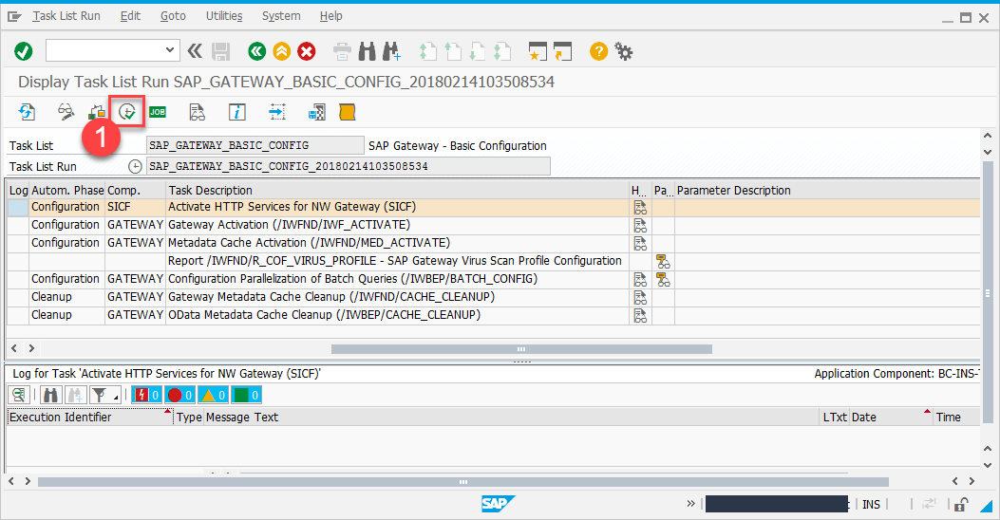

3. The result should look like this:

    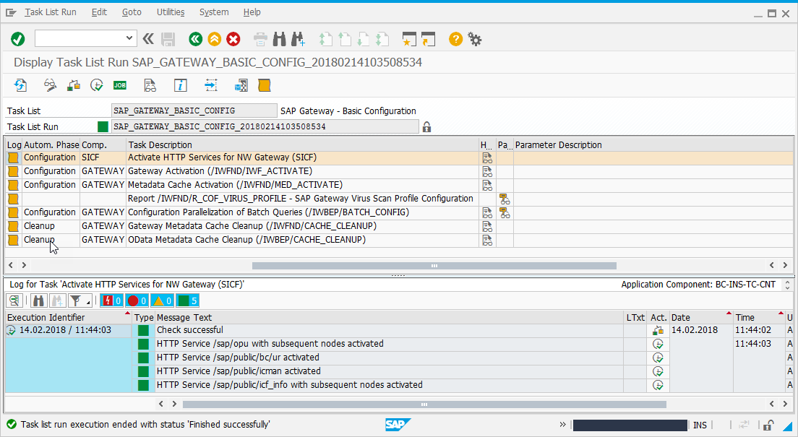

4. If you would like to find task list runs again, for example, because it did not finish successfully or you would like to run tasks of your task lists individually, choose **`Goto`** | **`Run Monitor`** on the entry screen of transaction **`STC01`**.

    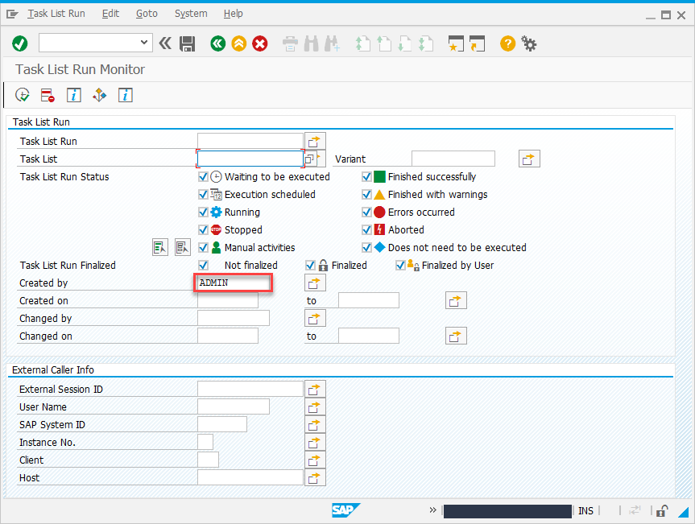

If you get stuck in any step of these task lists you can also do the configuration manually as described in [this blog](https://blogs.sap.com/2013/05/14/quick-starter-configuration-guide-sap-gateway/).

[DONE]

[ACCORDION-END]


[ACCORDION-BEGIN [Step 2: ](Set system alias for SAP Gateway)]
SAP Gateway can be run on a hub system to connect to several ABAP backend systems. To keep it simple, the SAP Gateway hub system and our ABAP backend system shall be the same. In other words, the system that is responsible for processing (managing and storing) the data of an inbound request is the local SAP Gateway instance itself. To configure if inbound requests are managed by a remote or a local system, you need to create an SAP system alias (see the [official documentation](https://help.sap.com/viewer/68bf513362174d54b58cddec28794093/7.5.latest/en-US/63f72651c294256ee10000000a445394.html)).

1. Call transaction **`SPRO`**.

2. Choose **SAP Reference IMG**.

    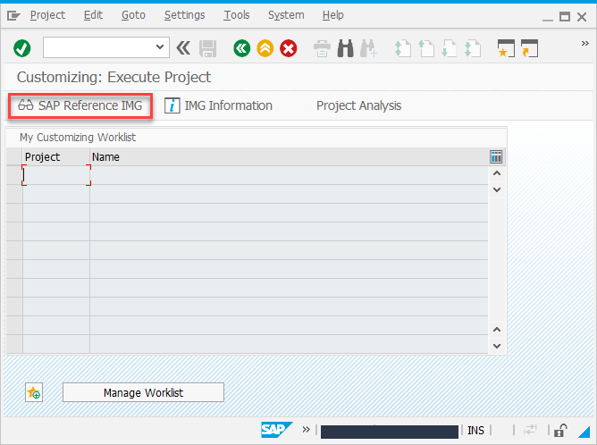

3. Navigate to **SAP NetWeaver** | **SAP Gateway** | **OData Channel** | **Configuration** | **Connection Settings** | **SAP Gateway to SAP System** | **Manage SAP System Aliases** and choose the Activity Icon.

    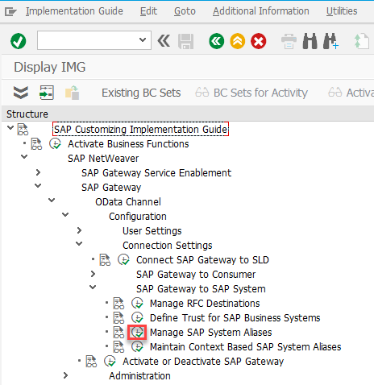

4. Choose **New Entries**.

    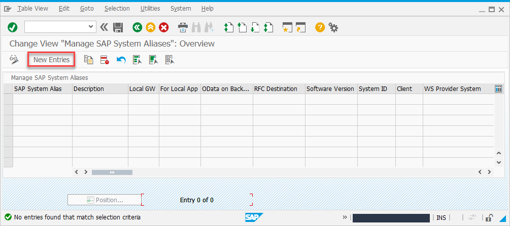

5. Enter the following details as shown in the next screenshot (provide your system data in columns System ID and Client.)

    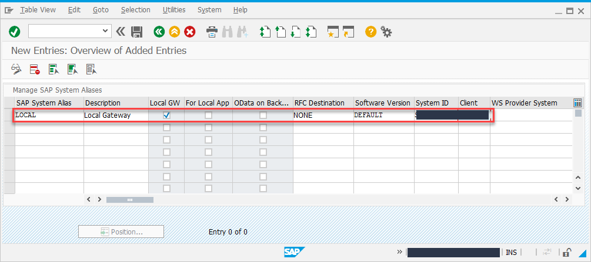

6. When you choose **Save** you need to specify a customizing request first. Choose **Create**.

    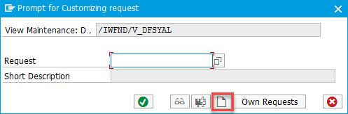

7. In the next pop-up, provide a **Short Description** and **Save**.

    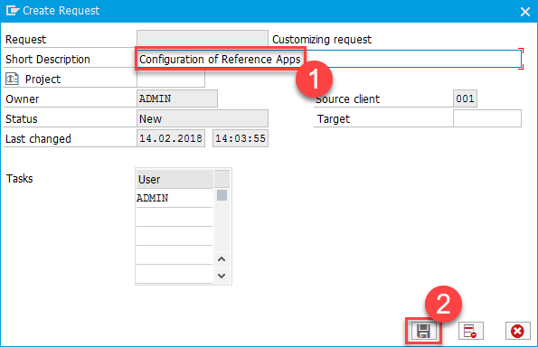

8. Confirm to use the customization request that you just created.

    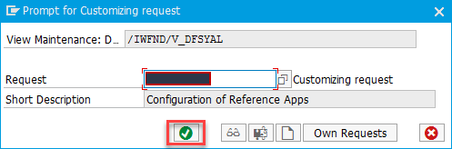

[DONE]

[ACCORDION-END]

[ACCORDION-BEGIN [Step 3: ](Create user to access the service)]

In this step we create a technical user DEMO. The purpose of this user is to restrict the access of the exposed OData services. For example, you can add user DEMO and its password to a destination of your cloud foundry subaccount to get access to the OData services from an app running on SAP Cloud Platform.

1. Call transaction SU01, enter **`DEMO`** in entry field **User**, and choose **Create** (F8).

    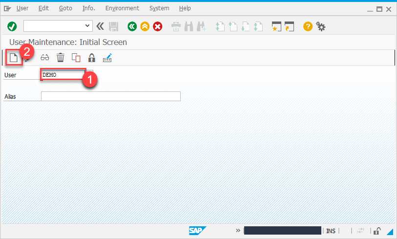

2. Enter **`DEMO`** as **Last name** on tab **Address**.

3. Change to tab **Logon Data**, choose **User Type** **`Service`**, provide a password, and press RETURN. For the following steps, we assume that you chose **`Welcome`** as a password. Note that you can also choose user type **`Dialog`** or **`Communication Data`**.

    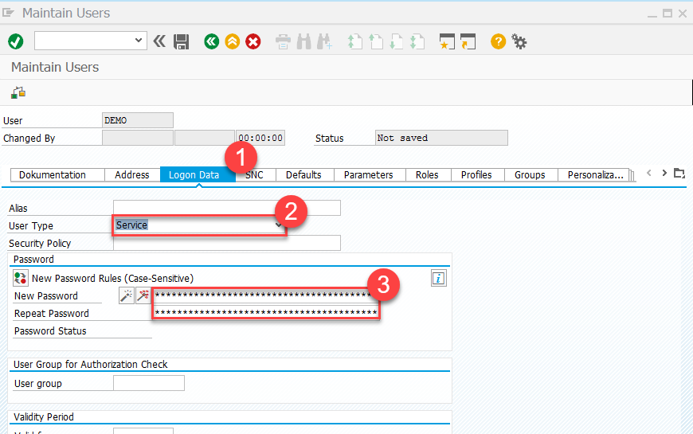

4. Change to tab **`Roles`**, call the value help in column **`Role`**, and enter **`SAP_EPM_REF_APPS_BASIC_AUTH`** in entry field **Single role**. On the next screen, select the role and choose **Copy**.

    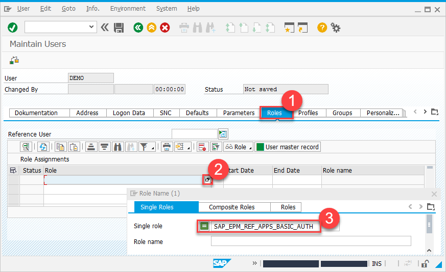

5. After saving your changes you will be back on main screen for user maintenance again. Keep **`DEMO`** in entry field **User** and choose **Display** (F7).

6. Change to tab **`Roles`** again and double click on the single role you have assigned to this user in step 3 to navigate to the role maintenance (transaction **`PFCG`**).

7. Change to tab **Authorizations** and choose **`Display Authorization Data`**.  

    

8. Let's assume that you have already initially filled the **Profile Generator customer tables** and confirm the following pop-up.

    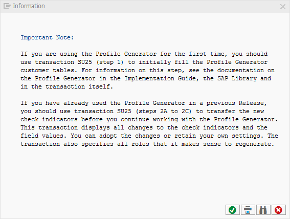

9. Generate the authorization profile and choose **Back**.

    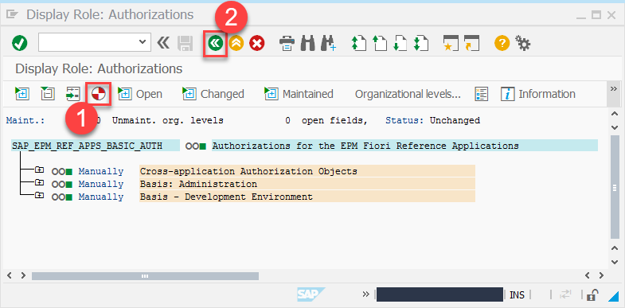

10. Change to tab **User**, select the line with **User ID** **`DEMO`** in table **User Assignments**, and choose **User comparison**.

    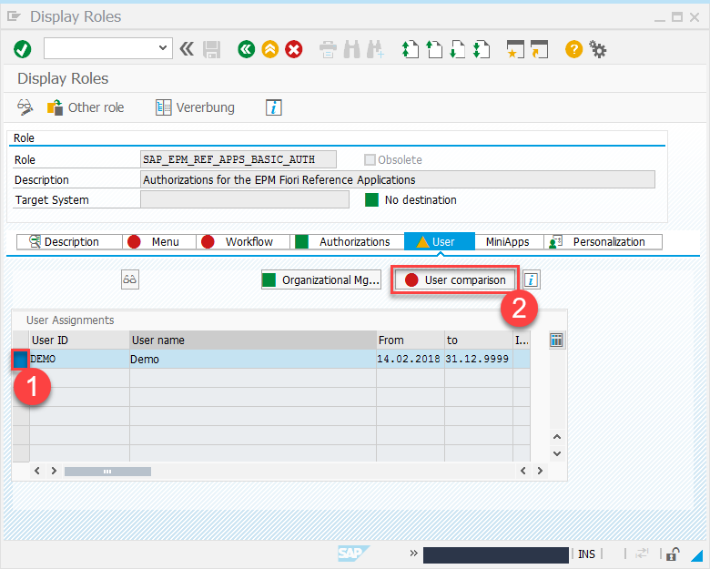

11. In the following pop-up, choose **Complete comparison**.

    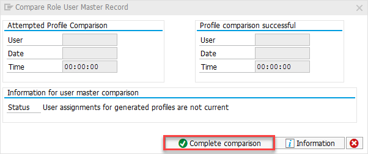

12. After this you can close the window and the status on tab **User** should be green.

    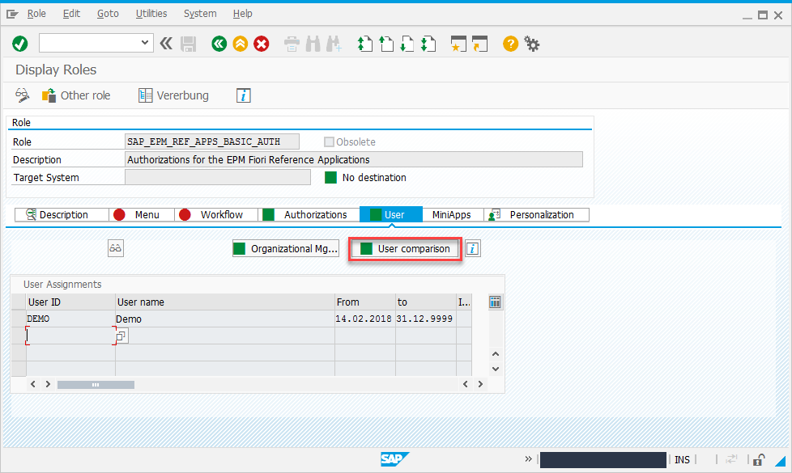

[DONE]

[ACCORDION-END]

[ACCORDION-BEGIN [Step 4: ](Configure reference apps and generate sample data)]
1. Call transaction **`STC01`**, enter task list **`SAP_FIORI_REFERENCE_APPS_SETUP`**, and choose **Generate Task List Run** (F8).

2. De-select the first task of this task list. The remaining configuration steps are sufficient for our purpose. Choose the icon in column **Parameter** for the last step.

    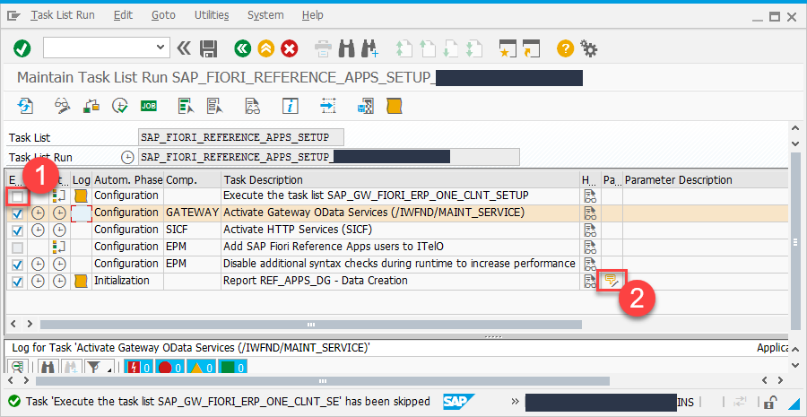

3. You need to add your user in order to generate sample data. Enter **`DEMO`** in entry field **Users to be added to `ITelO`**, save, and choose **Back**.

    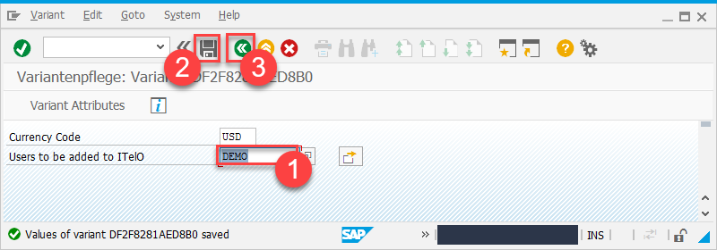
    > Note that the access to the OData service will be restricted to the users you enter here. If several users need to access the service, return to step 3 to create more users and add them here by choosing **`multiple selection`** ().

4. Choose **Start/Resume Task List Run in Dialog** (F8). Note that due to the generation of sample data, the task list run will run for a few minutes. If you need to re-generate the sample data, you just need to run the last two tasks of this task list.

    

5. After completion of the task list run, it should look like this:

    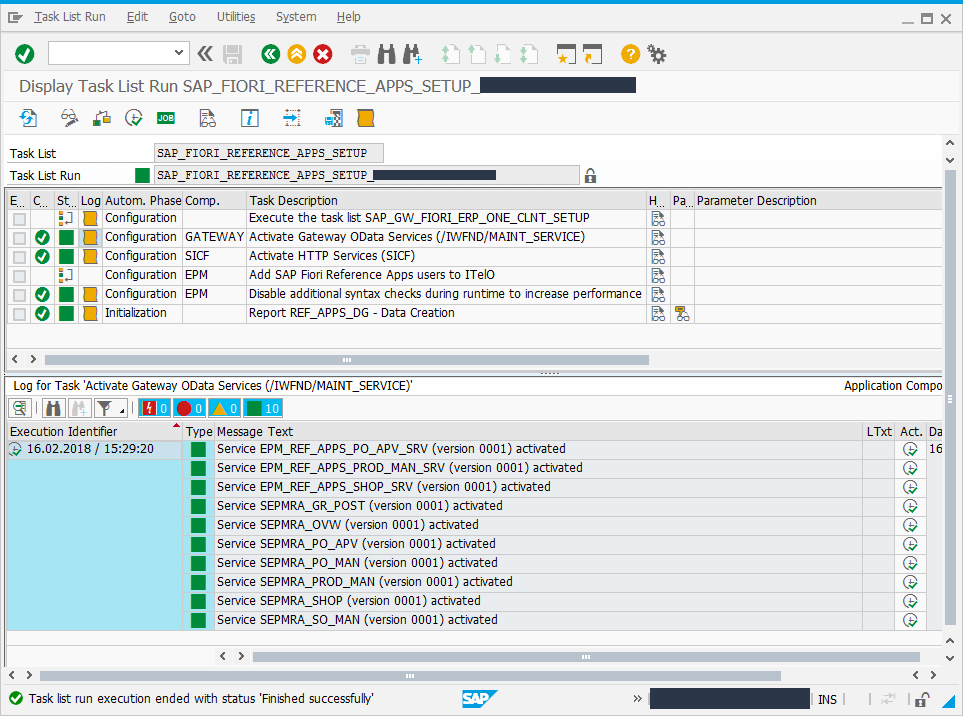

Congratulations! You are done with the configuration.

[DONE]

[ACCORDION-END]

[ACCORDION-BEGIN [Step 5: ](Check your HTTP port)]
To access the OData service you need to know the HTTP port of your system.

1. Call transaction **`SMICM`**, and choose **`Goto`** | **`Services`** (Shift + F1).

2. You should see the HTTP port of your system.

    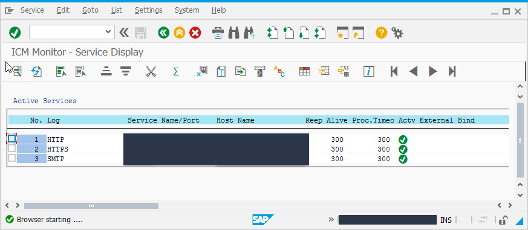

[DONE]

[ACCORDION-END]

[ACCORDION-BEGIN [Step 6: ](Test the OData service)]
After the configuration is done, SAP Gateway provides a whole set of tools to troubleshoot the activated services. The corresponding troubleshooting guide can be found as PDF attachment of SAP Note [1797736](https://launchpad.support.sap.com/#/notes/1797736).

1. For a simple check if the service was activated and can be accessed, enter **`/n/IWFND/MAINT_SERVICE`** as OK code, hit `RETURN`, select **Filter**, enter **`*ZEPM*`** in entry field **Technical Service Name** and confirm with **Enter**.

    

2. Select service **`ZEPM_REF_APPS_PROD_MAN_SRV`** from the remaining services in column **Technical Service Name** of the **Service Catalog** list, and choose **SAP Gateway Client**.

    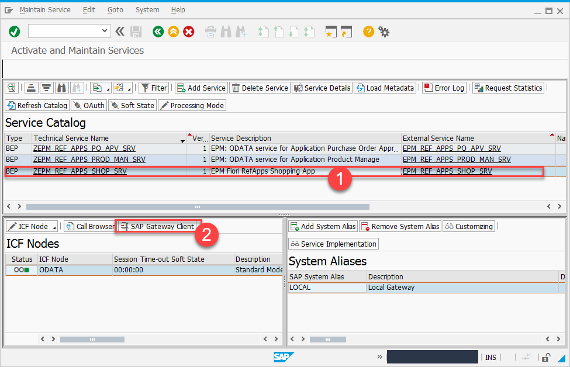

3. Choose **Execute** to check if you get any response from the service (using HTTP Method **GET**).

    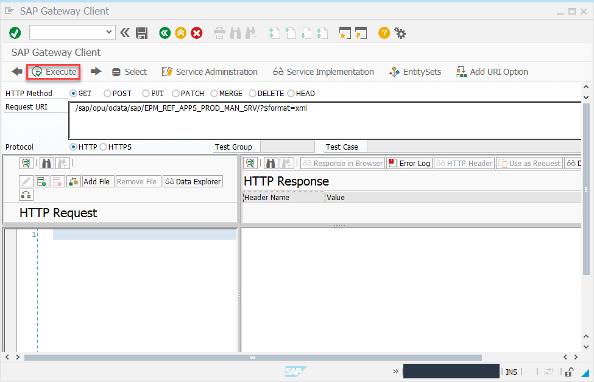

4. The result should look like the screenshot below.

    

5. To check if any sample data was successfully generated, choose **`EntitySets`**, and in the pop-up an entity set from the list, for example, **Products**.

    

6. After choosing your entity set, choose **Execute**. You should now get a bigger payload with product data displayed in your HTTP response.

7. Next, we would like to check if we can see an HTTP response in the browser and if it can be accessed using the service user we created in step 3. Choose **Back**, choose service with **`Technical Service Name`** **`ZEPM_REF_APPS_PROD_MAN_SRV`** from the **Service Catalog** and choose **Call Browser**.

    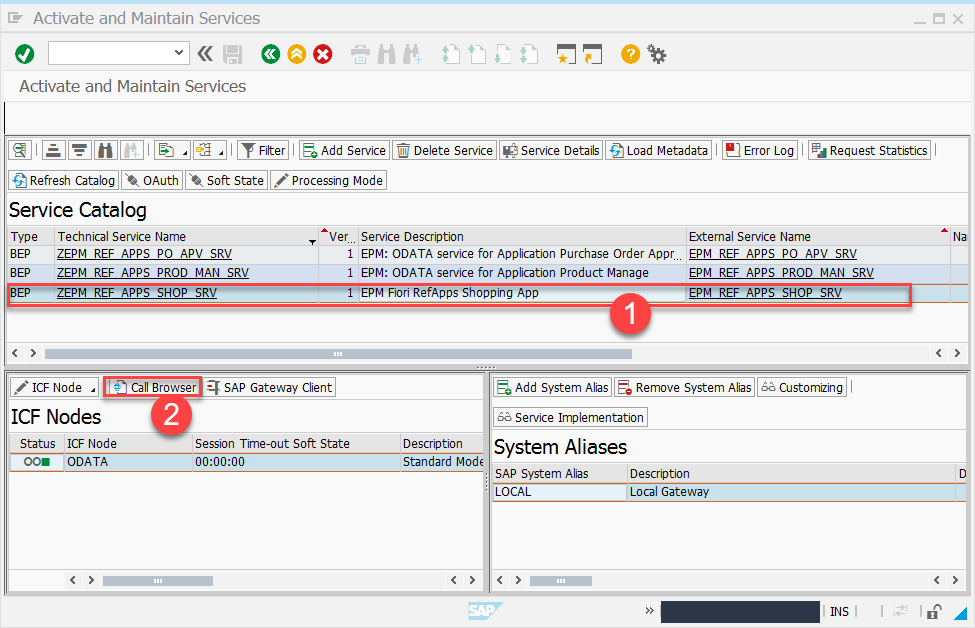

8. Enter **`DEMO`** and **`Welcome`**.

    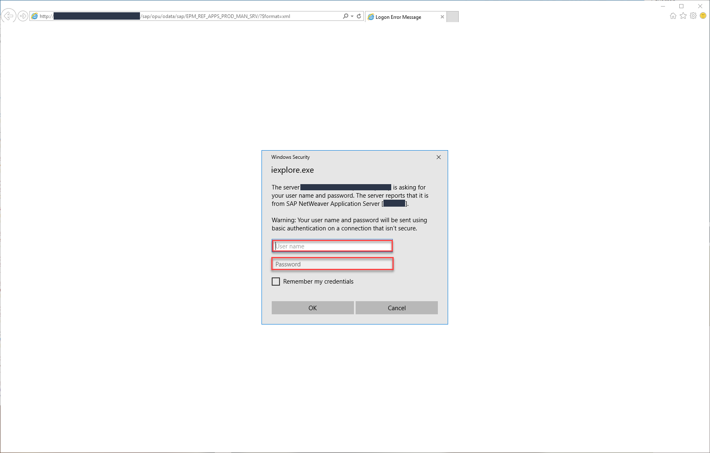

9. You should see the same HTTP response as you saw when using the **SAP Gateway Client** for testing.

    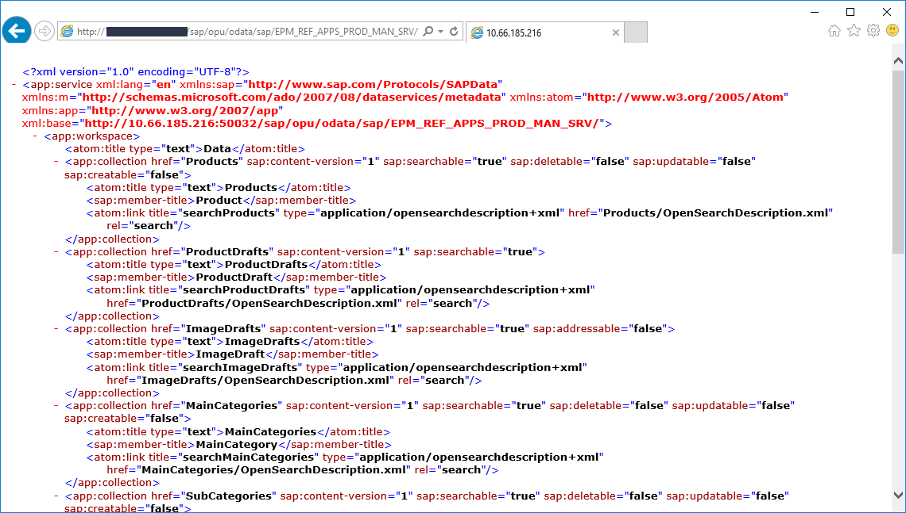

> If the connection using the browser does not work, it sometimes help to copy the IP address of your ABAP system into the link address.

10. To read an entity set, modify the link in the browser
    ```xml
    http://<your server>:<your port>/sap/opu/odata/sap/EPM_REF_APPS_PROD_MAN_SRV/Products
    ```

    >Sometimes Web browsers show the HTTP response of an OData service as RSS feed. When developing OData services you should switch this off to see the actual XML data of the response. In Internet Explorer, choose **Tools** | **Internet Options** | **Content** | **Feeds and Web Slices** | **Settings**. Then make sure that **Turn on feed reading view** is not checked in frame **Advanced**.
    

12. Last, but not least, search for product with ID **`HT-1066`** in your payload. Copy the text content of XML element **`<d:Name>`** into the frame below and click on **Validate**.

[VALIDATE_6]

[ACCORDION-END]

### Result

You now have exposed OData services of the Fiori Reference apps via HTTP using a service user. For implementation details of these services, check ABAP package **`S_EPM_REF_APPS_ODATA`**.

In the context of connectivity you could now use the Cloud Connector to set up a secure tunnel between your ABAP system and SAP Cloud Platform and consume the OData services of the reference apps in a SAP Cloud Platform app. To do anything with the data coming from your ABAP backend, you still need to develop business logic and user interfaces on SAP Cloud platform.

---
