## Prerequisites  
 - [Configure your ABAP System to Activate OData Services of Fiori Reference Apps](https://developers.sap.com/tutorials/cp-connectivity-configure-fiori-reference-apps.html)
 - [Install the Cloud Connector in your System Landscape](https://developers.sap.com/tutorials/cp-connectivity-install-cloud-connector.html)
 - [Connect your ABAP System with SAP Cloud Platform Using a Secure Tunnel](https://developers.sap.com/tutorials/cp-connectivity-create-secure-tunnel.html)

## Details
### You will learn  
  - How to configure connectivity for the Cloud Connector in Cloud Foundry
  - How to create an application router and what it is used for
  - How to troubleshoot your application router

  For the overall goal to consume an OData service of an ABAP system in an application on SAP Cloud Platform you need to configure components in the ABAP system, on your Cloud Connector, and on SAP Cloud Platform (in this tutorial we cover the configuration in Cloud Foundry). The following table shows what information you need to before you can start with this tutorial:

|Component        | Configured Entity (Value)   |  As Shown in Tutorial              |
|:----------------|:----------------------------|------------------------------------|
| ABAP system |Path of OData service (`http://<your server>:<your port>/sap/opu/odata/sap/EPM_REF_APPS_PROD_MAN_SRV/Products`)     |  [Configure your ABAP System to Activate OData Services of Fiori Reference Apps](https://developers.sap.com/tutorials/cp-connectivity-configure-fiori-reference-apps.html) |
| ABAP system |User name and password of the technical user that is allowed to access the service (`DEMO`, `<your password>`) | [Configure your ABAP System to Activate OData Services of Fiori Reference Apps](https://developers.sap.com/tutorials/cp-connectivity-configure-fiori-reference-apps.html) |
| Cloud Connector |Virtual host and port of the access control for your ABAP system (`http://abap-as-eu01:443`) | Connect your ABAP System with SAP Cloud Platform using a Secure Tunnel |

  To configure the access of the OData service applications require several services on SAP Cloud Platform (see picture below): After a user starts the application (1), the Authorization & Trust Management service (also known as XSUAA service) is used to authenticate the user for the on-premise call (2). The application then requests technical information about the virtual host of the ABAP system that needs to be accessed from the destination service (3), and finally uses the connectivity service to connect to the Cloud Connector through the secure tunnel (4-7).

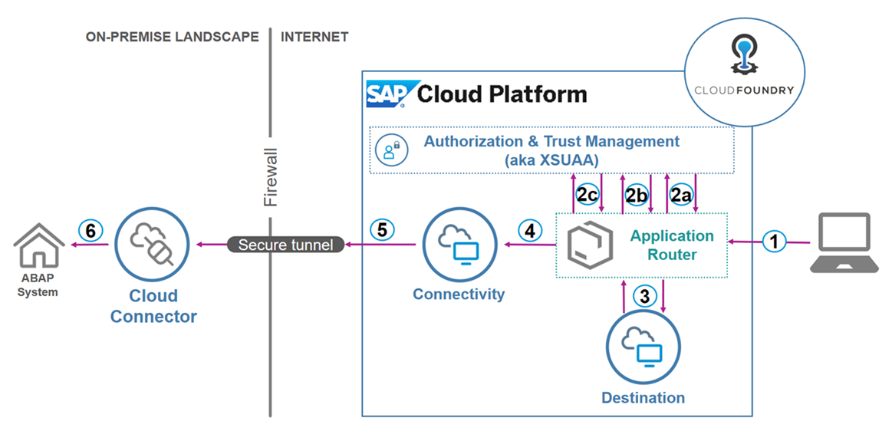

  Instead of developing such an application we demonstrate this configuration by using the application router which is the single point-of-entry for applications running in the Cloud Foundry environment at SAP Cloud Platform. It is a node.js application that is used to dispatch requests to microservices or static resources, and to authenticate users, and it's best practice that Cloud Foundry applications use it anyway.

  When a HTTP request is sent to the application router it checks if there is already JSON Web Token (JWT) available for the authentication. If so, URL paths will be routed according to the application router's configuration to start the right application. If not, the application router redirects the user to the XSUAA service instance in order to log in. After successful login, the XSUAA instance returns a JWT token which is cached by the application router to skip the login process for future calls. The following table explains the message flow in more detail:

| Step  |From          | To               | Action   |
|:------|:-------------|:-----------------|:------------|
| 1     |User          |Application Router| Redirect to XSUAA for user login|
| `2a`    |XSUAA         |Application Router| Create and send JTW1 for future authentication without login|
| `2b`    |Application Router|XSUAA   | Request JWT2 to access destination instance |
| `2c`    |Application Router|XSUAA   | Request JWT3 to access connectivity instance |
| 3     |Application Router|Destination Instance| Use JWT2 to access destination configuration|
| 4     |Application Router|Connectivity Instance|Send JWT3 and authorization header|
| 5     |Connectivity Instance|Cloud Connector|Forward request|
| 6     |Cloud Connector| ABAP System | Forward request|
> In a real scenario the application router would forward the initial request including JWT1 to an application. Replace "Application Router" by "Application" in the table above for steps `2b` to `4` to get the corresponding message flow. It is recommended that the application caches all JSON Web Tokens to improve performance.

  Since we only would like to demonstrate the access of our OData service without developing a fancy application we use the application router itself as application. So instead of binding the connectivity service and the destination service to an application we bind the application router to these services (in addition to the `xsuaa` service) to get the HTTP response from the ABAP system.
> When a service is bound to an application, the application can retrieve service resources that are required to use the service, usually through cloud foundry environment variables. For more information, see the [Cloud Foundry Documentation](https://docs.cloudfoundry.org/services/overview.html).

---

[ACCORDION-BEGIN [Step 1: ](Create a destination)]

1. Go to your SAP Cloud Platform trial account and navigate to your Cloud Foundry subaccount.

2. Choose **`Connectivity`**| **`Destinations`**| **`New Destination`**.

    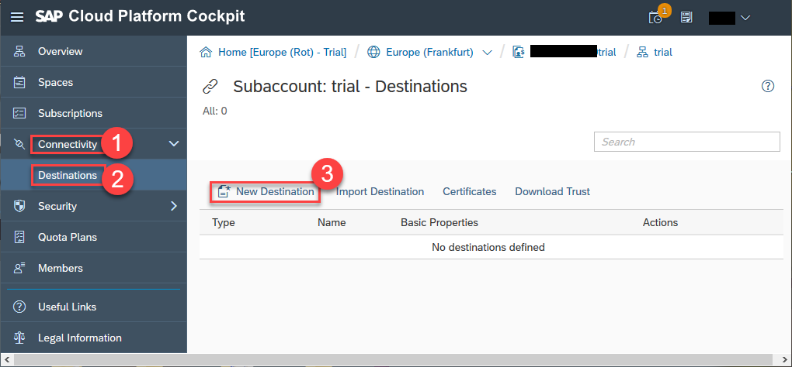

3. Enter the following data:

    |Field Name     | Value                     | Remark                       |
    |:------------- | :-------------------------| :----------------------------|
    |Name           | `abapBackend1`            | Id will be used in Web app   |
    |Type           | `HTTP`                    |                              |
    |Description    | `Product Data`            |                              |
    |URL            | `http://abap-as-eu01:443` | Virtual host for ABAP system |
    |Proxy Type     | `OnPremise`               |                              |
    |Authentication | `BasicAuthentication`     |                              |
    |User           | `DEMO`                    | ABAP user with access to the OData Service |
    |Password       | (your password)           | Password of ABAP User        |

    >ID `abapBackend1` will be used as destination when we configure the application router in step 5.

[DONE]

[ACCORDION-END]

[ACCORDION-BEGIN [Step 2: ](Create a destination instance)]

1. Go to space `dev` of your trial account and choose **`Services`**| **`Service Marketplace`**. Filter for `dest` and choose `destination`.

    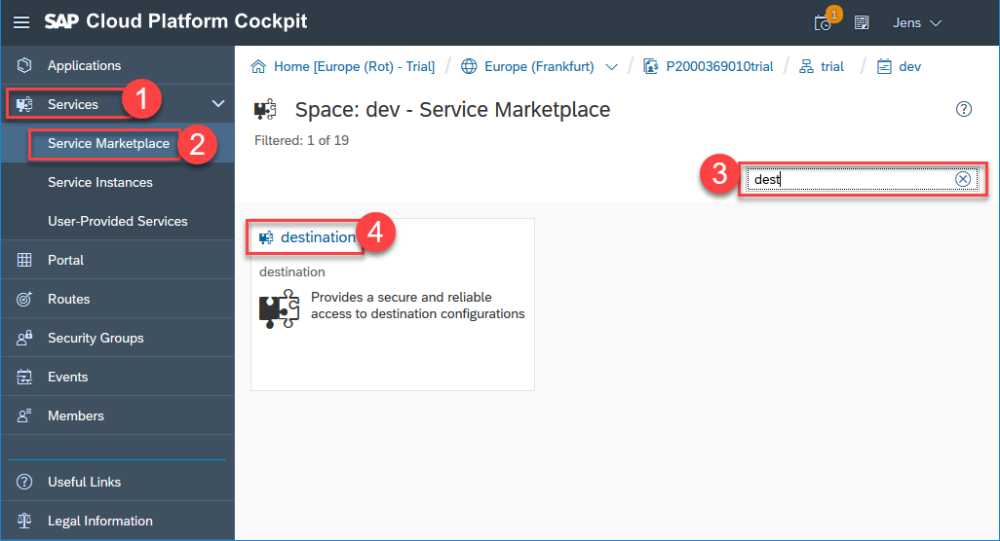

2. On screen **`Service: destination - Instances`** choose **`New Instance`**.

    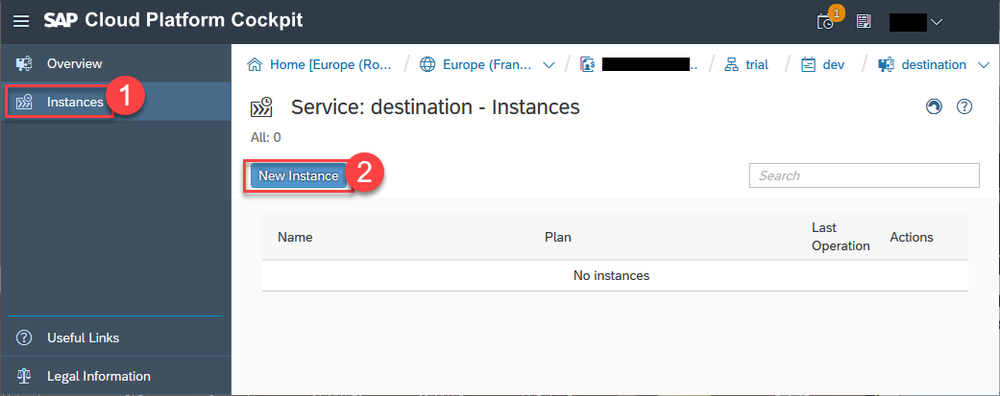

3. Choose **`lite`** as service plan and choose **`Next`**.

    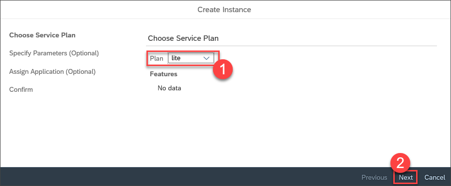

4. On the next screen, choose **`Next`**.

    

5. On the next screen you can assign this service instance to an application. In this tutorial we will create such bindings by specifying the required services in the manifest the application router, so choose **`Next`**.

    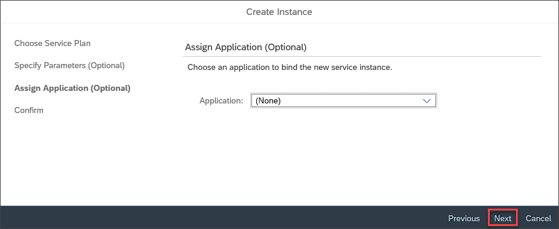

6. On the next screen, use `destination-demo-lite` as **`Instance Name`** and choose **`Finish`**.

    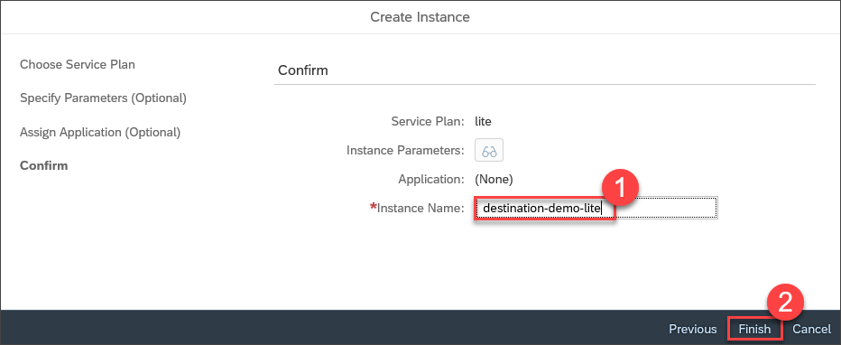

[DONE]

[ACCORDION-END]

[ACCORDION-BEGIN [Step 3: ](Create a connectivity instance)]

1. Go to your dev space and navigate to **`Service Marketplace`**. Filter by `conn` and choose **`connectivity`**.

    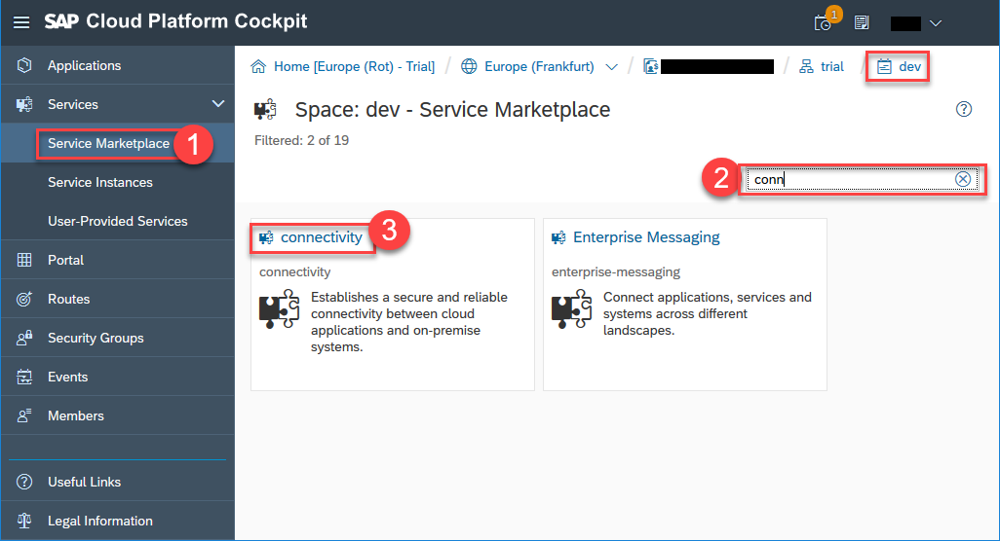

2. On screen  **`Service: connectivity - Instances`** choose **`New Instance`**.

    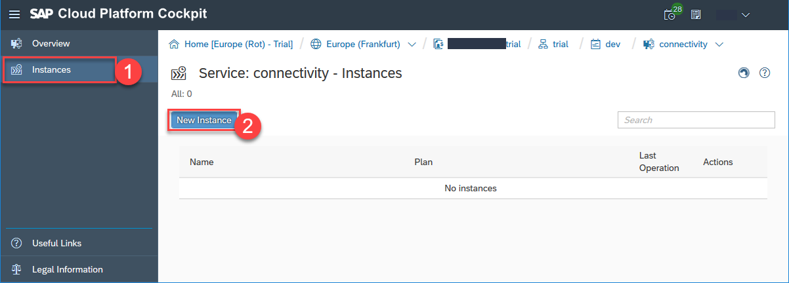

3. Choose **`lite`** as service plan and choose **`Next`**.

    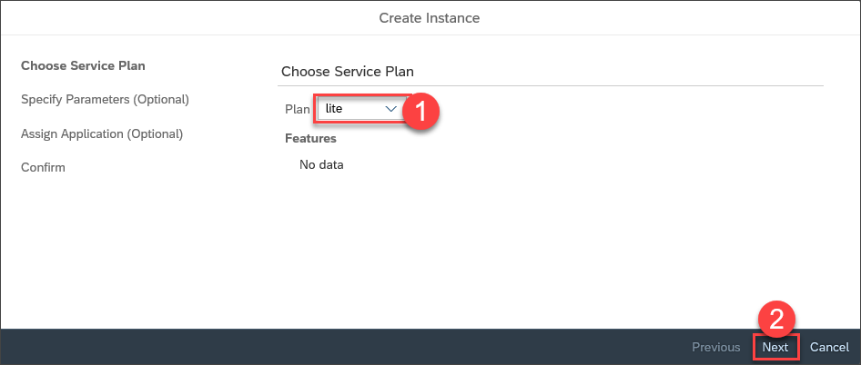

4. On the next screen, choose **`Next`**.

    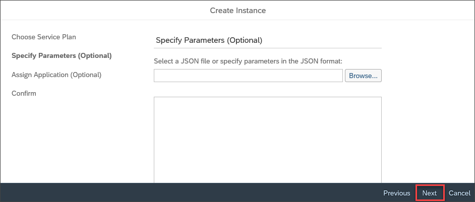

5. On the next screen you can assign this service instance to an application. In this tutorial we will create such bindings by specifying the required services in the manifest the application router, so choose **`Next`**.

    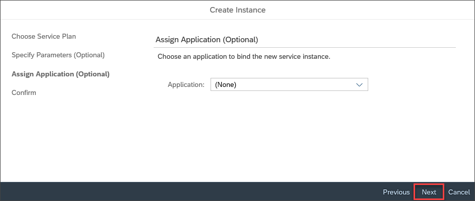

6. On the next screen, use `connectivity-demo-lite` as **`Instance Name`** and choose **`Finish`**.

    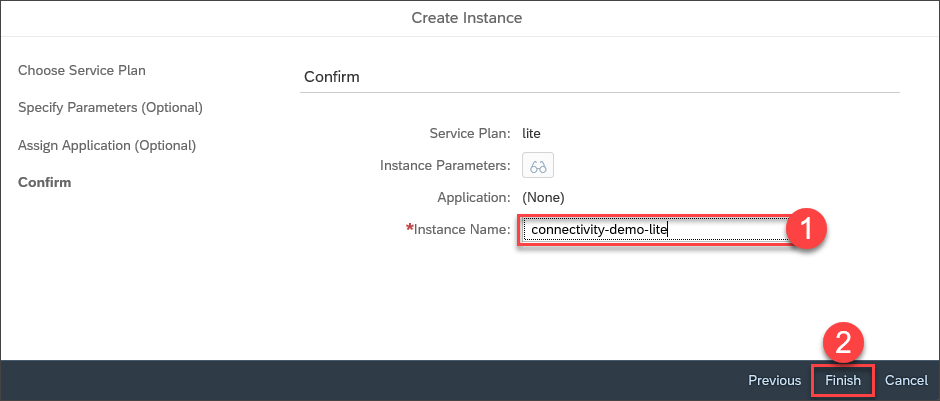

[DONE]

[ACCORDION-END]


[ACCORDION-BEGIN [Step 4: ](Create an XSUAA instance)]

The application router will use the XSUAA instance to authenticate the user before routing the HTTP request to a defined destination. For more general information, see [Authorization and Trust Management in the Cloud Foundry Environment](https://help.sap.com/viewer/65de2977205c403bbc107264b8eccf4b/Cloud/en-US/09f5bd3f346b4ee08b5ca084128e2e81.html) in the official documentation.

1. Go to your dev space and navigate to **`Service Marketplace`**. Filter by `Auth` and choose **`Authorization & Trust Management`**.

    

2. On screen  **`Service: Authorization & Trust Management - Instances`** choose **`New Instance`**.

    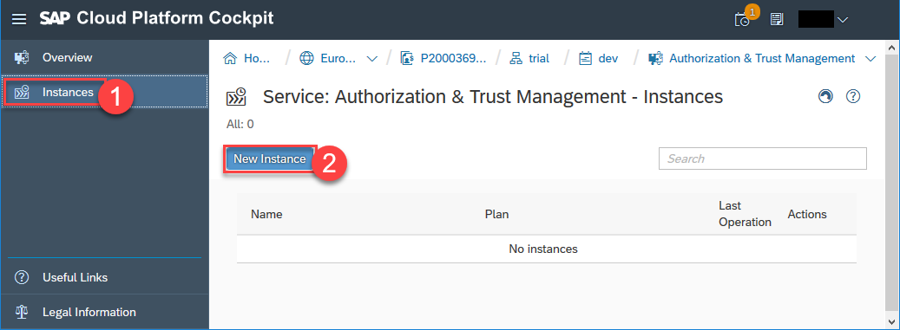

3. Choose **`application`** as service plan and choose **`Next`**.

    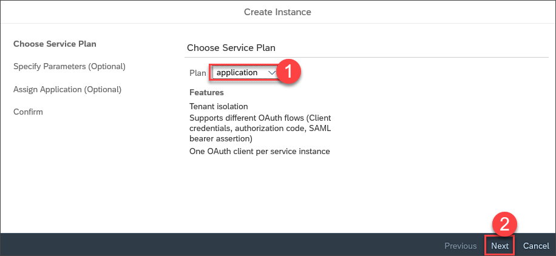

4. On the next screen, you specify authorization parameters for your application. Scope `uaa.user` is required for the token exchange between the application (in our case this is the application router) and the instance of the destination service. Provide the following parameters and choose **`Next`**:

    ```json
    {
      "xsappname": "approuter-demo",
      "tenant-mode": "dedicated",
      "description": "Security profile of called application",
      "scopes": [
        {
          "name": "uaa.user",
          "description": "UAA"
        }
      ],
      "role-templates": [
        {
          "name": "Token_Exchange",
          "description": "UAA",
          "scope-references": [
            "uaa.user"
          ]
        }
      ]
    }
    ```
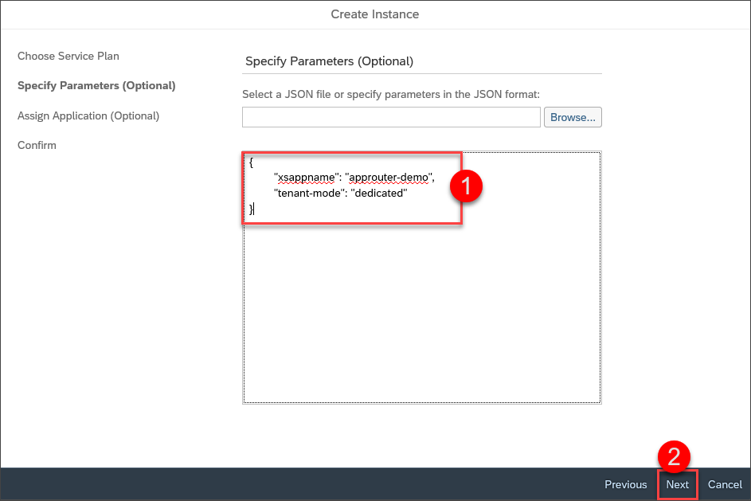
> Every user in the XSUAA has the scope `uaa.user` assigned by default. It basically says that it is a user (and for example, not a client) who owns the token. By using this scope in the role template, the scope will be part of all exchanged tokens by default, even if users do not have the corresponding role assigned explicitly at all. More information about parameters for the XSUAA instance can be found in the [official documentation](https://help.sap.com/viewer/65de2977205c403bbc107264b8eccf4b/Cloud/en-US/517895a9612241259d6941dbf9ad81cb.html).

5. On the next screen you can assign this service instance to an application. In this tutorial we will create such bindings by specifying the required services in the manifest the application router, so choose **`Next`**.

    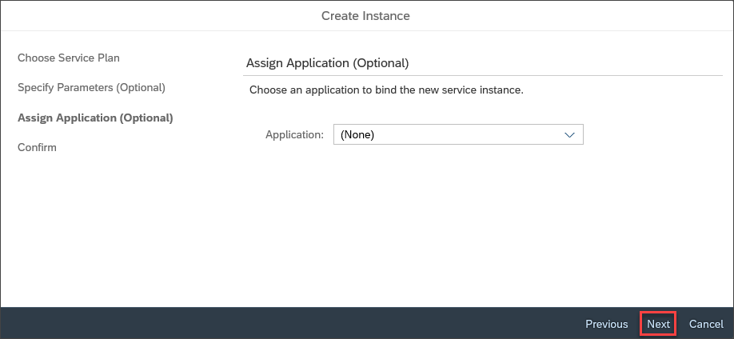

6. On the next screen, use `xsuaa-demo` as **`Instance Name`** and choose **`Finish`**.

    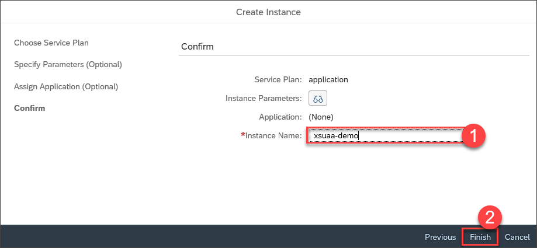

7. You should now have the following services instances:

    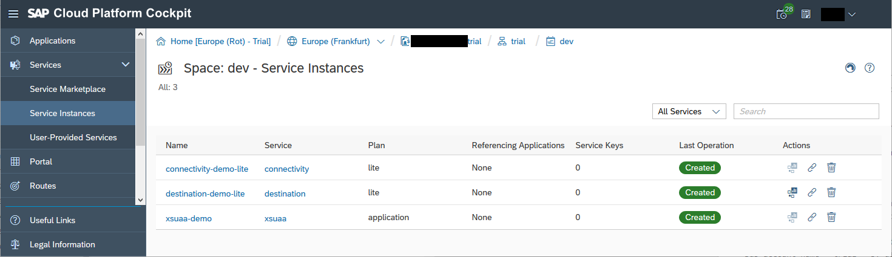

[VALIDATE_4]

[ACCORDION-END]

[ACCORDION-BEGIN [Step 5: ](Create and configure the application router)]

The application router is a node.js application that that is installed using SAP's NPM registry `https://npm.sap.com/`. To keep the file size of the files to be uploaded to SAP Cloud Platform manageable, we will just add information about this registry in the npm startup file `.npmrc` and leave it to the SAP Cloud Platform to install the node.js application at the time of deployment.
>If you would like to learn more about the application router you can also install it locally using the npm commands below. Documentation for the the application router can be found after installation in directory `node_modules\@sap\approuter\README.md`. Alternatively, see [Configure Application Router](https://help.sap.com/viewer/65de2977205c403bbc107264b8eccf4b/Cloud/en-US/01c5f9ba7d6847aaaf069d153b981b51.html) in the official documentation.
```
npm config set @sap:registry https://npm.sap.com/
npm install @sap/approuter
```

We will bind the application router to the created service instances and configure a route. When the application router is called, it will follow the route after successful authentication.

1. Create a new directory called `approuter` somewhere on your PC.

1. Create a new file called `package.json` inside this directory with the following content:
```json
{
  "name": "approuter-demo",
  "version": "1.0.0",
  "description": "",
  "scripts": {
    "start": "node node_modules/@sap/approuter/approuter.js",
    "test": "echo \"Error: no test specified\" && exit 1"
  },
  "license": "ISC",
  "dependencies": {
    "@sap/approuter": "^5.3.0"
  }
}
```
This tells Node (npm) to fetch and start the approuter.

1. Create a file called `.npmrc` in directory `approuter` with the following content:
```npmrc
  @sap:registry=https://npm.sap.com/
```
> Windows may show an error because of the missing prefix. In this case, use filename `.npmrc.`. Windows will create the file then and remove the trailing `.`.

1. Create a file called `xs-app.json` in directory `approuter` with the following content:
```json
{
	"routes": [
		{
			"source": "/",
			"target": "/sap/opu/odata/sap/EPM_REF_APPS_PROD_MAN_SRV/Products",
			"destination": "abapBackend1"
		}
	]
}
```
This configures the routing inside the approuter. The target path corresponds to the path of the OData service of the Fiori Reference apps that we released in the ABAP system. The destination corresponds to the destination we have created in step 2.

[DONE]

[ACCORDION-END]

[ACCORDION-BEGIN [Step 6: ](Deploy the application router)]

1. Create a zip archive called `approuter.zip` containing all the files in the `approuter` directory you have created in the last step. It is important that the files are at the top level of the zip file so be sure that your current directory is `approuter`. You can use these commands in bash (Linux and macOS) to create the zip file:
```bash
{
  for file in xs-app.json .npmrc package.json ; do
    if [[ ! -e $file ]] ; then echo -e "\e[33m[WARNING] $file does not exist\e[0m"; fi ;
  done
  zip -r approuter.zip .
}
```
or use `Powershell` (Windows)
```Powershell
  foreach ($file in @("xs-app.json",".npmrc", "package.json")){
     if (-not (Test-Path $file)) { Write-Warning "$file does not exist" }
  }
  Compress-Archive -Force -Path .\* -DestinationPath approuter.zip
```

1. Create a file `manifest.yml` for the approuter. The manifest should include information about the required services `xsuaa`, `connectivity-demo-lite`, and `destination-demo-lite`, so that the SAP Cloud Platform will create a binding between the application router and all of these services at the time of deployment:

        ---
        applications:

        - name: approuter-demo
          host: approuter-demo-<unique ID>
          buildpack: nodejs_buildpack
          memory: 128M
          path: ./approuter.zip
          services:
            - xsuaa-demo
            - connectivity-demo-lite
            - destination-demo-lite

1. Replace `<unique ID>` of the `host` property in the manifest with something unique, for example your subaccount Id. If the host name is not unique there might be another application router with the same host name which would cause the application router to crash.

1. Go to the dev space and choose **`Applications`** | **`Deploy Application`**.

    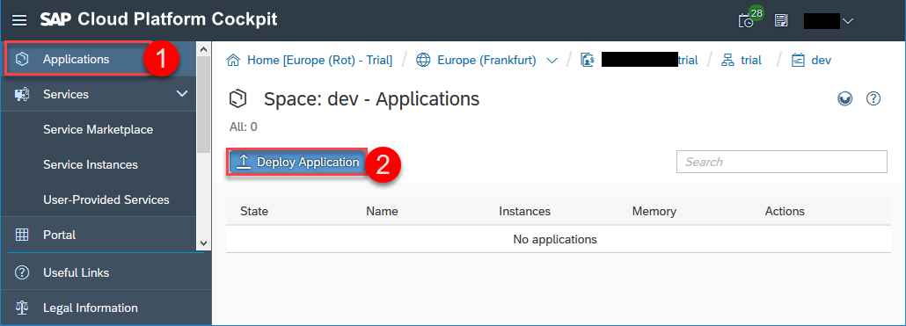

1. Browse to your zip file `approuter.zip` and to your manifest file `manifest.yml` and choose **`Deploy`**.

    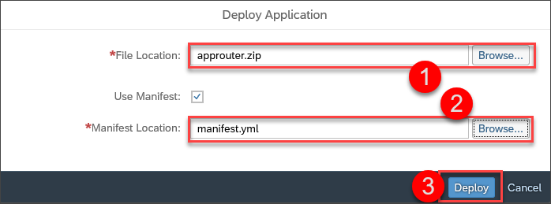

1. SAP Cloud Platform will try to start the application router directly after deployment automatically. You should eventually get a green state `started`.

    
    > You can also deploy the application router using the command line interface of cloud foundry, see [Installing the Cloud Foundry Command Line Interface](https://help.sap.com/viewer/e275296cbb1e4d5886fa38a2a2c78c06/Cloud/en-US/8e525a3791d64f40a2578cd63f5995f9.html) of the SAP Cloud Platform documentation and [Getting Started with the cf CLI](https://docs.cloudfoundry.org/cf-cli/getting-started.html) of the cloud foundry documentation.

[DONE]

[ACCORDION-END]

[ACCORDION-BEGIN [Step 7: ](Run the application router)]

1. In your dev space, navigate to **`Applications`** | `approuter-demo`.

    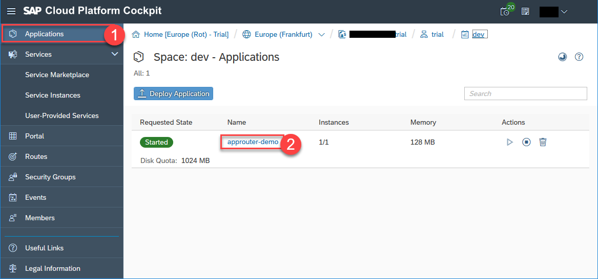

1. Click on the link for your application route.

    

1. You are now redirected by the application router to the XSUAA instance to log in with your SAP Cloud Platform email address and password. Log in.

    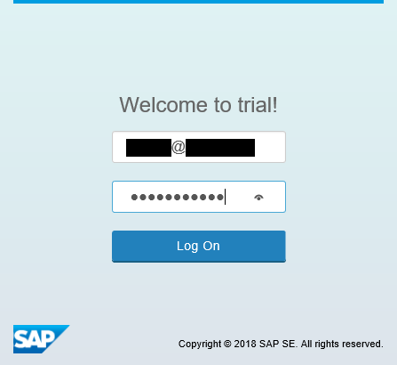

1. Depending on your browser settings you will now either see the HTTP response of the OData service as XML document (as shown below) or a list of the same products, but rendered as RSS feed.

    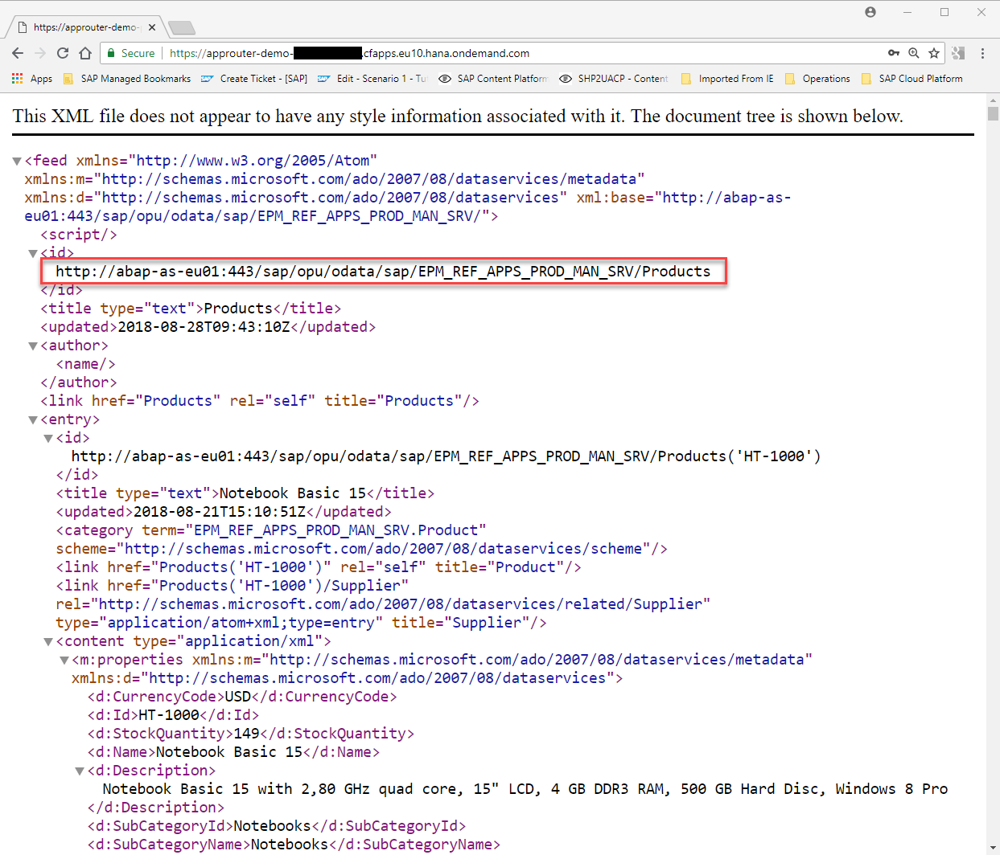
> If your browser does not display the XML document as above, choose **`View Page Source`** from the context menu of your browser and copy the response to your favourite XML editor.

Congratulations! You have consumed an OData service of your ABAP system on SAP Cloud Platform. Note that the internal host of your ABAP system does not appear anywhere in the output of the OData service. Instead, you can see the virtual host and the path in the `<id>` element.

```XML
<id>http://abap-as-eu01:443/sap/opu/odata/sap/EPM_REF_APPS_PROD_MAN_SRV/Products</id>
```

What is the product name (value of element `<d:Name>`) of product ID `HT-7030` in the OData response?

[VALIDATE_6]

[ACCORDION-END]

[ACCORDION-BEGIN [Step 7: ](Troubleshooting and monitoring (optional))]

#### Troubleshooting

If you are new to SAP Cloud Platform (like myself) you might appreciate some troubleshooting hints.

1. If something went wrong during the deployment of your application, SAP Cloud Platform might have managed to upload your files, but could not deploy or start your application. If so, navigate to your application and choose **`Logs`**. Scroll down to the latest messages which often helps to figure out what went wrong during the deployment.

    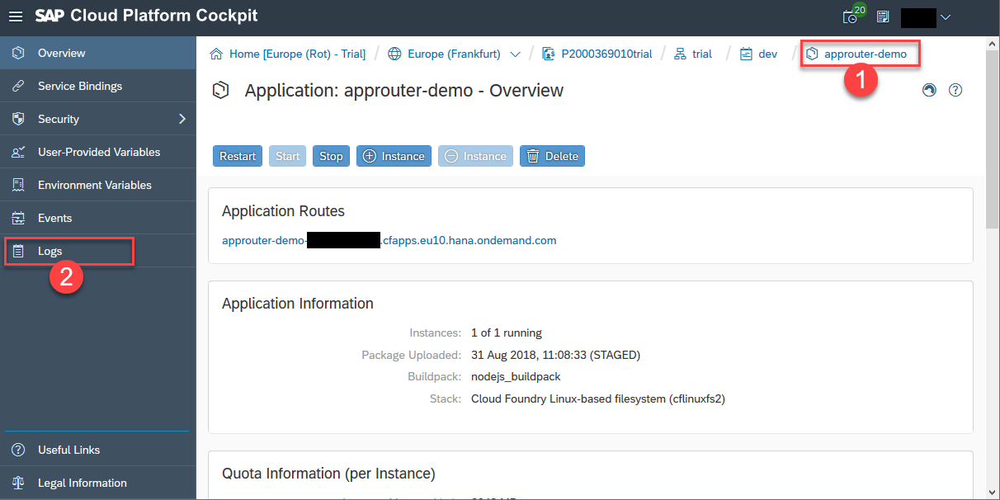

2. Check the validity of your JSON and YAML files. You can find a variety of online validators that will tell you if anything is wrong. A comma at the wrong place or a wrong path will lead to deployment errors.

3. Insufficient authentication - depending on where it happens - will also be visible in logs and trace files you can check in the Cloud Connector Administration UI:

    

#### Monitoring

To monitor performance you can check which calls required how much time and in which step.

1. For example, you can check the performance of the OData calls in the Cloud Connector Administration UI by choosing **`Monitor`** | **`MOST RECENT REQUESTS`** | **`All Hosts`** | **`Show details`**.

    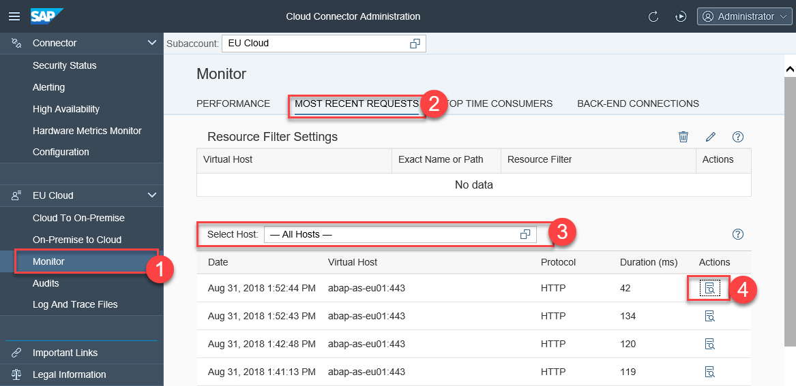

2. The Cloud Connector Administration UI will show the following **`Request Details`**.

    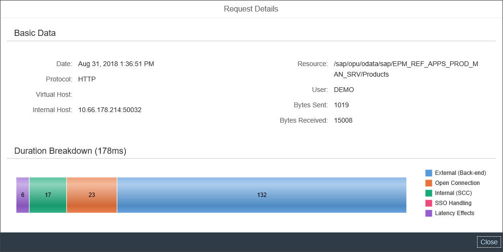

[DONE]

[ACCORDION-END]


---
