## Prerequisites  
  - [Configure your ABAP System to Activate OData Services of Fiori Reference Apps](cp-connectivity-configure-fiori-reference-apps)
  - [Install the Cloud Connector in your System Landscape](cp-connectivity-install-cloud-connector)

## Details
### You will learn  
  - How to connect the Cloud Connector to your trial cloud foundry account on SAP Cloud Platform
  - How to connect the Cloud Connector to your ABAP system

---

[ACCORDION-BEGIN [Step 1: ](Connect Cloud Connector with trial subaccount)]

Before you can access data from the Cloud Connector in an application on SAP Cloud Platform, you must establish a trust between your SAP Cloud Platform subaccount and the Cloud Connector that is installed in your system landscape. To do so, you need your subaccount ID.

1. Go to [Your SAP Cloud Platform Trial](https://account.hanatrial.ondemand.com/cockpit) | **Cloud Foundry Trial**, and navigate to your subaccount.

1. The card with your subaccount information will show the sub-account name **trial** by default. Choose **More Info** to display your subaccount's ID:

    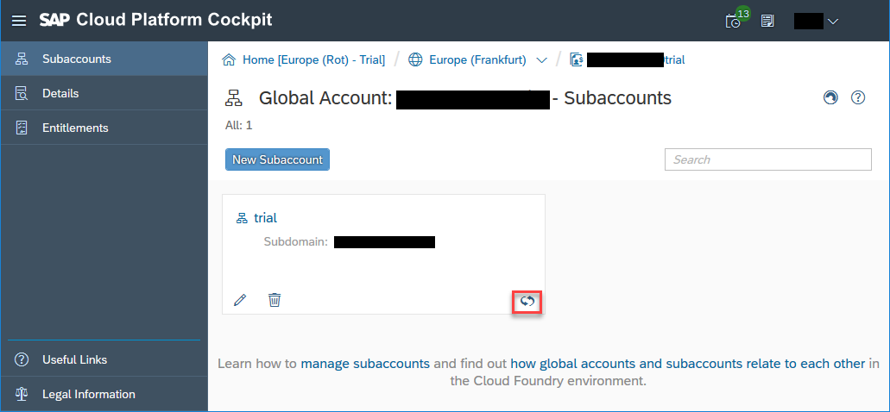

1. Select the ID and copy it:

    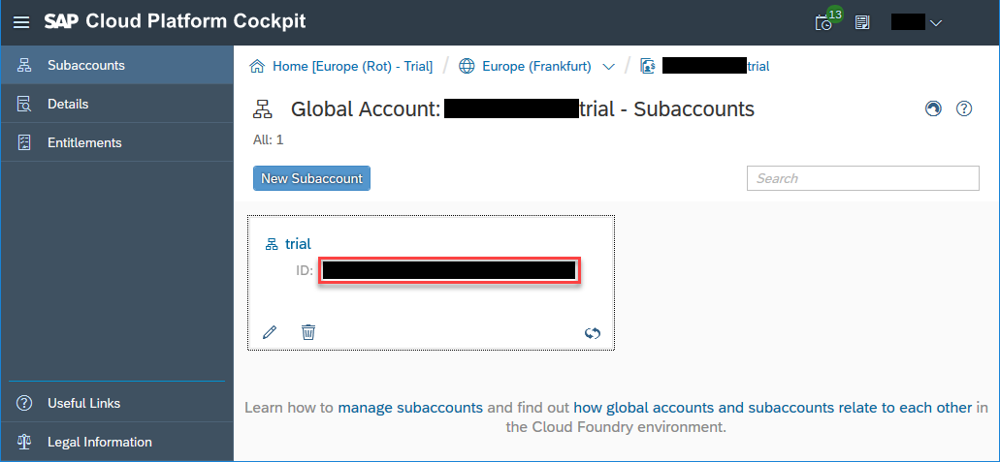

1. Log on to the Cloud Connector administration UI and choose **Connector** | **Define Subaccount** (if you already have defined a subaccount for another purpose, choose **Connector** | **Add Subaccount**). Enter the following information:

    |  Field Name            | Value                                                                   |
    |:-----------------------|:------------------------------------------------------------------------|
    |  **Region**            | `cf.eu10.hana.ondemand.com` or `cf.us10.hana.ondemand.com`              |
    |  **Subaccount**        | The subaccount ID you copied in the last step.                          |
    |  **Display Name**      | This will be displayed in the Cloud Connector administration UI         |
    |  **Subaccount User**   | Email address of your subaccount user. You can find it in the `User Information`. |
    |  **Password**          | Password of your subaccount user                                        |
    |  **Location ID**       | not required in this tutorial                                           |
    > You can find the `User Information` in the upper right corner of the cockpit:
    >
    >  

1. Choose `Save`.

    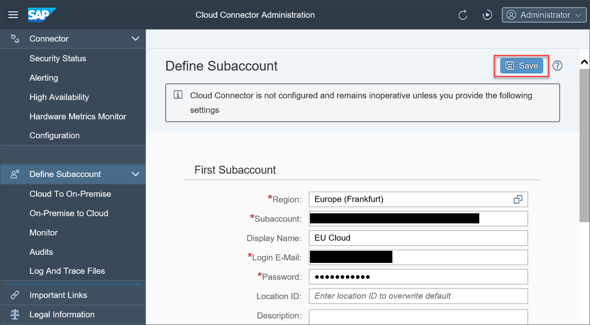

1. After a while you should get the following success message:

    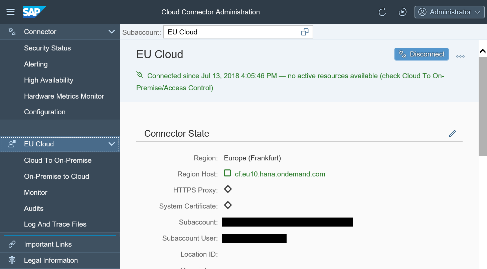
    > If your internal landscape is protected by a firewall that blocks any outgoing TCP traffic, the connection will only work using an HTTPS proxy. For more information see section [Set up Connection Parameters and HTTPS Proxy](https://help.sap.com/viewer/cca91383641e40ffbe03bdc78f00f681/Cloud/en-US/db9170a7d97610148537d5a84bf79ba2.html#loiodb9170a7d97610148537d5a84bf79ba2__configure_proxy) in the official documentation.

[VALIDATE_2]

[ACCORDION-END]

[ACCORDION-BEGIN [Step 2: ](Connect Cloud Connector with ABAP system)]
Access from any application on SAP Cloud Platform to resources on your ABAP system are provided by mapping the IP address of your ABAP system ( **Internal Host** ) to a **Virtual Host**. You provide this mapping and further attributes relevant for the connection in the **`ACCESS CONTROL`**. After the access control is set up you can use the virtual host on SAP Cloud platform to allow applications to connect to services on your ABAP system.

In this step we do not provide any password information. It will have to be provided later on SAP Cloud Platform when you create a destination for this host.

1. In the Cloud Connector Administration UI, expand the name of your subaccount and choose **`Cloud To On-Premise`**. Above table **`Mapping Virtual To Internal System`** choose the plus sign ( **`Add`** ).

    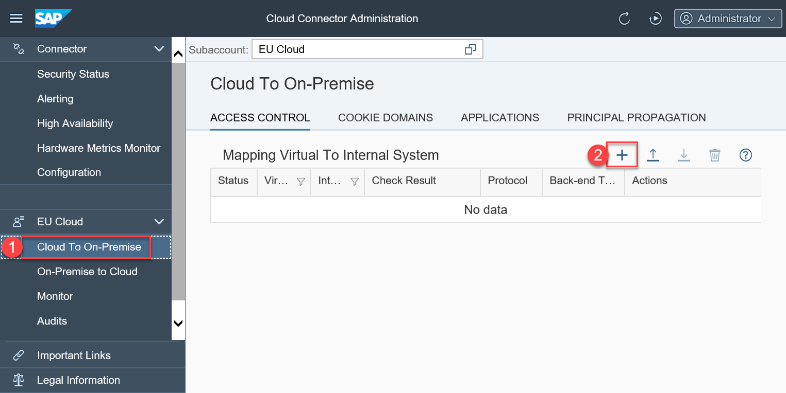

1. Choose `ABAP System` as **`Back-end Type`** and choose **`Next`**.

    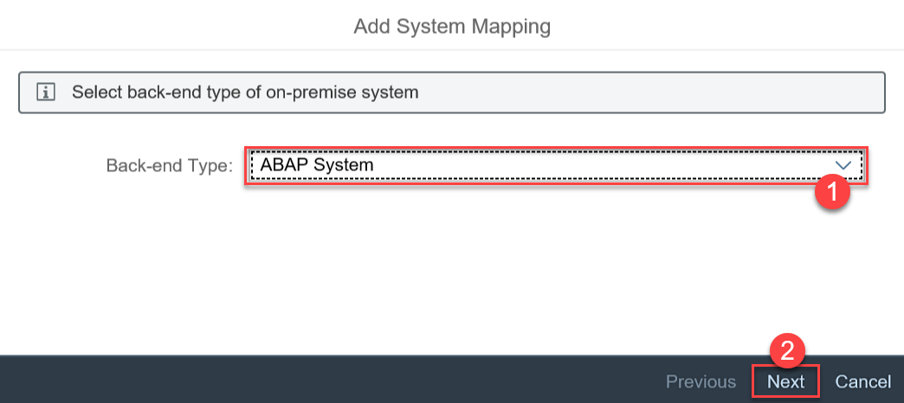

1. Choose `HTTP` as **`Protocol`** and choose **`Next`**.

    

1. Enter the internal host and port of your ABAP system and choose **`Next`**.

    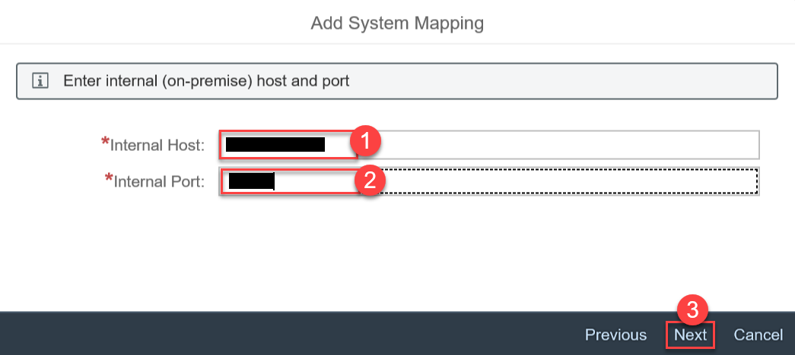
    > To check this again, choose **`Call Browser`** for OData service `ZEPM_REF_APPS_PROD_MAN_SRV` in transaction `/n/IWFND/MAINT_SERVICE` of the ABAP system where you configured your OData services.

1. Enter a **`Virtual Host`** and a **`Virtual Port`**.

    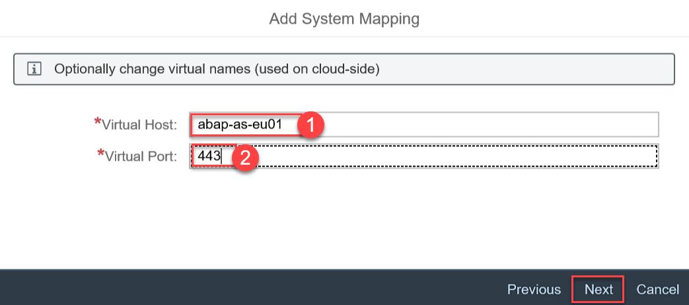

    >These values can be arbitrary, simply choose something that makes sense for you but do not copy the     values of your internal host to hide this information outside your network.

1. Choose `None` as **`Principal Type`**.

    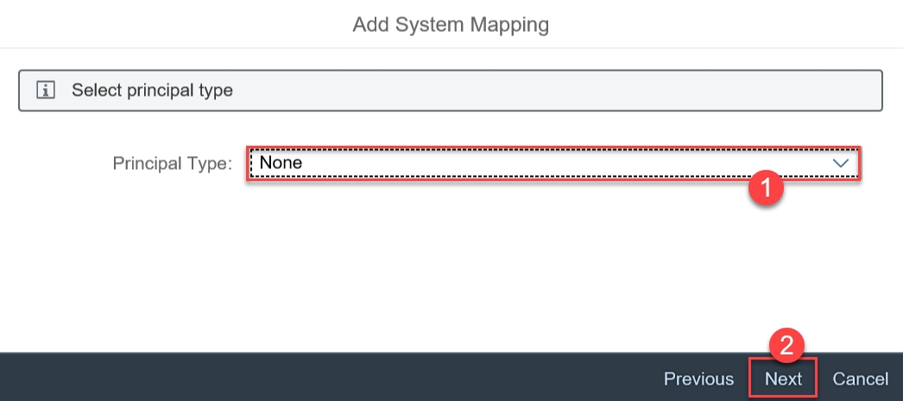

1. Choose **`Next`**.

    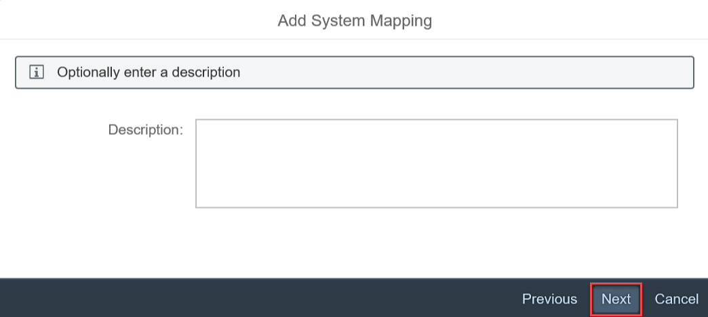

1. Choose **`Check Internal Host`**. This will check the connection to your ABAP system after you choose **`Finish`**.

    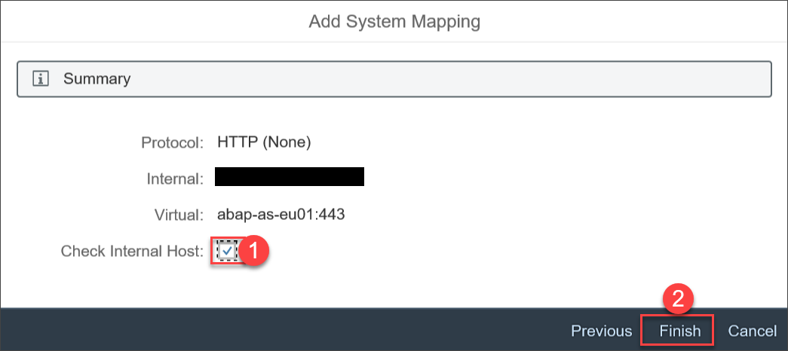

1. If the ABAP system is not reachable check if your internal host is correct. Otherwise you should see something like this:

    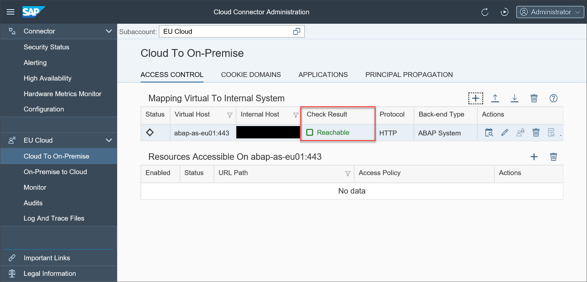

[DONE]

[ACCORDION-END]

[ACCORDION-BEGIN [Step 3: ](Allow access to ABAP resources)]

Before applications on SAP Cloud Platform can access any services of the ABAP system you must specify the corresponding paths in table **`Resources Accessible On <your virtual host>:<port>`**.

1. In your access control for your ABAP system you created in the last step, choose the plus sign ( **`Add`** ).

    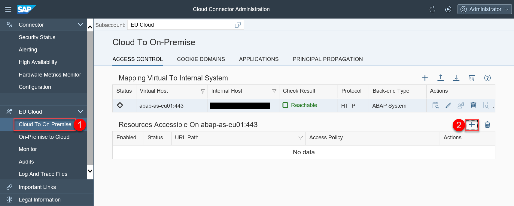

1. Add the following resource and choose **`Save`**.

    | Field Name                     | Value                              |
    |:-------------------------------|:-----------------------------------|
    | **`URL Path`**                 | `/sap/opu/odata`                   |
    | **`Enabled`**                  | (checked)                          |
    | **`Access Policy`**            | **`Path and all sub-paths`**       |

    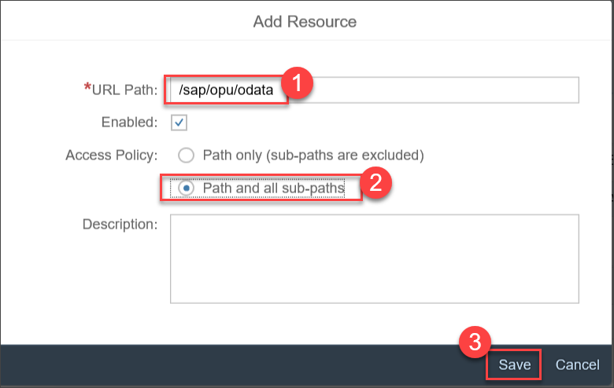
    > For now we will only add path `/sap/opu/odata` as resource path to be able to access the output of the OData service. You can add more paths later, for example, because you would also like to allow access to related images stored in the ABAP system.

1. Your configuration should now look like this:

    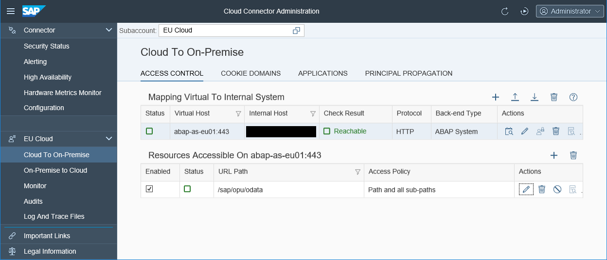

As a result, you now have configured a secure tunnel between your ABAP system and your subaccount on SAP Cloud Platform.  

[VALIDATE_3]

[ACCORDION-END]

---
