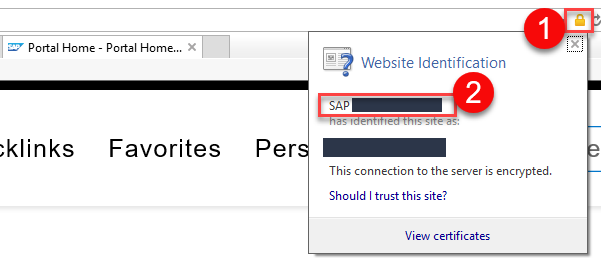

## Prerequisites  
 - **Proficiency:** Beginner

## Details
### You will learn  
* About the available Cloud Connector versions
* How to install the Cloud Connector
* How to start and stop the Cloud Connector
* How to log on to the Cloud Connector administration UI
* First steps to secure your installed Cloud Connector

### Time to Complete
**20 Min**

---

[ACCORDION-BEGIN [Step 1: ](Check the Prerequisites)]

In this tutorial we will install version 2.11.0.3 of the Cloud Connector on a PC with Windows 10. You need at least 2GB of RAM and 3GB of hard disk space to use this version of the Cloud Connector. Since the Cloud Connector will act as a gateway between SAP Cloud Platform and systems in your on-premise system landscape, it must have an Internet connection to the hosts of SAP Cloud Platform as well as LAN access to your systems (SAP Cloud Platform has IP addresses for connectivity for each region). As a consequence, the Cloud Connector will be a security-critical component in your system landscape, so it is highly recommended to restrict the operating system access to the machine where you install it to a minimal set of users who will administrate it.

> You can check the current prerequisites for newer versions of the Cloud Connector in the [official documentation](https://help.sap.com/viewer/cca91383641e40ffbe03bdc78f00f681/Cloud/en-US/e23f776e4d594fdbaeeb1196d47bbcc0.html). The list of IP addresses is also given there.

For version 2.11.0.3 of the Cloud Connector the recommended version of the Java Development Kit (JDK) is Java 8 (`1.8.x`). Let's check first what Java version you have installed on your PC.

1. In Windows, search for **`cmd`** to open a command prompt.
2. Enter **`Java -version`** to find out which Java version you have installed.
3. If you do not have the JDK for Java SE 8 installed you can download it from Oracle's [Java SE downloads](http://www.oracle.com/technetwork/java/javase/downloads/index.html) (on the **Downloads** tab).
> You can also use SAP JVM. The installation procedure is described in the [official documentation](https://help.sap.com/viewer/65de2977205c403bbc107264b8eccf4b/Cloud/en-US/76137f42711e1014839a8273b0e91070.html).

4. After the download, follow the installation wizard to install the JDK for Java 8.

[DONE]

[ACCORDION-END]

[ACCORDION-BEGIN [Step 2: ](Choose your Version of the Cloud Connector)]

The Cloud Connector runs on the following operating systems and is offered in two versions:

| Operating System  |  Installer Version | Portable Version |
| :-----------------|:-------------------| :----------------|
| Windows           | yes                | yes              |
| Linux             | yes                | yes              |
| MacOS             | no                 | yes              |

The _installer version_ is the one to use for productive scenarios. You can install the _portable version_ on your PC even if you do not have administrator rights, but then it won't be upgraded automatically.

In this tutorial, we will install the Windows version for productive scenarios.

[VALIDATE_2]

[ACCORDION-END]

[ACCORDION-BEGIN [Step 3: ](Install the Cloud Connector)]

1. Open [https://tools.hana.ondemand.com/#cloud](https://tools.hana.ondemand.com/#cloud), scroll down to section **Cloud Connector**, and choose the Windows installer download.

2. Read the **End User License Agreement** and confirm with **`I Have Read And Agree`**.

3. Choose **`Run`**.

4. This version of the Cloud Connector (2.11.0.3) is not a signed installation yet. Choose **`More Info`** in the warning dialog of Windows Defender.

5. Choose **`Run anyway`**.

6. Choose **`Next>`** on the welcome screen of the Cloud Connector setup wizard.

7. Select a local folder on your PC and choose **`Next>`**.

8. Enter an HTTPS port for accessing the Cloud Connector administration UI and choose **'Next>'**. The standard port is 8443.

9. Navigate to the root directory of your Java 8 JDK installation and choose **`Next>`**.

10. Select **Start Cloud Connector 2.11.0.3 after Finishing the Setup** and choose **`Next>`**.

> Note that if you select this option, only the Cloud Connector service will be started after the installation, and not your Web browser with the Cloud Connector administration UI.

11. Choose **`Next>`** to start the installation.

12. In the next pop-up, confirm the installation with **`Yes`**.

13. You should get the following message after a successful installation. Choose **`Close`**.

When you close the last pop-up, the Cloud Connector service runs in the background.

What is the standard port for accessing the Cloud Connector administration UI?

[VALIDATE_3]

[ACCORDION-END]

[ACCORDION-BEGIN [Step 4: ](Logon to the Cloud Connector)]

1. To access the Cloud Connector administration UI, open a Web browser and go to https://localhost:8443/ (adjust the port if you specified another one during the installation).

2. Your browser will show a certificate error. Continue to the Web site anyway.

3. At the cloud connector login, log on with the following logon data:
    * User Name: **`Administrator`**
    * Password: **`manage`**

4. After login, you will be asked to change your Administrator password. You can choose whether this instance of the Cloud Connector will be the master instance or a shadow instance. Choose **`Master`** and **`Save`**. For more information on how to use a shadow instance, see: [Install a Failover Instance for High Availability](https://help.sap.com/viewer/cca91383641e40ffbe03bdc78f00f681/Cloud/en-US/c697705179a24d2b8b6be038fae59c33.html).

> You can use LDAP (Lightweight Directory Access Protocol) to configure Cloud Connector authentication. For more information, see the [official documentation](https://help.sap.com/viewer/cca91383641e40ffbe03bdc78f00f681/Cloud/en-US/120ceecfd84145a181ac160d588a7a3d.html).

[DONE]

[ACCORDION-END]

[ACCORDION-BEGIN [Step 5: ](Replace Self-Signed UI Certificate)]

To assure users of the Cloud Connector administration UI that they can trust its Web address (not localhost, but the fully qualified domain name of your server), we highly recommend replacing the self-signed UI certificate that is included by default with one from your trusted certificate authority (CA).

Before you start, you need to find out what certificate authority is usually used in your Intranet and how certificates are issued:

1. Open a Web site of your Intranet in Internet Explorer.

2. Click the padlock at the end of the Internet Explorer address bar. The certificate authority is now displayed in the **Website Identification** pop-up.

3. Search in your Intranet for information about your certificate authority and how certificates are issued.

4. If you cannot find any information, ask an administrator.

After clarifying where you can get a certificate (sometimes referred to as **Enrollment Service**), you need to follow the process shown in the following graphic:

1. Log on to the Cloud Connector Administration UI and choose **Configuration** in the menu. On the **USER INTERFACE** tab, **UI Certificate** section, choose **Generate a certificate signing request**. The information you need to provide in the following pop-up (for example, **Common Name**, **Subject Alternative Name**) is defined by your certificate authority. Choose **Generate** to save your request as a PEM file (PEM: Privacy Enhanced Mail).

2. Open the PEM file in a text editor, and copy the contents to the enrollment service of your certificate authority to issue a certificate.

3. The certificate authority issues a signed certificate that proves - together with a private key that is known to the Cloud Connector - that you are the owner of the Web site. Save this certificate in a local file.

4. Return to the Cloud Connector Administration UI. Choose **Configuration** and then **Import a certificate** in the **UI Certificate** section on the **USER INTERFACE** tab. Import the file you saved in the last step.

5. After a successful import, the certificate details are displayed in the **UI Certificate** section.

6. Finally, choose **Restart** on the top of the Cloud Connector administration UI.

After the restart the certificate error should no longer be displayed.

[DONE]

[ACCORDION-END]

[ACCORDION-BEGIN [Step 6: ](Set up a Windows Service User)]

After a successful installation the Cloud Connector is available as a Windows service. Let's check its status and set up a Windows service user:

1. In Windows, enter **`Services`** in the central Windows search next to the Windows start button, and  choose the following match:

2. Click on an entry in the service list, hit **`S`** on your keyboard, and scroll down in the list of services to find service **SAP Cloud Connector**. After selecting it, you can start, stop, and restart the service. Double-click it.

3. In this pop-up you have the option of changing the startup type: **Automatic**, **Automatic (Delayed Start)**, **Manual**, **Disabled**.

4. To restrict the access to the Cloud Connector service to a specific user, change to tab **Log On**, choose **This account**, and **Browse...**.

5. Choose **Locations...**.

6. Choose **Entire Directory** and **OK**.

7. Choose **Advanced**.

8. Enter a user name, choose **Find Now**, then select the user who should be allowed to start the service, and choose **OK** twice.

9. Enter the user's password, and choose **OK**. If the password you enter will be different from the user's Windows password, the logged on user will not be able to start the service.

10. You will get the following confirmations.

11. Return to tab **General** to restart the service. After restarting it, you will see the configured service user in column **Log On As** in the service list.

12. Log on to the Cloud Connector. Choose **Security Status** to change the service user status.

12. Change the service user status.

13. Your **General Security Status** should now look like this:

Congratulations! You have successfully finished the installation and started to secure your Cloud Connector.

More information about a secure setup of the Cloud Connector can be found in the [official documentation](https://help.sap.com/viewer/cca91383641e40ffbe03bdc78f00f681/Cloud/en-US/e7ea82a4bb571014a4ceb61cb7e3d31f.html).

[VALIDATE_6]

[ACCORDION-END]

---
