## Details
### You will learn  
* About the available SAP Connectivity Service Cloud Connector versions
* How to install the SAP Connectivity Service Cloud Connector
* How to start and stop the SAP Connectivity Service Cloud Connector
* How to log on to the SAP Connectivity Service Cloud Connector administration UI
* First steps to secure your installed SAP Connectivity Service Cloud Connector

---

[ACCORDION-BEGIN [Step 1: ](Check the prerequisites)]

In this tutorial we will install version 2.11.0.3 of the SAP Connectivity Service Cloud Connector (from this point forward simply referred to as Cloud Connector) on a PC with Windows 10, but you should also be able to follow the steps if you use another operating system.

You need at least 2GB of RAM and 3GB of hard disk space to use this version of the Cloud Connector.

Since the Cloud Connector will act as a gateway between SAP Business Technology Platform and systems in your on-premise system landscape, it must have an Internet connection to the hosts of SAP BTP as well as LAN access to your systems (SAP BTP has IP addresses for connectivity for each region). As a consequence, the Cloud Connector will be a security-critical component in your system landscape, so it is highly recommended to restrict the operating system access to the machine where you install it to a minimal set of users who will administrate it.

> You can check the current prerequisites for newer versions of the Cloud Connector in the [official documentation](https://help.sap.com/viewer/cca91383641e40ffbe03bdc78f00f681/Cloud/en-US/e23f776e4d594fdbaeeb1196d47bbcc0.html). The list of IP addresses is also given there.

For version 2.11.0.3 of the Cloud Connector the recommended version of the Java Development Kit (JDK) is Java 8 (`1.8.x`). Let's check first what Java version you have installed on your PC.

1. Open a command line (for example, in Windows, search for **`cmd`** to open a command prompt).

2. Enter **`java -version`** to find out which Java version you have installed.

If you do not have the JDK for Java SE 8 installed:

1. Download the JDK for Java SE 8 from Oracle's [Java SE downloads](http://www.oracle.com/technetwork/java/javase/downloads/index.html) (on the **Downloads** tab).
2. Follow the installation wizard to install the JDK for Java 8.

The installation wizard will show the following success message after a successful installation:

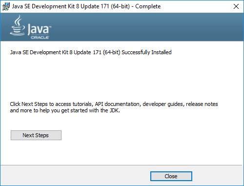

> You can also use SAP JVM. The installation procedure is described in the [official documentation](https://help.sap.com/viewer/65de2977205c403bbc107264b8eccf4b/Cloud/en-US/76137f42711e1014839a8273b0e91070.html).

[DONE]

[ACCORDION-END]

[ACCORDION-BEGIN [Step 2: ](Choose your version of the Cloud Connector)]

The Cloud Connector runs on the following operating systems and is offered in two versions:

| Operating System  |  Installer Version | Portable Version |
| :-----------------|:-------------------| :----------------|
| Windows           | yes                | yes              |
| Linux             | yes                | yes              |
| MacOS             | no                 | yes              |

The _installer version_ is the one to use for productive scenarios. You can install the _portable version_ on your PC even if you do not have administrator rights, but then it won't be upgraded automatically.

In this tutorial, we will install the Windows version for productive scenarios.

[VALIDATE_2]

[ACCORDION-END]

[ACCORDION-BEGIN [Step 3: ](Install the Cloud Connector)]

The installation is described for Windows 10 using Chrome as Web browser. Note that if you use another browser it will look slightly different. If you use Mac OS X or Linux OS, you will first have to unpack the downloaded installation package. If you get stuck, check the [official documentation](https://help.sap.com/viewer/cca91383641e40ffbe03bdc78f00f681/Cloud/en-US/57ae3d62f63440f7952e57bfcef948d3.html) for installation instructions for your operating system.

1. Open [https://tools.hana.ondemand.com/#cloud](https://tools.hana.ondemand.com/#cloud), scroll down to section **Cloud Connector**. To be able to illustrate the Cloud Connector in productive scenarios, we suggest to download the installer version.

    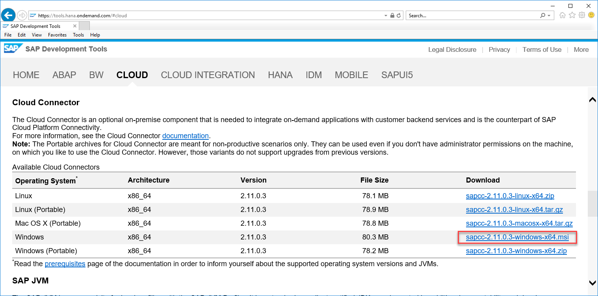

2. Read the **End User License Agreement** and confirm with **`I Have Read And Agree`**.

    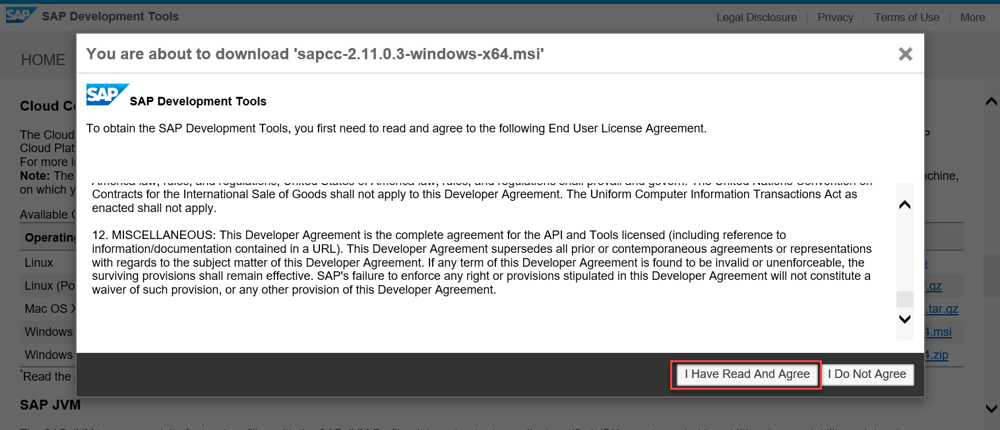

3. After successful download, the downloaded file appears in the lower left corner of your Chrome browser. Choose **`Open`** (this may work differently depending on the browser you use).

    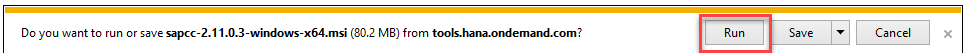

4. This version of the Cloud Connector (2.11.0.3) is not a signed installation yet. Choose **`More Info`** in the warning dialog of Windows Defender.

    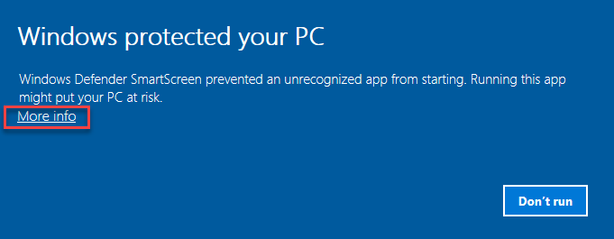

5. Choose **`Run anyway`**.

    

6. Choose **`Next>`** on the welcome screen of the Cloud Connector setup wizard.

    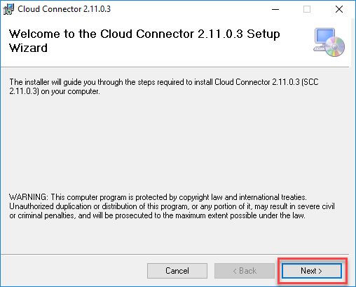

7. Select a local folder on your PC and choose **`Next>`**.

    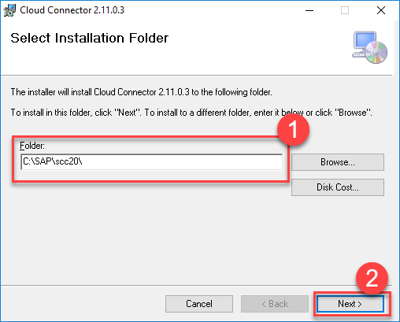

8. Enter an HTTPS port for accessing the Cloud Connector administration UI and choose **'Next>'**. The standard port is 8443.

    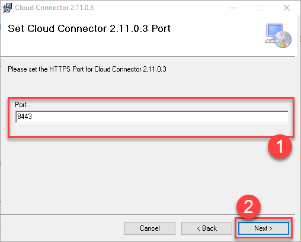

9. Navigate to the root directory of your Java 8 JDK installation and choose **`Next>`**.

    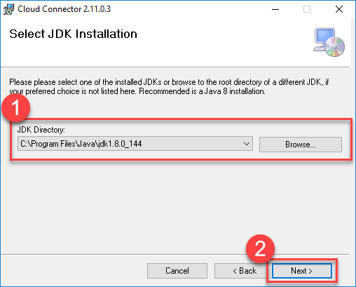

10. Select **Start Cloud Connector 2.11.0.3 after Finishing the Setup** and choose **`Next>`**.

    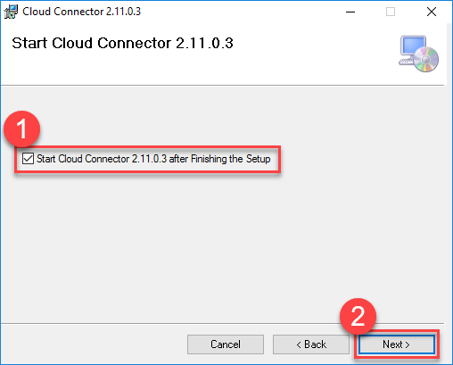
    > Note that if you select this option, only the Cloud Connector service will be started after the installation, and not your Web browser with the Cloud Connector administration UI.

11. Choose **`Next>`** to start the installation.

    

12. In the next pop-up, confirm the installation with **`Yes`**.

    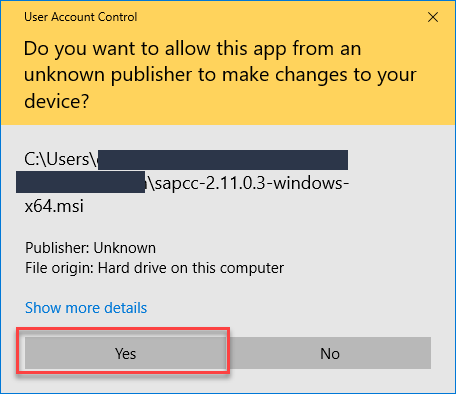

13. You should get the following message after a successful installation. Choose **`Close`**.

    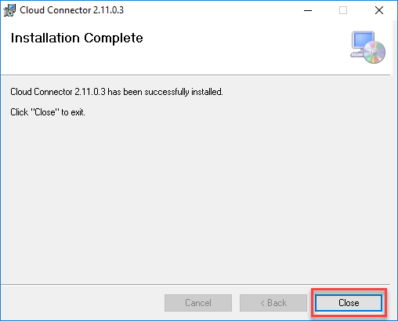

When you close the last pop-up, the Cloud Connector service runs in the background.

What is the standard port for accessing the Cloud Connector administration UI?

[VALIDATE_3]

[ACCORDION-END]

[ACCORDION-BEGIN [Step 4: ](Log on to the Cloud Connector)]

1. To access the Cloud Connector administration UI, open a Web browser and go to <https://localhost:8443/> (adjust the port if you specified another one during the installation).

2. Your browser will show a certificate error. Depending on what browser you use, the way to continue anyway will be different. In Chrome, you first have to choose **ADVANCED**.

    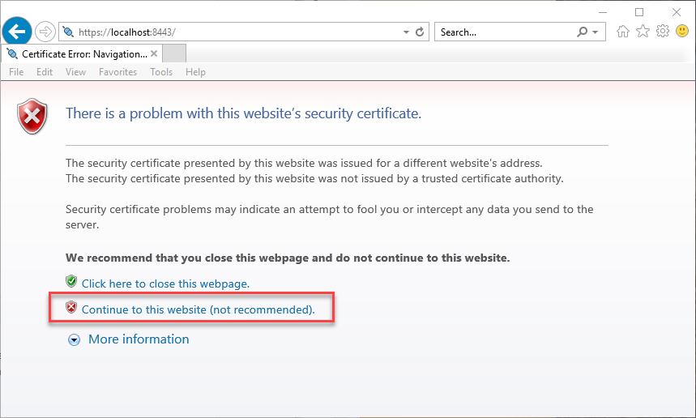

3. On the next pop-up, choose **Proceed to localhost (unsafe)**. We will explain in the next step how you can overcome this procedure whenever you log on to the Cloud Connector administration UI.

    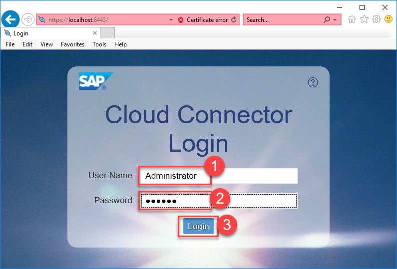

3. At the cloud connector login, log on with the following logon data:
    * User Name: **`Administrator`**
    * Password: **`manage`**

    

4. After login, you will be asked to change your Administrator password. You can choose whether this instance of the Cloud Connector will be the master instance or a shadow instance. Choose **`Master`** and **`Save`**. For more information on how to use a shadow instance, see: [Install a Failover Instance for High Availability](https://help.sap.com/viewer/cca91383641e40ffbe03bdc78f00f681/Cloud/en-US/c697705179a24d2b8b6be038fae59c33.html).

> You can use LDAP (Lightweight Directory Access Protocol) to configure Cloud Connector authentication. For more information, see the [official documentation](https://help.sap.com/viewer/cca91383641e40ffbe03bdc78f00f681/Cloud/en-US/120ceecfd84145a181ac160d588a7a3d.html).

After the installation of the Cloud Connector you can see that its **Security Status** is red -- **Risk**. We will show in the next two steps how to achieve a level of low risk for the Cloud Connector.

[DONE]

[ACCORDION-END]

[ACCORDION-BEGIN [Step 5: ](Replace self-signed UI certificate (optional))]

#### Background

If you just installed the Cloud Connector for your own use to try it out, you can leave out this step. But as soon as you use the Cloud Connector productively in your company, other colleagues would like to be sure that the Web address used for the Cloud Connector is valid. Now what is this all about?

Through the Cloud Connector you can generate an unsigned certificate that contains a public key which corresponds to a private key only known to the Cloud Connector. Public and private keys form a pair: Each public key corresponds to exactly one private key. Anyone who has the public key can encrypt data that can only be decrypted by the holder of the private key. This way you can securely exchange data over the Internet (and Intranet).

Now there is a little snag: If you have a public key, how can you be sure to whom it belongs to? If you can generate such a key pair hackers can do so as well. And then they could give you their public key and claim that it belongs to your bank.

That's when the certificate authority (CA) comes into play. They play a central role for [public key infrastructures](https://en.wikipedia.org/wiki/Public_key_infrastructure) (PKI) to vouch for public key holders that they represent valid identities. Technically, the CA provides a digital signature for a public key to say: "Yes, this public key belongs to the Cloud Connector administration UI. Believe me. I checked it.". To document this, the CA will create a _certificate_ that includes both, the public key and the digital signature.

#### How to find out what certificate authority to use

Now in your specific case, you need to find out what certificate authority is usually used in the Intranet of your company and how certificates are issued. Here are some hints how you can find this out:

1. Open a Web site of your Intranet in Internet Explorer.

2. Click the padlock next to your browser's address bar (depending on your browser it could be at the beginning or the end). Choose **Certificate**.

    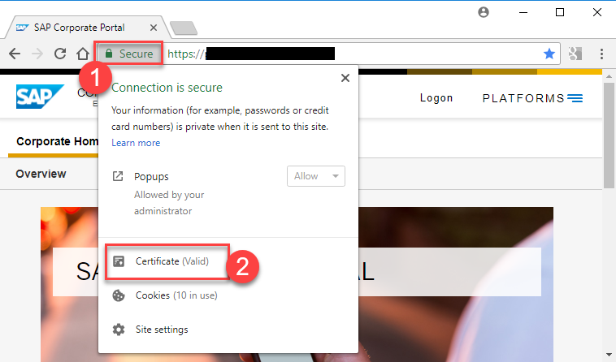

3. The **Certificate Information** will show you the CA which issued the certificate.

    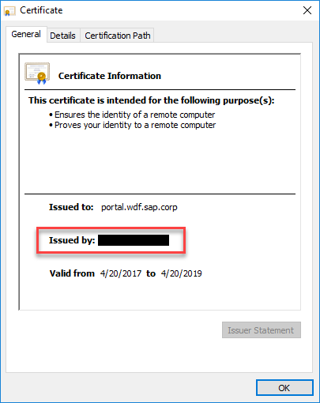

Search in your Intranet for information about your certificate authority and how certificates are issued. If you cannot find any information, this is a problem for your Web admin team, please consult them how to do this.

#### Import a signed certificate to the Cloud Connector

After clarifying where you can get a certificate (sometimes referred to as **Enrollment Service**), you need to follow the process shown in the following graphic:

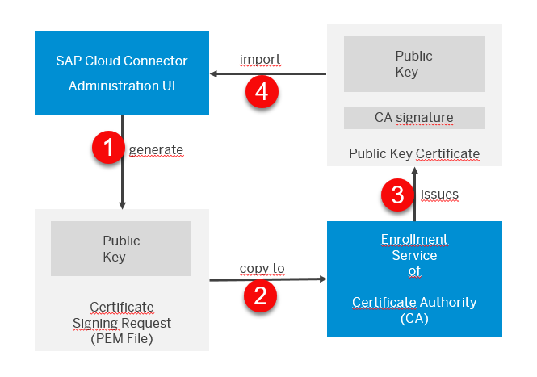

1. Log on to the Cloud Connector Administration UI and choose **Configuration** in the menu. On the **USER INTERFACE** tab, **UI Certificate** section, choose **Generate a certificate signing request**. The information you need to provide in the following pop-up (for example, **Common Name**, **Subject Alternative Name**) is defined by your certificate authority. Choose **Generate** to save your request as a PEM file (PEM: Privacy Enhanced Mail).

    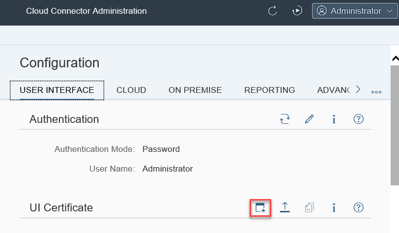

2. Open the PEM file in a text editor, and copy the contents to the enrollment service of your certificate authority to issue a certificate.

3. The certificate authority issues a signed certificate that proves - together with a private key that is known to the Cloud Connector - that you are the owner of the Web site. Save this certificate in a local file.

4. Return to the Cloud Connector Administration UI. Choose **Configuration** and then **Import a certificate** in the **UI Certificate** section on the **USER INTERFACE** tab. Import the file you saved in the last step.

    

5. After a successful import, the certificate details are displayed in the **UI Certificate** section.

    

6. Finally, choose **Restart** on the top of the Cloud Connector administration UI.

    

After the restart the certificate error should no longer appear.

[DONE]

[ACCORDION-END]

[ACCORDION-BEGIN [Step 6: ](Manage the Cloud Connector service)]

The installer version of the Cloud Connector is associated to a service that runs in the background on your PC.

In Linux, you manage the Cloud Connector service using the following command syntax:

```shell
service scc_daemon stop|restart|start|status
```

In Windows, services can be started and stopped by all users of a PC by default. To ensure a minimum level of security you should restrict the rights to a specific user on your PC. Service users are specific to Windows only.

1. Enter **`Services`** in the central Windows search next to the Windows start button, and  choose the following match:

    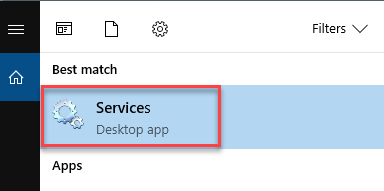

2. Click on an entry in the service list, hit **`S`** on your keyboard, and scroll down in the list of services to find service **SAP Cloud Connector**. After selecting it, you can start, stop, and restart the service. Double-click it.

    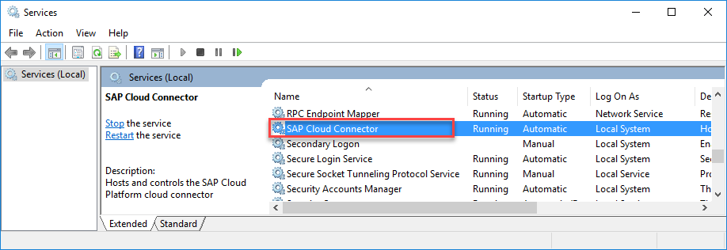

3. In this pop-up you have the option of changing the startup type: **Automatic**, **Automatic (Delayed Start)**, **Manual**, **Disabled**.

    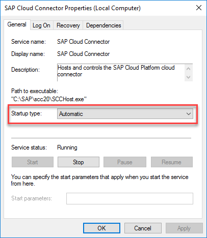

4. To restrict the access to the Cloud Connector service to a specific user, change to tab **Log On**, choose **This account**, and **Browse...**.

    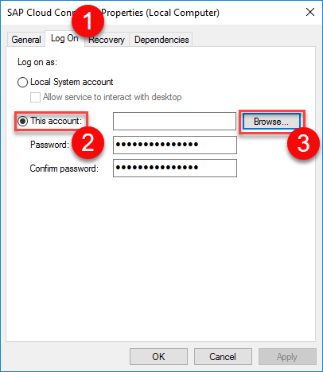

5. Choose **Locations...**.

    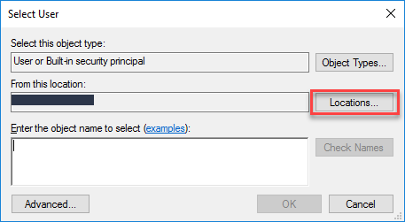

6. Choose **Entire Directory** and **OK**.

    

7. Choose **Advanced**.

    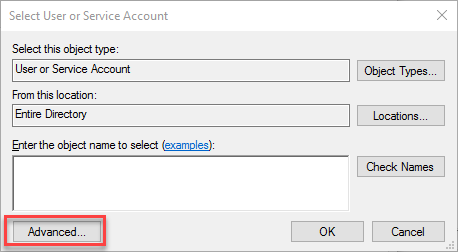

8. Enter a user name, choose **Find Now**, then select the user who should be allowed to start the service, and choose **OK** twice.

    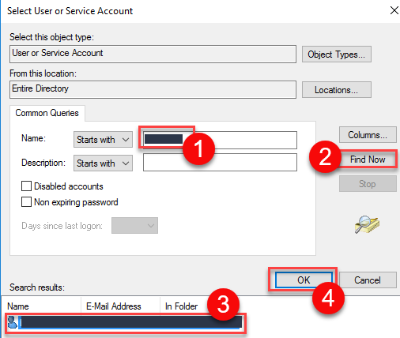

9. Enter the user's password, and choose **OK**. If the password you enter will be different from the user's Windows password, the logged on user will not be able to start the service.

    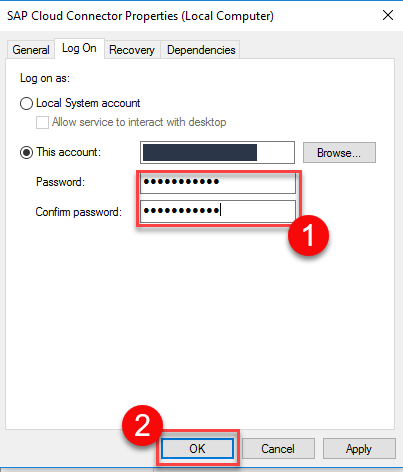

10. You will get the following confirmations.

    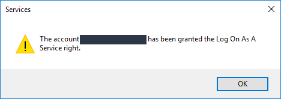

    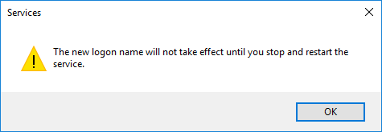

11. Return to tab **General** to restart the service. After restarting it, you will see the configured service user in column **Log On As** in the service list.

    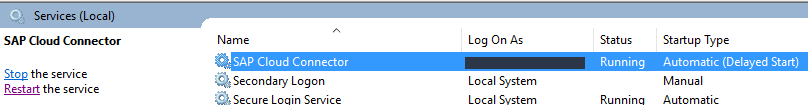

12. Log on to the Cloud Connector. Choose **Security Status** to change the service user status.

    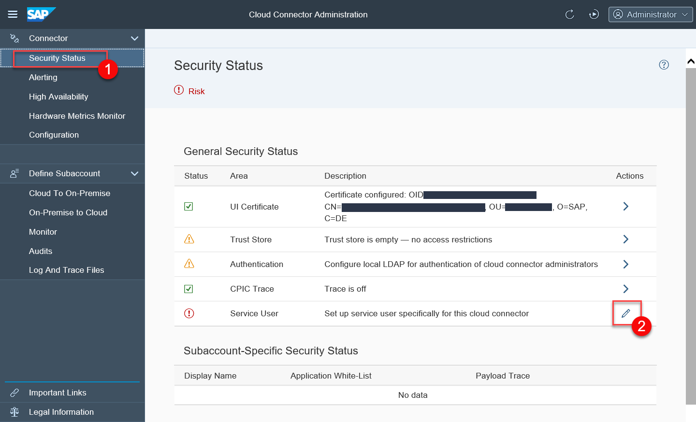

12. Change the service user status.

    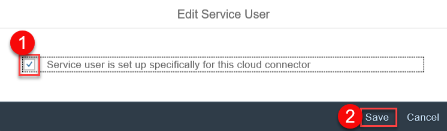

13. Your **General Security Status** should now look like this:

    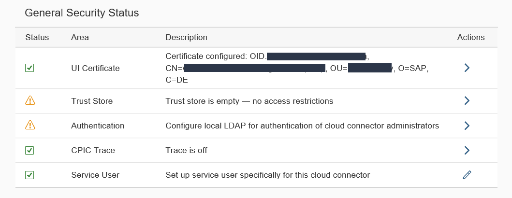

Congratulations! You have successfully finished the installation and started to secure your Cloud Connector.

More information about a secure setup of the Cloud Connector can be found in the [official documentation](https://help.sap.com/viewer/cca91383641e40ffbe03bdc78f00f681/Cloud/en-US/e7ea82a4bb571014a4ceb61cb7e3d31f.html).

[VALIDATE_6]

[ACCORDION-END]


---
