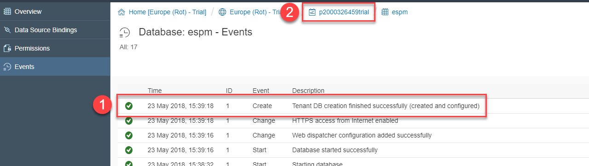
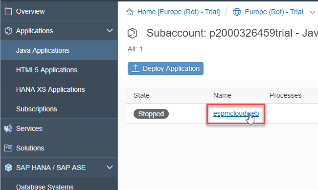
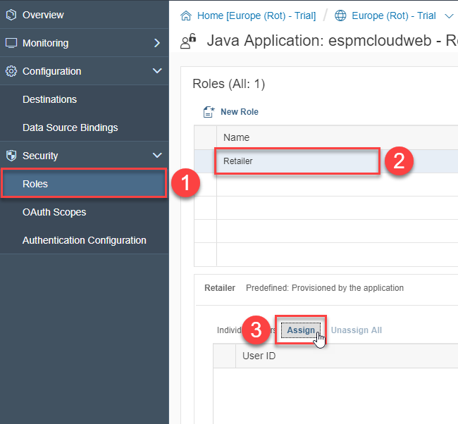
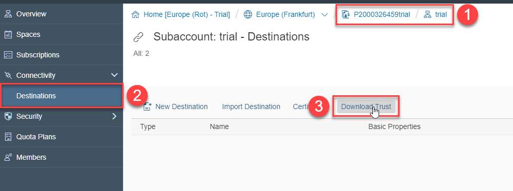
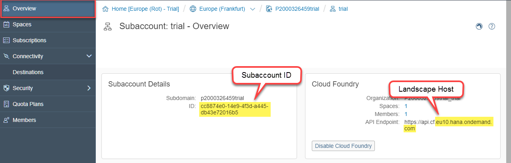
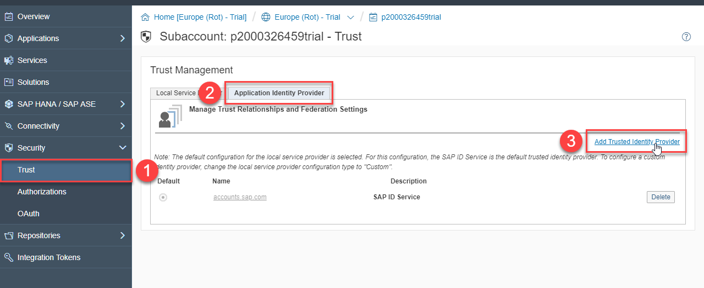
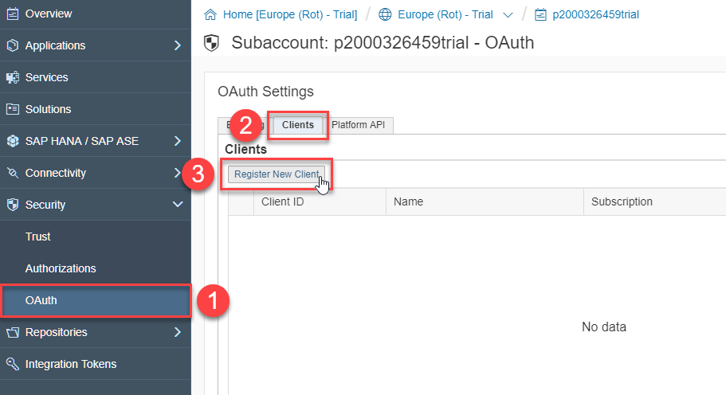
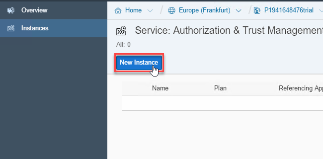
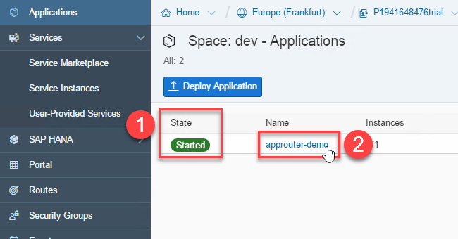
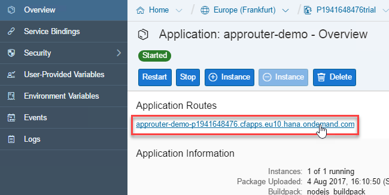

## Prerequisites  
  - Java
  - Eclipse for Java EE

## Details
### You will learn  
- How to set up principal propagation in SAP BTP
- How to establish trust from the SAP BTP, Neo environment to the SAP BTP, Cloud Foundry environment

In this tutorial you will set up a connection between SAP Business Technology Platform, Neo environment (Neo) and SAP Business Technology Platform, Cloud Foundry environment (CF).

A simple application in CF will consume data from an Neo application, and therefore propagate the user details from one environment to the other. This is called "Principal Propagation" and requires some additional steps establishing trust between the environments, to guarantee security.

---

[ACCORDION-BEGIN [Step 1: ](Adapt the ESPM Application)]
1. If you're using Eclipse for the first time, you will see a Welcome Page. Close this page.

    

1. Open Eclipse and choose **Window** > **Perspective** > **Open Perspective** > **Other...**, select **Git** and click **Open**.

    

1. Click **Clone a Git repository**.

    

1. Insert `https://github.com/SAP/cloud-espm-v2.git` into the URI field and click **Next**.

    

1. Make sure only the **master** branch is selected and click **Next**.

    

1. Click **Finish** and wait until the clone has finished.

    

1. Right-click on `cloud-espm-v2` > **Import Projects...**.

    

1. Make sure Eclipse hast detected all projects and click **Finish**.

    

1. Open the **Java EE** Perspective and edit the `web.xml` file: Look for `<auth-method>FORM</auth-method>` and change it to `<auth-method>OAUTH</auth-method>`. Don't forget to save your changes.

    

[DONE]

[ACCORDION-END]

[ACCORDION-BEGIN [Step 2: ](Create an approuter)]
1. Create a new directory called `approuter` somewhere on your machine.

1. Create a new file called `package.json` inside this directory with the following content:
```json
{
  "name": "approuter",
  "version": "1.0.0",
  "description": "",
  "scripts": {
    "start": "node node_modules/@sap/approuter/approuter.js",
    "test": "echo \"Error: no test specified\" && exit 1"
  },
  "license": "ISC",
  "dependencies": {
    "@sap/approuter": "^9.1"
  }
}
```
This tells Node (npm) to fetch and start the approuter.

1. Create a file called `xs-app.json` with the following content:
```json
{
  "welcomeFile": "index.html",
  "routes": [ {
      "source": "/espm-cloud-web/espm.svc/",
      "target": "/espm-cloud-web/espm.svc/",
      "destination": "retailerBackend"
    }, {
        "source": "/espm-cloud-web/images/",
        "localDir": "static/images/"
    }, {
      "source": "/",
      "localDir": "static/retailer/"
    }
  ]
}
```
This configures the routing inside the approuter.

1. Create a folder called `static`.

1. **Move** the `src/main/webapp/retailer` folder (from the `espm` project) to the newly created `static` folder.
> Note: This folder contains the HTML, CSS and JavaScript of the Retailer application.

1. **Copy** the `src/main/webapp/images` folder to the newly created `static` folder.
> Note: The images are needed by the Shop and the Retailer application.

1. Create a zip archive called `approuter.zip` containing all the file in the `approuter` folder. It's important that the files are in the top level of the zip file!
You can use this commands in `bash` (Linux and macOS) to create the zip file:
```bash
for file in static/retailer static/images xs-app.json package.json ; do
  if [[ ! -e $file ]] ; then echo -e "\e[33m[WARNING] $file does not exist\e[0m"; fi ;
done
zip -r approuter.zip .
```
or use `PowerShell` (Windows):
```powershell
foreach ($file in @("static\retailer", "static\images","xs-app.json","package.json")){
   if (-not (Test-Path $file)) { Write-Warning "$file does not exist" }
}
Compress-Archive -Force -Path .\* -DestinationPath approuter.zip
```
This will also check that all files exist and print a warning if one or more is missing.
Note: You need to change to the approuter directory using the `cd` command first (Linux, macOS and Windows).

[DONE]

[ACCORDION-END]

[ACCORDION-BEGIN [Step 3: ](Build the ESPM Application)]
1. Make a right-click on `espm` and select **Export**.

    

1. Select **Web** > **WAR file** and click **Next**.

    

1. Select a Destination on your machine and click **Finish**.

    


[DONE]

[ACCORDION-END]

[ACCORDION-BEGIN [Step 4: ](Configuration in the SAP BTP, Neo environment)]

1. Open the SAP BTP, Neo environment cockpit.

1. Navigate to **SAP HANA / SAP ASE** > **Databases & Schemas** and click **New**

    

1. Create a database named `espm` and select a password. Make sure you don't lose it, we'll need it soon.

    

1. Wait until you see the event with description **Tenant DB creation finished successfully (created and configured)** (this can take up to 15 minutes). Now navigate back to your subaccount.

    

1. Navigate to **Applications** > **Java Applications** and click **Deploy Application**

    

1. Select the `espm-cloud-web.war` you've exported in the first step, be sure to use the **Tomcat 8** Runtime and click deploy. Note: Don't change the name of the application.

    

1. Wait until the application is successfully deployed and click **Done**.

    

1. Open the details of the application by clicking its name.

    

1. Navigate to **Configuration** > **Data Source Bindings** and click **New Binding**.

    

1. Enter `SYSTEM` and the password you choose while creating the database as credentials and click **Save**.

    

1. Navigate to **Security** > **Roles**, make sure the **Retailer** role is selected and click **Assign** in the Individual Users section.

    

1. Enter your email-address (the one you use for your Cloud Foundry Account) and click **Assign**.

    

1. Navigate to **Overview** and click **Start**.

    

1. Wait until you can see **Started** and open the Application URL.

    


[VALIDATE_4]

[ACCORDION-END]

[ACCORDION-BEGIN [Step 5: ](Establish trust between SAP BTP, Cloud Foundry environment and SAP BTP, Neo environment)]

1. Open the SAP BTP, Cloud Foundry environment in a new tab, navigate into your subaccount, go to **Connectivity** > **Destinations** and export the X509 certificate of the destination service by clicking the **Download Trust** button.

    

1. Go to **Overview** and find your subaccounts id and the landscape host. You will need it later. **Notice:** The landscape host does **not** include `api.cf.`!

    

1. Go to the Neo environment > **Security > Trust > Application Identity Provider** and click on **Add Trusted Identity Provider**.

    

1. Enter the following details and click **Save**.

    | Parameter            | Value                                                           |
    |:---------------------|:----------------------------------------------------------------|
    | Name                 | `cfapps.` + Landscape Host + `/` + subaccount ID e.g. `cfapps.eu10.hana.ondemand.com/77f532e6-71f7-44e9-9761-c0b24f6f38ca` |
    | Signing Certificate  | Open the certificate file downloaded earlier with your favorite editor and copy everything between **\-\-\-\-\-BEGIN CERTIFICATE\-\-\-\-\-** and **\-\-\-\-\-END CERTIFICATE\-\-\-\-\-**. |


    

1. Go to **Security > OAuth > Clients** and click **Register new client**.

    

1. Enter the following details and click **Save**.

    | Parameter            | Value                                                           |
    |:---------------------|:----------------------------------------------------------------|
    | Name                 | It doesn't actually matter. Use e.g. `CFNEO-Demo`.              |
    | Subscription         | `p0123456789trial/espmcloudweb` (while `p0123456789` is your own account id) |
    | ID                   | leave unchanged and save it somewhere for later use             |
    | Confidential         | checked                                                         |
    | Secret               | Generate a random password and save it somewhere for later use  |
    | Redirect URI         | Unused in this scenario. Use e.g. `https://example.com`         |

    Example:

    

1. Go back to the CF environment and click **New Destination**.

    | Property               | Value                                                           |
    |:-----------------------|:----------------------------------------------------------------|
    | Name                   | `retailerBackend`                                               |
    | Type                   | `HTTP`                                                          |
    | URL                    | URL of the Neo application/API you want to consume. e.g. `https://espmcloudwebp2000292804trial.hanatrial.ondemand.com/espm-cloud-web/`|
    | Proxy type             | `Internet`                                                      |
    | Authentication         | `OAuth2SAMLBearerAssertion`                                     |
    | Audience               | Depends on your Landscape (Neo). See table in the bottom.       |
    | Client Key             | ID of the OAuth client you saved in the previous step.          |
    | Token Service URL      | taken from the "Branding" tab in the Neo subaccount - "Security" > "OAuth". |
    | Token Service user     | Once again the ID of the OAuth client.                          |
    | Token Service Password | The Secret you generate in the last step.                       |
    | System User            | empty                                                           |
    | Use default JDK truststore | Checked                                                     |

    Add the following Additional properties:

    | Property               | Value                                                    |
    |:-----------------------|:---------------------------------------------------------|
    | `authnContextClassRef` | `urn:oasis:names:tc:SAML:2.0:ac:classes:PreviousSession` |
    | `nameIdFormat`         | `urn:oasis:names:tc:SAML:1.1:nameid-format:emailAddress` |

    Use this table to find the correct audience for your landscape:

    | Landscape            | Audience                                  |
    |:---------------------|:------------------------------------------|
    | Europe (Rot) - Trial | `https://nwtrial.ondemand.com/services`   |
    | Australia (Sydney)   | `ap1.hana.ondemand.com/services`          |
    | Brazil (São Paulo)   | `https://br1.hana.ondemand.com/services`  |
    | Canada (Toronto)     | `https://ca1.hana.ondemand.com/services`  |
    | Europe (Amsterdam)   | `https://eu3.hana.ondemand.com/services`  |
    | Europe (Rot)         | `https://netweaver.ondemand.com/services` |
    | Japan (Tokyo)        | `https://jp1.hana.ondemand.com/services`  |
    | KSA (Riyadh)         | `https://sa1.hana.ondemand.com/services`  |
    | Russia (Moscow)      | `https://ru1.hana.ondemand.com/services`  |
    | UAE (Dubai)          | `https://ae1.hana.ondemand.com/services`  |
    | US East (Ashburn)    | `https://us1.hana.ondemand.com/services`  |
    | US West (Chandler)   | `https://us2.hana.ondemand.com/services`  |
    | US East (Sterling)   | `https://us3.hana.ondemand.com/services`  |

    Example:

    

[DONE]

[ACCORDION-END]

[ACCORDION-BEGIN [Step 6: ](Configuration in the SAP BTP, Cloud Foundry environment)]

1. Create Destination Service Instance
    - Navigate into your **dev** space.

    
    - Open the **Service Marketplace** under **Services**.

    

    - Find and click the **destination** tile.

    

    - Click **New Instance**.

    

    - Press **Next** three times.

    - Enter the **Instance Name**: `destination-demo-lite` and click **Finish**.

    

1. Create Authorization & Trust Management Service Instance (aka XSUAA)

    - Click the arrow next to **destination** (see screenshot) and select **Authorization & Trust Management**.

    

    - Click **New Instance**.

    

    - Press **Next** only once.

    - Copy and past the following parameters and click **Next**.

        ```json
        {
        	"xsappname": "connectivity-app",
        	"tenant-mode": "dedicated",
        	"authorities": ["uaa.user"],
        	"scopes": [{
        		"name": "uaa.user",
        		"description": "Default scope for user",
        		"granted-apps": ["xs_user", "*"]
        	}],
        	"role-templates": [{
        			"name": "USER",
        			"description": "Normal user",
        			"scope-references": [
        				"uaa.user"
        			]
        		}
        	]
        }
        ```

    

    - Enter the **Instance Name**: `xsuaa-demo` and click **Finish**.

    

1. Create Manifest File for the approuter.

    - Create a new file called `approuter-manifest.yml` with the following content:

        ```yaml
          ---
          applications:

          - name: destination-demo-approuter
            host: destination-demo-approuter-<userid>
            buildpack: nodejs_buildpack
            memory: 128M
            path: ./approuter.zip
            env:
              NODE_TLS_REJECT_UNAUTHORIZED: 0
            services:
              - xsuaa-demo
              - destination-demo-lite
        ```

    - Replace `<userid>` of the `host` property with your user id.

1. Deploy the Approuter

    - Back in the Browser click the **dev**-space, **Applications** followed by **Deploy Application**.

    

    - Click **Browse** and select `approuter.zip` as **File Location**. Then do the same for the **Manifest Location** and select the `approuter-manifest.yml`. Finally click **Deploy**.

    

    - Wait until your application shows a green **Started** as State and then click on **approuter-demo**.

    

    - Navigate to the Approuter by clicking the link as shown in the screenshot.

    

    - Login using the E-Mail-Address and password of your trial account.

    

[DONE]

[ACCORDION-END]

---
