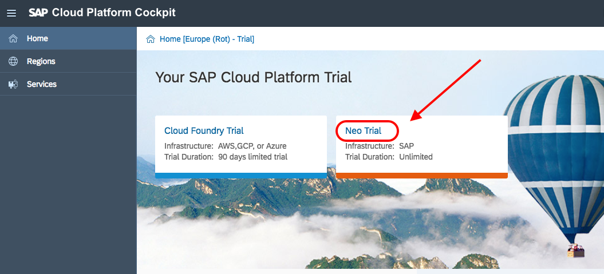

## Prerequisites  
 - **Proficiency:** Beginner

## Details
### You will learn
Destinations are used for the outbound communication of your application to a remote system (which can be a cloud or on-premise system). You will create a destination by giving it a name, URL of the remote system or service, the authentication type, and some other configuration data.

### Time to Complete
**5 Min.**

---

[ACCORDION-BEGIN [Step 1: ](Log into SAP Cloud Platform)]

Go to <https://account.hanatrial.ondemand.com> and log in to your SAP Cloud Platform cockpit.

You will use your Neo trial for this tutorial (and related series). Select **Neo Trail** to get to your SAP Cloud Platform cockpit.

[DONE]
[ACCORDION-END]

[ACCORDION-BEGIN [Step 2: ](Create new destination)]

Select the **Destinations** tab on the left side, and then click on **New Destination** to open a new destination configuration form.

[DONE]
[ACCORDION-END]

[ACCORDION-BEGIN [Step 3: ](Confirm data)]

Enter/confirm all fields in the Destination configuration section with the information below.

Field Name     | Value
:------------- | :-------------
Name           | `toysData`
Type           | `HTTP`
Description    | `Toys OData service`
URL            | `https://sapdevsdd27584c4.us2.hana.ondemand.com/codejam/toyspace/services/api.xsodata/`
Proxy Type     | `Internet`
Authentication | `NoAuthentication`

[DONE]
[ACCORDION-END]

[ACCORDION-BEGIN [Step 4: ](Add properties)]

Add two **Additional Properties** fields by clicking on the **New Property** button once for each property.

Field Name       | Value
:--------------- | :-------------
`WebIDEEnabled`  | `true`
`WebIDEUsage`    | `odata_gen`

[DONE]
[ACCORDION-END]

[ACCORDION-BEGIN [Step 5: ](Save your destination)]

Click **Save**.

[DONE]
[ACCORDION-END]

[ACCORDION-BEGIN [Step 6: ](Check the Additional Property settings)]

Select the value of the **`WebIDEUsage`** parameter in your destination from the list below and click **Validate**:

[VALIDATE_6]
[ACCORDION-END]
