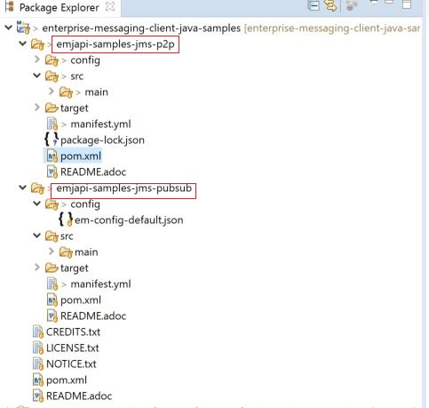

## Prerequisites
- Installed Java 8: [Java download](https://www.java.com/en/download/)
- Installed Maven 3.x: [Maven download](https://maven.apache.org/download.cgi)
- Installed Git: [Git download](https://git-scm.com/downloads)
- Follow [Create Instance of SAP Event Mesh Service](cp-enterprisemessaging-instance-create) and [Create Queues and Queue Subscriptions for Event Mesh](cp-enterprisemessaging-queue-queuesubscription) to create a queue in an instance of Event Mesh.
- Follow [Install the Cloud Foundry Command Line Interface(CLI)](cp-cf-download-cli) to download and work with CLI.
- Installed IDE of choice (e.g. [Visual Studio](https://code.visualstudio.com/) with installed [Java language support](https://marketplace.visualstudio.com/items?itemName=redhat.java) plugin)

## Details
### You will learn
  - How to create a basic messaging client application with Java
  - How to deploy this application to the SAP Event Mesh and test it

---

[ACCORDION-BEGIN [Step 1: ](Set up environment)]

To download and install the samples, just clone the repository via: [git clone](https://github.com/SAP/enterprise-messaging-client-java-samples)

The git has two applications for you to try out.

|       Application                    |              Scenario Description                                 
| :----------------------------------- | :-----------------------------------------------------------------
|     emjapi-samples-jms-p2p (Point to Point communication)           | This sample demonstrates how messages can be sent and received from an application deployed on SAP Business Technology Platform. Therefore the messaging sample provides a Spring Boot based application which provides REST endpoints for sending and receiving messages via a queue (or queues) of choice. The REST endpoints are provided via the `MessagingServiceRestController`.
|


|       Application                    |              Scenario Description                                 
| :----------------------------------- | :-----------------------------------------------------------------
|     emjapi-samples-jms-pubsub (Publish & Subscribe)        |  This sample demonstrates how messages can be sent and received to a topic from an application deployed on SAP Business Technology Platform. This messaging sample provides a Spring Boot based application which provides REST endpoints for sending and receiving messages via a topic of choice. It also offers a REST endpoint to receive a message from a queue. The REST endpoints are provided via the `MessagingServiceRestController`.  
|

Download both the scenarios to your local IDE. After downloading, the project structure will look like this :

!

The downloaded project has all the dependencies and required client files for both scenarios mentioned above.
The Event Mesh service descriptor is `/config/em-config-default.json`. Detailed information on different parameters of the
descriptor can be found in [Create Instance of SAP Event Mesh](cp-enterprisemessaging-instance-create).  

*Replace the content in the **.json** file with the content of the descriptor in the service instance you have created.*

[DONE]
[ACCORDION-END]

[ACCORDION-BEGIN [Step 2: ](Understand the dependencies)]
To be able to build, deploy and run the Java message client, ensure the following dependencies are mentioned in the pom.xml.

-  enterprise-messaging spring service connector that provides the `MessagingService`
-  enterprise-messaging core that creates the connection factory
-  enterprise-messaging JMS extension that provides the `MessagingServiceJmsConnectionFactory`

i.e. the pom.xml should have dependencies as below.

```XML
<dependency>
	<groupId>com.sap.cloud.servicesdk.xbem</groupId>
	<artifactId>emjapi-connector-sap-cp</artifactId>
	<version>${version.xbem.client}</version>
</dependency>

<dependency>
	<groupId>com.sap.cloud.servicesdk.xbem</groupId>
	<artifactId>emjapi-core</artifactId>
	<version>${version.xbem.client}</version>
</dependency>

<dependency>
	<groupId>com.sap.cloud.servicesdk.xbem</groupId>
	<artifactId>emjapi-extension-sap-cp-jms</artifactId>
	<version>${version.xbem.client}</version>
</dependency>

```

[VALIDATE_1]
[ACCORDION-END]

[ACCORDION-BEGIN [Step 3: ](Code Snippets — common for both examples)]

1. Open the `manifest.yml` file for the projects and make changes to the following parameters:

    - applications:

        `-` name: *<<Customized name of choice. Should be unique for a space of SCP>>*

    - services:

        `-` *<<name of the SAP Event Mesh instance>>*


2. Get the `MessagingService`

    ```Java
    ServiceConnectorConfig config = null; // currently there are no configurations for the MessagingServiceFactory supported
    Cloud cloud = new CloudFactory().getCloud();
    // get a messaging service factory via the service connector
    MessagingService messagingService = cloud.getSingletonServiceConnector(MessagingService.class, config);
    ```

3. Create a `MessagingServiceFactory` object with the help of `MessagingServiceFactoryCreator` and get a `MessagingServiceJmsConnectionFactory`.

    The Connection Factory can be configured with the `MessagingServiceJmsSettings`. In case the reconnection feature is not needed and an individual connection mechanism (for example, through a connection cache) is used these settings can be skipped. The connection factory can be built with `messagingServiceFactory.createConnectionFactory(MessagingServiceJmsConnectionFactory.class,settings)`.

    ```Java
    MessagingServiceJmsSettings settings = new MessagingServiceJmsSettings(); // settings are preset with default values (see JavaDoc)
    settings.setMaxReconnectAttempts(5); // use -1 for unlimited attempts
    settings.setInitialReconnectDelay(3000);
    settings.setReconnectDelay(3000);
    MessagingServiceFactory messagingServiceFactory = MessagingServiceFactoryCreator.createFactory(messagingService);
    MessagingServiceJmsConnectionFactory connectionFactory = messagingServiceFactory.createConnectionFactory(MessagingServiceJmsConnectionFactory.class, settings)
    ```

4. Create a connection and a session

    ```Java
    Connection connection = connectionFactory.createConnection();
    Session session = connection.createSession(false, Session.AUTO_ACKNOWLEDGE));
    ```

[DONE]
[ACCORDION-END]

[ACCORDION-BEGIN [Step 4: ](Code Snippets — Point to Point communication)]
#### Sending

Open the `MessagingServiceRestController.java` source code. Change the value of `QUEUE_PATH` based on the values of the instance you created.

```Java

private static final String QUEUE_PATH = "queue/{queueName}";
```

For sending messages a Connection and a Session are required first. Note that those resources must be closed if they are not needed anymore. As those objects
are implementing the `autoclosable` interface they will be closed automatically after the try-catch-block. Now a `BytesMessage` can be created. In the next
steps a queue is bound to a producer. The queue must be created on the broker first (via for example, the UI or MM API). Note that the prefix "queue:" is
mandatory. Finally, the message can be sent to the queue.

```Java
try (
  Connection connection = connectionFactory.createConnection();
  Session session = connection.createSession(false, Session.AUTO_ACKNOWLEDGE)) {
	connection.start();
	BytesMessage byteMessage = session.createBytesMessage();
	byteMessage.writeBytes(message.getBytes());
	Queue queue = session.createQueue("queue:" + "<queue-name>"); // even though the JMS API is "createQueue" the queue will not be created on the message broker
	MessageProducer producer = session.createProducer(queue);
	producer.send(byteMessage);
} catch (JMSException e) {
	LOG.error("Could not send message={}.", message, e);
}
```

#### Receiving

In this example, a consumer is listening to a queue. Again a Connection and a Session are required. Note that those resources must be closed if they are not
needed anymore. First, a queue with the mandatory prefix "queue:" is bound to a consumer. Since the messages are sent as a `ByteMassage`, the message needs to be
converted to say a String.

```Java
try (Connection connection = connectionFactory.createConnection();Session session = connection.createSession(false, Session.AUTO_ACKNOWLEDGE)) {
	connection.start();
	Queue queue = session.createQueue(QUEUE_PREFIX + queueName); // see comments above
	MessageConsumer consumer = session.createConsumer(queue);
	BytesMessage message = (BytesMessage) consumer.receive(); // Blocking call. Define a timeout or use a Message Listener
	byte[] byteData = new byte[(int) message.getBodyLength()];
    message.readBytes(byteData);
} catch (JMSException e) {
	LOG.error("Could not receive message.", e);
}
```

[DONE]
[ACCORDION-END]

[ACCORDION-BEGIN [Step 5: ](Code Snippets — Publish and Subscribe)]

Open the `MessageingServiceRestController.java` source code. Change the value of `TOPIC_PATH` and `QUEUE_PATH` based on the values of the instance you created.
```Java
`private static final String TOPIC_PATH = "topic/{topicName}";
private static final String QUEUE_PATH = "queue/{queueName}";`
```
#### Sending

For sending messages a Connection and a Session are required first. Note that those resources must be closed if they are not needed anymore. As those objects are
implementing the `autoclosable` interface they will be closed automatically after the try-catch-block. Now a `BytesMessage` can be created. In the next steps,
a topic is bound (not created) to a producer. Note, that the prefix "topic:" is mandatory. Finally, the message can be sent to the topic.

```Java
try (
  Connection connection = connectionFactory.createConnection();
  Session session = connection.createSession(false, Session.AUTO_ACKNOWLEDGE)) {
	connection.start();
	Topic topic = session.createTopic("topic:" + "<topic-name>");
	BytesMessage byteMessage = session.createBytesMessage();
	byteMessage.writeBytes(message.getBytes());
	MessageProducer producer = session.createProducer(topic);
	producer.send(byteMessage);
} catch (JMSException e) {
	LOG.error("Could not send message={}.", message, e);
}
```

#### Receiving

Currently, direct topic subscription is *not supported for the default plan*. In this example, a consumer is subscribed to a specific topic. Again a Connection
and a Session are needed. Note that those resources must be closed if they are not needed anymore. First a topic (not created) with the mandatory prefix "topic:"
is bound to consumer. Since the messages are sent as a `ByteMessage` the message needs to be converted to say a String

```Java
try (
  Connection connection = connectionFactory.createConnection();
  Session session = connection.createSession(false, Session.AUTO_ACKNOWLEDGE)) {
	connection.start();
	Topic topic = session.createTopic(TOPIC_PREFIX + topicName);
	MessageConsumer consumer = session.createConsumer(topic);
	// Blocking call. Define a timeout or use a Message Listener
	BytesMessage message = (BytesMessage) consumer.receive();
	byte[] byteData = new byte[(int) message.getBodyLength()];
	message.readBytes(byteData);
} catch (JMSException e) {
	LOG.error("Could not receive message.", e);
}
```

[DONE]
[ACCORDION-END]

[ACCORDION-BEGIN [Step 6: ](Build and deploy)]
1. Build the project with maven (`maven clean install`).

2. Push it to Cloud Foundry via `cf push` using CLI from the folder where the executable is available.

3. After successful deployment, follow [Send and Receive Test Event Mesh](cp-enterprisemessaging-test-queue-sendreceive) to test sending and receiving of message using the Java client.

[VALIDATE_2]
[ACCORDION-END]


---
